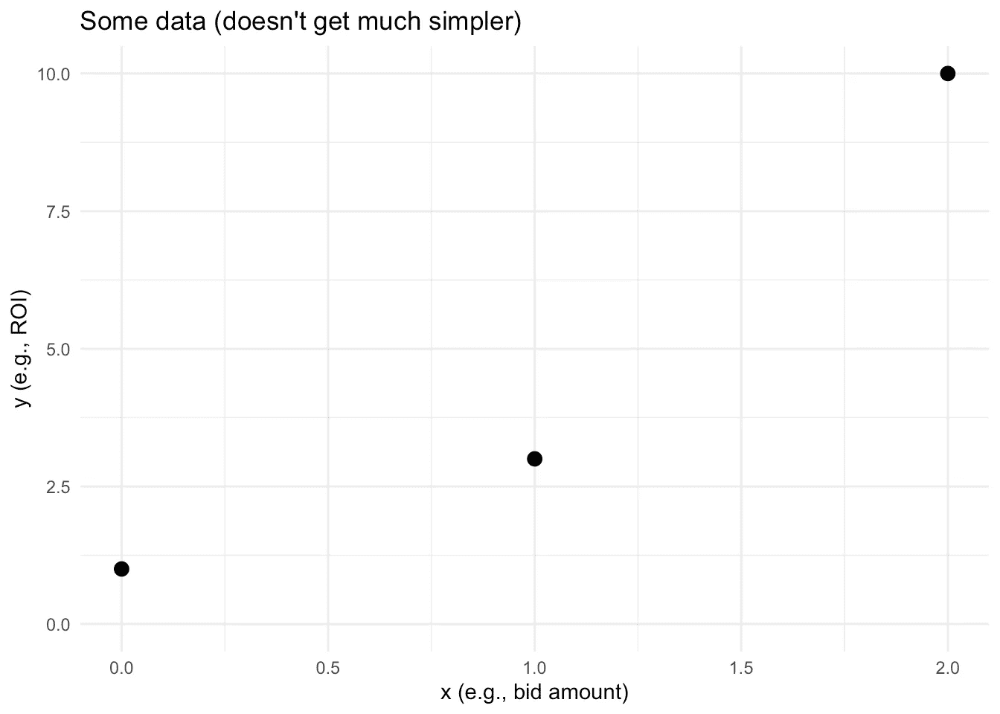
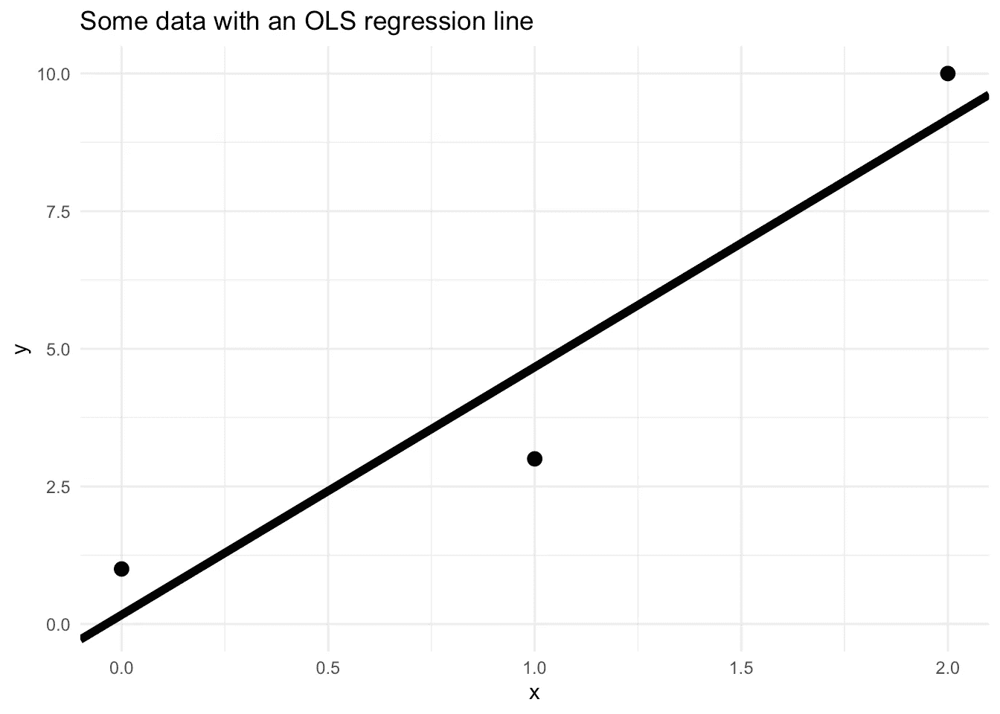
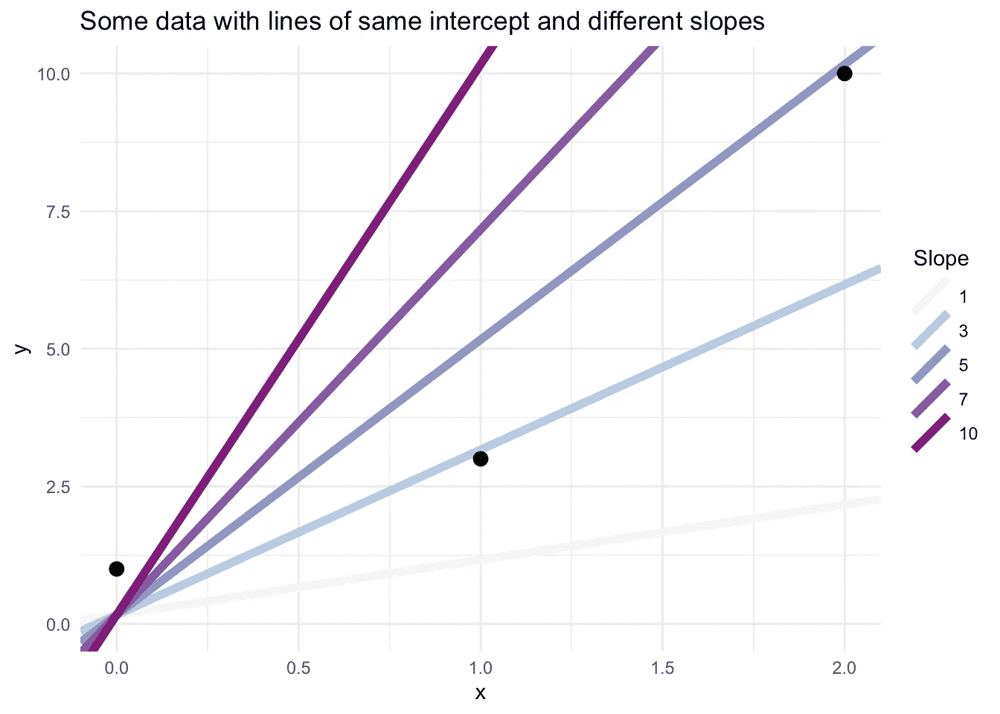
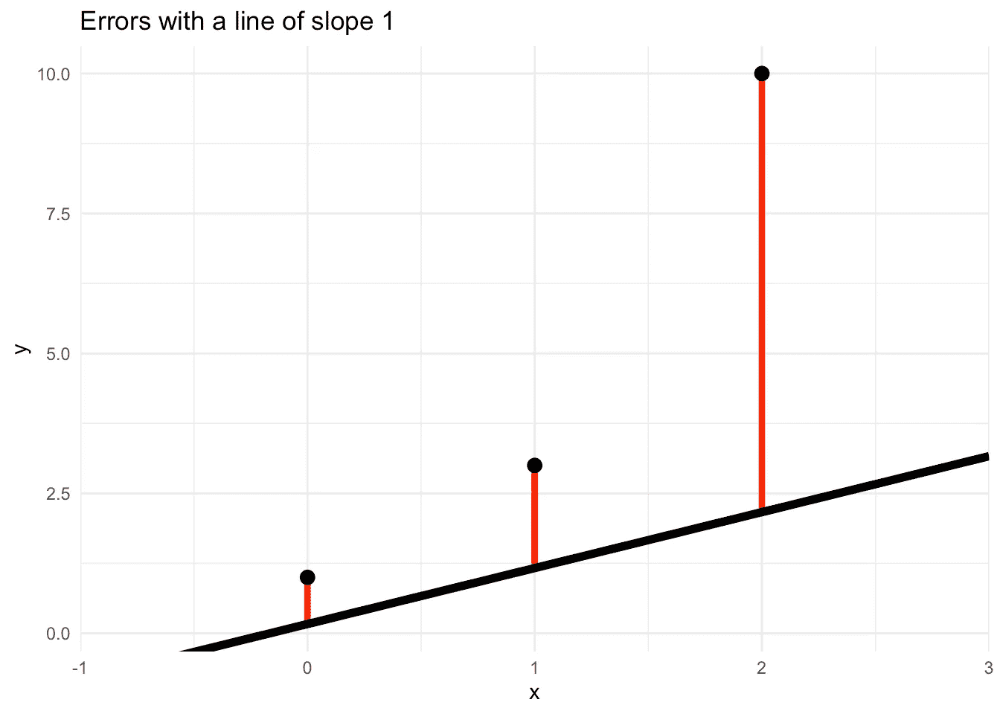
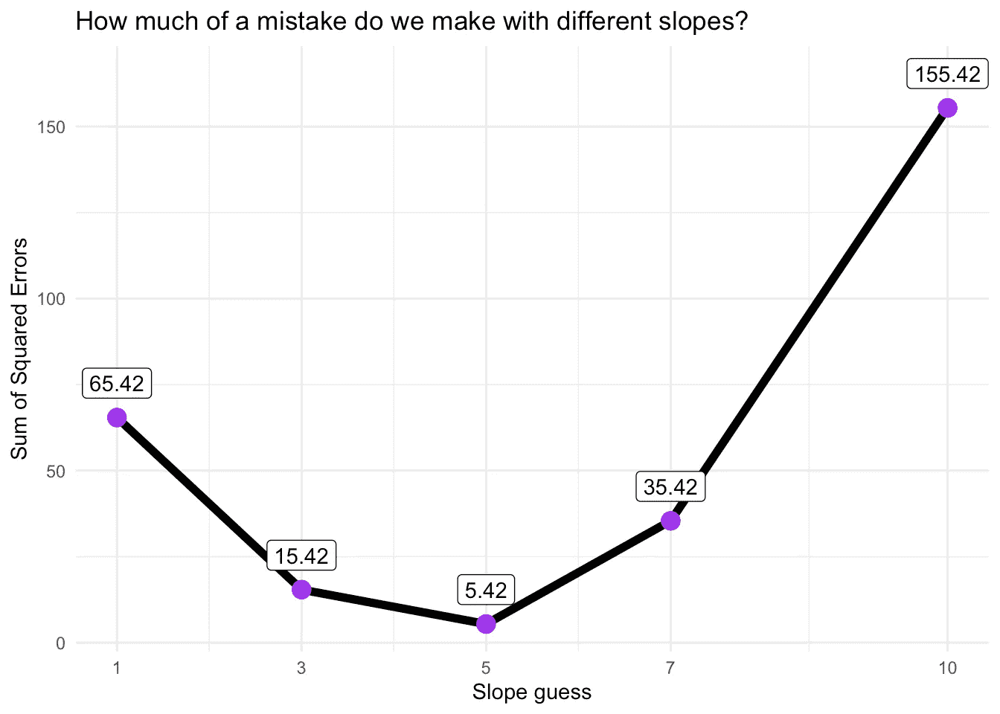
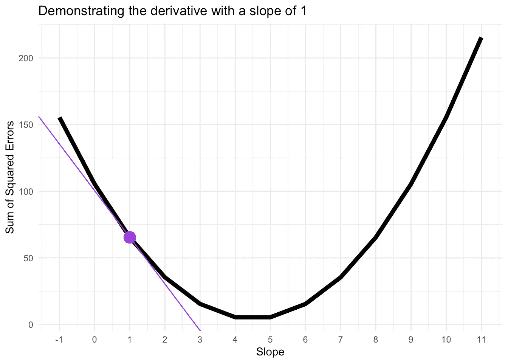
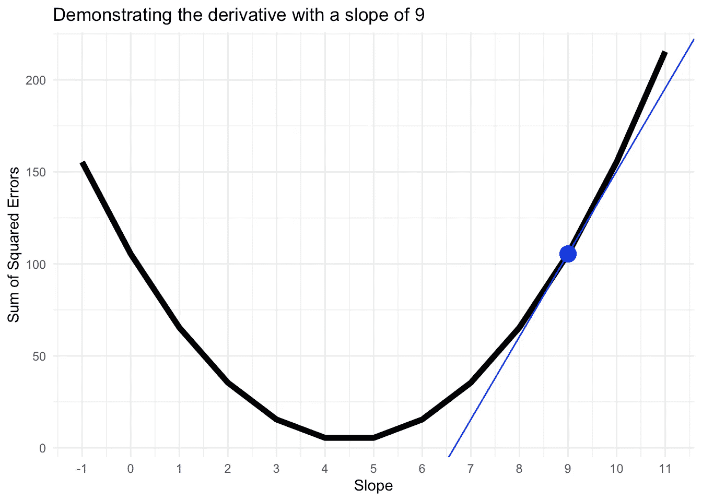
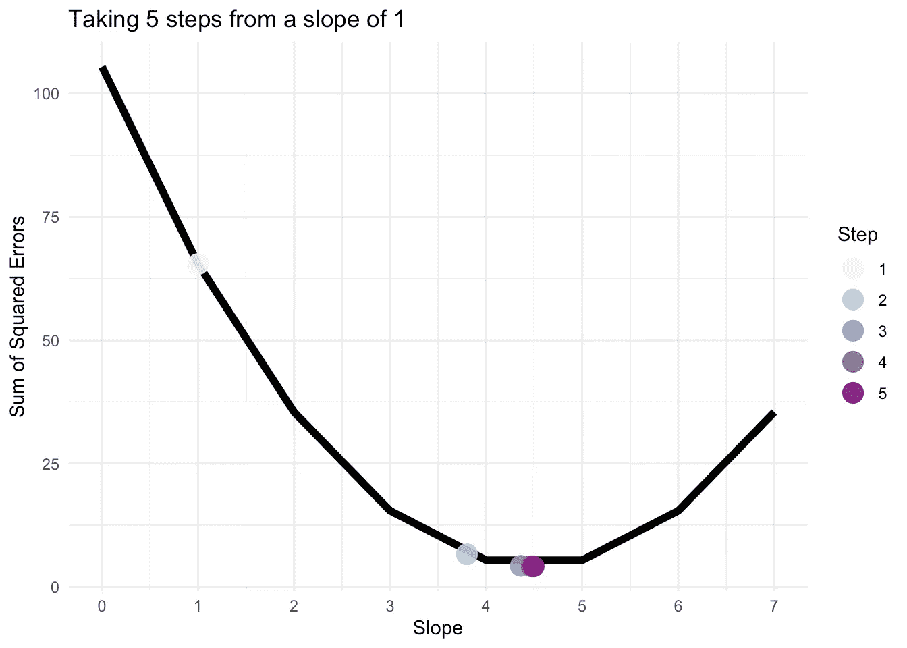

# 学习梯度下降(带代码)

> 原文：<https://towardsdatascience.com/learn-gradient-descent-with-code-f84eb9a14703?source=collection_archive---------56----------------------->

大量的统计和机器学习涉及将一堆数据转化为新的数字，以做出好的决策。例如，数据科学家可能会使用您过去对 Google 搜索项的出价和结果，来计算新出价的预期投资回报(ROI)。有了这些知识，你就可以对未来出价多少做出明智的决定。酷，但是如果那些 ROI 是错的呢？真的错了吗？

> 灾难！

幸运的是，数据科学家不只是猜测这些数字！他们使用数据为自己生成一个合理的数字。有很多方法可以做到这一点，一个常见的是梯度下降。根据我们的朋友[维基百科](https://en.wikipedia.org/wiki/Gradient_descent)，“梯度下降是一种一阶迭代优化算法，用于寻找可微函数的局部最小值。”这没有错，但是你被这个弄糊涂了也是情有可原的。我们来学习一下什么是梯度下降，它是如何工作的(用代码)。

## 设置和代码

想跟着去吗？本文中复制了基本代码。如果你想完全遵循，从[这个 github repo](https://github.com/drsimonj/LearnGradientDescent) 下载代码。我将对以下包使用 R:

```
library(tidyverse)
library(broom)
library(glue)
```

# 渐变？血统？

在“如何”之前，让我们先了解一下梯度下降是关于什么的。

我们将从两个变量的超级简单数据集开始，`x`和`y`。这些可以是`bid`和`ROI`的值。我们有兴趣使用这些数据来猜测我们从未见过的`x`值的`y`会是多少。

```
d <- tibble(x = c(0, 1, 2),
            y = c(1, 3, 10))
```



好吧。为了使用该数据对`y`进行新的预测，典型的方法是使用[普通最小二乘(OLS)回归](https://en.wikipedia.org/wiki/Ordinary_least_squares)。听起来不错吧？别担心。这只是一种快速获得下图所示最佳拟合线的方法。



我们是怎么得到这条线的？使用此代码:

```
model <- lm(y ~ x, d) %>% tidy()
model#> # A tibble: 2 x 5
#>   term        estimate std.error statistic p.value
#>   <chr>          <dbl>     <dbl>     <dbl>   <dbl>
#> 1 (Intercept)    0.167      1.86    0.0894   0.943
#> 2 x              4.5        1.44    3.12     0.198
```

记住，直线有等式:`y = intercept + slope * x`。上面的代码告诉我们`estimate`列中的截距和斜率:`intercept = 0.167`和`slope = 4.5`。我们会把这些留到以后。

```
ols_intercept <- model$estimate[1]
ols_slope     <- model$estimate[2]
```

OLS 回归是一个超级标准的算法。尽管如此，我还是会用它来演示梯度下降是如何工作的，因为你可以将你在这里学到的东西应用到更多的东西上！

想象一下，有人告诉你截距值(0.167)，但让你算出斜率。除了认为这很粗鲁，你还会怎么做？我们就试试一堆随机的斜坡吧！



从视觉上看，斜率 5 是这一组中最好的(我们知道它非常接近真实的斜率 4.5)。但是如果我们看不出来呢？斜率为 4 看起来也不错。

这就是所谓损失函数的用武之地。这是一个奇特的术语，表示有一种方法可以用数字来表示你的线与数据的匹配程度。有很多方法可以做到这一点，但我们将使用一个非常标准的方法来处理回归问题:误差平方和。

哇，更多的行话？！这些数据人员让事情变得不容易。别担心。我会解释的。这条线显示了在给定每个`x`值的情况下，我们对`y`的预测。这意味着从直线到每个数据点的垂直距离就是我们的错误程度。这个距离称为“误差”(或“残差”)。这些是下图中的红线。



*侧面宣传:想进入这样的可视化领域？看看我的博客，* [*“可视化残差”*](http://Visualising Residuals)

把这些红色的部分加起来，我们就能对我们的曲线与数据的吻合程度有一个总体的了解。如果总数很少，我们的产品一定很好。如果总数很大，我们一定做得不好。还有一个额外的细节需要了解。距离计算为`y - predicted y`。在上面的图中，这些都是正值(因为线在点的下面)。然而，如果线在它们上面，它们将是负的。这很烦人，因为如果我们有很多正面和负面，它们可能会互相抵消。所以解决方法是首先求每个误差值的平方，这样它们都是正的，然后把所有的都加起来。因此，“误差平方和！”

```
# Calculating the squared errors for a slope of 1
slope_guess <-  1d %>%
  mutate(predicted_y = ols_intercept + slope_guess * x) %>% 
  mutate(error = y - predicted_y) %>% 
  mutate(squared_error = error^2)#> # A tibble: 3 x 5
#>       x     y predicted_y error squared_error
#>   <dbl> <dbl>       <dbl> <dbl>         <dbl>
#> 1     0     1       0.167 0.833         0.694
#> 2     1     3       1.17  1.83          3.36 
#> 3     2    10       2.17  7.83         61.4
```

这些平方误差的总和就是`0.694 + 3.36 + 61.4 = 65.42`。

现在，我们可以对之前尝试的五行代码重复这一过程:

```
# Function to add predicted y to data with x and y
add_predicted_y <- function(df, intercept, slope) {
  mutate(df, predicted_y = intercept + slope * x)
}# Function to get sum of squared errors (sse) from the data
sse <- function(y, predicted_y) {
  squared_errors <- (y - predicted_y)^2
  sum(squared_errors)
}# Compute Sum of Squared Errors (sse) for each slope
slope_tests <- tibble(slope_guess = c(1, 3, 5, 7, 10)) %>%
  mutate(sse = map_dbl(
    slope_guess, 
    ~ add_predicted_y(d, ols_intercept, .) %>% 
      summarise(sse = sse(y, predicted_y)) %>% 
      pull(sse)
  ))slope_tests#> # A tibble: 5 x 2
#>   slope_guess    sse
#>         <dbl>  <dbl>
#> 1           1  65.4 
#> 2           3  15.4 
#> 3           5   5.42
#> 4           7  35.4 
#> 5          10 155.
```

看起来像这样:



我们不用再猜了。5°的斜率绝对是这一组中最好的，因为它的误差平方和最低。

你注意到这个情节了吗？我们只有 5 分，但他们已经有一个 U 型。这不是巧合。存在一个误差最小的“最佳”斜率。当我们选择更远的斜率时，误差会增加。我们的目标是找到最低点！这就像在山谷中迷路，但知道你最有可能在底部找到水，所以走下坡路。

走下山。下山。降梯度！
渐变下降！

# 梯度下降

是时候认真对待了。如果我们想努力达到最低点，我们该怎么做呢？一种选择是尝试很多很多的斜坡，直到我们有信心到达那里。当然，但这可能会变得非常烦人和耗时。

梯度下降是一种算法，巧妙地为我们找到了最低点。它从斜率的初始值开始。假设我们从斜率 1 开始。然后，它以一系列合理的步骤调整斜率，直到它认为找到了最低点。让我们来看看这是如何发生的。

## 寻找梯度

尝试一个斜率后，我们希望下一个斜率更接近曲线的底部。方便的是，我们可以利用曲线在当前位置的梯度知道向哪个方向移动。

我们分两步解决这个问题。首先，定义上图所示曲线的方程式。这并不太难。记住，曲线上的一点代表误差平方和。所以曲线的整个方程看起来像这样(其中`y`和`x`是我们数据中值的向量):

```
sum((d$y - (intercept + slope * d$y))^2)
```

我们也知道截距，所以实际上是:

```
sum((d$y - (0.167 + slope * d$x))^2)
```

*旁注:这是指误差的总组合，称为损失。方程也可以叫做函数。这是我们的损失函数！*

其次，我们使用[链式法则](https://en.wikipedia.org/wiki/Chain_rule)对这条曲线进行[求导](https://en.wikipedia.org/wiki/Derivative)(它告诉我们梯度)。如果你不熟悉导数，我会偷偷摸摸地让你弄清楚这是怎么回事，但答案是:

```
sum( -2 * d$x * (d$y - ( 0.167 + slope * d$x) ) )
```

代入斜率 1，我们得到:

```
# Derivative where slope = 1
sum( -2 * d$x * (d$y - ( 0.167 + 1 * d$x) ) )#> [1] -34.998
```

好，我们有一个很大的负值。这意味着我们在曲线上的一点，向下向右倾斜。为了下降到一个更合适的斜坡，我们需要向右移动！为了直观地理解它，您可以在下图中看到一条紫色的倾斜线:



为了比较，对 9°的斜率重复，我们得到了`45.002`的正导数。这意味着我们在一个向右上方倾斜的点上，必须向左移动来降低坡度。下图证实了这一点:



好吧，我们已经搞定了一个大挑战。需要休息吗？喝一杯，吃点点心，或者做点瑜伽。当你准备好了，回来开机！

# 穿越梯度

我们现在知道如何使用导数来告诉我们更高或更低的斜率会更好。现在是行动的时候了。


照片由[尼古拉斯·I .](https://unsplash.com/@miikola?utm_source=unsplash&utm_medium=referral&utm_content=creditCopyText)在 [Unsplash](https://unsplash.com/s/photos/funny-move?utm_source=unsplash&utm_medium=referral&utm_content=creditCopyText) ( [CC0](https://unsplash.com/license) )拍摄

假设我们需要将正在测试的斜率向右移动(一个更高的斜率)。我们应该走多远？太小的一步，我们会浪费时间。太大的一步，我们可能会在另一边以比以前更大的误差结束。

方便的是，衍生品可以再次帮助我们！当导数真的很大(远离 0)时，意味着我们离一个好的解还很远，可以迈出一大步。随着导数越来越接近零，这意味着我们越来越接近解决方案，可以开始采取更小的步骤。

梯度下降如何使用这个俏皮的想法？它可以从当前斜率移动到`current slope — derivative`。如果导数是负的，那么从当前斜率中减去它将向上移动(右)。如果导数为正，那么我们向下移动(向左)。离零更远的导数也会导致更大的步长。有道理。然而，仅仅减去导数最终有点疯狂。当我告诉你这不是个好主意时，你必须相信我。为了处理这种情况并更好地控制步骤，梯度下降将导数乘以一个称为学习率的数字。例如，0.1 的学习率意味着下一个测试点将在:`current position — 0.1 * derivative`

让我们来看看实际情况。我们将使用 1 的初始斜率，0.08 的学习率，并采取 5 个步骤(所有这些都是我挑选出来做一个很好的演示)。

```
# Setup
initial_slope <- 1
learning_rate <- .08
steps_df <- tibble(step = seq_len(5), slope = NA)
current_slope <- initial_slope# For each step...
**for** (step **in** steps_df$step) {
  # Store the current slope value
  steps_df$slope[step] <- current_slope # Calculate the derivative of the loss
  derivative <- sum(-2*d$x*(d$y - (0.167 + current_slope * d$x))) # Update the slope value based on the derivative and learning rate
  current_slope <- current_slope - learning_rate * derivative
}

steps_df#> # A tibble: 5 x 2
#>    step slope
#>   <int> <dbl>
#> 1     1  1   
#> 2     2  3.80
#> 3     3  4.36
#> 4     4  4.47
#> 5     5  4.49
```

当绘制误差曲线时，看起来像这样:



注意从第一步到第二步的变化有多大，但是它很快变得越来越小。5 步之后，算法落在一个`4.49`的斜坡上。难道你不知道吗，这和 OLS 一开始给我们的答案差不多！

# 知道何时停止

到目前为止还不错，但是走 5 步就能找到正确答案有多幸运呢？！好吧，这不是运气。不幸的是，你不知道现实世界中的正确答案，需要告诉算法什么时候停止。


在 [Unsplash](https://unsplash.com/s/photos/funny-waiting?utm_source=unsplash&utm_medium=referral&utm_content=creditCopyText) ( [CC0](https://unsplash.com/license) )上由[贝琳达·费因斯](https://unsplash.com/@bel2000a?utm_source=unsplash&utm_medium=referral&utm_content=creditCopyText)拍摄的照片

我们想要停止有两个原因，每个原因都有不同的处理方式:

1.  我们认为我们已经找到了一个很好的答案。
2.  我们的耐心到期了。

为了停止，因为我们认为我们已经得到了一个好的答案，我们可以设置一个最小的步长。也就是说，一旦算法试图采取一个小于这个最小值的步骤，我们就停止。

为了不考验我们的耐心，我们可以设定我们愿意等待的最大步数。如果算法不停地运行这个数量的步骤，那么就停下来，把计算机还给我们。

这里不多解释了。让我们在下一节看看代码。

# 将碎片拼在一起

是时候用一个新的稍微大一点的数据集把这些碎片放在一起了:

```
*# Simulate a larger data set*
more_d <- tibble(x = rnorm(100),
                 y = .6 * x + rnorm(100) + 5)
```

我得到了 OLS 对这个新数据的估计:

```
more_d_model <- lm(y ~ x, more_d) %>% tidy()
more_d_ols_intercept <- more_d_model$estimate[1]
more_d_ols_slope     <- more_d_model$estimate[2]
```

并且如下运行梯度下降:

```
# Hyperparameters
initial_slope   <- 1
learning_rate   <- .001
minimum_step    <- .0001
maximimum_steps <- 1000# Values to track
slope <- initial_slope
step  <- Inf
steps <- 0# Run Gradient Descent until stopping criterion reached
while((steps < maximimum_steps) && (abs(step) > minimum_step)) {     derivative <- sum(-2 * more_d$x * (more_d$y - (more_d_ols_intercept + slope * more_d$x))) step  <- learning_rate * derivative
  steps <- steps + 1
  slope <- slope - step
}
```

注意到我在代码中的注释“超参数”了吗？你可能听说过这个，因为 [*超参数*](https://en.wikipedia.org/wiki/Hyperparameter_(machine_learning)) *是所有酷的机器学习孩子都使用的一个词。现在你知道梯度下降是如何工作的，你可以看到它只是指我们可以改变的值，以使我们的算法按照我们想要的方式运行。*

结果呢？

```
glue("OLS slope: {round(more_d_ols_slope, 3)}",
     "Gradient Descent slope: {round(slope, 3)}",
     "Number of steps: {steps}",
     .sep = "\n")#> OLS slope: 0.624
#> Gradient Descent slope: 0.625
#> Number of steps: 26
```

如果你问我，我会觉得这很酷！

*注意。我调整了超参数(再次),所以这个演示工作。事实上，许多学习率并没有导致找到解决方案。这是因为梯度下降对学习速率非常敏感。如果你想进入这个兔子洞，那么你的下一站应该是学习不同的学习率公式，以确保事情顺利进行。我会从搜索“适应性学习率”开始。*

如果你愿意，这是另一个快速休息的好时机。准备好了吗？向前！

# 不止一个参数？

我们已经走了很长一段路，但你还记得吗，我们一直在使用 OLS 拦截器作弊。这是我的错，但这是为了帮助你学习，我发誓！

为了解决这个问题，我们必须回到我们的损失函数(误差曲线)。这里有一个提醒:

```
sum((y - (intercept + slope * y))^2)
```

既然我们正在处理两个参数(截距和斜率)，我们的损失函数就不像我们看到的图那样是 2D 曲线。它更像一个三维平面。如果这是令人困惑的，不要担心。相反，假设我们现在有两条误差曲线，一条是截距，一条是斜率。我们将在其中的每一个上设置一个点，并尝试同时移动它们。这意味着算法必须计算导数，并为每个步骤！

我们知道斜率的导数是什么样的:

```
# Derivative of the slope
sum( -2 * x * (y - ( intercept + slope * x) ) )
```

截距是相似的，但不完全相同:

```
# Derivative of the intercept
sum( -2 * (y - ( intercept + slope * x) ) )
```

为了方便起见，我编写了一些函数来计算这些:

```
*# Functions to compute derivatives*
get_slope_derivative <- **function**(x, y, intercept, slope) {
  sum( -2 * x * (y - ( intercept + slope * x) ) )
}

get_intercept_derivative <- **function**(x, y, intercept, slope) {
  sum( -2 * (y - ( intercept + slope * x) ) )
}
```

我们所做的大部分与之前相同，但同时针对两个参数。这意味着我们需要:

*   为每个参数(截距和斜率)创建一个初始值
*   使用各自的导数对每个参数进行阶跃变化。
*   改变最小步长停止准则以考虑所有参数。

让我们来看看它的实际应用:

```
*# Hyperparameters*
initial_intercept <- 0
initial_slope     <- 1
learning_rate     <- .001
minimum_step      <- .0001
maximimum_steps   <- 1000

*# Values to track*
intercept      <- initial_intercept
slope          <- initial_slope
intercept_step <- Inf
slope_step     <- Inf
steps          <- 0

*# Run Gradient Descent until stopping criterion reached*
**while**((steps < maximimum_steps) && (max(abs(intercept_step), abs(slope_step)) > minimum_step)) {

  *# Handle intercept*
  intercept_derivative <- get_intercept_derivative(
    more_d$x,
    more_d$y,
    intercept,
    slope
  )
  intercept_step <- learning_rate * intercept_derivative
  intercept <- intercept - intercept_step

  *# Handle slope*
  slope_derivative <- get_slope_derivative(
    more_d$x,
    more_d$y,
    intercept,
    slope
  )
  slope_step <- learning_rate * slope_derivative
  slope <- slope - slope_step

  *# Increment step*
  steps <- steps + 1
}
```

最后的结果呢？

```
glue("OLS intercept: {round(more_d_ols_intercept, 3)}",
     "OLS slope: {round(more_d_ols_slope, 3)}",
     "Gradient Descent intercept: {round(intercept, 3)}",
     "Gradient Descent slope: {round(slope, 3)}",
     "Number of steps: {steps}",
     .sep = "\n")#> OLS intercept: 5.187
#> OLS slope: 0.624
#> Gradient Descent intercept: 5.186
#> Gradient Descent slope: 0.624
#> Number of steps: 44
```

完美！(给或拿一些四舍五入，让我一个人呆着，好吗)

# 祝贺和告别

如果你做到了这一步，并且理解了正在发生的一切，那么恭喜你！这并不完全是让人放松的材料，你可能需要一些时间来理解。

这是我要结束的地方。我的最后一个请求是，如果你在此基础上有所发展，请回来分享一些东西。例如，也许你测试适应性学习率。在这里分享你的作品意味着未来的读者可以从你的作品中受益并直接阅读:)

感谢您的阅读，希望您觉得这有用，再见！