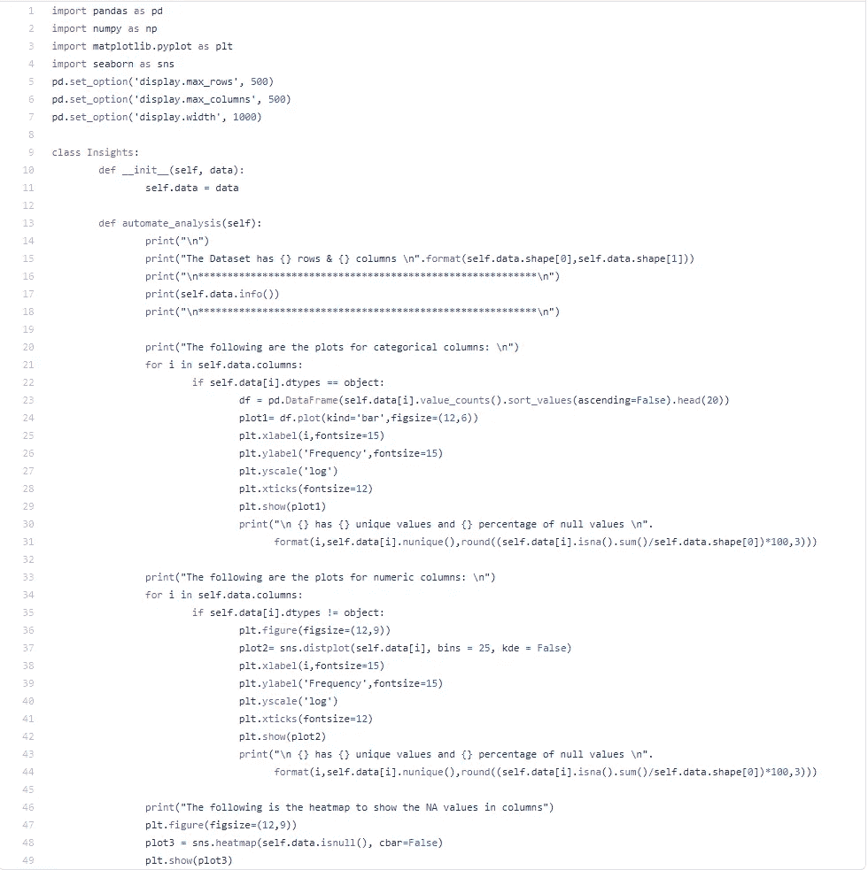
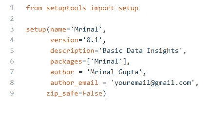

# 了解如何自动化数据分析的基本步骤

> 原文：<https://towardsdatascience.com/learn-how-to-automate-the-basic-steps-of-data-analysis-45e118048172?source=collection_archive---------33----------------------->

## 你是不是也厌倦了一遍又一遍的写 df.shape，df.info()。

马库斯·斯皮斯克在 [Unsplash](https://unsplash.com?utm_source=medium&utm_medium=referral) 上的照片

# 介绍

写 *df.shape，df.info()，plt.plot(kind='bar ')，df['column_name']，你也烦吗？nunique()* ，以及其他许多基本函数一次又一次地从任何数据中获得基本的洞察力。我相信你们一定也开始觉得这个过程很单调。阅读完本文后，您将看到如何通过在几分钟内开发自己的 Python 包，在五个基本步骤中实现这些基本功能的自动化。

## 试映

作者提供的视频

# 我们开始吧

要开始开发您自己的定制 Python 包，我们需要执行以下步骤:

## 步骤 1-创建 Python 脚本文件

该文件将包含运行基本数据分析所需的 Python 代码。为了演示，让我们自动执行以下步骤，例如计算-

*   数据集的维度
*   所有列的数据类型
*   唯一值的数量
*   NA 值的百分比
*   绘制所有分类列的条形图
*   绘制所有数字列的直方图，以查看数据的分布
*   制作一个热图来显示空值

以下是我写的代码片段:

作者图片

文件的名字应该是你想要的包的名字，比如 Pandas，Numpy 等等，并且应该是唯一的。在我们的例子中，我将其命名为“Mrinal”。

## 步骤 2 创建一个 Setup.py 文件

这个文件是安装包所必需的，包含了包名、作者名等信息。该文件位于包含步骤 1 中的 Python 脚本文件和稍后讨论的其他文件的文件夹之外。

作者图片

上面的图像显示了要在 Setup.py 中编写的代码。这里需要注意的一些事情是，您的包的名称应该是唯一的，如果您希望稍后发布到 pypi.org，那么您不能使用网站中已经存在的任何匹配的名称。例如，您不能创建名为“Pandas”或“Numpy”的包，因为它们已经在库中。

## 步骤 3 创建一个 __init__。py 文件

这个文件告诉 Python 这个文件夹包含一个包。它应该与步骤 1 中创建的 Python 脚本文件位于同一文件夹中。

作者图片

上面的代码引用了我们在 Python 脚本中创建的类的名称“Insights ”,以及包的名称“Mrinal”。“.”在 Python3 和更高版本中是强制的。

## 将文件放在正确的文件夹中

对于这一步:

*   创建一个文件夹，你可以随意命名，因为它不会以任何方式影响安装。让我们把它命名为“我的第一个 Python 包”作为参考
*   将 Setup.py 文件存储在该文件夹中
*   在其中创建另一个文件夹，并将其命名为与您给定的包名相同的名称，在我们的例子中，它是“Mrinal ”,每当您想要导入包时，您将编写“From Mrinal import Insights”。
*   存储名为“Mrinal.py”的 Python 脚本文件和“__init__”。新创建的文件夹中的“py”文件

## 第五步 Pip 安装

*   打开命令提示符
*   使用“cd”命令导航到“我的第一个 Python 包”文件夹
*   键入“Pip 安装”
*   这将安装您的软件包
*   然后打开任何 IDE，如 Jupyter Notebook，并键入:“来自 Mrinal import Insights”
*   创建一个类对象，例如 insight_1 = Insights()。也可以看看预告视频。
*   然后像视频中一样调用' automate_analysis()'函数。你会看到那些重复的步骤现在是如何自动化的，现在你只需要调用这个函数就可以完成所有的工作。

# 恭喜你！

您自己构建了您的第一个 python 包，并且通过不再一次又一次地编写那些函数，将会在将来节省大量时间。类似地，您可以添加更多的函数和类来为您的包添加更多的内容，并使您的数据分析过程更加顺畅。

# 资源

*   你也可以从我的 GitHub 页面下载所有的代码文件
*   如果你想上传你的包裹到 pypi.org，你可以点击这个[链接](https://dev.to/prahladyeri/python-checklist-publishing-a-package-to-pypi-4jlc)

如果你喜欢这篇文章，那么请阅读我的另一篇关于[如何开发为强大的机器学习模型](/the-art-of-engineering-features-for-a-strong-machine-learning-model-a47a876e654c)执行特征工程所需的关键技能的文章。