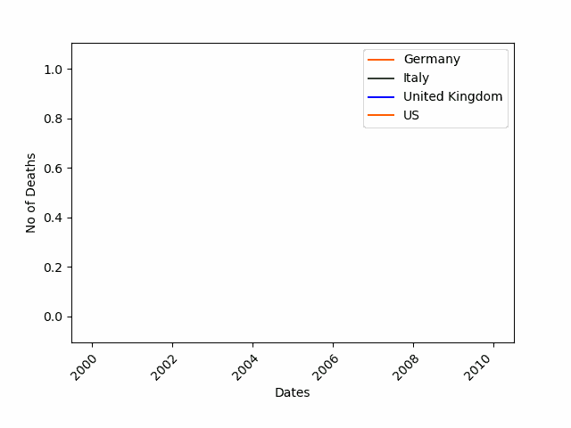
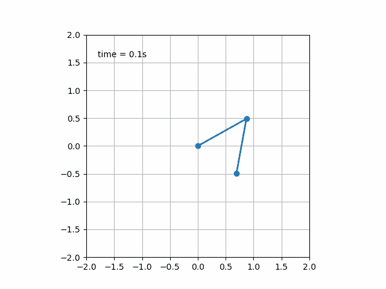
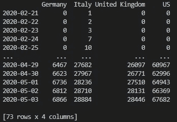
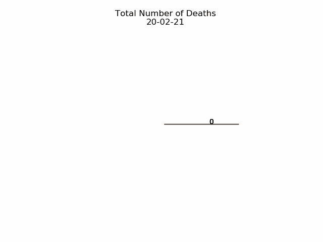
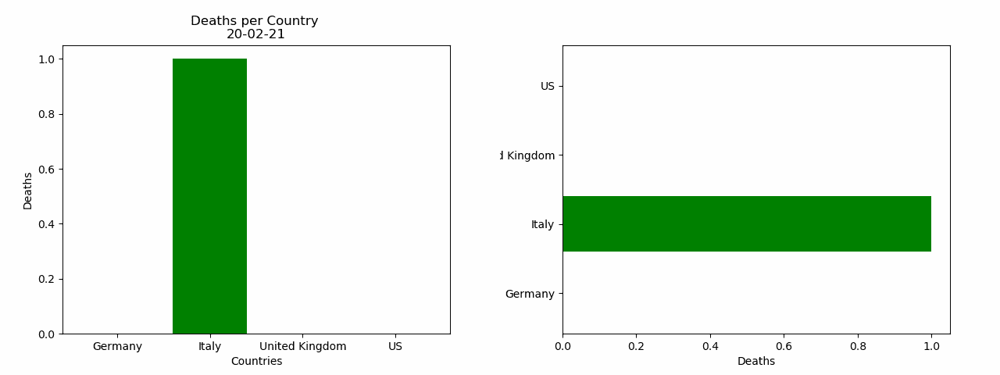

# 了解如何用 Python 创建动画图形

> 原文：<https://towardsdatascience.com/learn-how-to-create-animated-graphs-in-python-fce780421afe?source=collection_archive---------1----------------------->

## 动画数据可视化的基础



随着数据以前所未有的速度不断膨胀，数据科学家需要对其进行分析和理解。一旦发生这种情况，就需要有效地交流结果。

然而，交流数据分析的结果常常是棘手的。为了有效地沟通，一个流行的和非常有效的技术是讲故事。

> 让世界上所有的信息触手可及并不会让交流变得更容易:反而会让交流变得更难。―科尔·努斯鲍默·克纳弗里克

为了帮助讲故事和交流，数据可视化是至关重要的。动画数据可视化让事情更上一层楼，增加了令人惊叹的因素。

在这篇博客中，我们将探讨如何让你的图表生动起来。我们将学习如何给折线图、条形图和饼图添加新的维度。这个博客将让你开始，但可能性是无限的。



[双摆](https://matplotlib.org/gallery/animation/double_pendulum_animated_sgskip.html)

# 动画是如何工作的

在典型的时尚中，正如你对 Python 的期望，有一个非常[易用的包](https://matplotlib.org/3.1.1/api/animation_api.html)，它使我们能够为我们的数据可视化增加一个额外的维度。

正在讨论的包是 [FuncAnimation 扩展方法](https://matplotlib.org/3.1.1/api/_as_gen/matplotlib.animation.FuncAnimation.html#matplotlib.animation.FuncAnimation)，是 Python 的 matplotlib 库中动画类的一部分。我们将通过多个例子来看看如何使用它，但是现在，你可以把这个函数想象成一个 while 循环，它不断地在画布上重新绘制我们的图形。

## 如何使用图书馆

帮助我理解如何制作图表动画的是从结尾开始。这个动画魔术将从下面两行开始发生:

```
import matplotlib.animation as anianimator = ani.FuncAnimation(fig, chartfunc, interval = 100)
```

让我们看看 FuncAnimation 的上述输入:

1.  *fig* 是我们将用来“绘制我们的图形”的图形对象
2.  *chartfunc* 是一个接受数字输入的函数，它表示时间序列上的时间(随着数字的增加，我们沿着时间轴移动)
3.  *间隔*是帧之间的延迟，单位为毫秒。默认为 200。

如需更多可选输入，请查看[文档](https://matplotlib.org/3.1.1/api/_as_gen/matplotlib.animation.FuncAnimation.html#matplotlib.animation.FuncAnimation)。

进一步研究以上内容，我们需要做的就是将他们的图表参数化为一个函数，该函数将时间序列中的点作为输入，游戏就开始了！

# 入门指南

为了确保我们涵盖了所有基础，我们将基于之前的数据可视化示例，我们已经在:

[](/the-basics-of-data-visualisation-with-python-23188aa9fc1a) [## Python 数据可视化基础

### 不到 5 分钟的逐步介绍

towardsdatascience.com](/the-basics-of-data-visualisation-with-python-23188aa9fc1a) 

换句话说，我们将使用来自疫情(每天死亡人数)的数据，并且我们将使用下面代码中给出的最终数据集。如果你想了解更多关于下面的数据转换和如何开始简单的数据可视化，先简单地阅读上面的帖子。

```
import matplotlib.animation as ani
import matplotlib.pyplot as plt
import numpy as np
import pandas as pdurl = '[https://raw.githubusercontent.com/CSSEGISandData/COVID-19/master/csse_covid_19_data/csse_covid_19_time_series/time_series_covid19_deaths_global.csv'](https://raw.githubusercontent.com/CSSEGISandData/COVID-19/master/csse_covid_19_data/csse_covid_19_time_series/time_series_covid19_deaths_global.csv')
df = pd.read_csv(url, delimiter=',', header='infer')df_interest = df.loc[
    df['Country/Region'].isin(['United Kingdom', 'US', 'Italy', 'Germany'])
    & df['Province/State'].isna()]df_interest.rename(
    index=lambda x: df_interest.at[x, 'Country/Region'], inplace=True)
df1 = df_interest.transpose()df1 = df1.drop(['Province/State', 'Country/Region', 'Lat', 'Long'])
df1 = df1.loc[(df1 != 0).any(1)]
df1.index = pd.to_datetime(df1.index)
```



# 动画线条图


我们需要做的第一件事是定义图表中的项目，这些项目将保持不变。也就是说，创建图形对象、x 和 y 标签，设置线条颜色和图形边距。

```
import numpy as np
import matplotlib.pyplot as pltcolor = ['red', 'green', 'blue', 'orange']
fig = plt.figure()
plt.xticks(rotation=45, ha="right", rotation_mode="anchor") #rotate the x-axis values
plt.subplots_adjust(bottom = 0.2, top = 0.9) #ensuring the dates (on the x-axis) fit in the screen
plt.ylabel('No of Deaths')
plt.xlabel('Dates')
```

然后，我们必须设置我们的曲线功能，然后动画它:

```
def buildmebarchart(i=int):
    plt.legend(df1.columns)
    p = plt.plot(df1[:i].index, df1[:i].values) #note it only returns the dataset, up to the point i
    for i in range(0,4):
        p[i].set_color(color[i]) #set the colour of each curveimport matplotlib.animation as ani
animator = ani.FuncAnimation(fig, buildmebarchart, interval = 100)
plt.show()
```

# 动画饼图



代码结构看起来与折线图相同。然而，有一些差异，我们将通过。

```
import numpy as np
import matplotlib.pyplot as pltfig,ax = plt.subplots()
explode=[0.01,0.01,0.01,0.01] #pop out each slice from the piedef getmepie(i):
    def absolute_value(val): #turn % back to a number
        a  = np.round(val/100.*df1.head(i).max().sum(), 0)
        return int(a)
    ax.clear()
    plot = df1.head(i).max().plot.pie(y=df1.columns,autopct=absolute_value, label='',explode = explode, shadow = True)
    plot.set_title('Total Number of Deaths\n' + str(df1.index[min( i, len(df1.index)-1 )].strftime('%y-%m-%d')), fontsize=12)import matplotlib.animation as ani
animator = ani.FuncAnimation(fig, getmepie, interval = 200)
plt.show()
```

一个主要的区别是，在上面的代码中，我们每次都返回一组值。在线图中，我们将整个时间序列返回到我们所在的点。我们通过使用

```
df1.head(i).max()
```

df1.head(i)返回一个时间序列，但是。max()确保我们只获得最新的记录(因为死亡总数要么保持不变，要么上升)。

# 动画条形图



构建条形图就像我们到目前为止看到的例子一样简单。对于这个例子，我包括了水平和垂直条形图。取决于你想看哪一个，你只需要定义变量 *bar* 。

```
fig = plt.figure()
bar = ''def buildmebarchart(i=int):
    iv = min(i, len(df1.index)-1) #the loop iterates an extra one time, which causes the dataframes to go out of bounds. This was the easiest (most lazy) way to solve this :)
    objects = df1.max().index
    y_pos = np.arange(len(objects))
    performance = df1.iloc[[iv]].values.tolist()[0]
    if bar == 'vertical':
        plt.bar(y_pos, performance, align='center', color=['red', 'green', 'blue', 'orange'])
        plt.xticks(y_pos, objects)
        plt.ylabel('Deaths')
        plt.xlabel('Countries')
        plt.title('Deaths per Country \n' + str(df1.index[iv].strftime('%y-%m-%d')))
    else:
        plt.barh(y_pos, performance, align='center', color=['red', 'green', 'blue', 'orange'])
        plt.yticks(y_pos, objects)
        plt.xlabel('Deaths')
        plt.ylabel('Countries')animator = ani.FuncAnimation(fig, buildmebarchart, interval=100)plt.show()
```

# 如何保存动画图形

所以你已经创建了你的第一个动画图表，你想分享它们。你如何拯救他们？

幸运的是，只需要一行代码:

```
animator.save(r'C:\temp\myfirstAnimation.gif')
```

更多信息，[查看文档](https://matplotlib.org/3.1.1/api/animation_api.html)。

如果你喜欢这篇博文，你可能也会喜欢:

[](/how-to-supercharge-excel-with-python-726b0f8e22c2) [## 如何用 Python 为 Excel 增压

### 如何用 xlwings 集成 Python 和 Excel

towardsdatascience.com](/how-to-supercharge-excel-with-python-726b0f8e22c2) [](https://medium.com/better-programming/introduction-to-regex-8c18abdd4f70) [## 正则表达式简介

### 使用 Python 逐步介绍正则表达式

medium.com](https://medium.com/better-programming/introduction-to-regex-8c18abdd4f70) [](/automate-ui-testing-with-pyautogui-in-python-4a3762121973) [## 用 Python 中的 PyAutoGUI 实现自动化 UI 测试

### 回归测试你的用户界面的一个快速简单的方法

towardsdatascience.com](/automate-ui-testing-with-pyautogui-in-python-4a3762121973)