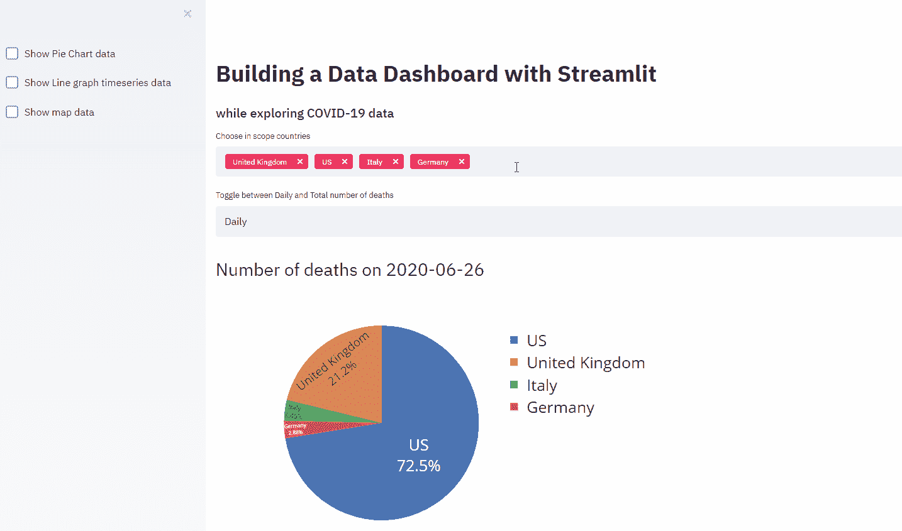
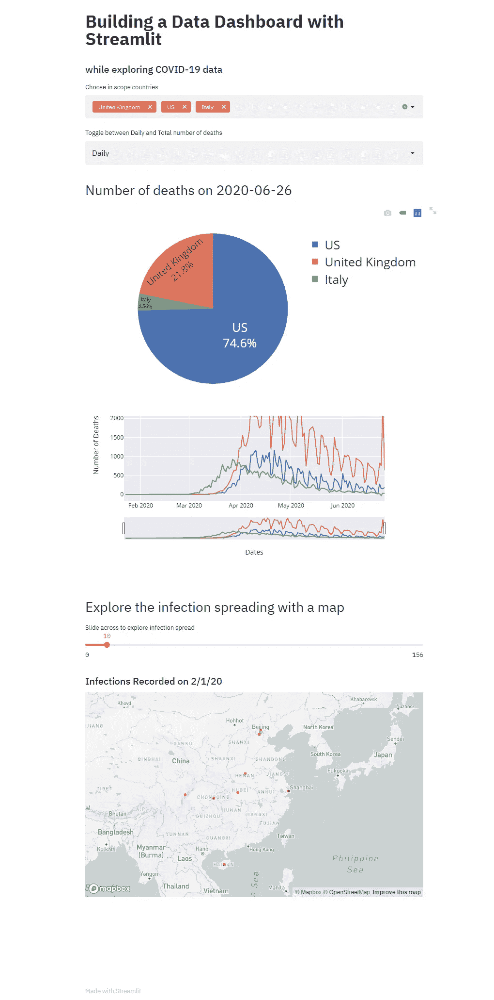
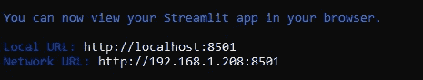
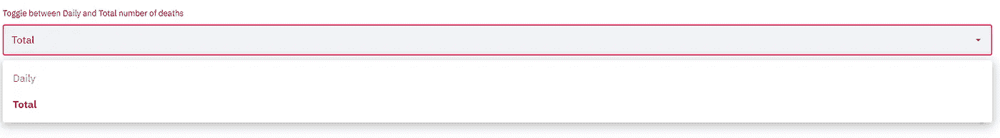
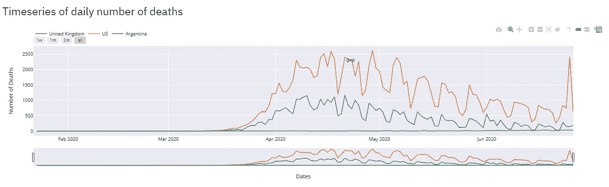
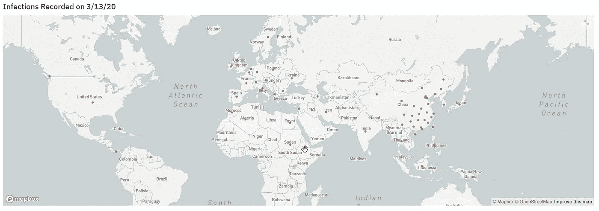

# 了解如何用 Python 创建 Web 数据应用程序

> 原文：<https://towardsdatascience.com/learn-how-to-create-web-data-apps-in-python-b50b624f4a0e?source=collection_archive---------21----------------------->

## 最后，你可以在 5 分钟内找到一个图书馆



学习 python 的美妙之处在于它的简单性和直观的表达结构。一旦你学会了这些基础知识，你就可以很好地构建有用且功能强大的应用程序了。加速整个过程并使 python 领先于竞争对手的是大量的免费库。

时不时会出现一个新的库，这改变了游戏！我认为这可能是构建 web 数据应用程序的一个例子。

# 用于构建 web(数据)应用程序的 Python 库

最流行的 web 开发 Python 框架有 Django、Tornado 和 Flask。都很厉害，但多少有点技术含量。它们需要你投入大量的时间来学习使用它们。在某种程度上，他们不是真正的生活方式！

这就是 **streamlit** 拯救世界的地方。一家谷歌支持的公司，其使命包括提供机器学习爱好者应得的工具:极快、有趣和互动！

> “在生产可共享工件的同时编写生产级代码。”—谷歌 X，尼尔·特里克

事不宜迟，让我们开始探索这个令人印象深刻的图书馆。

# 疫情数据探索

使用我上一篇文章 [***中的数据和技术，如何用 Python 创建交互式可视化***](/how-to-create-interactive-visualisations-in-python-4af42cf83ba4) ***，*** 我们可以用 Streamlit 非常快速地构建一个数据仪表板。

下面是我用几行代码构建的！



# 加载仪表板

加载仪表板非常快速简单。首先，以典型的方式安装库:

```
pip install streamlit
```

然后，创建一个 python 脚本:

```
import streamlit as stst.title('Hello there')
```

然后通过命令行运行它:

```
streamlit run yourScriptsFileName.py
```

这将返回您需要在浏览器中使用的地址，以查看您的 web 数据应用程序。



# 内置函数介绍

## 显示文本

有几种方法可以在 web 应用程序上显示文本:


```
import streamlit as st
st.title('This is a title')
st.header('A header...')
st.subheader('A subheader...')
st.markdown('Or a markdown.')
```

## 多重选择

你可以很容易地添加一个下拉多选控件。


```
x = st.multiselect('Text to display', List of Available Options, List of default options)
#where x will end up being a list of options
```

## 选择框

或者你可以有一个选择框，你只能从下拉菜单中选择一个值。



```
dailytotal = st.selectbox('Toggle between Daily and Total number of deaths', ('Daily', 'Total'))
```

## 滑块


引入滑块可以允许用户在不同的值之间拖动滑块。

```
slide = st.slider('Slide across to explore infection spread', minimumslide, maxslide, defaultslidevalue)
```

## 图表



使用 plotly express 时，您很大程度上遵循了典型的模式，但是您没有使用 fig.show()，而是将其替换为:

```
st.plotly_chart(fig, use_container_width=True)
```

## 交互式地图



一个直接的控件，要求您传入经度和纬度。

```
st.map(dfmap[['lat','lon']])
```

## 缓存以更快获得结果

没有任何形式的缓存，数据仪表板就不完整。令人欣慰的是，streamlit 允许您非常快速、轻松地缓存数据，因此您不必每次都读取它们。简单地在你的函数上添加下面一行。

```
@st.cache(persist=True)
```

# 我的仪表板的完整代码

```
import streamlit as st
import pandas as pd
import plotly.express as px
import pydeck as pdk
import numpy as np#Load and Cache the data
[@st](http://twitter.com/st).cache(persist=True)
def getmedata():
    url = '[https://raw.githubusercontent.com/CSSEGISandData/COVID-19/master/csse_covid_19_data/csse_covid_19_time_series/time_series_covid19_deaths_global.csv'](https://raw.githubusercontent.com/CSSEGISandData/COVID-19/master/csse_covid_19_data/csse_covid_19_time_series/time_series_covid19_deaths_global.csv')
    df = pd.read_csv(url, delimiter=',', header='infer')
    df.rename(index=lambda x: df.at[x, 'Country/Region'], inplace=True)
    dft = df.loc[df['Province/State'].isnull()]
    dft = dft.transpose()
    dft = dft.drop(['Province/State', 'Country/Region', 'Lat', 'Long'])
    dft.index = pd.to_datetime(dft.index)
    return(dft, df)df1 = getmedata()[0]st.title('Building a Data Dashboard with Streamlit')
st.subheader('while exploring COVID-19 data')#####In Scope Countries
countrylist = df1.columns.tolist()
countrylist1 = ['United Kingdom', 'US', 'Italy']
x = st.multiselect('Choose in scope countries', countrylist, countrylist1)
df1_inscope = df1[x]dailytotal = st.selectbox('Toggle between Daily and Total number of deaths', ('Daily', 'Total'))
if dailytotal == 'Daily':
    plotdata = df1_inscope.diff() #day on day changes
else:
    plotdata = df1_inscope#Build Pie Chart
df1 = plotdata.tail(1).transpose()
fig = px.pie(df1, values = str(df1.columns[0]), names = df1.index)
fig.update_traces(textposition='inside', textinfo = 'percent+label')
ddate = str(df1.columns[0])[:10] #chop timestampif dailytotal == 'Daily':
    st.header('Number of deaths on ' + ddate)
else:
    st.header('Total number of deaths up until ' + ddate)fig.update_layout(
    #title = f'Deaths on {ddate} due to COVID-19',
    xaxis_title = 'Dates'
    ,yaxis_title = 'Number of Deaths'
    ,font = dict(size = 25)
    ,template = 'seaborn' #"plotly", "plotly_white", "plotly_dark", "ggplot2", "seaborn", "simple_white", "none"
)
st.plotly_chart(fig)piechart = st.sidebar.checkbox('Show Pie Chart data')
if piechart == True:
    st.dataframe(df1)
    st.write()
else:
    st.write()#Move to Line graph
if dailytotal == 'Daily':
    st.header('Timeseries of daily number of deaths')
else:
    st.header('Timeseries total Number of deaths')fig = px.line()
for i,n in enumerate(plotdata.columns):
    fig.add_scatter(x=plotdata.index, y= plotdata[plotdata.columns[i]], name= plotdata.columns[i])
fig.update_layout(
     xaxis_title = 'Dates'
    ,yaxis_title = 'Number of Deaths'
    ,template = 'seaborn' #"plotly", "plotly_white", "plotly_dark", "ggplot2", "seaborn", "simple_white", "none"
    ,legend=dict(orientation="h", yanchor = 'top', y = 1.2)
)
fig.update_xaxes(
    rangeslider_visible=True,
    rangeselector=dict(
        buttons=list([
            dict(count=7, label="1w", step="day", stepmode="backward"),
            dict(count=1, label="1m", step="month", stepmode="backward"),
            dict(count=2, label="2m", step="month", stepmode="backward"),
            dict(step="all")
        ]),
        font = dict( color='#008000', size = 11),
    )
)st.plotly_chart(fig, use_container_width=True)##Show underlying data?
showdata = st.sidebar.checkbox('Show Line graph timeseries data')
if showdata == True:
    st.dataframe(plotdata)
else:
    st.write()###Plot a streamlit map
st.header('Explore the infection spreading with a map')
df2 = getmedata()[1]
df2.rename(columns={'Lat': 'lat', 'Long': 'lon', 'Province/State': 'Province', 'Country/Region': 'Country'}, inplace=True)maxslide = len(df2.columns) - 5
slide = st.slider('Slide across to explore infection spread', 0, maxslide, 10)datecolumn = df2.columns[slide + 4]
datecolumnlist = [datecolumn]st.subheader('Infections Recorded on ' + datecolumn)dfmap = df2[['Country','Province', 'lat', 'lon', datecolumn]]
dfmap = dfmap.replace(0,np.nan).dropna(subset = [datecolumn, 'lat', 'lon'])st.map(dfmap[['lat','lon']])mapgraph = st.sidebar.checkbox('Show map data')
if mapgraph == True:
    st.dataframe(dfmap)
    st.write()
else:
    st.write()
```

# 离别的思绪

Streamlit 是一个非常漂亮的数据 web 仪表板，可以单独用 python 编写。它允许你毫不费力地分享你的工作，并且有许多有用的控件。

只使用了这个仪表板的基本功能，我可以看到它的许多应用。它上传文件的新控件 st.file_uploader()肯定会支持更大的项目。

我相信 streamlit 是这样一个库，随着它的成熟，它会变得越来越好，并在定制和控制方面提供越来越多的功能！

如果你喜欢这个博客，你可能也会喜欢:

[](https://medium.com/better-programming/three-techniques-for-time-management-and-prioritization-9df6dffe2ff1) [## 时间管理和优先级排序的三种技巧

### 学习如何有效管理你的时间以获得职业成功

medium.com](https://medium.com/better-programming/three-techniques-for-time-management-and-prioritization-9df6dffe2ff1) [](/learning-to-use-progress-bars-in-python-2dc436de81e5) [## 学习使用 Python 中的进度条

### 4 个不同库的介绍(命令行和用户界面)

towardsdatascience.com](/learning-to-use-progress-bars-in-python-2dc436de81e5) [](https://medium.com/financeexplained/beginners-guide-to-identifying-stocks-to-invest-in-4cf10fa5dcff) [## 识别投资股票的入门指南

### 想在股市一试身手却不知道从何下手？

medium.com](https://medium.com/financeexplained/beginners-guide-to-identifying-stocks-to-invest-in-4cf10fa5dcff)