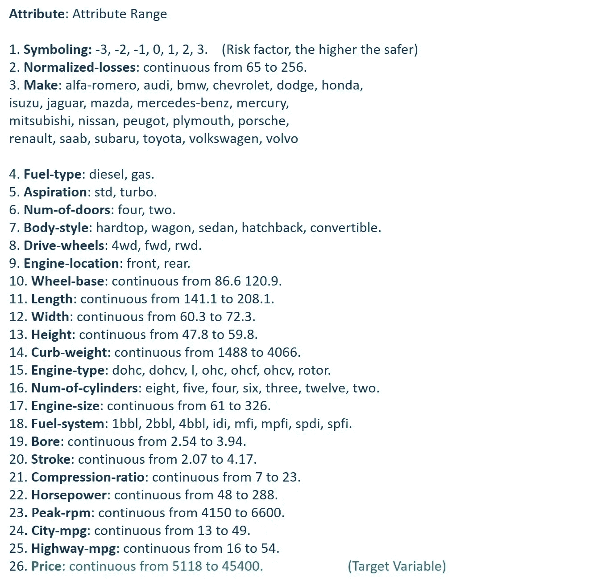
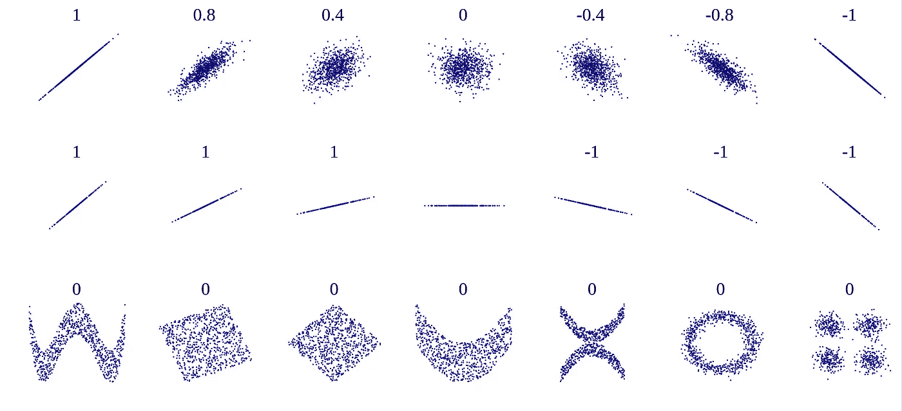
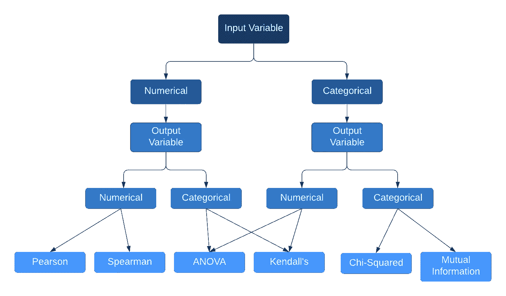

# 了解如何以正确的方式进行特征选择

> 原文：<https://towardsdatascience.com/learn-how-to-do-feature-selection-the-right-way-61bca8557bef?source=collection_archive---------11----------------------->

来源: [Pixabay](https://pixabay.com/photos/apple-fruit-selection-especially-1594742/)

## x 真的是 y 的预测因子吗？

努力为您的模型找到合适的功能？我指的是增值功能。假设您正在处理来自物联网传感器或医疗保健的高维数据，这些数据具有成百上千个特征，很难找出哪些特征子集将带来良好的可持续模型。本文是关于在汽车数据集上使用 scikit-learn 的特性选择和技术实现的。我已经尽了最大努力把复杂的计算放在一边，但是对统计学的一些基本理解会让你的旅程更容易。😃

“原始”数据集通常带有许多不相关的特征，这些特征对预测模型的准确性没有太大贡献。使用音乐类比来理解这一点——音乐工程师经常使用各种技术来调整他们的音乐，这样就没有多余的噪音，声音也清晰明了。类似地，即使是数据集也会遇到噪声，为了更好地优化模型，去除噪声是至关重要的。这就是特性选择的由来！

现在，撇开模型精度不谈，理论上，**特征选择**

*   ***减少过度拟合***‘维数灾难’—如果数据集的特征/列多于样本 **(X)** ，模型将容易过度拟合。通过移除不相关的数据/噪声，该模型可以专注于基本特征，从而实现更高的泛化能力。
*   ***简化模型*** —维度给模型增加了许多层，使其变得不必要的复杂。过度工程很有趣，但他们可能不会比简单的同行更好。更简单的模型更容易解释和调试。
*   ***减少训练时间*** —较少的特征/尺寸降低了计算速度，加快了模型训练。

请记住，所有这些好处在很大程度上取决于问题。但可以肯定的是，它会产生一个更好的模型。

# 这是降维吗？

## 不完全是！

通常，特征选择和降维可以互换使用，因为它们的相似目标是减少数据集中的特征数量。然而，它们之间有一个重要的区别。特征选择从原始特征集中产生特征子集，这是数据的最佳代表。而降维是引入新的特征空间，在该空间中表示原始特征。它基本上将特征空间转换到一个较低的维度，保持原始特征不变。这是通过组合或排除一些特征来实现的。总之，你可以把特征选择看作是维度教育的一部分。

# 数据集在运行

我们将使用来自 UCI 机器学习知识库的自动汽车数据集。该数据集包含有关汽车规格、保险风险评级以及与其他汽车相比的正常使用损失的信息。该模型的目标是预测“价格”。一个回归问题，它由连续变量和分类变量组成，如下所示:

属性描述(图片由作者提供)

在对大约 200 个样本(每个样本有 26 个属性)进行了大量的预处理后，我设法将 [R 的平方](https://en.wikipedia.org/wiki/Coefficient_of_determination)的值设为 0.85。因为我们的重点是评估特性选择技术，所以我不会深入建模过程。要获得完整的回归代码，请查看下面 [Github](https://github.com/Ayushijain09/Feature-Selection-Techniques) 链接上的 [jupyter 笔记本](https://github.com/Ayushijain09/Feature-Selection-Techniques/blob/master/_Automobile_Multiple_LinearRegression_Feature_Selection.ipynb)。

 [## ayushijain 09/特征选择技术

### 查看此链接，了解完整的多元线性回归代码以及汽车数据集的特征技术。

github.com](https://github.com/Ayushijain09/Feature-Selection-Techniques/blob/master/_Automobile_Multiple_LinearRegression_Feature_Selection.ipynb) 

**现在，让我们尝试通过特征选择来改进模型！**

# 技术

简而言之，特征选择方法可以分为三大类，过滤、包装和嵌入。

# 一.过滤方法

使用过滤方法，我们主要应用适合我们的数据的统计测量来分配**每个特征列**一个计算的分数。基于该分数，将决定该特征将被保留还是从我们的预测模型中移除。这些方法计算成本低，最适合消除冗余的不相关特征。然而，一个缺点是它们没有考虑到特性的相关性，因为它们独立地处理每个特性。

此外，我们有对单个特征进行排序的 ***单变量过滤方法*** ，以及评估整个特征空间的 ***多变量过滤方法*** 。让我们探索一下最著名的特征选择过滤方法:

## **1。)缺失值比率**

缺少太多值的数据列没有多大价值。理论上，25–30%是缺失值的可接受阈值，超过该阈值，我们应该从分析中删除这些特征。如果你有领域知识，最好能做出一个有根据的猜测，这个特性是否对模型至关重要。在这种情况下，尝试使用此处列出的[各种技术输入缺失值。要获得每个特性的缺失值百分比，请尝试下面的一行代码！为每种技术添加一个 jupyter 笔记本很麻烦，所以我使用 Github gist 并排添加了输出，考虑到了相同的汽车数据集。](/all-about-missing-data-handling-b94b8b5d2184)

nlargest()返回缺省值最多的 5 个要素

## **2。)差异阈值**

其中相同值占据大多数样本的特征被称为具有零方差。这种携带少量信息的特征不会影响目标变量，并且可以被丢弃。您可以调整阈值，默认值为 0，即移除所有样本中具有相同值的特征。对于一个非常大的子集具有相同值的准常数特征，使用阈值 0.01。换句话说，删除 99%的值相似的列。

丢弃零方差要素(可自定义阈值)

## **3。)相关系数**

如果两个独立的特征(X)彼此之间有很强的关系并且向相似的方向移动，则它们是高度相关的。在这种情况下，如果一个特性就足够了，那么就不需要将两个相似的特性添加到模型中。它主要考虑拟合线、拟合线的斜率和拟合质量。计算相关系数有多种方法，如果一对列超过某个阈值，则显示与目标变量(y)高度相关的一列将被保留，而另一列将被丢弃。

***皮尔逊相关*** *(针对连续数据)*是度量两个变量之间相似性的参数统计检验。被参数项搞糊涂了？这意味着该测试假设观察到的数据遵循某种分布模式(例如，正态、高斯)。其系数值' **r'** 的范围在 **-1(** 负相关)到 **1(** 正相关)之间，表示数据与模型的拟合程度。它还返回' **p 值**，通过与显著性水平' alpha' (α)进行比较，确定变量之间的相关性是否显著。如果 p 值小于α，则意味着样本包含足够的证据来拒绝零假设，并得出相关系数不等于零的结论。

[来源](https://en.wikipedia.org/wiki/Pearson_correlation_coefficient):多组( *x* ， *y* )点，每组相关系数为 *x* ， *y* 。请注意，相关性反映了线性关系的强度和方向(顶行)，但不是该关系的斜率(中间)，也不是非线性关系的许多方面(底部)。

***Spearman 秩相关系数*** *(针对连续+有序数据)*是一种非参数统计检验，工作原理类似于 Pearson，但是，它不对数据做任何假设。用符号 rho(-1<**ρ**<1**)**表示，这种检验可以应用于未通过皮尔逊相关假设的有序和连续数据。对于新手来说，有序数据是分类数据，但在排名/排序上有细微差别(例如，低、中、高)。这里要注意的一个重要假设是，变量之间应该存在单调关系，即变量的值一起增加，或者如果一个增加，另一个减少。

***肯德尔相关系数*** *(针对离散/有序数据)——**类似于 Spearman 相关，这个系数比较的是一致和不一致数据对的数量。*

> **假设我们有一对观测值(xᵢ，yᵢ)，(xⱼ，yⱼ)，i < j，它们是:*
> *** 和谐 if 任一(xᵢ > xⱼ和 yᵢ > yⱼ)或(x\u\u<x \u\u 和 y\u\u<y\u\\u
> ***不和谐if 任一(x \\u*

*用希腊字母 tau ( **τ** )表示，该系数在-1 到 1 之间变化，并且基于相对于 x-y 对数量的一致和不一致对的计数差异。*

*Pearson、Spearman、Kendall 使用 Scipy & Pandas 的相关系数*

*在上面的回归 jupyter 笔记本中，我使用了 **Pearson 相关性**,因为 Spearman 和 Kendall 只对顺序变量有效，而我们有 60%的连续变量。*

## ***4。)独立性卡方检验** *(针对分类数据)**

*在深入研究卡方之前，我们先了解一个重要的概念:假设检验！想象一下，XYZ 提出一个主张，一个公认的事实，你称之为无效假设。现在你提出了一个替代假设，一个你认为能更好地解释这种现象的假设，然后努力拒绝零假设。
在我们的例子中:
*零假设*:两个变量是独立的。
*备择假设*:两个变量是相依的。*

*因此，卡方检验有两种变化——一种是评估**拟合优度**，另一种是独立性**检验**。首先，它将观察到的数据与根据变量独立的**期望**分布数据的模型进行比较。然后，你基本上需要检查观察到的数据哪里不符合模型。如果数据点/异常值太多，那么变量存在相依性的可能性极大，证明零假设不正确！*

*它主要返回一个测试统计量**“p 值”**来帮助我们决定！在高水平上，如果 p 值小于某个临界值- ' **显著性水平**'(通常为 0.05)，我们拒绝零假设，认为变量是相关的！*

*卡方检验不适用于汽车数据集，因为它需要分类变量和非负值！出于这个原因，我们可以使用互信息&方差分析。*

## ***5。)** **互信息(** *为双方回归&分类)**

*互信息衡量一个变量对另一个变量的贡献。换句话说，如果我们删除或添加特性，目标变量会受到多大的影响？如果两个变量都是独立的，则 MI 为 0，如果 X 是 y 的确定性变量，则 MI 在 0-1 之间。MI 主要是 X 的熵，它测量或量化通过一个随机变量获得的关于另一个随机变量的信息量。*

*关于 MI 最好的事情是它允许人们检测非线性关系，并且对回归和分类都有效。酷！不是吗😃*

## ***6。)方差分析***

*好吧，老实说，这有点棘手，但让我们一步一步地理解它。首先，这里我们处理的不是特性，而是组/级别。组是同一独立(分类)变量中的不同组。方差分析主要是 t 检验的一种 T2 扩展。用 t 检验，你可以只研究两组，但用方差分析，你至少需要三组来观察均值是否有差异，并确定他们是否来自同一人群。*

> *它假定假设为
> H0:所有群体的手段都是平等的。
> H1:至少有一组的均值不同。*

*假设从我们的汽车数据集中，我们使用一个“燃料类型”特征，它有两个组/级别——“柴油”和“汽油”。因此，我们的目标是通过计算两组的平均值是否不同于独立变量(即“燃料类型”)的总体平均值，来确定这两组在统计上是否不同。ANOVA 使用 F-Test 进行统计显著性检验，F-Test 是组之间的**方差与组**内的**方差之比，该数字越大，组的均值越有可能真正*不同，您应该拒绝零假设。***

*回归任务的方差分析特征选择*

**

*选择特征选择方法(图片由作者提供)*

# *二。包装方法*

*在包装方法中，我们主要选择特征的子集，并使用机器学习算法来训练它们。基于来自该模型的推论，我们采用搜索策略来查看可能的特征子集的空间，并决定为下一个模型开发添加或移除哪个特征。该循环继续，直到模型性能不再随所需的特征数 *(k_features)* 而变化。*

*缺点是，随着要素的增加，计算量会变得很大，但好的一面是，它会处理要素之间的交互，最终为您的模型找到具有最低可能误差的最佳要素子集。*

## *1.)顺序特征选择*

*一种贪婪的搜索算法，它有两种变体- **顺序向前选择** (SFS)和**顺序向后选择** (SBS)。它基本上从一组空集特征开始，然后寻找一个特征，使**最小化成本函数**。一旦找到特征，它就被添加到特征子集中，并以同样的方式一个接一个地找到正确的特征集来构建最佳模型。这就是 SFS 的工作方式。对于顺序向后特征选择，它采取完全相反的路线。它从所有特征开始，并根据性能迭代地逐个去除特征。两种算法的目标都是获得最低成本的模型。*

> *SFS 的主要限制是*不能删除添加其他功能后变得无用的功能*。SBS 的主要限制是它不能在一个特性被丢弃后重新评估其有用性。*

*SFS(对于顺序向后选择，将**向前**参数改为 ***假)****

## *2.)递归特征消除(RFE)*

*考虑到您有一组初始特征，这种贪婪算法的作用是通过每次考虑更小的特征子集来重复执行模型构建。它是怎么做到的？在对估计器进行特征训练之后，它基于模型的 *coef_* 或 *feature_importances_* 属性返回等级值，传达每个特征的重要性。对于下一步，从当前特征集中删除最不重要的特征。这个过程被递归地重复，直到获得指定数量的特征。*

*RFE 回归*

# *三。嵌入式方法*

*这些方法结合了过滤器和包装器方法的功能。好处是它们在训练过程中执行特征选择，这就是它们被称为嵌入式的原因！计算速度和过滤方法一样快，当然精确度更高，这是一个双赢的模式！*

## *1.)L1(拉索)正则化*

*在深入 L1 之前，让我们先了解一下正规化。首先，它是一种用于减少对高度复杂模型过度拟合的技术。我们在成本函数中增加了一个惩罚项，这样随着模型复杂度的增加，成本函数会增加一个巨大的值。回到 LASSO(最小绝对收缩和选择算子)正则化，这里你需要明白的是，它带有一个参数，**‘alpha’**并且 alpha 越高，最不重要特征的特征系数越收缩到零。最终，我们得到一个更简单的模型，具有相同或更好的精度！*

*然而，在某个特征很重要的情况下，您可以尝试岭正则化(L2)或弹性网(L1 和 L2 的组合)，其中不是完全放弃它，而是减少特征权重。*

*套索回归*

## *2.)树模型(用于回归和分类)*

*随机森林是最流行和最准确的机器学习算法之一，它是随机**决策树**的集合。一个单独的树不会包含所有的特征和样本。我们使用这些进行特征选择的原因是决策树的构造方式！我们的意思是，在树构建的过程中，它使用内置的几种特征选择方法。从根开始，用于创建树的函数通过在每一步进行条件比较来尝试所有可能的分割，并选择将数据分割成最同质组(最纯)的一个。每个特征的重要性由每个集合的“纯净”程度得出。*

*使用**基尼系数**进行分类，使用方差进行回归，我们可以识别出能够产生最优模型的特征。同样的概念也可以应用于 CART(分类和回归树)和 boosting 树算法。*

*使用决策树的特征重要性*

# *结束注释*

*仅此而已！希望你对这些统计测试作为特征选择技术是如何工作的有一个很好的直觉。这里要考虑的一件重要事情是，应用特征选择算法并不总是保证更好的准确性，但肯定会导致比以前更简单的模型！*

*如果你有任何问题/想法，请在下面的评论区留下你的反馈，或者你可以通过 [Linkedin](https://www.linkedin.com/in/ayushijain09/) 联系我。*

*敬请关注更多内容！😃*

# *参考*

* [## NumPy、SciPy 和 Pandas:与 Python 的相关性-真正的 Python

### 在本教程中，您将了解什么是相关性，以及如何使用 Python 计算相关性。你会用 SciPy，NumPy…

realpython.com](https://realpython.com/numpy-scipy-pandas-correlation-python/#pearson-correlation-coefficient)  [## 特征选择技术实践:嵌入式方法

### 第 4 部分:正则化和基于树的嵌入方法

heartbeat.fritz.ai](https://heartbeat.fritz.ai/hands-on-with-feature-selection-techniques-embedded-methods-84747e814dab)*