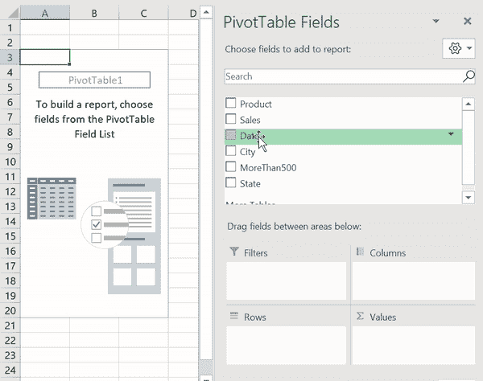

# 学习如何(轻松！！)用 Python 做 3 个高级 Excel 任务

> 原文：<https://towardsdatascience.com/learn-how-to-easily-do-3-advanced-excel-tasks-in-python-925a6b7dd081?source=collection_archive---------4----------------------->

## 面向 Excel 高级用户的熊猫介绍


对峙开始了！(来源:Nik Piepenbreier)

Excel 是无处不在的数据分析工具——它很容易上手，大多数情况下每个人都有一份，一旦你掌握了它，它就非常强大！与此同时，Python 通常被认为是比较难学的，但是却有无限的潜力。在这篇文章中，我们将探索在 Python 中可以轻松完成的三件事，这三件事你通常在 Excel 中都能做到！

我们将从导入 pandas 开始，并根据工作簿中的工作表加载两个数据帧。我们称它们为*销售*和*状态*。

将我们的数据集导入熊猫数据框架。

假设我们运行了。head()方法，如下所示:

```
print(sales.head())
```

我们可以将其与 Excel 中的数据进行比较:


比较数据在 Excel 和 Pandas 中的显示方式(来源:Nik Piepenbreier)

我们可以看到显示的数据与 Excel 显示数据的方式相对相似，但也有一些关键的区别:

*   Excel 从第 1 行开始，而 Pandas 从第 0 行(' index ')开始，
*   Excel 用以 A 开头的字母标记列，而 Pandas 用变量名标记列

让我们开始深入研究如何与熊猫一起完成 Excel 任务。

# Python 中的 IF 函数

在 Excel 中使用 IF 函数非常方便，它允许我们根据另一个单元格中的条件应用某个标签。假设我们想要创建一个新列，让我们知道 B 列的单元格中的值是否大于 500。在 Excel 中，我们将 E 列标记为大于 500，我们将进入单元格 E2 并写入:

```
=IF([@Sales]>500, "Yes", "No")
```


在 Excel 中应用 IF 函数(来源:Nik Piepenbreier)

如果我们想在 Pandas 中这样做，我们可以使用列表理解来轻松应用相同的 If 语句:

```
sales['MoreThan500'] = ['Yes' if x > 500 else 'No' for x in sales['Sales']]
```


解释的理解列表(资料来源:Nik Piepenbreier)

列表理解是这类工作的好工具，它减少了编写复杂 if/else 语句的需要。您可以用 if/else 语句完成同样的事情，但是这样可以节省时间，并使代码更加简洁。你可以通过查看[这篇文章](https://datagy.io/list-comprehensions-in-python/)来了解更多关于列表理解的细节。

想了解更多关于列表理解的知识吗？看看我的视频！

Python 中的列表理解。资料来源:Nik Piepenbreier

# 熊猫视频

在我们的数据集中，城市在一张表上，州/省在另一张表上。这并不理想，但是我们可以在 Excel 中使用 VLOOKUP 来链接数据。VLOOKUP 的工作方式类似于左连接，左数据集中的每个记录都被保留。我们告诉 Excel 在查找表中垂直上下查找某一列中的特定值，然后返回位于该列右侧特定列数的值。

让我们添加一个名为“State”的列，并使用 VLOOKUP 从 *states* 表中返回相应的状态。


使用 VLOOKUP 添加州/省信息(来源:Nik Piepenbreier)

在 Python 中，我们可以使用 Pandas *merge* 函数来完成同样的事情。Merge 获取两个数据帧并将其合并。为此，我们将编写以下代码:

```
sales = pd.merge(sales, states, how='left', on='City')
```

让我们一个论点一个论点地来分析:

1.  第一个参数是原始数据帧
2.  第二个参数是我们要查找值的数据帧
3.  如何指定我们要进行的连接类型
4.  On 指定我们想要合并的变量(如果变量在每个数据帧中被称为不同的东西，还有 left_on 和 right_on)。

# 熊猫的数据透视表

数据透视表是 Excel 最强大的功能之一，它允许我们以令人难以置信的速度从大型数据集提取有意义的数据。让我们创建一个关于每个城市销售额的数据透视表。



在 Excel 中生成数据透视表(来源:Nik Piepenbreier)

为此，我们只需将 City 字段拖到 Rows 部分，将 Sales 字段拖到 Values 部分。Excel 会自动合计数据集中每个城市的销售额。

为了在 Pandas 中生成相同的数据透视表，我们将编写以下代码:

```
sales.pivot_table(index = 'City', values = 'Sales', aggfunc = 'sum')
```

让我们再来分解一下:

1.  我们使用 sales.pivot_table 让 Pandas 知道我们想要基于销售数据框架创建一个数据透视表
2.  Index 指定了我们想要聚合的值
3.  Values 指定我们要聚合的值
4.  Aggfunc 指定了我们想要使用的函数(我们也可以使用 mean，max，min 等)。)

# 包扎

在本文中，我们学习了如何将 Excel 数据导入 Pandas，如何完成 IF 和 VLOOKUP 函数，以及如何生成数据透视表。但是你可能会问自己，如果你可以在 Excel 中做这里列出的所有事情，为什么还要用熊猫呢？这里没有一个明确的答案。Python 让我们能够生成可重用、可追踪的代码，让我们能够轻松地复制我们的分析设计。对于较小的分析，Excel 可能就足够了。我鼓励你给熊猫打一针，看看你是否会喜欢上它。