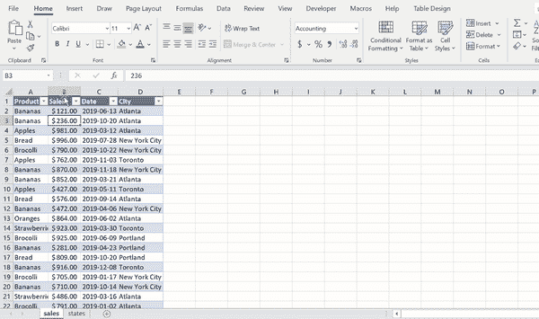
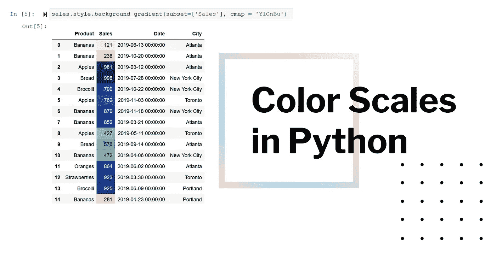
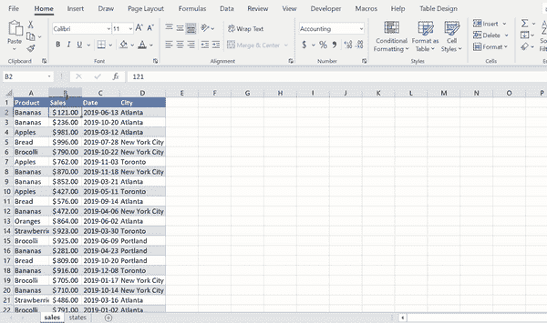
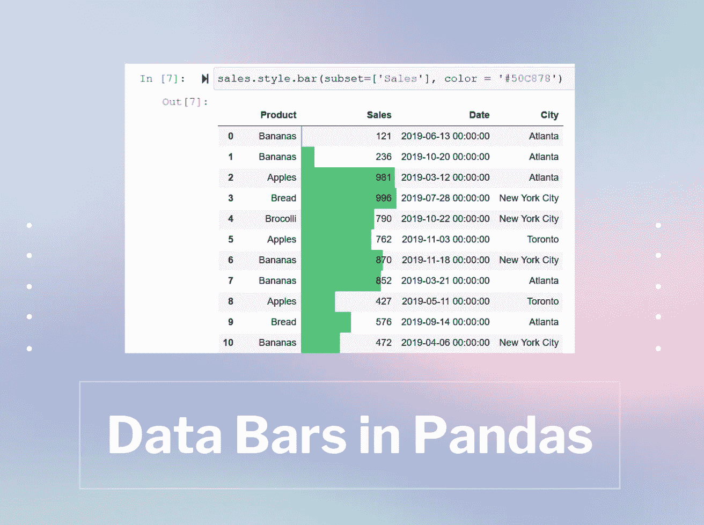
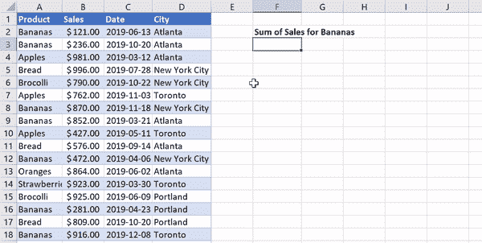
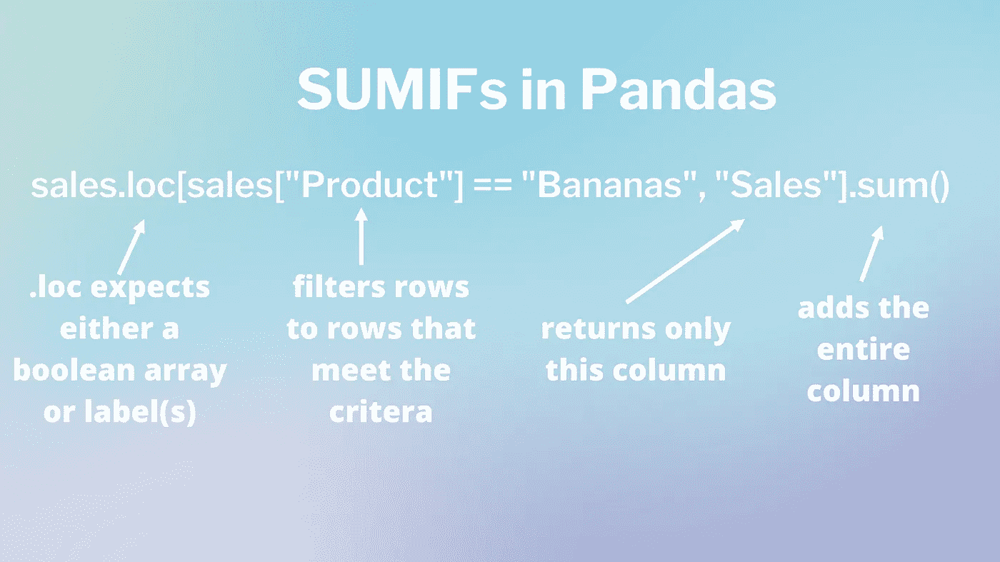

# 学习如何(轻松！！)用 Python 做 3 个更高级的 Excel 任务

> 原文：<https://towardsdatascience.com/learn-how-to-easily-do-3-more-advanced-excel-tasks-in-python-36449e425c9d?source=collection_archive---------15----------------------->

## Excel 高级用户对熊猫的更多介绍


让我们用 Python 来承担一些更高级的 Excel 任务吧！资料来源:Nik Piepenbreier

在另一篇文章中，我们[学会了如何(轻松！！)用 Python 做 3 个高级 Excel 任务](/learn-how-to-easily-do-3-advanced-excel-tasks-in-python-925a6b7dd081)。在这里，我们将继续这项任务，并学习另外 3 项你可以轻松掌握的高级技能！我希望这篇文章让 Python 变得更加平易近人，同时在这两个伟大的工具之间提供一些有趣的比较。

我们将从导入 pandas 开始，并根据工作簿中的工作表加载两个数据帧。我们使用与上一篇文章相同的数据集。

如果你想继续的话，我已经为这篇文章上传了一个完整的笔记本。在[可以找到这个链接](https://github.com/datagy/mediumdata/blob/master/3%20More%20Advanced%20Excel%20Tasks%20in%20Python.ipynb)。遗憾的是，颜色格式没有遵循，但是您可以很容易地从那里复制并粘贴代码。同样，如果你想在 Excel 中跟进，你可以通过[这个链接](https://github.com/datagy/mediumdata/raw/master/pythonexcel.xlsx)下载文件。

让我们开始吧！

# Pandas 中的彩色地图格式

条件格式是 Excel 中非常棒的工具之一，它可以让我们快速挑出数据中的异常值，例如最高值或最低值。让我们先在我们的 Excel 文件中这样做！



在 Excel 中应用色彩映射表很容易！资料来源:Nik Piepenbreier

选择要格式化的列。

在“主页”选项卡下，选择条件格式、色标和

选择您想要使用的比例。我们用了绿-黄-红。

在熊猫身上，我们想应用。背景 _ 渐变样式方法。我们可以通过输入:

```
sales.style.background_gradient(subset=[‘Sales’], cmap = ‘YlGnBu’)
```

这将返回:



在熊猫身上应用色阶的结果。资料来源:Nik Piepenbreier

让我们稍微分解一下这个语法:

*   **子集**:识别您想要应用这个的列。如果您想要多个，请将它们嵌套在列表中。
*   **cmap**:Matplotlib 中的颜色映射。这确定了我们想要应用的色阶类型。更多细节可以在[这里找到](https://matplotlib.org/tutorials/colors/colormaps.html)。

# Python 中的数据栏

与色标类似，数据条使我们能够轻松地识别单元格中值的大小。



在 Excel 中添加数据栏。资料来源:Nik Piepenbreier

要在 Excel 中添加数据栏:

选择要格式化的列。

在主页选项卡上，转到条件格式→数据栏。

为此，我们选择了纯蓝。

为了用 Python 和 Pandas 实现这一点，我们可以编写以下代码:

```
sales.style.bar(subset=['Sales'], color = '#50C878')
```



在 Python 中用熊猫应用数据栏。资料来源:Nik Piepenbreier

让我们再细分一下:

*   **子集**再次引用我们想要应用格式的列，而
*   **颜色**是指我们要应用的颜色的十六进制代码！

# 熊猫中的 SUMIFs

最后，我们将探索如何用 Python 完成 SUMIFs。SUMIF 函数允许我们根据条件将值相加(该条件是否出现在另一列取决于我们)。



在 Excel 中计算 SUMIFs。资料来源:Nik Piepenbreier

在左边的例子中，我们计算所有香蕉销售的总销售额。我们通过使用以下公式实现了这一点:

```
=SUMIF(sales[Product], "Bananas", sales[Sales])
```

我们可以通过编写以下代码在 Python 中完成同样的事情:

```
sales.loc[sales["Product"] == "Bananas", "Sales"].sum()
```

就像在 Excel 中一样，这将返回 5843。让我们来看看这里发生了什么:



如何承担熊猫的 SUMIF 功能？资料来源:Nik Piepenbreier

# 结论:学会如何(轻松！！)用 Python 做 3 个更高级的 Excel 任务

在这篇文章中，我们学习了如何在 Excel 和 Pandas 中承担三个额外的高级任务。我们学习了如何在熊猫身上应用色标、色带和 SUMIF 函数。

如果你还没有，请通过[点击此链接](/learn-how-to-easily-do-3-advanced-excel-tasks-in-python-925a6b7dd081)查看这篇文章的第一部分。

感谢阅读！