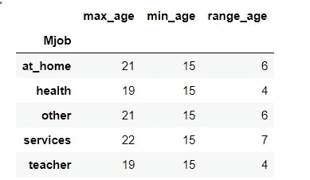

# 现在学习如何掌握 Python 中的 groupby 函数

> 原文：<https://towardsdatascience.com/learn-how-to-master-groupby-function-in-python-now-4620dd463224?source=collection_archive---------31----------------------->

## Pandas 中的 GroupBy 比 SQL 中的 groupby 更加复杂和强大。


麦克斯韦·尼尔森在 T2 的照片

熊猫套餐中一个受欢迎的功能是分组功能。相信之前用熊猫的几乎都一定也用过 groupby 功能。它之所以如此受欢迎，是因为它有效地提供了概括而详细的结果。如熊猫包装文件所述，

> “分组依据”指的是涉及一个或多个以下步骤的过程:
> 
> **根据某些标准将数据分组**。
> 
> **将**功能独立应用于每组。
> 
> **将**结果组合成一个数据结构。*【1】*

SQL 中还有一个 groupby 函数。因此对于有 SQL 经验的人来说，学习 Python 中的 groupby 函数并不是一件困难的事情。但问题是 Pandas 中的 groupby 可以执行比 SQL 更多的分析，这使得 Pandas 中的 groupby 成为一个常见但重要的函数。

熊猫里的 groupby 之所以更厉害，是因为第二步“申请”。在 SQL 中,“应用”步骤中的大多数操作都是统计相关的，比如 min、max、count 等。然而，在熊猫身上，“应用”可以表现得更多。

从熊猫的文档中，

> 在应用步骤中，我们可能希望执行以下操作之一:
> 
> **聚合**:计算每个组的汇总统计数据。
> 
> **转换**:执行一些特定于组的计算，并返回一个相似索引的对象。
> 
> **过滤**:根据评估真或假的分组计算，丢弃一些分组。*【1】*

在本文中，我将介绍一些 groupby 应用程序。这些应用程序不仅向我展示了数据的洞察力，还帮助我确定了分析数据的下一步行动。

我们开始吧。

本文使用的数据是来自 Kaggle 的《学生饮酒》中的“student-por.csv”。你可以从这个[链接](https://www.kaggle.com/uciml/student-alcohol-consumption)下载数据。

```
**# Input**
import pandas as pd 
data = pd.read_csv('student-por.csv')
data.info()**# Output** <class 'pandas.core.frame.DataFrame'>
RangeIndex: 649 entries, 0 to 648
Data columns (total 33 columns):
school        649 non-null object
sex           649 non-null object
age           649 non-null int64
address       649 non-null object
famsize       649 non-null object
Pstatus       649 non-null object
Medu          649 non-null int64
Fedu          649 non-null int64
Mjob          649 non-null object
Fjob          649 non-null object
reason        649 non-null object
guardian      649 non-null object
traveltime    649 non-null int64
studytime     649 non-null int64
failures      649 non-null int64
schoolsup     649 non-null object
famsup        649 non-null object
paid          649 non-null object
activities    649 non-null object
nursery       649 non-null object
higher        649 non-null object
internet      649 non-null object
romantic      649 non-null object
famrel        649 non-null int64
freetime      649 non-null int64
goout         649 non-null int64
Dalc          649 non-null int64
Walc          649 non-null int64
health        649 non-null int64
absences      649 non-null int64
G1            649 non-null int64
G2            649 non-null int64
G3            649 non-null int64
dtypes: int64(16), object(17)
memory usage: 167.4+ KB
```

## **第一步:拆分数据**

第一步相当简单，根据一列或多列中的值对数据进行分组。您只需要指定如何执行分组。大多数人都知道一个列名或一组列名可以用于分组。但是，您也可以为分组传递一个函数。该函数将使用索引值作为参数并执行分组。欲了解更多信息，[2]

groupby 函数返回的对象是“DataFrameGroupBy 对象”。分组后，您可以使用`group`来查看分组。

```
**#Groupby one column****# Input**
data.groupby('school')
**# Output** <pandas.core.groupby.generic.DataFrameGroupBy object at 0x0000024D28C9DF98>**# Input** data.groupby('school').groups
**# Output** {'GP': Int64Index([  0,   1,   2,   3,   4,   5,   6,   7,   8,   9,
...413, 414, 415, 416, 417, 418, 419, 420, 421, 422],
dtype='int64', length=423),
 'MS': Int64Index([423, 424, 425, 426, 427, 428, 429, 430, 431, 432,
...639, 640, 641, 642, 643, 644, 645, 646, 647, 648],
dtype='int64', length=226)}**# Groupby a function** **# Input**
def grouping(int):
    if int%10==0:
        return 'Group1'
    if int%5==0:
        return 'Group2'
    return 'Group3'
data.groupby(grouping).groups
**# Output** {'Group1': Int64Index([  0,  10,  20,  30,  40,  50,  60,  70,  80,  90, 100, 110, 120, 130, 140, 150, 160, 170, 180, 190, 200, 210, 220, 230, 240, 250, 260, 270, 280, 290, 300, 310, 320, 330, 340, 350, 360, 370, 380, 390, 400, 410, 420, 430, 440, 450, 460, 470, 480, 490, 500, 510, 520, 530, 540, 550, 560, 570, 580, 590, 600, 610, 620, 630, 640], dtype='int64'),
 'Group2': Int64Index([  5,  15,  25,  35,  45,  55,  65,  75,  85,  95, 105, 115, 125,135, 145, 155, 165, 175, 185, 195, 205, 215, 225, 235, 245, 255, 265, 275, 285, 295, 305, 315, 325, 335, 345, 355, 365, 375, 385, 395, 405, 415, 425, 435, 445, 455, 465, 475, 485, 495, 505, 515, 525, 535, 545, 555, 565, 575, 585, 595, 605, 615, 625, 635, 645], dtype='int64'),
 'Group3': Int64Index([  1,   2,   3,   4,   6,   7,   8,   9,  11,  12,... 637, 638, 639, 641, 642, 643, 644, 646, 647, 648],dtype='int64', length=519)}
```

在上面使用函数进行分组的例子中，数据帧中的索引是行号。因此，根据行号将一行分配给三个组之一。然后 groupby 函数将这三组分组。

要获得每个组的数据，您可以使用`get_group()`函数并输入组名。

```
**#Input** data.groupby(grouping).get_group('Group1')
```


data.groupby(分组)。get_group('Group1 ')

此外，如果要按非索引列对数据进行分组，可以同时使用 apply 和 lambda 函数进行分组。

```
**# Input** data.groupby(data['famsize'].apply(lambda x: x.startswith('GT'))).get_group(False)
```


data.groupby(data['famsize']。apply(lambda x: x.startswith('GT '))。get_group(False)

分组后，您已经可以应用许多计算或统计函数。例如，`size()`可以给你每组的行数；`sum()`返回每组所有数字列的总和。要知道更多适用的函数，[3]

```
**#Input** data.groupby(data['famsize'].apply(lambda x: x.startswith('GT'))).size()**#Output** famsize
False    192
True     457
dtype: int64
```

## 步骤 2:应用函数并组合结果

是时候报道 groupby 的重要部分了。Pandas 中的 Groupby 函数比 SQL 中的功能更强大，因为你不仅可以使用常见的统计函数，如`min(), max(), mean(),...`，还可以使用许多更复杂的函数。您也可以应用您定义的函数。在下面的部分，我将分别解释这三个动作。

## **聚合(agg)**

关于聚合的一个简单解释是根据以前分组的数据执行计算。聚合应用于每个组，并返回其各自的结果。

一些常见的计算如`sum`、`min`、`max`、…您可以对所有数值列执行计算，也可以指定一列来执行计算。

```
**#Input** mjob_gp = data.groupby('Mjob')
mjob_gp.agg('mean')
```


mjob_gp.agg('mean ')

```
**#Input** mjob_gp['age'].agg('mean')**#Output** Mjob
at_home     16.955556
health      16.312500
other       16.802326
services    16.661765
teacher     16.583333
Name: age, dtype: float64
```

关于聚合，一个不太为人所知的情况是，您可以在一个或多个列上同时执行多个计算。如果您想研究一个列的统计数据，这个选项很有用。

```
**#Input** mjob_gp.agg({'age':['mean','max']})
```


mjob_gp.agg({'age':['mean '，' max']})

然而，一个问题是这些列是多索引的，这对于进一步的处理不是很好(我个人不喜欢多索引)。因此，我们可以更进一步，将`pd.NamedAgg`(熊猫 0.25.0 版本新增)包含到`agg`功能中。关于`pd.NamedAgg`的更多信息，[4]

```
**#Input** mjob_gp.agg(avg_age=pd.NamedAgg(column='age', aggfunc='mean'),
            min_age=pd.NamedAgg(column='age', aggfunc='min'),
            max_age=pd.NamedAgg(column='age', aggfunc='max'))
```


mjob_gp.agg(avg_age=pd。NamedAgg(column='age '，aggfunc='mean ')，
min_age=pd。NamedAgg(column='age '，aggfunc='min ')，
max_age=pd。NamedAgg(column='age '，aggfunc='max '))

使用`pd.NamedAgg`有两个好处。当然，第一个优点是列上没有多索引。第二个优点是您可以自定义列名。

毫不奇怪，您也可以在聚合中使用自定义函数。

```
**#Input** def range_function(x):
    return max(x) - min(x)mjob_gp.agg(max_age = pd.NamedAgg(column='age',aggfunc='max'),
            min_age = pd.NamedAgg(column='age',aggfunc='min'),
            range_age = pd.NamedAgg(column='age',aggfunc=range_function),)
```



mjob_gp.agg(max_age = pd。NamedAgg(column='age '，aggfunc='max ')，
min_age = pd。NamedAgg(column='age '，aggfunc='min ')，
range_age = pd。NamedAgg(column='age '，aggfunc=range_function)，)

## **变换(transform)**

回到变形的描述，

> T **转换**:执行一些特定于组的计算，并返回一个相似索引的对象。

关键部分是“特定于组的计算”。不同组的计算是不同的。例如，`max`将为每个组提供一列的最大值，但不是跨整个数据集。

转换的另一个特征是，计算应用于每一行，并返回每个组长度相同的结果，而不像长度减少的聚合。如果您熟悉 SQL 中的窗口函数，Pandas 中的转换与此类似。(PS:你还不知道 SQL 中的窗口函数？！？！查看我以前的一篇文章，这篇文章帮助您理解为什么 SQL 中的窗口函数如此重要)

[](/why-window-function-in-sql-is-so-important-that-you-should-learn-it-right-now-1274b6096a86) [## 为什么 SQL 中的窗口函数如此重要，以至于你现在就应该学习它？

### 如果我告诉你这个问题会在每次数据分析职位的面试中被问到，你会怎么想？

towardsdatascience.com](/why-window-function-in-sql-is-so-important-that-you-should-learn-it-right-now-1274b6096a86) 

```
**#Input** mjob_gp['G1','G2','G3'].transform(lambda x: (x-x.mean())/x.std())
```


mjob_gp['G1 '，' G2 '，' G3']。transform(λx:(x-x . mean())/x . STD())

在上面的例子中，对于每个组，G1 到 G3 的值基于相应组的平均值和标准偏差被归一化。

## 过滤器

从《熊猫》中的描述来看，

> R 返回数据帧的副本，排除不满足 func 指定的布尔标准的组中的元素。*【5】*

您可以使用`filter`功能过滤掉任何不符合标准的组。

```
**#Input** mjob_gp.filter(lambda x: x['G1'].mean() > 12)
```


mjob_gp.filter(lambda x: x['G1']。平均值()> 12)

在上面的示例中，只返回“健康”和“教师”下的 Mjob，因为它们的“G1”的平均值大于 12。

```
**#Input** mjob_gp['G1'].mean()**#Output** Mjob
at_home     10.451852
health      12.395833
other       11.275194
services    11.610294
teacher     12.555556
Name: G1, dtype: float64
```

# 关闭

Pandas 中的 Groupby 函数是执行大量分析和数据转换的便捷工具。我希望这篇文章能帮助你理解熊猫中 groupby 的威力和用处。我相信您现在已经更加了解如何在日常数据分析中使用 groupby 了。和熊猫玩得开心，下次再见。

# 我的另一篇文章

[如果您是 Python 新手(尤其是自学 Python 的话)，请将此加入书签](/bookmark-this-if-you-are-new-to-python-especially-if-you-self-learn-python-54c6e7b5dad8)

[(第二部分)如果你是 Python 新手(尤其是自学 Python 的话)请将此加入书签](/bookmark-this-if-you-are-new-to-python-especially-if-you-self-learn-python-part-2-ab3ba54e2f45)

[如何用熊猫来分析数值型数据？](/how-to-use-pandas-to-analyze-numeric-data-9739e0809b02)

[Web Scrape Twitter by Python Selenium(第 1 部分)](/web-scrape-twitter-by-python-selenium-part-1-b3e2db29051d)

[Web Scrape Twitter by Python Selenium(第二部分)](/web-scrape-twitter-by-python-selenium-part-2-c22ae3e78e03)

# 引用/参考

[1]: [分组依据:拆分-应用-合并](https://pandas.pydata.org/pandas-docs/version/0.23.4/groupby.html)

【2】:[熊猫。DataFrame.groupby](https://pandas.pydata.org/pandas-docs/stable/reference/api/pandas.DataFrame.groupby.html#pandas-dataframe-groupby)

[3]: [计算/描述性统计](https://pandas.pydata.org/pandas-docs/stable/reference/groupby.html#computations-descriptive-stats)

[4]: [命名聚合](https://pandas.pydata.org/pandas-docs/stable/user_guide/groupby.html?highlight=namedagg#named-aggregation)

[5]:[pandas . core . group by . data frame group by . filter](https://pandas.pydata.org/pandas-docs/stable/reference/api/pandas.core.groupby.DataFrameGroupBy.filter.html)