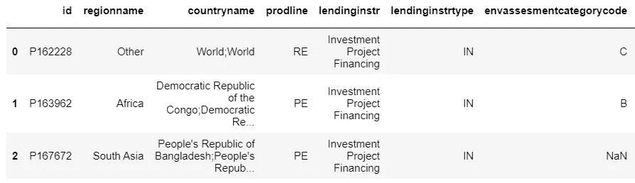
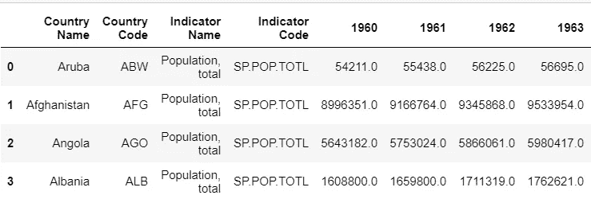
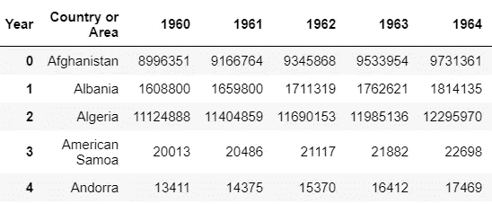

# 学习如何在 5 分钟内将数据读入熊猫数据框

> 原文：<https://towardsdatascience.com/learn-how-to-read-data-into-a-pandas-dataframe-in-5-minutes-122af8e0b9db?source=collection_archive---------18----------------------->

## 从不同来源提取数据


[来源](https://pixabay.com/illustrations/matrix-network-data-exchange-1027571/)

## 概观

据说数据科学家花费 80%的时间对数据进行预处理，所以让我们深入研究数据预处理管道，也称为 ETL 管道，让我们找出哪个阶段花费的时间最多。在这篇博文中，我们将学习如何从不同的数据源中提取数据。让我们来看一个真实的数据集，这样更容易理解。

本课使用了世界银行的数据。数据来自两个来源:

1.  [**世界银行指标数据**](https://data.worldbank.org/indicator) —该数据包含世界各国的社会经济指标。一些示例指标包括人口、可耕地和中央政府债务。
2.  [**世界银行项目数据**](https://datacatalog.worldbank.org/dataset/world-bank-projects-operations) —该数据集包含 1947 年以来世界银行项目贷款的相关信息。

## 数据文件的类型

1.  **CSV** — CSV 代表逗号分隔值。这是文件的外观

```
id,regionname,countryname,prodline,lendinginstr
P162228,Other,World;World,RE,Investment Project Financing
P163962,Africa,Democratic Republic of the Congo;Democratic Republic of the Congo,PE,Investment Projec
```

让我们用 pandas 加载这个文件。

```
import pandas as pd
df_projects = pd.read_csv('../data/projects_data.csv')#ERROR:
#/opt/conda/lib/python3.6/site-packages/IPython/core/interactiveshell.py:2785: DtypeWarning: Columns (44) have mixed types. Specify dtype option on import or set low_memory=False.interactivity=interactivity, compiler=compiler, result=result)
```

我们将得到一个 DType 警告错误。基本上，pandas 会计算出我们文件的数据类型，并适当地读取它们，但是我们的一个列有多种数据类型，因此会出现警告错误。我们可以在读取时传递字符串的数据类型。请参考熊猫 [**文档**](https://pandas.pydata.org/pandas-docs/stable/reference/api/pandas.errors.DtypeWarning.html) 阅读更多。

```
df_projects = pd.read_csv('../data/projects_data.csv',dtype=str)
```

**输出:**



让我们阅读另一个 CSV 文件:

```
df_population = pd.read_csv("../data/population_data.csv")
# ParserError: Error tokenizing data. C error: Expected 3 fields in line 5, saw 63
```

看起来这个 CSV 文件有问题。让我们检查一下里面的东西。这里，如果文件很小，您可以使用记事本/excel 直接打开 CSV 文件，也可以使用下面的 python 代码:

```
with open("../data/population_data.csv") as f:
    lis = [line.split() for line in f]        # create a list of lists
    #print(lis)
    for i, x in enumerate(lis):              #print the list items 
        print ("line{0} = {1}".format(i, x))#Output:line0 = ['\ufeff"Data', 'Source","World', 'Development', 'Indicators",']
line1 = []
line2 = ['"Last', 'Updated', 'Date","2018-06-28",']
line3 = []
line4 = ['"Country', 'Name","Country', 'Code","Indicator', 'Name","Indicator', 'Code","1960","1961","1962","1963","1964","1965","1966","1967","1968","1969","1970","1971","1972","1973","1974","1975","1976","1977","1978","1979","1980","1981","1982","1983","1984","1985","1986","1987","1988","1989","1990","1991","1992","1993","1994","1995","1996","1997","1998","1999","2000","2001","2002","2003","2004","2005","2006","2007","2008","2009","2010","2011","2012","2013","2014","2015","2016","2017",']
```

看起来 CSV 文件的前 4 行已损坏。因此，我们可以通过使用**skip prows**参数跳过前 4 行。

```
df_population = pd.read_csv("../data/population_data.csv",skiprows=4)
```

**输出:**



**2。JSON** —它是一种带有键/值对的文件格式。

```
[{"id":"P162228","regionname":"Other","countryname":"World;World","prodline":"RE","lendinginstr":"Investment Project Financing"},{"id":"P163962","regionname":"Africa","countryname":"Democratic Republic of the Congo;Democratic Republic of the Congo","prodline":"PE","lendinginstr":"Investment Project Financing"},{"id":"P167672","regionname":"South Asia","countryname":"People\'s Republic of Bangladesh;People\'s Republic of Bangladesh","prodline":"PE","lendinginstr":"Investment Project Financing"}]
```

谢天谢地，熊猫有直接读取 [**JSON**](https://pandas.pydata.org/pandas-docs/stable/reference/api/pandas.read_json.html) 的功能。

```
import pandas as pd
df_json = pd.read_json('population_data.json',orient='records')
```

其他方法:

```
import json# read in the JSON file
with open('population_data.json') as f:
    json_data = json.load(f)# print the first record in the JSON file
print(json_data[0])
```

3. **XML** —另一种数据格式叫做 XML(可扩展标记语言)。至少在格式方面，XML 和 HTML 非常相似。

```
<ENTRY>
  <ID>P162228</ID>
  <REGIONNAME>Other</REGIONNAME>
  <COUNTRYNAME>World;World</COUNTRYNAME>
  <PRODLINE>RE</PRODLINE>
  <LENDINGINSTR>Investment Project Financing</LENDINGINSTR>
</ENTRY>
<ENTRY>
  <ID>P163962</ID>
  <REGIONNAME>Africa</REGIONNAME>
  <COUNTRYNAME>Democratic Republic of the Congo;Democratic Republic of the Congo</COUNTRYNAME>
  <PRODLINE>PE</PRODLINE>
  <LENDINGINSTR>Investment Project Financing</LENDINGINSTR>
</ENTRY>
```

有一个名为 BeautifulSoup 的 Python 库，它使得读入和解析 XML 数据变得更加容易。以下是文档链接:[美汤文档](https://www.crummy.com/software/BeautifulSoup/)

```
# import the BeautifulSoup library
from bs4 import BeautifulSoup# open the population_data.xml file and load into Beautiful Soup
with open("population_data.xml") as fp:
    soup = BeautifulSoup(fp, "lxml") # lxml is the Parser type
```

让我们看看汤是什么样子的:

```
<html><body><p><?xml version="1.0" encoding="utf-8"?>
<root xmlns:wb="http://www.worldbank.org">
<data>
<record>
<field key="ABW" name="Country or Area">Aruba</field>
<field key="SP.POP.TOTL" name="Item">Population, total</field>
<field name="Year">1960</field>
<field name="Value">54211</field>
</record>
<record>
<field key="ABW" name="Country or Area">Aruba</field>
<field key="SP.POP.TOTL" name="Item">Population, total</field>
<field name="Year">1961</field>
<field name="Value">55438</field>
</record>
```

如何将 XML 作为数据帧读取？

```
data_dictionary = {'Country or Area':[], 'Year':[], 'Item':[], 'Value':[]}for record in soup.find_all('record'):
    for record in record.find_all('field'):
        data_dictionary[record['name']].append(record.text)df = pd.DataFrame.from_dict(data_dictionary)
df = df.pivot(index='Country or Area', columns='Year', values='Value')df.reset_index(level=0, inplace=True)
```

基本上，我们需要为每一列或每一行创建一个字典，然后将字典转换为 dataframe。

**输出:**



4. **SQL** — SQL 数据库使用[主键和外键](https://docs.microsoft.com/en-us/sql/relational-databases/tables/primary-and-foreign-key-constraints?view=sql-server-2017)在表中存储数据

要从 SQL 数据库中读取数据，您需要将数据存储在数据库中。要了解如何将 CSV 转换为 SQL DB，请阅读这篇 [**博客**](https://medium.com/swlh/how-to-insert-data-from-csv-file-into-a-sqlite-database-using-python-82f7d447866a) 。

**SQLite3 对熊猫**

```
import sqlite3
import pandas as pd# connect to the database
conn = sqlite3.connect('population_data.db')# run a query
pd.read_sql('SELECT * FROM population_data', conn)
```

**对熊猫的 SQLAlchemy**

```
import pandas as pd
from sqlalchemy import create_engineengine=create_engine('sqlite:////home/workspace/3_sql_exercise/population_data.db')
pd.read_sql("SELECT * FROM population_data", engine)
```

5.从网络中提取数据是一个非常累人的过程。但是很多公司已经通过 API 公开了他们的数据。API 通常以 JSON 或 XML 格式提供数据。有些 API 是公共的，您不需要登录，而有些是私有的，用户需要生成一个 API 密钥。

```
import requests
import pandas as pdurl = '[http://api.worldbank.org/v2/countries/br;cn;us;de/indicators/SP.POP.TOTL/?format=json&per_page=1000'](http://api.worldbank.org/v2/countries/br;cn;us;de/indicators/SP.POP.TOTL/?format=json&per_page=1000')
r = requests.get(url)
r.json()
```

不同网站的 API 调用是不同的，这里我们使用请求库来获取 JSON 格式的数据。在这里 阅读更多关于不同 API 结构的信息[](https://datahelpdesk.worldbank.org/knowledgebase/articles/898581-api-basic-call-structure)