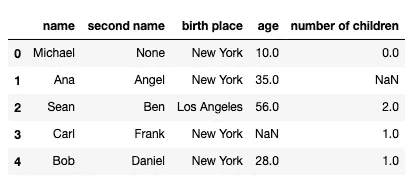
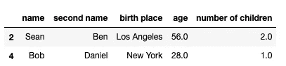
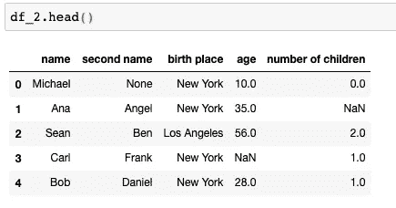
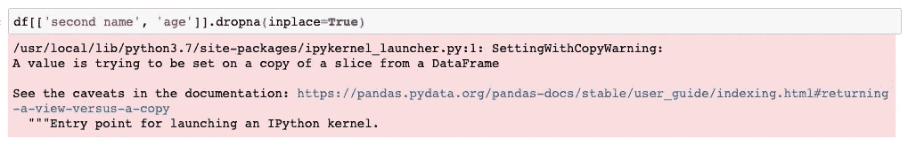
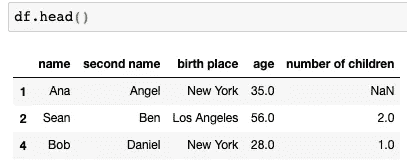

# 了解如何使用熊猫在地方参数一劳永逸

> 原文：<https://towardsdatascience.com/learn-how-to-use-pandas-inplace-parameter-once-and-for-all-5a29bb8bf338?source=collection_archive---------14----------------------->

## 对流行的 pandas 函数何时使用、何时不使用 inplace 参数的快速解释。


图片由 [995645](https://pixabay.com/users/995645-995645/?utm_source=link-attribution&utm_medium=referral&utm_campaign=image&utm_content=3875289) 来自 [Pixabay](https://pixabay.com/?utm_source=link-attribution&utm_medium=referral&utm_campaign=image&utm_content=3875289)

**简介**

我注意到初学者，有时甚至是更高级的数据科学家在操作数据帧时，对如何在 pandas 中使用 *inplace* 参数感到困惑。

更有趣的是，我没有看到太多解释这个概念的文章或教程。不知何故，它似乎是假定的知识或不言自明的概念。不幸的是，这并不是对每个人都如此简单，因此本文试图解释什么是 *inplace* 参数以及如何正确使用它。

**使用现场参数的功能**

让我们来看一些使用*代替*的函数的例子:

*   菲尔娜
*   德罗普纳()
*   排序值()
*   重置索引()
*   排序索引()
*   重命名()

我已经从头开始创建了这个列表，可能有更多的函数使用*代替*作为参数。我并不记得所有的函数，但是几乎所有将*作为参数的 pandas DataFrame 函数都会以类似的方式运行。这意味着在处理这些问题时，你将能够运用你将在本文中学到的同样的逻辑。*

**创建一个样本数据框**

为了说明*在*位置的用法，我们将创建一个样本数据框。

```
import pandas as pd
import numpy as np
client_dictionary = {'name': ['Michael', 'Ana', 'Sean', 'Carl', 'Bob'], 
                     'second name': [None, 'Angel', 'Ben', 'Frank', 'Daniel'],
                     'birth place': ['New York', 'New York', 'Los Angeles', 'New York', 'New York'],
                     'age': [10, 35, 56, None, 28],
                     'number of children': [0, None, 2, 1, 1]}
df = pd.DataFrame(client_dictionary)
df.head()
```



我们创建了一个具有五行的数据框，其中包含以下各列:*姓名、第二个名字、出生地、*和*子女数量。*注意*年龄、姓氏、*和*子女*列(NaNs)有部分数值缺失。

我们现在将演示 dropna()函数如何与 *inplace* 参数一起工作。因为我们想要检查两种不同的变体，所以我们将创建原始数据框的两个副本。

```
df_1 = df.copy()
df_2 = df.copy()
```

**dropna()with in place = True**

让我们从 inplace=True 的变体开始。下面的代码删除所有缺少值的行。

```
df_1.dropna(inplace=True)
```

如果你在 Jupyter 笔记本上运行这个，你会看到这个单元没有输出。这是因为 inplace=True 的函数不会返回任何内容。它使用所需的操作修改现有的数据帧，并在原始数据帧上“就地”执行。

如果您在数据框上运行 head()函数，您应该会看到两行被删除。

```
df_1.head()
```

**dropna() with inplace = False(默认)**

现在让我们用 inplace = False 运行相同的代码。注意，这次我们将使用 df_2 版本的数据帧。

```
df_2.dropna(inplace=False)
```



如果你在 Jupyter notebook 中运行这段代码，你会看到有一个输出(上面的截图)。inplace = False 的函数返回删除了行的数据框。

记得当*在位*被设置为*真*时，没有返回任何东西，但是原始数据帧被修改。

那么这次原始数据帧会发生什么情况呢？让我们调用 head()函数来检查。

```
df_2.head()
```



原数据框不变！发生了什么事？

使用 inplace=False 时，将创建并更改新对象，而不是原始数据框。如果想要更新原始数据框以反映被删除的行，则必须将结果重新分配给原始数据框，如下面的代码所示。

```
df_2 = df_2.dropna(inplace=False)
```

但是等等！这正是我们在使用 inplace=True 时所做的事情。是的，这最后一行代码相当于下面一行:

```
df_2.dropna(inplace=True)
```

后一种方法更优雅，它不会创建一个中间对象，然后将这个中间对象重新分配给原始变量。它直接更改原始数据框，因此，如果您打算更改原始数据框，则首选它。

> 简单，不是吗？

那么，为什么会有这么多的错误呢？我不确定，可能是因为有些人还不明白如何正确使用这个参数。让我们来看看一些常见的错误。


图片来自[pix abay](https://pixabay.com/?utm_source=link-attribution&utm_medium=referral&utm_campaign=image&utm_content=5403583)Syaibatul Hamdi

**常见错误**

*   **对数据帧的一部分使用 in place = True**

我已经注意到好几次了。让我们回到本文开头的数据框示例。有些自由列没有值:s*second name、age* 和 *number of children* 。

如果我们只想从第二个姓名和年龄列中删除 None，并保持*孩子数量*列不变，我们该怎么办？

我见过有人尝试做以下事情:

```
df[['second name', 'age']].dropna(inplace=True)
```

> 这可能是你不想做的事情！

事实上，这应该抛出以下警告。



显示这个警告是因为熊猫设计师很好，他们实际上试图警告你不要做你可能不想做的事情。代码正在更改只有两列的数据帧切片，而不是原始数据帧。这是因为您选择了数据帧的一个切片，并将 dropna()应用于这个切片，而不是原始数据帧。

为了纠正它，在带有*子集*参数的整个数据帧上使用 dropna()。

```
df.dropna(inplace=True, subset=['second name', 'age'])
df.head()
```



这将导致在*的第二个名字*和*的年龄*列中有空值的行从数据框中被删除。

*   **将变量值赋给 inplace = True 的结果**

这个我也看过好几次了。

```
df = df.dropna(inplace=True)
```

这也是你永远不应该做的事情！你只是把 None 重新分配给 df 的值。请记住，当您使用 inplace=True 时，不会返回任何内容。因此，该代码的结果将不会给 df 赋值。

**总结**

我希望这篇文章为你揭开了*中*参数的神秘面纱，你将能够在你的代码中正确地使用它。快乐的数据框操作！

*原载于 aboutdatablog.com:* [学习如何一劳永逸地使用熊猫原地参数](https://www.aboutdatablog.com/post/learn-how-to-use-pandas-inplace-parameter-once-and-for-all)，*2020 年 7 月 15 日。*

*PS:我正在 Medium 和*[](https://www.aboutdatablog.com/)**上撰写深入浅出地解释基本数据科学概念的文章。你可以订阅我的* [***邮件列表***](https://medium.com/subscribe/@konkiewicz.m) *在我每次写新文章的时候得到通知。如果你还不是中等会员，你可以在这里加入*[](https://medium.com/@konkiewicz.m/membership)**。***

**下面还有一些你可能喜欢的帖子**

**[](/pandas-data-manipulation-functions-7b3519fc1370) [## Pandas 数据操作函数:apply()、map()和 applymap()

### 以及如何在熊猫身上正确使用它们…

towardsdatascience.com](/pandas-data-manipulation-functions-7b3519fc1370) [](/9-pandas-visualizations-techniques-for-effective-data-analysis-fc17feb651db) [## 9 熊猫有效数据分析的可视化技术

### 学习如何使用折线图、散点图、直方图、箱线图和其他一些可视化技术

towardsdatascience.com](/9-pandas-visualizations-techniques-for-effective-data-analysis-fc17feb651db) [](/jupyter-notebook-autocompletion-f291008c66c) [## Jupyter 笔记本自动完成

### 数据科学家的最佳生产力工具，如果您还没有使用它，您应该使用它…

towardsdatascience.com](/jupyter-notebook-autocompletion-f291008c66c) [](/top-9-jupyter-notebook-extensions-7a5d30269bc8) [## 9 大 Jupyter 笔记本扩展

### 改进笔记本电脑功能，提高您的工作效率

towardsdatascience.com](/top-9-jupyter-notebook-extensions-7a5d30269bc8)**