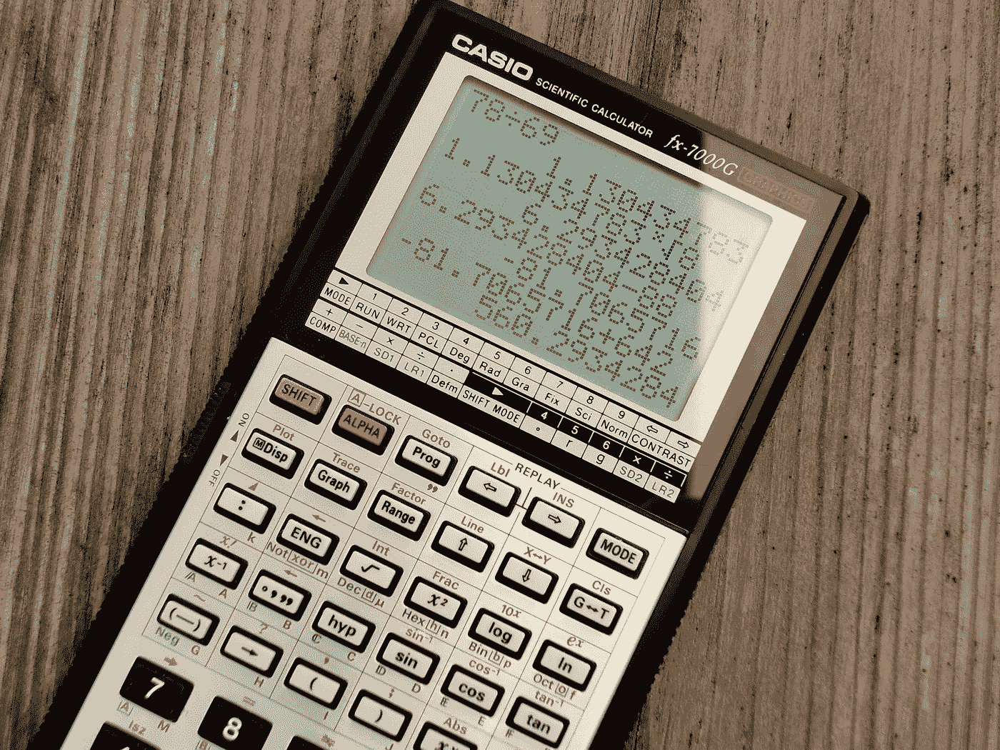

# 学习线性代数的机器学习从最好的

> 原文：<https://towardsdatascience.com/learn-linear-algebra-for-machine-learning-from-the-best-ae95ab92c6f9?source=collection_archive---------6----------------------->

## ML 和 DS 学习线性代数的顶级免费资源

图像由[像素](https://www.pexels.com/photo/black-and-grey-casio-scientific-calculator-showing-formula-220301/)生成

## 介绍

大约 4、5 年前，我坐在一堂数学课上，老师第一次介绍向量的话题。

> "矢量是既有方向又有大小的线段."

这时候我以为我已经永远不再学数学了。在学校，每当老师介绍一些大的数学话题时，他们总是说这个概念在现实生活中非常重要，我应该学习它。我从不问为什么，只是顺其自然。原因是我真的很喜欢数学，擅长数字。我甚至参加了一些数学竞赛，赢了一些。

但是当涉及到向量时，我就是不明白尖尖的线怎么会在现实生活中有应用(我不会责怪任何人不解释)。那时候，学这样的东西似乎很荒唐，我对数学失去了兴趣。

直到今年，我从未见过我的数学知识在现实生活中的应用。然而，当我决定学习[计算机科学](https://en.wikipedia.org/wiki/Computer_science)并发现[数学](https://en.wikipedia.org/wiki/Mathematics)是我感兴趣领域的基石——[机器学习](https://en.wikipedia.org/wiki/Machine_learning)时，事情发生了变化。

## 机器学习应该什么时候学线性代数？

[机器学习](https://en.wikipedia.org/wiki/Machine_learning)由几种适合不同现实生活问题的算法组成。任何一个有扎实编程基础的人都可以利用现成的工具、库和模型成为一名优秀的[机器学习](https://en.wikipedia.org/wiki/Machine_learning)工程师。但是如果你想成为这个领域的真正专家，你就不能逃避学习线性代数的一些概念。

任何[机器学习](https://en.wikipedia.org/wiki/Machine_learning)算法，尤其是深度学习的掩盖下发生的所有魔法，大多是[线性代数](https://en.wikipedia.org/wiki/Linear_algebra)数学。所以，在我开始学习 ML 之前，很多人都坚信[线性代数](https://en.wikipedia.org/wiki/Linear_algebra)是一个很大的先决条件。不只是[线性代数](https://en.wikipedia.org/wiki/Linear_algebra)，我也碰到很多帖子说多元微积分和 PCA 也很重要，不容忽视。我想成为一名“专业人士”,所以我认真考虑了这些建议，并在 Coursera 上找到了一门教授上述所有内容的课程。还有…大错特错！

我读到的所有东西都说数学很重要，但它们从没说过什么时候。事实证明，在你开始研究复杂的算法和解决实际问题之前，ML 有太多的东西要学。谢天谢地，在我学完一些[线性代数](https://en.wikipedia.org/wiki/Linear_algebra)并准备转向多元微积分的时候，我发现了这个真理。

所以，我的建议是这样的:刚开始不用数学就进入学习[机器学习](https://en.wikipedia.org/wiki/Machine_learning)或者[数据科学](https://en.wikipedia.org/wiki/Data_science)。无论何时开始学习算法，都要尽可能地学习每一个算法。如果你不理解背后的数学，那就开始学习数学课程，填补你的知识空白。这就是你进步的方式，边做边学。不要犯这样的错误，在你还不知道它有什么用之前就去学习。否则，在你开始应用它们之前，你会被烧坏几次，忘记你的大部分知识。

现在，正如承诺的那样，让我们继续学习线性代数的实际资源。

## 3 蓝色 1 棕色，线性代数播放列表

我们名单上的第一位是 YouTube 传奇人物[格兰特·桑德森](https://en.wikipedia.org/wiki/3Blue1Brown#:~:text=3Blue1Brown%20is%20a%20math%20YouTube,Fourier%20transform%2C%20quaternions%20and%20topology.)，他是 [YouTube](https://www.youtube.com/) 频道 [3Blue1Brown](https://www.youtube.com/channel/UCYO_jab_esuFRV4b17AJtAw) 的创始人。他用 Python 写的一个[包](https://github.com/3b1b/manim)将数学概念形象化，如此美丽，你会爱上他的视频。

他的[线性代数](https://www.youtube.com/playlist?list=PL2QY0xcsWhz6ghPUixeNQm47xapSKw4SM) [播放列表](https://www.youtube.com/playlist?list=PL2QY0xcsWhz6ghPUixeNQm47xapSKw4SM)只包含了[线性代数](https://en.wikipedia.org/wiki/Linear_algebra)的 15 个章节，然而，却在 [YouTube](https://www.youtube.com/) 上获得了近 2000 万的浏览量。他的所有视频都旨在给出每个数学概念背后的完整直觉，不会让你对复杂的计算细节感到厌烦。

他使用 2D 和 3D 动画的解释是最高质量和难忘的。这对于[线性代数](https://en.wikipedia.org/wiki/Linear_algebra)案例特别有用，因为你将会处理大量的向量和线性变换，这些都是不能也不应该用纸笔来教授的主题。要掌握[线性代数](https://en.wikipedia.org/wiki/Linear_algebra)，你需要每个题目的几何直觉，然后，它的代数表示。

总而言之，格兰特·桑德斯给了数学界它所需要的视觉元素，此外，我喜欢他的视频和 pi 学生的配乐。😃

## 特雷福·巴泽特，线性代数全教程

接下来是特雷福·巴泽特教授的[线性代数](https://www.youtube.com/playlist?list=PLHXZ9OQGMqxfUl0tcqPNTJsb7R6BqSLo6.)完整 YouTube [课程](https://www.youtube.com/playlist?list=PLHXZ9OQGMqxfUl0tcqPNTJsb7R6BqSLo6)。他是辛辛那提大学的数学教授。他在 YouTube 上关于[线性代数](https://en.wikipedia.org/wiki/Linear_algebra)的课程是视觉解释和通过定义明确的例子进行教学的完美结合。

他首先用视觉动画教授每个主题，并展示一般公式和计算方法。然后通过解题进一步强化知识，不用复杂的字母和符号，而是用实际的矩阵和向量。你可能会惊讶，有多少教师没有超越我们都讨厌的混乱公式。

## 可汗学院，线性代数播放列表

最后但同样重要的是，我们还有另一位著名的教育家和在线导师萨尔·汗——汗学院的创始人。他在 YouTube 或他的网站上的[线性代数](https://www.youtube.com/playlist?list=PLFD0EB975BA0CC1E0) [播放列表](https://www.youtube.com/playlist?list=PLFD0EB975BA0CC1E0)可以被认为是对[线性代数](https://en.wikipedia.org/wiki/Linear_algebra)的深入钻研。

有超过 140 个视频，几乎所有的视频都至少持续 15 分钟。他通过理论和例子很好地解释了每个主题。他还为[线性代数](https://en.wikipedia.org/wiki/Linear_algebra)中的许多主题提供了证明。我不建议观看他的所有视频，因为并非所有视频都与机器学习有关。

但是如果你想要一个系统的学习线性代数的方法，并完全掌握它的基础知识，这是一个学习的好地方。

## 我应该选择哪一个？

我的建议是不要选择一个，而是结合使用这三个。其中任何一个都不能涵盖你需要的所有主题。我所做的是观看 3B1B 中的一个章节，并观看其他两个章节中相应的主题视频。这样我就有了我所需要的视觉直觉，以及所有缺少的计算信息和它们在例子中的应用。