# 使用 scikit-learn 和 NBA 数据学习线性回归:体育数据科学

> 原文：<https://towardsdatascience.com/learn-linear-regression-using-scikit-learn-and-nba-data-data-science-with-sports-9908b0f6a031?source=collection_archive---------14----------------------->

## 使用 Python 对 NBA 球员的真实数据进行实际线性回归，可视化结果和学习(包括数据和代码)

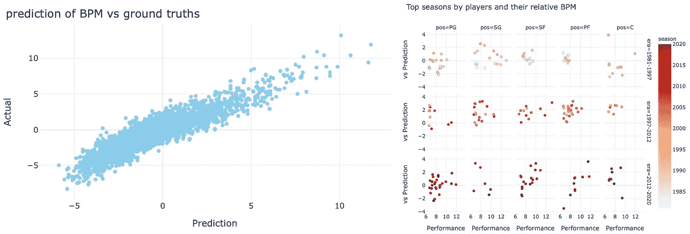

用 Python 构建 NBA 球员表现模型(图片由作者提供)

数据科学为其从业者实现了许多非常惊人的任务，并在许多方面从小到大改变了我们的生活。当企业预测产品需求时，当公司发现在线欺诈交易时，或当流媒体服务推荐观看内容时，数据科学通常是实现这些创新的润滑油。

这些类型的数据科学创新基于回归分析，也就是说，它们是关于理解输入变量和输出变量之间的关系。

与分类分析一样，回归是两种基本类型的数据问题之一，了解它如何工作以及如何执行它们是数据分析和数据科学的重要组成部分。

因此，我想在这篇文章中展示如何使用回归分析来识别数据中的模式并用于预测目的。首先，让我们从简单的线性回归技术开始，看看它们能教会我们什么。

我们将构建一个简单的模型来预测 NBA 球员的描述性统计数据，称为 [Box-Plus-Minus (BPM)](https://www.basketball-reference.com/about/bpm2.html) 。

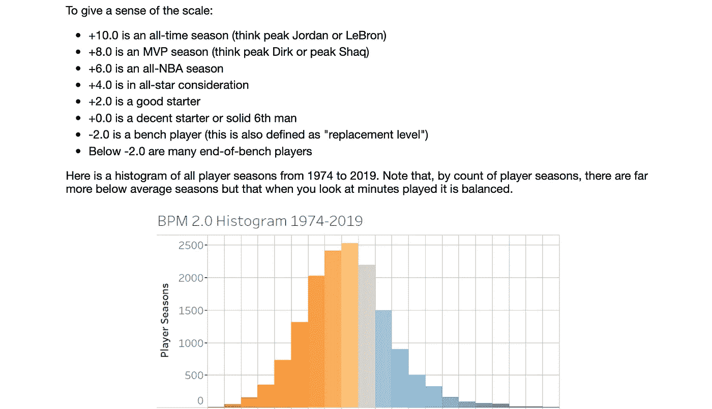

来自关于 BPM —图片:[Basketball-Reference.com](https://www.basketball-reference.com/about/bpm2.html)

BPM 旨在衡量球员的贡献，它基于球员的统计数据、位置和球队的表现。

在这种情况下，我们将仅基于每个玩家的*个人统计数据来构建该模型。*因此，该模型不仅要估计 BPM 如何与个人统计数据相关，还要估计个人统计数据如何与集体团队绩效相关，此处未包括。

最后，在我们建立了一个模型之后，我们将查看哪些数据点形成了异常值/高误差点，并讨论这在该模型的上下文中可能意味着什么。

## 准备

接下来，安装几个软件包— `numpy`、`pandas`、`sklearn` (scikit-learn)，还有`plotly`和`streamlit`。用一个简单的`pip install [PACKAGE_NAME]`安装每个(在您的虚拟环境中)。

这篇文章的代码在我的 [GitHub repo here](https://github.com/databyjp/learndata_nba) (作为`data_predict_bpm.py`)上，所以你可以下载/复制/叉走你喜欢的内容。

哦，这是我写的关于使用 NBA 数据的一系列数据科学/数据分析文章的一部分。所有的钱都会去回购，所以你要睁大眼睛！([这是我之前写的一篇关于可视化数据集进行数据探索的文章](/explore-any-data-with-a-custom-interactive-web-app-data-science-with-sports-410644ac742)

如果您正在跟进，请使用以下内容导入密钥库:

```
import numpy as np
import pandas as pd
import sklearn
import plotly.express as px
import streamlit as st
```

我们准备好出发了。

# 构建玩家模型——从汤到坚果

## 数据预处理

大多数数据科学项目都是从乏味的任务开始的，比如项目范围、数据收集和数据清理。幸运的是，我们正在使用的数据集将让我们绕过这一切。

尽管如此，它并没有完全减轻我们对预处理的所有责任。

在预处理中，就像在每一步一样，我们需要记住我们要达到的目标。在这种情况下，我们正在构建一个使用玩家统计数据来预测 BPM 的模型。

因为 BPM 是一个“比率”统计，所以使用与每场比赛相关的统计是有意义的。因此，让我们加载每场比赛的统计数据集(`player_per_game.csv`)并检查它。(有关使用交互式 web 应用程序探索该数据集的文章，请在此处查看我的文章。)

查看数据，我们看到一些玩家有异常数据。这里有一个例子，绘制球员在两分球和三分球上的命中率。

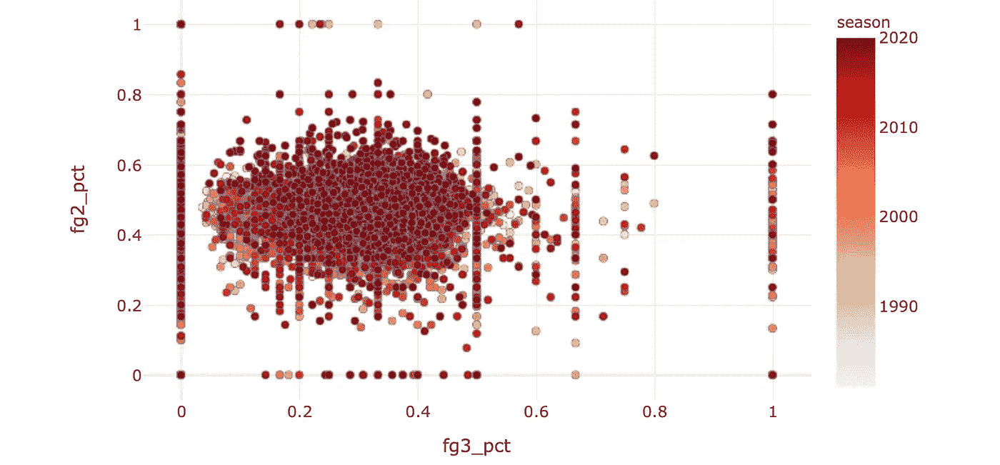

请注意由于样本量小而导致的数据失真(图片由作者提供)

你会注意到在这张图表中的直的垂直线或水平线中的点群。这些都是小样本的伪影，导致像 0%、60%或 100%这样的百分比。)精度。一名球员 3 投 100 中，整体命中率 80%。这些数据点不太可能代表玩家的实际能力，并且可能会污染我们构建的任何模型。

所以让我们过滤掉这些玩家。我们应该怎样做呢？很明显，我们可以过滤掉具有一定准确度的球员，但这不是根本问题——这是症状，不是原因。原因是某些球员的样本量很小。

考虑到这一点，让我们用一个统计数据来代表每个球员产生这些统计数据的机会，也就是总的上场时间。

上场时间的分布如下所示:

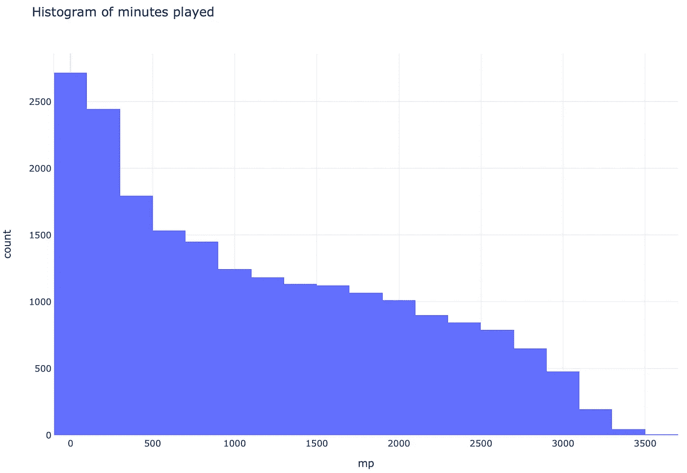

分钟直方图(图片由作者提供)

因此，让我们按照至少 500 分钟的播放时间来过滤数据帧。

```
df = df[df["mp"] > 500]
```

数据现在应该看起来“干净”多了。你自己看看吧。

因为我们正在构建一个线性回归模型，所以让我们保持一些连续的变量来简化事情。

```
cont_var_cols = ['g', 'mp_per_g', 'fg_per_g', 'fga_per_g', 'fg3_per_g', 'fg3a_per_g', 'fg2_per_g', 'fg2a_per_g', 'efg_pct', 'ft_per_g', 'fta_per_g', 'orb_per_g', 'drb_per_g', 'trb_per_g', 'ast_per_g', 'stl_per_g', 'blk_per_g', 'tov_per_g', 'pf_per_g', 'pts_per_g', 'mp']
cont_df = df[cont_var_cols]
```

将所有最新的数据放在一起(为了实时可视化，添加了一点 Streamlit)，我们得到:

## 数据探索

让我们暂停一下，检查各种输入变量和目标变量(BPM)之间的相关性。

首先，场均得分和 BPM 之间:

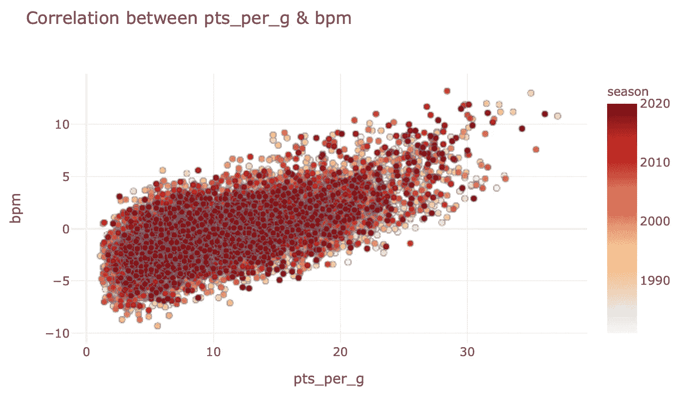

场均得分和 BPM 之间的相关性——非常非常好！(图片由作者提供)

场均助攻呢？

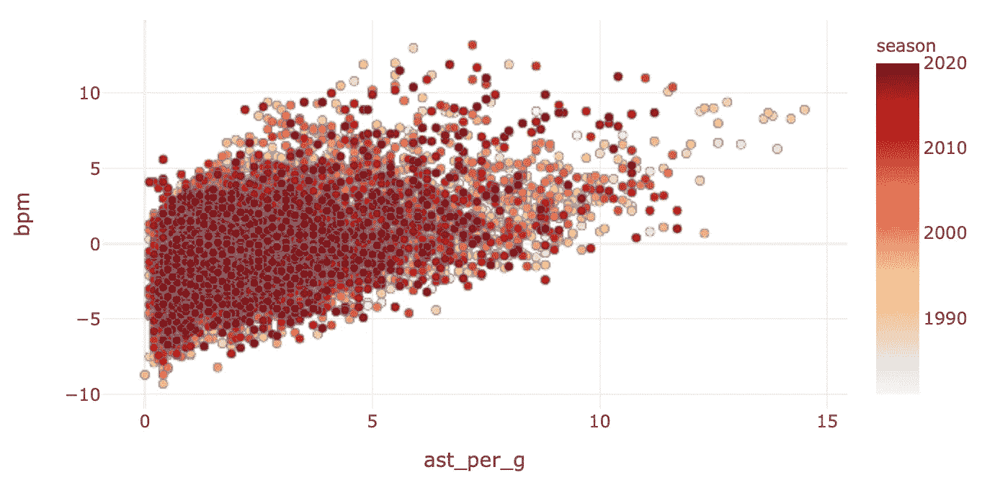

场均助攻与 BPM 的相关性——还不错！(图片由作者提供)

现在，并不是所有的统计数据都与目标相关联—请看下一个统计数据:

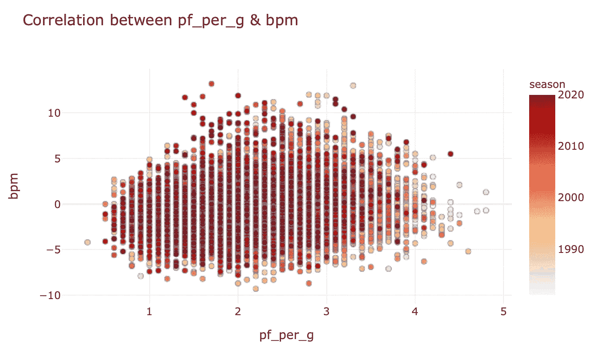

场均助攻和 BPM 之间的相关性——可能接近于零(图片由作者提供)

这看起来像是典型的非相关关系！不要相信我的话，看看这个教科书上的例子:


相关性示例表——中上图是否让你想起了什么？(图片:[维基百科](https://commons.wikimedia.org/wiki/File:Correlation_examples2.svg#/media/File:Correlation_examples2.svg))

这很直观，对吗？为什么一个球员的平均个人犯规次数与他们的能力有任何关系，除了他们在球场上花了多少时间？即便如此，我认为这种相关性还是很弱。

接下来，我们将看看单个特征的规模。我们可以将数据列的最小、平均、最大和标准偏差可视化，如下所示:

```
feat_desc = cont_df.describe()[cont_var_cols].transpose().reset_index().rename({'index': "var"}, axis=1)
feat_fig = px.bar(feat_desc[['var', 'mean', 'std']].melt(id_vars=['var']), x="var", y="value", color="variable", barmode="group")
```

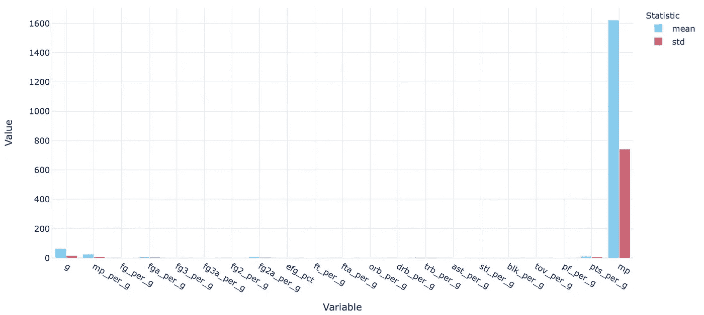

各种特征的统计描述符—范围由一个统计数据决定！(图片由作者提供)

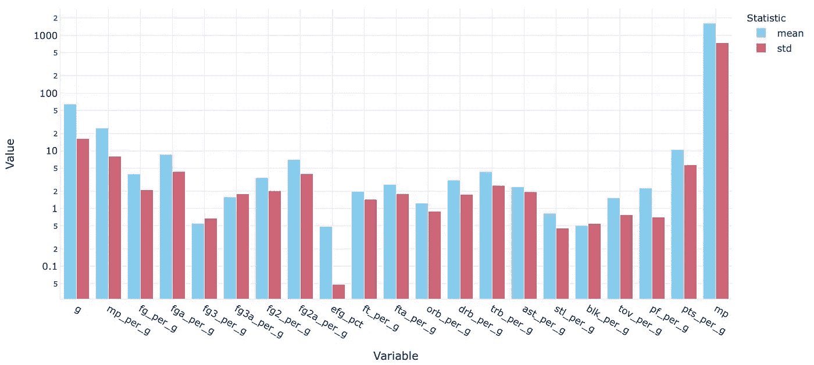

即使在对数标度中，它们也是极其易变的！(图片由作者提供)

这里有一个相当大的范围。这可能会导致一些变量对模型的影响超过其他变量，因此调整每个输入变量通常是一种好的做法。

所以让我们将数据标准化。Scikit-learn 有一个模块`preprocessing.StandardScaler()`，它基本上使这个过程一步完成。像这样实例化一个`scaler`:

```
from sklearn import preprocessing
scaler = preprocessing.StandardScaler().fit(cont_df)
```

数据可以缩放为:

```
X = scaler.transform(cont_df)
```

为了确保缩放有效，我们可以再次绘制缩放后的变量，从而得到这个极其无聊的图！

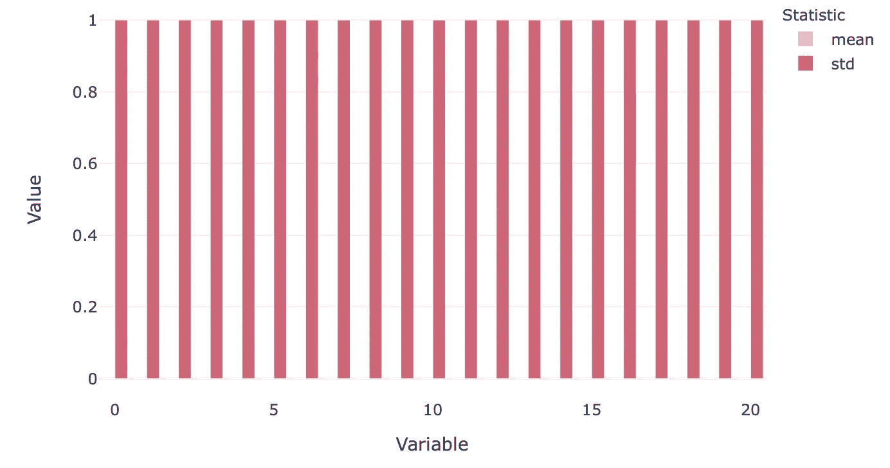

成功的攀登，还是一堵墙的轮廓？(图片由作者提供)

现在我们(终于)准备好开始构建一些模型了。

## 给我做个模型

作为第一步，我们将数据分成两组—一组训练集和一组测试集。让我们保持简单，现在使用 80/20 规则。输入变量可以这样分割:

```
X_train, X_test = model_selection.train_test_split(X, train_size=0.8, random_state=42, shuffle=True)
```

目标变量是这样的:

```
Y = df["bpm"].values
Y_train, Y_test = model_selection.train_test_split(Y, train_size=0.8, random_state=42, shuffle=True)
```

现在我们在这里，scikit-learn 的神奇之处在于，实际应用一个特定的算法非常简单。

对于随机梯度下降回归器，建立如下模型:

```
mdl = linear_model.SGDRegressor(loss="squared_loss", penalty="l2", max_iter=1000)
mdl.fit(X_train, Y_train)
```

然后用以下公式进行预测:

```
Y_test_hat = mdl.predict(X_test)
```

我们可以将预测与基本事实(实际 Y 值)进行比较，如下所示:

```
test_out = pd.DataFrame([Y_test_hat, Y_test], index=["Prediction", "Actual"]).transpose()
val_fig = px.scatter(test_out, x="Prediction", y="Actual", title="Stochastic Gradient Descent model prediction of BPM vs ground truths")
```

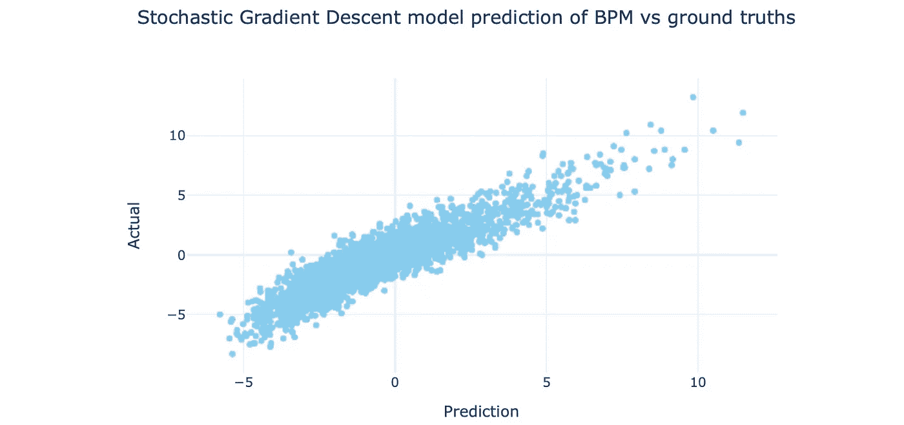

SDG 模型预测与实际值(图片由作者提供)

这是个不错的结果。我们犯了什么错误？让我们以 MSE(均方误差)来计算它，这又是用 sklearn 的一行计算:

```
from sklearn import metrics
mse = metrics.mean_squared_error(Y_test, Y_test_hat)
```

使用随机梯度下降回归器，MSE 值为:1.19。

那是我们能做的最好的吗？有可能，但也可能没有。有很多很多算法可以尝试。Scikit-learn 文档为[提供了这份线性模型指南](https://scikit-learn.org/stable/modules/linear_model.html)，这份指南可能值得一读，或者至少提供了一份方便的参考。他们还提供[这个地图](https://scikit-learn.org/stable/tutorial/machine_learning_map/index.html)来帮助选择一个估计器(不仅仅是线性模型，但是它们在那里)

现在，让我们尝试几个不同的回归变量，看看它们的表现如何:

试一个[岭回归](https://scikit-learn.org/stable/modules/generated/sklearn.linear_model.Ridge.html)模型:

```
mdl = linear_model.Ridge(alpha=.5)
mdl.fit(X_train, Y_train)
```

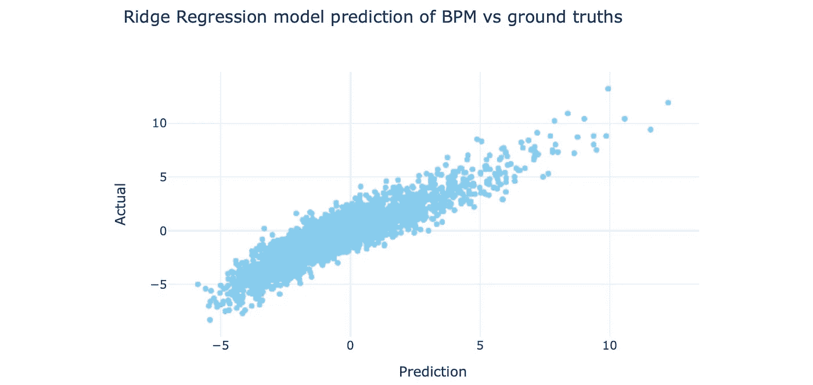

岭回归模型预测值与实际值(图片由作者提供)

[支持向量回归](https://scikit-learn.org/stable/modules/generated/sklearn.svm.SVR.html)模型:

```
mdl = svm.SVR(kernel='rbf', degree=3)
mdl.fit(X_train, Y_train)
```

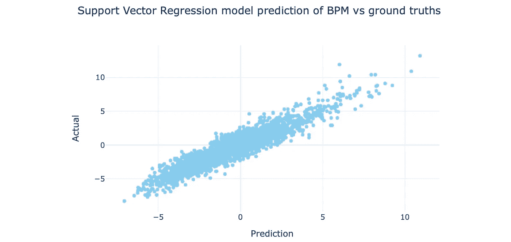

支持向量回归模型预测值与实际值(图片由作者提供)

你可以看到他们的行为都略有不同。

MSE 值为:

*   随机梯度下降:1.19
*   岭回归:1.17
*   支持向量回归:0.9

组合在一起的代码如下所示:

在我们的简单测试中，支持向量回归对这组数据表现最好。这当然没有多大意义——我没有做过任何超参数调优，只使用了相对较小的数据集，并且使用了一个测试/训练集分割。但希望这足以让你大致了解。

这就是用 Python 构建线性回归模型的基础——如果你对机器学习相对陌生，并且认为它比你想象的要简单——我同意。如今，实现机器学习算法很容易。

对于深度学习等更复杂的方法也是如此，我们将在后面看到。对我来说，就像在其他技术领域一样，关键在于问题的表述。所以我鼓励你投入进去，看看你还能做些什么。

## 额外讨论——这里的错误意味着什么吗？

通常，基础事实和模型之间的误差并不意味着什么，除了——这是模型和现实生活样本之间的差异。但有时，误差可能是系统性的，甚至表明模型或输出变量的某些固有特性。

在我们的例子中，回想一下 BPM 是一个与团队绩效相关的统计数据，而模型仅仅来自个人绩效。

所以，我想知道预测(仅基于个人数据)和实际的 BPM 数据之间的差异是否会识别出对球队有额外价值，但没有显示在数据上的球员。

这就是结果。在这里，我只显示了排名靠前的球员(BPM 值为 6 或更高)，并根据球员的位置和时代进一步细分了结果。

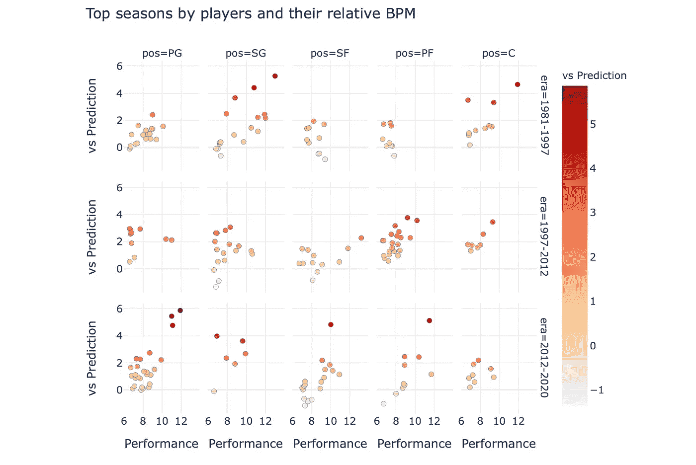

杰出的玩家，比较预测和实际表现(图片由作者提供)

通过查找 BPM 表现超出模型的最佳季节有:

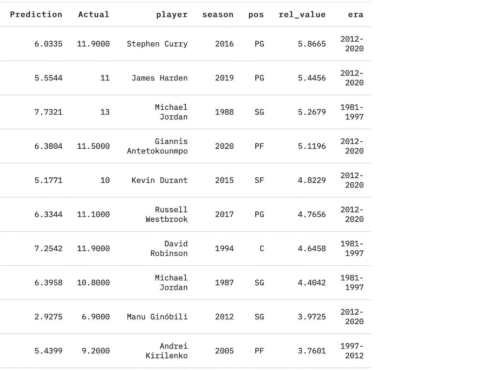

超额表现者(与我们的模型相比)(图片由作者提供)

相反，这些玩家的实际 BPM 远低于预测。

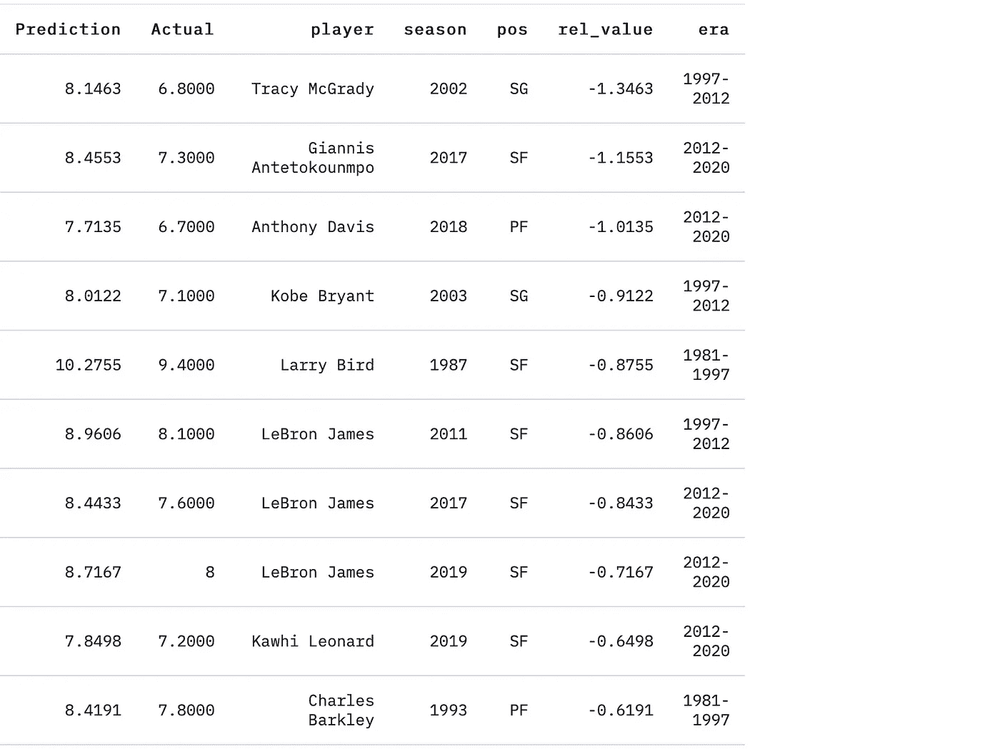

和…表现不佳者(对比模型)(图片由作者提供)

我的假设是，具有较高“相对价值”统计数据的球员往往是那些让队友变得更好的球员(例如斯蒂芬·库里，因为他的重力，或者迈克尔·乔丹，因为他是迈克尔·乔丹)，但另一种解释可能是，这表明那些幸运地拥有伟大队友的球员(例如 2012 年的马努)。

有趣的是，勒布朗·詹姆斯三次出现在名单上，因为他的表现低于他预测的 BPM 数据——随你怎么想。我会注意到，2017 年的骑士队在某种程度上只是一个疲软的东部联盟的 2 号种子，2011 年的热火队是热火队真正团结起来之前的第一年，而 2019 年的湖人队或多或少是勒布朗周围一支球队的一个小垃圾箱。

无论如何，关于篮球方面的事情已经说得够多了——我可能下次再写。我只是想强调错误不仅仅意味着模型和事实之间的差异。

今天到此为止。我希望那是有趣的。我将跟进一些其他机器学习的例子，一些还有深度学习/神经网络模型，这对我来说真的很令人兴奋。

ICYMI，这是我之前写的一篇关于用 Plotly 和 Streamlit 探索数据集的文章:

[](/explore-any-data-with-a-custom-interactive-web-app-data-science-with-sports-410644ac742) [## 使用定制的交互式 web 应用程序探索任何数据:体育数据科学

### 了解如何使用领先的数据可视化工具构建交互式、可重复使用的 web 应用程序进行探索性数据分析…

towardsdatascience.com](/explore-any-data-with-a-custom-interactive-web-app-data-science-with-sports-410644ac742) 

在你离开之前——如果你喜欢这个，在推特上打个招呼/关注，或者点击这里更新。

您可能还会对以下内容感兴趣:

[](/plotly-dash-vs-streamlit-which-is-the-best-library-for-building-data-dashboard-web-apps-97d7c98b938c) [## Plotly Dash 与 Streamlit——哪个是构建数据仪表板 web 应用程序的最佳库？

### 用于共享数据科学/可视化项目的两个顶级 Python 数据仪表板库的比较——

towardsdatascience.com](/plotly-dash-vs-streamlit-which-is-the-best-library-for-building-data-dashboard-web-apps-97d7c98b938c)