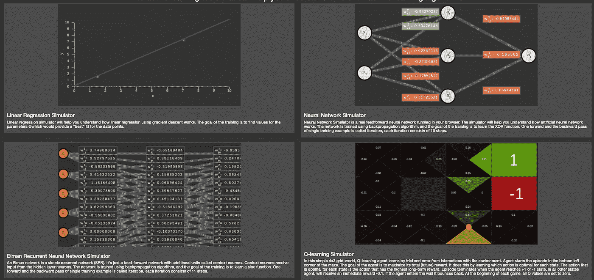
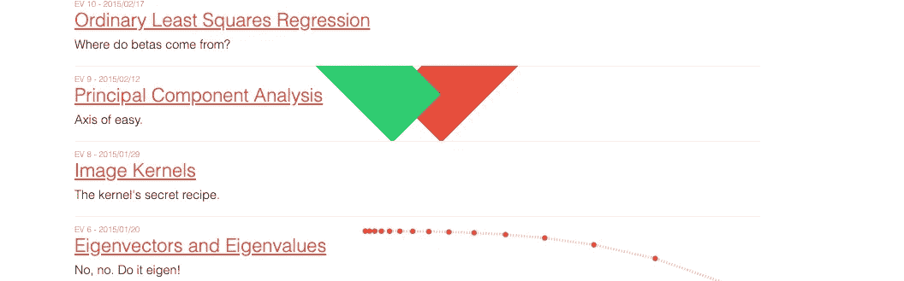

# 交互式学习机器学习概念

> 原文：<https://towardsdatascience.com/learn-machine-learning-concepts-interactively-6c3f64518da2?source=collection_archive---------30----------------------->

## 五个免费可用的工具，直观地分解了复杂的机器学习概念

罗斯·斯奈登在 [Unsplash](https://unsplash.com?utm_source=medium&utm_medium=referral) 上的照片

机器学习算法如何在引擎盖下工作是许多人不理解的一个方面。一层 CNN 看到了什么？反向传播是如何工作的？层中的权重究竟是如何更新的？这些是我们脑海中反复出现的一些问题。这些概念对于那些想要在将数学方程与理论联系起来的过程中度过一段艰难的时间的初学者来说可能是特别难以理解的。好消息是，一些人理解这种痛苦，并希望提供替代形式的学习。本文汇集了五个这样的工具，它们超越了理论，而是直观地解释了标准的机器学习概念。

# 1.MLaddict.com

来源:https://www.mladdict.com/

[**mladdict.com**](https://www.mladdict.com/)如果你想理解以下四种算法的基本数学概念，这是一个极好的工具:

*   线性回归
*   神经网络
*   循环网络
*   q 学习代理

它会在您的浏览器中打开一个模拟器，然后演示算法的每个阶段会发生什么。下面是一个模拟器的演示，展示了如何使用梯度下降算法进行线性回归。

作者视频|内容来自[mladdict.com](https://www.mladdict.com/)

# 2.直观解释

来源:[mladdict.com](https://www.mladdict.com/)

[**直观解释(EV)**](https://setosa.io/ev/#:~:text=Explained%20Visually%20(EV)%20is%20an,to%20hear%20about%20the%20latest.) 是一个旨在将挑战性的想法直观化的实验。它的灵感来自 Bret Victor 的作品[探索性解释](http://worrydream.com/ExplorableExplanations/)。这个网站上最后一篇更新的文章可以追溯到 2017 年，所以你不会找到任何最新的材料，但那里的那些简直太棒了。我在我的一些博客中借用了一些他们的视觉解释，因为他们创作得非常漂亮。下面先睹为快 EV 如何解释主成分分析(PCA)的概念。查看他们网站上其他令人兴奋的作品。

作者视频。来自[的内容进行了直观解释(EV)](https://setosa.io/ev/#:~:text=Explained%20Visually%20(EV)%20is%20an,to%20hear%20about%20the%20latest.)

# 3.视觉理论

来源:https://seeing-theory.brown.edu/

[**见理论**](https://seeing-theory.brown.edu/) 是一个提供概率和统计直观介绍的网站。该网站的目标是通过交互式可视化使统计数据更容易获取。该书为以下六个统计概念提供了直观的解释。

*   基本概率
*   复合概率
*   概率分布
*   频繁推理
*   贝叶斯推理
*   回归分析

我们来看看看见论是如何介绍概率论的基本概念的。

作者视频。内容来自 [**见论**](https://seeing-theory.brown.edu/)

# 4.R2D3:统计和数据可视化

来源: [R2D3:统计和数据可视化](http://www.r2d3.us/)

[R2D3](http://www.r2d3.us/) 是用交互设计表达统计思维的实验。它以结构化的方式提供了机器学习概念的可视化介绍。目前，网站上提供了以下主题:

*   [第 1 部分:决策树](http://www.r2d3.us/visual-intro-to-machine-learning-part-1/)
*   [第 2 部分:偏差和方差](http://www.r2d3.us/visual-intro-to-machine-learning-part-2/)
*   在机器学习的世界里设计
*   [理解新冠肺炎](http://www.r2d3.us/covid-19/)

下面是你如何可视化决策树如何进行分类

作者视频|内容来自 [R2D3](http://www.r2d3.us/)

# 5.CNN 解说者

来源:[https://poloclub.github.io/cnn-explainer/](https://poloclub.github.io/cnn-explainer/)

[**CNN 讲解人**](https://poloclub.github.io/cnn-explainer/) 是一个交互式可视化系统，旨在帮助非专家了解卷积神经网络(CNN)。CNN Explainer 是一个结合了 CNN 的模型概述和动态可视化解释的工具，可以帮助用户理解 CNN 的底层组件。 [*通过跨抽象层次的平滑过渡，我们的工具使用户能够检查低级数学运算和高级模型结构之间的相互作用。*](https://medium.com/r?url=https%3A%2F%2Farxiv.org%2Fabs%2F2004.15004)

欲了解更多信息，请查看我们的手稿 [CNN 解释者:用交互式可视化学习卷积神经网络](https://arxiv.org/abs/2004.15004)或尝试使用现场演示[这里](https://github.com/poloclub/cnn-explainer)。下面是如何使用该工具的快速演示。

[演示视频“CNN 讲解者:用交互式可视化学习卷积神经网络”](https://www.youtube.com/watch?v=HnWIHWFbuUQ&feature=emb_title)

# 结论

最后，我们看了五个有用的工具，它们让机器学习和统计概念变得更有趣。一幅画胜过千言万语，这是正确的说法。当复杂的术语以互动的形式呈现时，它们会变得更容易理解。这也有助于降低初学者进入机器学习领域的门槛。