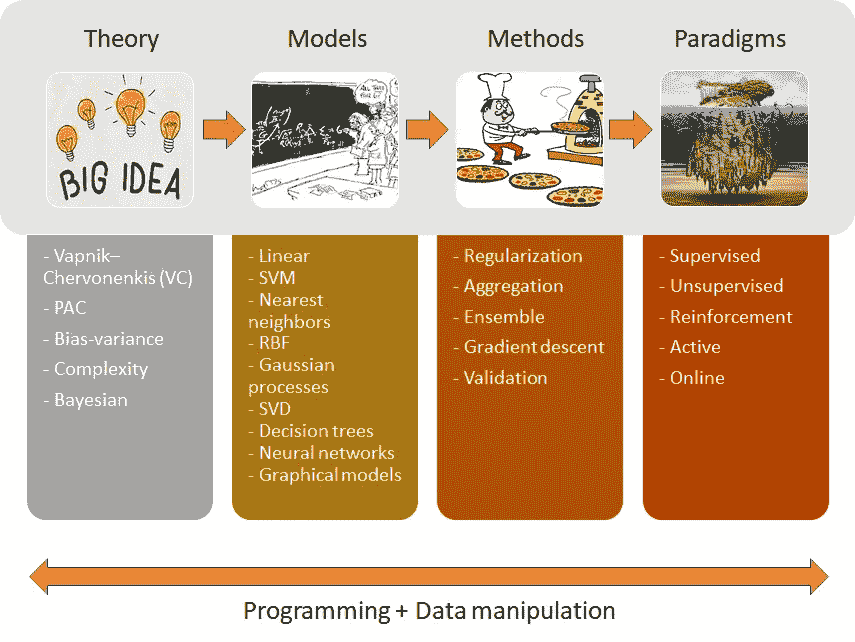
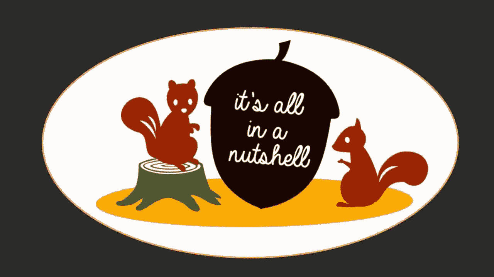
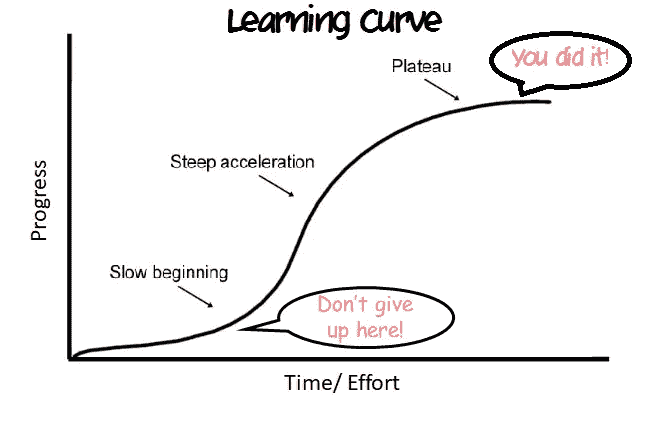

# 以有趣的方式学习机器

> 原文：<https://towardsdatascience.com/learn-machine-learning-the-fun-way-554833891b73?source=collection_archive---------7----------------------->

## 严格的课程让你享受学习。

最近，我收到了一些读者的回复，他们让我写一些关于如何从机器学习/数据科学开始，以及从哪些资源开始是正确的。我犹豫了一下，因为已经有很多关于这个主题的“初学者指南”文章了。

然而，我也注意到，那里的许多文章更像是无穷无尽的在线课程列表的集合。而 ***乐趣*** 学习的成分很大程度上被忽略了。此外，来自非技术背景(我第一个学位学的是经济学)，我知道放弃有多容易。学习的道路需要大量的 ***努力*** ，大量的 ***奉献*** 和 ***好奇心*** 。没有捷径可走，但你肯定可以让它变得更有趣、更令人兴奋。在这篇文章中，我试图向你展示一幅最清晰的机器学习(ML)的画面，以及你应该如何从它开始而不被淹没。这是我们的计划:

*   了解机器学习的构建模块；
*   必修基础；
*   学习策略+如何娱乐自己的技巧；
*   如何让知识成为你的？

让我们开始吧。

# 1.机器学习的基石

机器学习的构建模块可以总结如下:

机器学习的基石。

这肯定不是一个详尽的列表，但你得到的想法。你遇到的所有模型和算法背后都有一些支配性的理论。这是因为机器学习可以从很多角度来看:统计的角度，计算复杂度的角度等等。当你看到一些主要介绍数学定理和证明的 ML 书籍时，不要感到困惑，而其他一些书籍则更注重数据和编程语言的实用性。他们只是从不同的角度看 ML。

来源:[https://anacuder.com/o-que-significa-in-a-nutshell/](https://anacuder.com/o-que-significa-in-a-nutshell/)

从这些不同的理论中，我们得出了不同类型的学习模型(线性、决策树、神经网络等。).

然而，为了使模型能够在真实数据集上很好地概括，我们需要采用一些额外的技术(例如，正则化以避免过度拟合，集成方法以减少学习模型中的偏差/方差)。这就是同一款车型的各种变种的来源。例如，添加了一些正则化项的线性回归创建了新类型的模型(例如套索、山脊或弹性网)。决策树也是如此:使用不同的集成方法，我们提出了随机森林、AdaBoost 等。

最后，根据您如何在真实数据集上应用模型，模型可以分为不同的范例。例如，当在标记数据集上训练时，神经网络是监督学习算法。然而，当它被训练来重建自己(例如自动编码器)时，它就变成了一种无监督的算法。还有其他混合范式，如半监督学习，但一旦你掌握了基本知识，你会在一眨眼的功夫就明白了。因此，**很好地了解核心**，事情将开始步入正轨。

# 2.必需的基础知识

来源:[https://www . bouvet . no/bouvet-deler/6-机器学习入门提示](https://www.bouvet.no/bouvet-deler/6-tips-for-getting-started-with-machine-learning)

你可能已经意识到，我们显然需要温习我们的**数学**和**统计学**才能征服机器学习。

其实你还需要一些**计算机科学**知识和编程技巧。但是，在将机器学习应用于您的问题时，您将通过实践自然地获得这些技能。

# 3.学习策略

还没睡吗？现在，让我们看看我们应该如何征服机器学习的这个广阔领域。

## 首先，做好基础工作

当你还没有很好的基础时，从一个在线课程转到另一个是很诱人的。许多在线课程就其核心内容而言基本上是相同的，尽管它们可能以不同的方式交付或使用不同的编程语言。所以明智地利用你的时间吧！你需要的是彻底完成一门课程，这门课程会给你所有你需要的基础知识。避免编程语言特定的课程，比如“Python 中的机器学习”，因为它们会让你失去对基础知识的关注。

我得到了这个教训。我发现自己甚至在完成了相当多的 ML 课程后，还在思考一些非常基本的概念，如最大似然估计或单值分解。无论你为你的 ML 项目写了多少次 *model.fit(X_train，y_train)* 和 *model.predict(X_test)* ，这些差距都是很难弥补的。因此，**把基础知识做好**你就可以在将来不断扩展你在“扩展”方面的知识，比如图像处理和自然语言处理。请记住，你的目标是成为一名有能力的数据科学家/机器学习者，而不是只知道在数据集上应用 Sklearn 的人。

**ML 入门推荐:**

1.  [Coursera 的机器学习——吴恩达](https://www.coursera.org/learn/machine-learning?skipBrowseRedirect=true)(对 ML 最好的直观介绍。编程练习在 Matlab 中，但是如果你不熟悉 Matlab，现在可以跳过这些练习)。
2.  [CS540 机器学习作者 Nando de Freitas](https://www.youtube.com/watch?v=w2OtwL5T1ow&list=PLE6Wd9FR--EdyJ5lbFl8UuGjecvVw66F6&index=1) (几乎所有 ML 概念和算法的综合数学基础)。

我们大多数人的学习曲线是这样的。来源:[https://medium . com/@ pwalukagga/learning-curve-experience-at-SLC-boot camp-day 3-9f8f 34458959](https://medium.com/@pwalukagga/learning-curve-experience-at-slc-bootcamp-day3-9f8f34458959)(改编)

**如何让自己开心的小贴士:**

*   Youtube 是你最好的朋友。每当事情变得太抽象或者你被某样东西卡住了，就去 Youtube 上找找看！一些有用的 Youtube 频道(仅举几个)是:

1.  [3 蓝色 1 棕色通道](https://www.youtube.com/channel/UCYO_jab_esuFRV4b17AJtAw)
2.  [亚历山大·伊勒频道](https://www.youtube.com/channel/UCUSRKgnYeos2aX_JnV9qa3w)
3.  [JB 统计](https://www.youtube.com/user/jbstatistics/videos)
4.  [可汗学院](https://www.youtube.com/results?search_query=khan+academy+statistics)

*   *使用视觉工具进行学习*，正如我在另一篇[帖子](/hard-statistics-and-data-science-concepts-visually-explained-de7325c2e9ef?source=friends_link&sk=2d7b9a3011094d9863dfc53f5749bb2c)中所描述的。
*   *什么时候开始觉得无聊*？这里有一些真正有趣的书，会让你在学习数学和统计学时充满乐趣:

1.  [如何用统计数据撒谎(达雷尔·赫夫著)](https://www.amazon.com/How-Lie-Statistics-Darrell-Huff/dp/0393310728/ref=sr_1_1?crid=2LWRGXYFDLBMD&keywords=how+to+lie+with+statistics&qid=1581155740&sprefix=how+to+lie+with+%2Caps%2C216&sr=8-1)
2.  [如何不犯错:数学思维的力量(乔丹·艾伦伯格)](https://www.amazon.com/How-Not-Be-Wrong-Mathematical/dp/0143127535/ref=sr_1_1?keywords=how+not+to+be+wrong&qid=1581155955&sr=8-1)

## 二、基础编程

Coursera、Udemy、DataCamp 上有很多不错的学习 R/ Python 的在线课程，这里就不赘述了。最好的学习方法，至少对我来说，是**练习，大量的练习**。下载一个玩具[数据集](/top-10-great-sites-with-free-data-sets-581ac8f6334)，做一些操作，看看你能走多远。

**如何让自己开心的小贴士:**

*   你可以收集你自己的数据集(关于你自己的)。保存一个你日常生活用品的数据集，获取你每月支出的银行对账单，浏览你最喜欢的网站。然后你可以用它们做大量有趣的分析。
*   找一个社区，和他们互动。如果你被卡住了，你可以在 Stackoverflow 上发布你的问题。回答别人的问题也是一种非常好的学习方式。此外，在许多在线课程中，你可以找到比你知道得更多或更少的同学。在任何情况下，这种互动都会让你感到与他人有联系，并在过程中给你带来些许快乐。

当你第一次开始时，你想做的每一件事情都很简单。你编程越多，你就越不需要谷歌，你开始学习成为一个高效和干净的程序员。你基本上可以像写诗一样写代码(嗯，我想你比我更擅长写诗)。

# 4.让知识成为你的

在某些时候，你可能会觉得自己对所学的知识仍然没有信心。你可以这样做:

## 教导他人

内化你的知识的最有效的方法是**教**别人。写一篇关于你所学到的东西的博文。给一个朋友解释，一个不了解这个概念的同事。做一个关于这个话题的报告。尽你所能解释清楚，穿过浅层，把它修剪到核心。使用图形、图表、图画或任何方式来传达你的信息。

## 在工作/学习中应用编程

如果你有一份工作，试着应用编程来自动化一些工作任务，无论是操作仪表板的数据，还是操作 Excel 文件！这将帮助您快速熟悉和熟练编程。

如果您正在学习 Python，以下是您可以尝试的内容:

1.  [用 Python 自动化枯燥的东西](https://automatetheboringstuff.com/)

## 辅助项目(与朋友一起)

就你关心的话题找一个 ML 挑战，和一个朋友一起做。通过从一些流行的内核派生代码，你总是可以在 Kaggle 竞争中“生存”,你可能还会学到一些新东西，但这并不真正有趣。和朋友在一起，你会比别人更有动力保持忠诚，变得更好。

祝你机器学习之旅一帆风顺。享受学习！