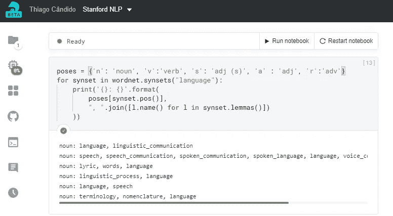

# 以斯坦福的方式学习 NLP 第 1 课

> 原文：<https://towardsdatascience.com/learn-nlp-the-stanford-way-lesson-1-3f1844265760?source=collection_archive---------28----------------------->

## 给你的邀请，介绍自然语言处理和词向量

在 [Unsplash](https://unsplash.com/s/photos/academic?utm_source=unsplash&utm_medium=referral&utm_content=creditCopyText) 上由[伊尼基·德尔·奥尔莫](https://unsplash.com/@inakihxz?utm_source=unsplash&utm_medium=referral&utm_content=creditCopyText)拍摄的照片

自然语言处理(NLP)的人工智能领域，通过其庞大的语言模型——是的，GPT 3 号，我在看着你——展示了它被视为机器执行最独特语言任务能力的一场革命。

由于这一点，公众对整体的看法是分裂的:一些人认为这些新的语言模型将为天网类型的技术铺平道路，而另一些人则认为它们是炒作推动的技术，将在很短时间内或根本不会存在于尘土飞扬的架子或硬盘驱动器中。

# 邀请

受此激励，我创作了这一系列故事，以一种友好的方式从头开始接近 NLP。

## 我也邀请你和我一起参加这个系列来学习 NLP，并且精通人工智能语言模型塑造的未来。

要加入我，你需要有一点 Python 和 Jupyter 笔记本的经验，在大多数情况下，我甚至不会要求你在你的机器上安装任何东西。

**这个系列将在统计学和微积分的深度上与斯坦福课程有显著的不同。**我将尽力避免涉及细节，因为在大多数情况下，我们将使用已经实现了我们将需要的大部分结构的 Python 库。但是，如果你想了解更多关于这些主题的知识，我强烈建议你学习课程笔记。

我们将使用 [Deepnote](https://deepnote.com) 创建我们的 Python 笔记本，并使用云开发整个课程。

**为什么选择 Deepnote？Deepnote 通过实时协作扩展了 Jupyter 笔记本的体验，并提供无预装的免费计算。你可以在这里复制我的 Deepnote 笔记本[，并跟随我完成这个项目以获得最佳体验。](https://deepnote.com/publish/a0986055-32dd-4f1e-b536-e62a47a91318)**

对于这门课程，我们将使用斯坦福大学 2020 年冬季 CS224N 材料的指南，因为它有一个全面的方法，一个包含课程的 [Youtube 播放列表](https://www.youtube.com/playlist?list=PLoROMvodv4rOhcuXMZkNm7j3fVwBBY42z)，以及斯坦福大学学生提供的其他资源。如果你想了解更多的课程，你可以访问它的[网站](https://web.stanford.edu/class/cs224n/)。

我们将首先从自然语言处理的基础开始，然后学习它的关键方法:RNN、注意力、变形金刚等等。本课程结束时，我们将能够创建以下一些应用程序:

*   字义
*   依存句法分析
*   机器翻译
*   问题回答

# 自然语言处理简介

> **“自然语言处理** ( **NLP** )是[语言学](https://en.wikipedia.org/wiki/Linguistics)、[计算机科学](https://en.wikipedia.org/wiki/Computer_science)和[人工智能](https://en.wikipedia.org/wiki/Artificial_intelligence)的一个分支，涉及计算机和人类语言之间的交互，特别是如何给计算机编程，以处理和分析大量的[自然语言](https://en.wikipedia.org/wiki/Natural_language)数据。”—维基百科

根据这个定义，除了看到 NLP 是一个广阔的多学科领域，它还将我们引向一个问题:**我们如何让计算机程序分析自然语言数据？**

第一步是学习我们如何在计算环境中表示单词及其含义。

## 词语的含义

几年来，NLP 的工作主要是基于对单词同义词和上位词的建模。找出这些集合的一个方法是查看字典中的单词定义。

我们可以通过使用 Python 和一个名为 [NLTK](https://www.nltk.org/) 的库来做到这一点。

## 试用 NLTK

> “NLTK 是构建 Python 程序来处理人类语言数据的领先平台。它为超过 50 个语料库和词汇资源如 WordNet 提供了易于使用的接口，以及一套用于分类、标记化、词干化、标记、解析和语义推理的文本处理库，工业级自然语言处理库的包装器，以及一个活跃的论坛—Nltk.org

有了 NLTK，我们可以使用一个名为 WordNet 的内置词汇数据库来搜索一个单词的意思。WordNet 将名词、动词、形容词和副词分组为认知同义词集— *同义词集—* ，每个同义词集*代表一个不同的概念。*

首先，让我们在 Deepnote 上登录创建一个“新项目”。打开笔记本，让我们通过在单元格中键入并使用 Shift+Enter 运行来安装 NLTK 库——对于那些使用不同 Python 笔记本平台的人来说，您知道的快捷方式应该可以正常工作。

之后，我们需要导入 NLTK 库并下载 WordNet 数据库。

有了这个，我们就都准备好了。为了从像 *'language，*这样的单词中获取 *synsets* 对象，我们必须导入 WordNet 数据库并使用方法。`*synsets()*` *。*

看起来结果对象并没有给我们所有需要的关于这个单词的信息，只是一些关于每个`*synset*` *的类似加密的信息。*为了更好地查看，我们可以循环查看结果，并使用`*pos()*` *和* `*lemmas()*` 格式化 *synset* 对象，借助一个自定义的对象列表来“漂亮地打印”单词表示。

> 关于 NLTK 中 WordNet 包的更多信息，您可以查看这个[链接](https://www.nltk.org/_modules/nltk/corpus/reader/wordnet.html)

## NLTK 陷阱

您可以看到它作为字典工作正常，但是在开发 NLP 应用程序时有一些问题。

这很主观。它需要大量的人力，所以实际上不可能维持语料库。它也不会有效地计算单词相似度，而这对于我们的应用程序来说是非常重要的。那会导致我们编写不可靠或容易过时的人工智能软件。

## 离散表示

另一种方法是使用离散向量(包含 0 和 1 的向量)来表示不同的单词，但是这种方法也有一些缺陷。例如，它主要依赖 WordNet 的同义词列表，这会给我们带来一些问题。

由于这个原因，该领域转向另一种方法，即使用单词向量来表示单词。

# 根据上下文来表示单词

> 从一个人交的朋友身上，你就可以知道这个人是什么样的人。

单词向量的概念使我们能够处理单词和中心单词的上下文(附近的单词)。这使我们能够研究不同语境中单词之间的相似性。

## 单词向量(也称为嵌入或表示)

单词向量由包含非零值的 n 维向量表示，通过单词与其他单词的关系来表示单词。为每个单词构建一个密集向量，如下所示:

由 100 维单词向量表示的单词“medium”

如果你想扩展你在单词向量方面的知识，我推荐这本由艾莉森·帕里什写的[超棒的笔记本](https://gist.github.com/aparrish/2f562e3737544cf29aaf1af30362f469)。

可以用不同的方法创建单词向量。在斯坦福的 CS224N 课程中，呈现了 word 2 vec(miko lov et al . 2013)[【1】](https://arxiv.org/abs/1301.3781)[【2】](https://arxiv.org/abs/1310.4546)*框架*:

## Word2Vec 概述:

*   收集大量的文本
*   用 n 维向量表示固定词汇表中的每个单词
*   对于文本中的每个位置，定义一个中心词和上下文词。
*   使用向量的相似度来计算给定中心词的上下文的概率。
*   重复单词向量以最大化这个概率

这个过程主要是通过使用神经网络学习单词之间的关联来实现的。我们不会实现 Word2Vec 框架来训练一个模型；相反，我们将使用 Python 库 [*gensim*](https://radimrehurek.com/gensim/index.html) 中的 Word2Vec 模型。

> “Gensim 是一个 Python 库，用于大型语料库的*主题建模*、*文档索引*和*相似性检索*。目标受众是 T21 的自然语言处理(NLP)和信息检索(IR)社区— [Gensim 网站](https://radimrehurek.com/gensim/index.html)

# 探索单词向量与 gensim 库的关系

这个例子将使用 *gensim 的*嵌入式`api`和`Word2Vec`模块下载一个文本语料库，并创建一个 Word2Vec 模型来可视化一些有趣的单词向量特征。首先，我们需要安装 *gensim* 包。

**现在我们需要获得用于创建 Word2Vec 模型的语料库。为此，我们可以使用`api`模块。我们将下载从维基百科中提取的文本创建的 text8 语料库。之后，我们需要使用语料库来创建我们的 Word2Vec 模型，我们通过导入 Word2Vec 模型并实例化它，将语料库作为构造函数参数传递来完成。**

这可能需要一些时间:)

**我们已经可以通过执行诸如查找相似单词和选择不属于一个组的单词这样的任务来处理单词向量。**你可以阅读 [gensim 的文档](https://radimrehurek.com/gensim/auto_examples/index.html)了解更多关于可用的词向量运算。

还记得 NLTK 最大的缺陷可能是无法计算两个单词之间的相似度吗？通过使用单词向量，我们可以使用这个特性来执行更复杂的任务。例如，我们可以找到几组单词之间的相似之处。

我们可以用单词和模型表达式进行数学运算，比如:**“国王—男人+女人=？”**

摘自[第一讲](https://youtu.be/8rXD5-xhemo)的视频

为了使用 *gensim、*对表达式求值，我们可以使用`most_similar()`方法，将正值`‘woman’` 和`‘king’`以及负值`‘man’`作为参数传递。

我们还可以创建一个`analogy`函数来简化这个操作:

单词向量为现代分布式单词表示奠定了基础，从而为 NLP 的发展铺平了道路。

## 对于第 2 课，您可以访问以下链接:

 [## 以斯坦福的方式学习 NLP 第 2 课

### 深入了解单词 2vec、手套和词义

thiago-gcandido.medium.com](https://thiago-gcandido.medium.com/learn-nlp-the-stanford-way-lesson-2-7447f2c12b36) 

# 结论

在下一篇文章中，我们将讨论单词向量和词义，这是斯坦福课程第二讲的主题。我希望你喜欢阅读这篇文章。

*如果你有，考虑在* [*推特*](https://twitter.com/ogaihtcandido) *上关注我。*

谢谢你的时间。保重，继续编码！

## 参考

*   [CS 224N 第一讲幻灯片](https://web.stanford.edu/class/cs224n/slides/cs224n-2020-lecture01-wordvecs1.pd)
*   [CS 224N 第一讲视频](https://youtu.be/8rXD5-xhemo)
*   [1] — [向量空间中单词表示的有效估计](https://arxiv.org/abs/1301.3781)
*   [2] — [单词和短语的分布式表示及其组合性](https://arxiv.org/abs/1310.4546)

## 软件和库

*   [深度笔记](https://deepnote.com/)
*   [Gensim](https://radimrehurek.com/gensim/)
*   [NLTK](https://www.nltk.org/)