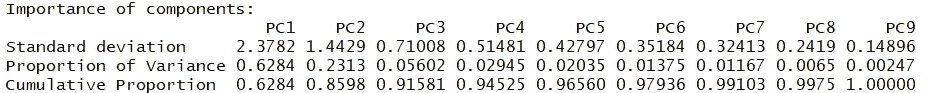
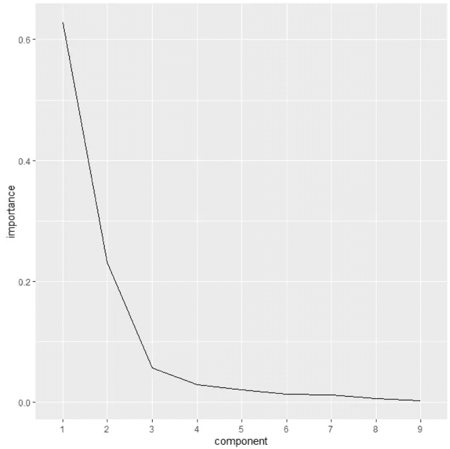
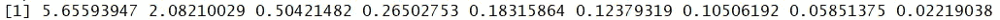
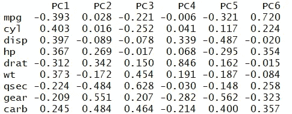
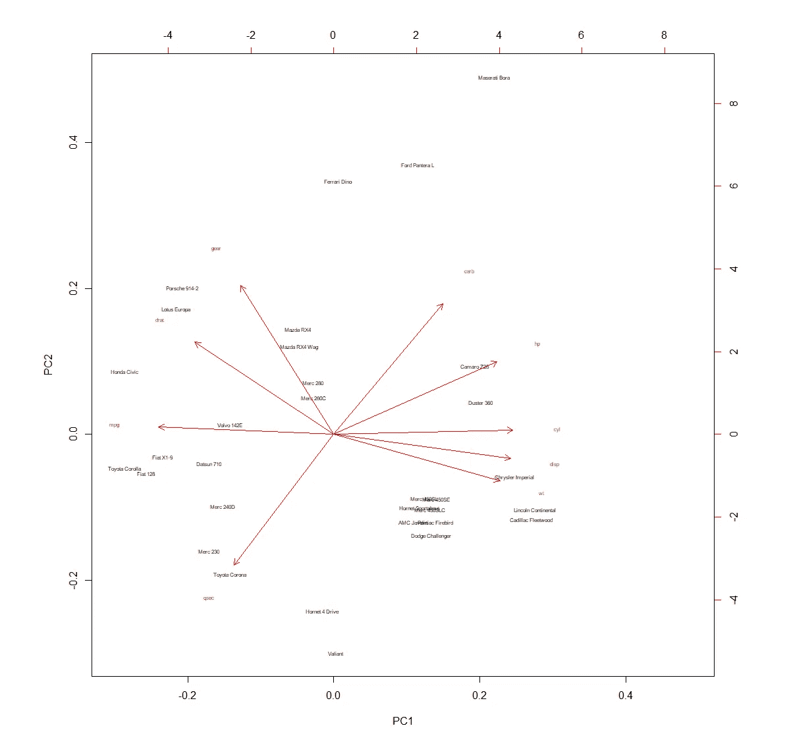
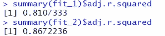

# 学习 R 中的主成分分析

> 原文：<https://towardsdatascience.com/learn-principle-component-analysis-in-r-ddba7c9b1064?source=collection_archive---------26----------------------->

图片来自 [Pixabay](https://pixabay.com/?utm_source=link-attribution&utm_medium=referral&utm_campaign=image&utm_content=1452987) 的 [Pavlofox](https://pixabay.com/users/Pavlofox-514753/?utm_source=link-attribution&utm_medium=referral&utm_campaign=image&utm_content=1452987)

# 使用 PCA 改进您的特征选择过程

PCA 是一种降维技术；这意味着您在建模过程中包含的每个额外变量都代表一个维度。

**它是做什么的？:**

就 PCA 实际做的事情而言，它采用高维度的数据集，并将其缩减为少数*不相关的*成分。需要考虑的是不相关组件的概念。如果我使用客户的收入(如果我碰巧有)&来预测他们的收入，那么我会添加一个额外的变量来表示他们的邮政编码中值收入，这两个变量很可能是相关的，下一个变量不太可能对我的模型准确预测收入的能力产生积极影响。

我刚才解释的想法是多重共线性。给定变量的一个预测因子可以由其他预测因子预测的想法。或者回到我刚才举的例子，实际收入可以通过他们所在地区的收入中值来预测；这两者可能是共线的。

**入门**:

**组件** **是如何确定的？**

确定每个分量是因为它占了最大的方差，并且根据所占方差的下一个最大部分来选择每个后续分量。因此，组件 1 将占最大的差异，组件 2 将占第二大的差异，以此类推。

**步骤:**

*   缩放数据集
*   创建 pca 对象— prcomp
*   打印特征值

首先，加载 R 数据集，mtcars

`data(mtcars)`

接下来，PCA 最适合处理数值数据，所以您需要过滤掉任何非数值的变量。在我们的例子中，我们将使用 dplyr select 函数删除变量`vs` & `am`。

`mtcars <- mtcars %>% select(- c(vs, am))`

让我们将更新的、只有数字数据的数据集放入 pca 函数中，`prcomp.`

`pca <- prcomp(mtcars, center = TRUE,scale. = TRUE)`

这里需要记住的是缩放。缩放的目的是标准化变量间的方差。为什么有人会关心你问？因为每个组成部分背后的想法是，它们尽可能多地解释了差异。没有这种缩放，您的高方差变量将在您的组件中被过度表示。

**现在，我们应该保留多少组件？？:**

在我们开始这一节之前，要记住的是，我们正试图减少我们的尺寸，因此最大限度地减少不必要的组件是理想的。

在决定保留多少组件时，我将给出三个主要考虑事项。

对于第一个跟随！

`summary(pca)`

我们在这里寻找的是`proportion of variance`。正如我们一直在谈论的，这个想法是围绕着解释变异；如果你继续下去，你会看到第一个组成部分，`PC1`占变异的 62.8%，`PC2`占 23%，以此类推。

有了这些信息，你就可以考虑用最少数量的组件来解释你需要多少差异。这可能是您决定第一个组件的 63%就足够了，它可能是 86%的前两个，或 91%的三个。

考虑这类问题的一个有用工具是碎石图。

你会看到在碎石图上，我在 x 轴上画出了分量，在 y 轴上画出了分量的重要性。我们在上面看到的是，在第二个组件之后，每个附加组件的增量影响会显著下降。虽然有人可能会认为第三个组件的影响非常重要，足以得出值得包含第三个组件的结论，但不太可能有人会认为应该添加更多组件。

你可能会做的下一个评估是所谓的凯泽-古特曼准则。这里的规则很简单；仅保留特征值大于 1 的组件。

如果你不知道如何立即得到特征值；跟我来一次快速旅行吧。要获得每个组件的特征值，您只需要从 pca 对象中找到每个组件的方差或标准差的平方——如下所示。

`pca$sdev ^ 2`

如前所述，您将消除任何特征值不大于 1 的变量。这背后的想法是，如果特征值小于 1，那么该组件比单个变量贡献的方差更小。

基于我们所使用的方法，很明显我们在这里的路线是只使用前两个组件

**了解您的组件:**

知道你的组件是由什么组成的很重要。换句话说，哪些变量对任何给定的分量有贡献？geom_hline(yintercept=20)了解组件由什么组成很重要。换句话说，哪些变量对任何给定的分量有贡献。

`print(pca$rotation)`

看着第一个组成部分的各种贡献，我可能会努力建议第一个组成部分在很大程度上代表了汽车的动力或性能，如汽缸、马力、重量和显示为最高。

另一个可以很容易看到不同变量分组的方法是双标图。

`pca %>% biplot(cex = .5)`

正如我之前提到的，你可以看到气缸、马力、显示和重量都分组在一起。

**使用线性回归将您的组件与原始变量进行比较:**

为了确定使用常规变量与主成分的潜在预测影响，让我们使用每组进行回归，并比较每个模型的 r 平方。

对于每次回归，我们将尝试使用`mtcars`数据集中的其他变量来预测 MPG。

我们现在将创建第一个模型，按原样预测所有变量。

`fit_1 <- lm(mpg ~ ., data = mtcars)`

现在让我们创建包含 mpg 和前两个组件的下一个数据集。

`components <- cbind(mpg = mtcars[, "mpg"], pca$x[, 1:2]) %>%
as.data.frame()`

现在，我们将使用这些组件训练第二个模型

`fit_2 <- lm(mpg ~ ., data = components)`

现在到了关键时刻，让我们比较一下每个模型的 r 平方！

`summary(fit_1)$adj.r.squared`

`summary(fit_2)$adj.r.squared`

正如你在上面看到的，当只使用两个组件时，模型的 r 平方有一个不那么小的变化。

**结论**

我希望这有所帮助！这里要记住的最后一点是，这里的唯一目的是在不损失太多预测能力的情况下进行简化。请随意查看我在 datasciencelessons.com 的其他帖子&祝数据科学快乐！