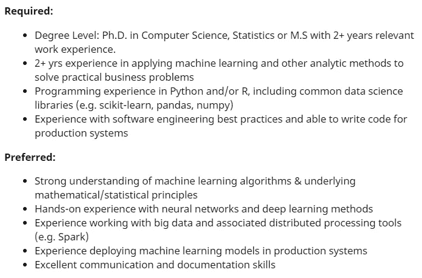

# 学习业务，成为伟大的数据科学家

> 原文：<https://towardsdatascience.com/learn-the-business-to-become-a-great-data-scientist-635fa6029fb6?source=collection_archive---------23----------------------->

## 意见

## 每个数据科学家的核心(抱歉，不是编码)

在 [Unsplash](https://unsplash.com?utm_source=medium&utm_medium=referral) 上[猎人赛跑](https://unsplash.com/@huntersrace?utm_source=medium&utm_medium=referral)的照片

许多有抱负的数据科学家认为，成为数据科学家需要具备以下条件:

*   编码
*   统计的
*   数学
*   机器学习
*   深度学习

和任何其他技术技能。

上面的列表是准确的；我上面列出了你现在需要的大部分数据科学家资格。这是不可避免的，因为现在许多工作列表总是把这些技能列为先决条件。只需看看下面的数据科学家工作要求和偏好示例。

取自 indeed.com

大多数需求听起来都是技术性的；学位、编码、数学和统计。虽然，有一个潜在的商业理解要求，你可能一开始从这个招聘广告中没有意识到。

如果你仔细观察，你会发现他们需要有应用分析方法解决实际商业问题经验的人。这意味着你的**日常任务将包括解决业务问题**，反过来，你需要了解公司经营什么样的业务以及流程本身是如何运作的。

你可能会问，“为什么我需要理解它？只要创建机器学习模型，问题就解决了，不是吗？”这种想法很危险，我会解释原因。

提醒一下，我认为**让你成为伟大的数据科学家**的不仅仅是你的**编码技能**有多好，或者你对**统计理论或者**业务理解的掌握程度**，**，而是多种因素的结合。

当然，任何人都可以同意或不同意我的观点，因为我相信没有特定的技能可以让你成为伟大的数据科学家。

> 数据科学家就业难。要进入这个领域并不容易。有很多申请人和拥有相似技能的人，你需要脱颖而出。商业理解是一种技能，它肯定会让你从池塘里的所有鱼中脱颖而出。

在我作为数据科学家的经历中，没有什么技能比业务理解技能更让我感到被低估了。我甚至以为，你不需要了解我早期职业生涯中的业务。我错了。

不过，我并不惭愧地承认，我起初并不认为业务方面是必不可少的，因为许多数据科学教育和书籍甚至没有教我们这方面的知识。

那么，为什么学习业务至关重要，以及它如何影响您作为数据科学家的就业？

想象一下这种情况。你在以糖果为主要产品的食品行业数据部工作，公司计划发布一款新的酸味糖果产品。然后，公司要求销售部门出售产品。现在，销售部门知道该公司有一个数据部门，并要求数据团队提供新的线索，他们可以在哪里销售酸糖果。

在任何人抱怨“这不是我们的工作，我们创造了一个机器学习模型！”或者“我是数据科学家，不在销售部门工作。”不，这恰恰是数据科学家在公司做的事情；许多项目是与另一个部门合作解决公司的问题。

回到我们的场景，那么如何正确处理这个问题呢？你可能会想，“只需创建一个机器学习模型来生成线索。”是的，这是在正确的轨道上，但你到底如何创建模型？依据是什么？使用机器学习模型解决商业问题是否可行？

你不能突然使用机器学习模型，对吗？这就是作为数据科学家，业务理解如此重要的原因。你需要更详细地了解糖果业。一直问这样的问题，

*   "**我们到底想解决什么样的业务问题？"**
*   **“我们甚至需要一个机器学习模型吗？”**
*   **“什么样的属性与糖果销售有关？”**
*   **“公司内外的糖果销售策略和实践如何？”**。

以及许多你能想到的与业务相关的业务问题。

了解你的公司经营什么样的业务以及与业务相关的一切非常重要，因为作为一名**数据科学家，你需要理解数据**。

虽然说商业理解技能是必不可少的很容易，但要获得这种技能并不容易。

教育是一回事；例如，与拥有生物学学位的人相比，如果你的教育背景是通信，你可能有更大的机会脱颖而出，申请公关公司的数据科学职位。

虽然工作经验很快就涵盖了这一点。在类似行业的另一个职位的工作经验将提供重要的杠杆作用，因为你已经了解业务流程。

对于一名新生来说，这可能是一个很难进入的行业，但事后看来，作为一名新生也有很多好处。我记得泰勒·福克曼在他的 [LinkedIn](https://www.linkedin.com/posts/tylerfolkman_datascience-machinelearning-ai-activity-6699689881012187136-bzJT) 上的帖子，为什么这个行业应该考虑应届毕业生，我同意。应届毕业生可以:

1.  有备而来
2.  渴望了解业务
3.  产生影响

新生应该成为那些已经建立了数据之旅的公司的目标。该公司可以更容易地教授许多商业方面的知识，因为大学新生在商业领域毫无经验。在我看来，永远不要把新生排除在外。

我也会告诉你我的经历。当我第一次获得数据项目时，我根本没有考虑业务，只是试图建立机器学习模型。结果是多么的灾难性。

我把模型呈现给相关方，脑子里在炒作。我的模型结果不错，对数据了如指掌，也知道自己用的模型的理论。很简单，对吧？所以，错了。原来用户并不在乎我用的型号。他们更感兴趣的是知道我是否已经考虑了业务方法“A ”,或者为什么我使用了与业务完全不相关的数据。最后讨论到我需要更多的商业培训。

这很尴尬，但我一点也不惭愧地承认，不考虑业务理解是我的错。我可能在模型创建或统计方面是最棒的，但不了解这个行业最终会成为一场灾难。从那天起，我试着学习更多关于业务流程本身的知识，甚至在考虑任何技术问题之前。

# 结论

在我看来，不管是不是大一新生，都要尽量去学业务。

专注于一个你觉得感兴趣的行业；金融、银行、信贷、汽车、糖果、石油等。每一项业务都有不同的方法和策略；你只需要专注于学习你喜欢的行业。

数据科学家就业难。进入这个领域并不容易。有许多申请人和许多拥有相似技能的人，**你需要脱颖而出。**商业理解无疑是将你与池塘中所有鱼区分开来的技能。

# 如果您喜欢我的内容，并希望获得更多关于数据或数据科学家日常生活的深入知识，请考虑在此订阅我的[简讯。](https://cornellius.substack.com/welcome)

> 如果您没有订阅为中等会员，请考虑通过[我的推荐](https://cornelliusyudhawijaya.medium.com/membership)订阅。