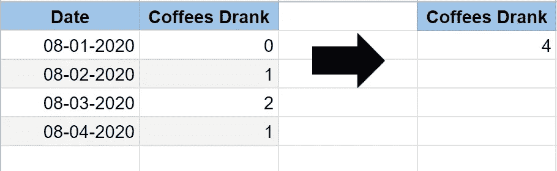

# 在强调编码语言或工具之前，先学习这 3 个基本的数据概念

> 原文：<https://towardsdatascience.com/learn-these-3-basic-data-concepts-before-stressing-about-coding-languages-or-tools-e599896e6d4?source=collection_archive---------2----------------------->

爱德华·豪厄尔在 [Unsplash](https://unsplash.com/s/photos/graph?utm_source=unsplash&utm_medium=referral&utm_content=creditCopyText) 上拍摄的照片

前几天我收到了一个 Instagram DM，这让我开始思考。这个人解释说，他们的职业是数据分析师，有多年的经验。但是，他们也说，他们觉得他们的技术能力略有欠缺，因为他们从未听说过我页面上提到的许多术语。这个人提到他们期待通过学习更多的技术工具(SQL、Python、R 等)来扩展他们的技能。)

当我思考如何进一步建议这个人的时候，我意识到这个人是实现他们期望的转变的最佳人选。为什么？他们已经掌握了数据技能和数据思维，这对于在数据领域取得成功至关重要。

我(和许多其他人)担心掌握现有的每一种技术工具或产品。我担心只拥有微软产品(SQL Server、Excel、Power BI)的经验，觉得自己需要拓宽视野，成为更好的数据分析师。我经常看到数据科学家在网上质疑和争论 Python 和 R 哪个更适合他们的工作。

但是，与我的 Instagram 新朋友交谈让我意识到，这些担忧和辩论非常愚蠢。工具和编程语言在不断发展变化，来来去去。但是你知道什么会留下来吗？核心概念。曾经构建的每一个工具或语言都会依赖于这些核心概念。

如果你知道如何获取一个数据集，操作它，并以一种提供真正洞察力的方式呈现它(或者至少引出更多你以前没有的问题…因为这种情况会发生！！)，你已经走上了成为某种数据专家的正确道路。

这种对数据的基本理解是如此强大。您可以理解这一点，并将其与您选择的任何技术工具相结合。然后，您可以对数据进行分组和筛选，以进行业务报告和 KPI 监控，进行统计测试以回答有关数据的问题，预测未来的数据，甚至生成 AI 模型以使用数据来帮助指导业务行动。你可以用包含数百万行的巨大数据集做所有这些事情！

好吧，我知道我在向你推销这个想法，所以让我开门见山吧。**如果你理解数据概念以及如何应用它们，你可以很容易地用你选择的任何技术工具或产品来实现这些概念。**

不过，别担心，我来这里不只是为了向你推销这个然后离开。我将从一个总体的角度谈论我作为数据分析师日常使用的 3 个基本数据技能。不涉及任何技术术语或代码。如果您开始掌握这些(以及其他)数据概念，那么掌握它们并将其应用于任何工具都很容易。我甚至在文章的结尾有一个严肃的生活帮，它将帮助你在任何你想掌握的工具中进一步运用你的新数据知识。跟着我，我抓住你了！

# #1.过滤数据

在数据世界中至关重要的第一个数据概念是过滤数据。老实说，过滤数据是一个超级简单的概念，也是我们人类每天都在做的事情。举这个例子。如果你要去吃麦当劳，你应该问问你的三个室友是否想要一些(因为你不想成为那个室友)。但是，在你去问你的室友是否想吃鸡块之前，你要记得你的三个室友中有两个甚至不喜欢麦当劳，所以你最后只问了一个。基本上你是基于某种“属性”从你的“数据集中”过滤掉了你的两个室友，这种属性就是他们是否喜欢麦当劳。

数据分析师或数据科学家过滤数据的方式完全相同。如果你正在对女性顾客进行分析，你将需要使用你所掌握的任何工具来过滤掉非女性顾客。如果您试图构建一个有助于为成年人推荐护肤产品的模型，您可能会希望过滤掉任何非成年患者的数据。

长话短说，过滤数据就是从你所有的数据集中去掉所有不需要的数据，直到剩下你分析所需的数据。

# #2.数据类型转换

另一个常用的数据技能是数据类型转换。数据类型是数据存储在电子表格、软件或数据库中时可以归入的特定类别。数据类型的一些常见示例有:

*   字符串(例如:“你好，这是一个字符串。”)
*   整数(例如:400)
*   小数(例如:400.17)
*   布尔值(例如:TRUE)

当我们处理数据集时，我们希望确保每个数据属性都存储为正确的数据类型。

我们不希望将整数 123 存储为字符串。如果我们将 123 存储为字符串，电子表格、软件或数据库将无法对其执行必要的操作。电脑会被弄糊涂的。如果我们告诉计算机我们有一个字符串(“123”)，但后来我们想把“123”加到某个东西上，计算机会说“等一下”。你教我“123”是一个字符串，基本上是一个单词。丫不能添话狂人！只能加数字！！！!"

抱歉，假设的计算机变得如此激进，但你明白了。为了确保我们能够在以后对数据执行适当的操作，我们希望绝对确保它被表示为正确的类型。

# #3.汇总数据

我现在想谈的最后一个概念是聚合数据。聚合数据是如此如此如此强大。聚合数据可以将您从一个由行和列数据组成的巨大文本文件中解放出来，并将其转化为一个更有意义、更悦目的汇总值或汇总表。

注意到我一直在说总结这个词吗？这可能是解释聚合的最佳方式，因为聚合接受多行数据，并将它们汇总到较少的行中。

照片由[SQLiteTutorial.Net](https://www.sqlitetutorial.net/sqlite-window-functions/)提供

如果您有一个数据集，其中包含需要相加的数字(如数量或销售额)，那么汇总这些数据的最简单方法之一就是求和。在下面的例子中，我取了一个包含我每天喝的咖啡量的数据集。我通过对其求和来对其应用聚合，这在右侧创建了我的数据的汇总视图。这个总结显示我总共喝了 4 杯咖啡(至少在这个数据集中)。

还有许多其他非常直观的聚合操作，即使对于数据世界的新手来说也是如此。这些操作中的每一个都回答了一些问题，这些问题告诉我们关于数据集的更多信息。其他简单聚合操作的一些示例如下:

*   数数(有多少条记录？)
*   最大(最大的观察是什么？)
*   最小(最小的观察值是多少？)
*   平均(我倾向于观察什么？)

# OK coooOooOol..那么下一步是什么？

我知道我之前答应过给你一个生活帮奖，所以别担心——我没有忘记。现在，您已经更牢固地掌握了数据专业人员工作流程中的一些最重要的步骤，您可以将它们应用于您选择的任何技术工具，即使您是一名新手。怎么会？和我们最好的朋友，我们的终极救世主，谷歌一起！

每当我想用某个工具来练习我的技能，并且我需要复习如何正确地执行它，我会以这种格式搜索:

> [插入技术工具]中的[插入数据技能]

我向你发誓，每当我用这种格式搜索时，我总能找到很棒的文档、博客帖子或其他资源(比如 Stack Overflow ),将我的想法引向解决方案。

那么，你觉得聚合数据有趣吗？你想提高你的 SQL 技能吗？然后，我建议回顾并着手:

> 在 SQL 中聚合数据

你基本上是一个在 Python 中过滤数据的专家，但是现在你想在 R 中尝试一下吗？试试我的生活帮和谷歌:

> 在 R 中过滤数据

听听这个在追求自己的数据职业梦想前几个月不知所措的女孩吧。先学概念。以后再担心技术问题。技术总是在发展，但基础却没有。

*原载于 2020 年 8 月 7 日*[*https://data dreamer . io*](https://datadreamer.io/2020/08/07/dont-fall-for-the-hype-learn-these-3-basic-data-concepts-before-stressing-about-programming-languages-or-tools/)*。*