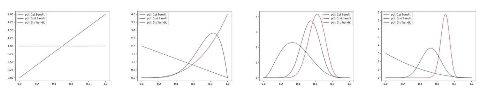
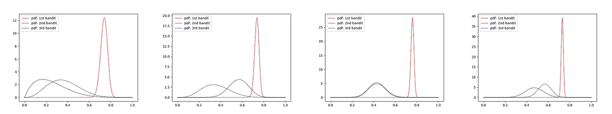

# 学会下注——使用贝叶斯决策

> 原文：<https://towardsdatascience.com/learn-to-bet-use-bayesian-bandits-for-decision-making-2e2e489087a5?source=collection_archive---------36----------------------->

## 贝叶斯思维如何影响我们在概率世界中的决策

我们生活在不确定性中，有时我们不得不在给定的几个选项中做出选择，而我们对这些选项都知之甚少。随着时间的推移，如果我们一次又一次面对同样的选择，我们可能会知道哪个选择会给我们最大的回报，哪个是第二好的，等等。一般来说，这可以说是人类的学习过程，由我们的目标引导，最大化总回报(或最小化总损失或遗憾)。


马库斯·斯皮斯克在 [Unsplash](https://unsplash.com?utm_source=medium&utm_medium=referral) 上的照片

此外，一些重要的业务应用程序也可以用这种方式建模。思考以下情况:

> (1)给定一堆股票代码，每一个都有不同的回报，你如何理性地选择一个能使你的回报最大化的代码？
> 
> (2)有三种网站登录页面设计可供您尝试，您会如何选择一种最大化您的指标(如转化率)的设计？
> 
> (3)假设您想要推广您的业务，并且有三个不同的广告场地，您将如何选择一个最符合您预算的场地？

这些现实的业务问题都可以方便地抽象为以下场景:

假设你有 N 个吃角子老虎机(或强盗)，每个都有自己的概率来给你奖励 r。你如何计算出随着时间的推移选择哪个吃角子老虎机，以便尽可能多地获得奖励？

**这种说法看似简单，但实际上，决策过程要复杂得多**,因为你要不断处理两难的选择，是坚持当前相对较好的选择，还是尝试其他可能更好的选择，即开发还是勘探。我们需要一个合理的框架来处理这种情况。


照片由[凯勒·琼斯](https://unsplash.com/@gcalebjones?utm_source=medium&utm_medium=referral)在 [Unsplash](https://unsplash.com?utm_source=medium&utm_medium=referral) 上拍摄

# 贝叶斯强盗

贝叶斯土匪提供了一个直观的解决问题的方法。一般来说，它遵循以下步骤:

1.  对每个强盗给予奖励的可能性进行初步猜测。用统计学的语言来说，这就是假设每个土匪的行为(给不给奖励)有一定的先验分布。由于我们试图模拟概率，一个方便的先验分布将是贝塔分布，它通常用于模拟 0 到 1 之间的随机变量。请注意，如果您对强盗行为的潜在分布一无所知，您的理性猜测将是平等对待每个强盗，即假设均匀分布，这是 beta 分布的特例。
2.  **从每一个土匪**身上抽取一个样本，根据其目前的分布情况。
3.  **关注样本最高的土匪**；通过选择来决定你获得的奖励(后悔)的数量，并**相应地更新强盗的分布。**在统计学的语言中，你有一个随机变量的特定参数的先验分布，现在你有了随机变量的值的新观察，你能够更新你关于随机变量的先验信念，通过应用贝叶斯规则得出后验分布；最终结果是有一组新的分布参数来解释新的观察结果:

> 先前分配:P(A)
> 
> 新观察:x
> 
> 后验分布:P(A|x) ~ P(x|A)*P(A)
> 
> 即**后验分布与似然*先验分布**成正比

4.回到步骤 2 并重复。


照片由[Tine ivani](https://unsplash.com/@tine999?utm_source=medium&utm_medium=referral)在 [Unsplash](https://unsplash.com?utm_source=medium&utm_medium=referral) 上拍摄

# 模拟

让我们看一个带有一些代码的具体例子。

首先，让我们导入必要的包:

```
import numpy as npfrom scipy.stats import betaimport matplotlib.pyplot as plt
```

让我们定义我们的强盗；这些数字表示各自的强盗提供奖励的概率，你可以随意修改这些数字并运行不同的模拟:

```
bandits = np.array([0.75, 0.5, 0.6])
```

随着基础知识的清除，现在下面的函数说明了贝叶斯强盗的核心:

```
def experiment(accumulated_rewards_per_bandit, times_chosen_per_bandit, bandits, num_draws=1):

    for _ in range(num_draws):
        bandit_chosen =    np.argmax(np.random.beta(1+accumulated_rewards_per_bandit, 1+times_chosen_per_bandit-accumulated_rewards_per_bandit)) reward = get_reward_from_bandit_i(bandits, bandit_chosen)

        accumulated_rewards_per_bandit[bandit_chosen] += reward times_chosen_per_bandit[bandit_chosen] += 1 a = 1+accumulated_rewards_per_bandit
    b = 1+times_chosen_per_bandit-accumulated_rewards_per_bandit
    return a, b
```

让我们一行一行地分解这个函数。首先，让我们指定输入参数:

> 每个强盗累积的奖励:在一个实验中，每个强盗累积的总奖励，它的大小等于强盗的数量。
> 
> times _ chosen _ per _ bandit:在一个实验中，每个强盗被选中的次数，其大小等于强盗的数量。
> 
> 强盗:我们各种奖励概率的强盗。
> 
> num_draws:一个实验中的试验次数

回想一下，从根本上说，我们的目标是更好地了解不同强盗的回报概率，这意味着我们试图获得对基础分布越来越准确的估计，在我们的情况下，这些分布都是贝塔分布。

请注意，beta 分布由两个参数 **a** 和 **b，**唯一定义，在我们的示例中，这两个参数分别代表强盗获得奖励的尝试次数(在我们的示例中等于累积奖励)和强盗未获得奖励的尝试次数。

**因此，我们的目标是在试验中保持这两个量的精确记录。**

现在应该清楚我们在上面的函数中试图实现什么了。循环查看试验次数，我们首先找出给出最大样本的强盗，然后通过在下面的行中选择这个强盗来确定我们是否得到任何奖励:

```
reward = get_reward_from_bandit_i(bandits, bandit_chosen)
```

这里我使用下面的简单实现来确定奖励:

```
def get_reward_from_bandit_i(bandits, i):
    return np.random.rand() < bandits[i]
```

您可以看到这个实现导致奖励为 1 或 0。在实践中，你可能想设计自己的奖励机制来反映你的问题的性质。

在获得奖励(或不获得)后，我们可以更新累积的奖励和为我们的采样 bandit 选择的时间，这将在下一次迭代中作为更新的 beta 分布参数 a 和 b。

最后，在循环所有试验之后，我们获得完全更新的分布参数并返回它们。

现在，我们已经配备了贝叶斯强盗的核心组件，让我们使用下面的代码片段开始运行模拟:

```
if __name__ == "__main__":
    bandits = np.array([0.75, 0.5, 0.6]) num_draws_per_experiment = [300] accumulated_rewards_per_bandit = np.zeros(bandits.size) times_chosen_per_bandit = np.zeros(bandits.size) for i in num_draws_per_experiment:
        a, b = experiment(accumulated_rewards_per_bandit, times_chosen_per_bandit, bandits, i)
```

# 结果

似乎我们需要一种方法来确定我们做得有多好。在本文中，让我们尝试绘制每组 beta 分布参数的概率密度函数，看看它们是否显示出任何可辨别的模式。

让我们发挥这一功能:

```
def plot_beta(x_range, a, b, filename):
    x = x_range
    y0 = beta.pdf(x, a[0], b[0])
    y1 = beta.pdf(x, a[1], b[1])
    y2 = beta.pdf(x, a[2], b[2]) plt.plot(x, y0, color='red', lw=2, ls='-', alpha=0.5, label='pdf: 1st bandit')
    plt.plot(x, y1, color='green', lw=2, ls='-', alpha=0.5, label='pdf: 2nd bandit')
    plt.plot(x, y2, color='blue', lw=2, ls='-', alpha=0.5, label='pdf: 3rd bandit') plt.legend() plt.savefig(filename)
```

对不同数量的试验运行绘图功能，我们得到以下 pdf 图:



每个强盗的 pdf 图，试验次数=1，10，50，100



每个强盗的 pdf 图，试验次数=200，500，1000，2000

请注意，第一个强盗(红色)的回报概率最高，为 0.75，在 100 次尝试后，随着其 beta 分布的形状缩小并在真实值的 0.75 附近达到峰值，它逐渐胜出，而其他两个强盗的分布形状仍然相对平坦且分布广泛，这暗示了不确定性。

尽管通过足够多的试验，每个强盗的分布将趋向于在奖励概率的真实值附近达到峰值，但在这个问题中，我们更感兴趣的是找到最好的强盗，而不是精确地推断隐藏的奖励概率。可以对我们的模拟进行一些改进:例如，可以将学习率(> 1 或< 1)应用于累积奖励的更新，以微调我们是倾向于保持当前的好选项还是更多地探索其他选项。

在后续文章中，我将展示贝叶斯土匪如何帮助构建股票的动态投资组合，这可以被建模为具有随时间变化的潜在回报概率的土匪。因此，请关注我，继续关注更多内容。