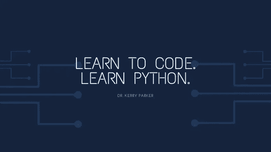

# 学习编码。学习 Python。

> 原文：<https://towardsdatascience.com/learn-to-code-learn-python-efb037b248e8?source=collection_archive---------49----------------------->

你想学习编码但是不知道从哪里开始吗？你来对地方了。我将向您介绍学习 Python 的原因，以帮助您决定它是否适合您，并提供一个资源列表来学习基础知识，设置您的环境，找到项目开始，以及在您的编码之旅中可以去哪里获得帮助和支持。

# **为什么要学 Python？**

Python 是一种多功能的编程语言，可以用于软件开发、数据分析、机器学习甚至 web 开发！如果你想给机器人编程，从事数据科学职业或者做漂亮的可视化，学习 python 是一个很好的起点！

如果这是您第一次学习编码，那么语法(语句的结构)与英语相似，需要更少的代码行，一旦您基本掌握了逻辑、语法和结构，就可以很容易地应用于其他编程语言。

然而，如果你更专注于 web 或应用程序开发，你可能会考虑其他编程语言。学习编码时，HTML、CSS 和 JavaScript 也是很好的起点。不过，不要停止阅读，下面的许多资源和技巧都与任何新开发人员相关！

# **资源**

根据你的学习风格，有不同类型的课程可供你选择。有带代码示例的书面教程、带交互式编码问题的短视频、现场编码视频或简单的教科书。我在这个列表中包括了一系列的资源，这样你可以尝试一下，决定哪种学习方式最适合你。

## **免费学习编码**

**1。FreeCodeCamp**

FreeCodeCamp 是一个学习编程的专用社区平台。他们有课程、教程、视频和文章来帮助您入门，并涵盖许多不同的编程语言。他们网站上的[课程](http://freecodecamp.org/learn)主要集中在 web 开发上，如果你想学习 HTML、CSS 和 JavaScript，这是一个很好的起点！
对于 python，他们已经编写了一个[参考资料综合指南](https://www.freecodecamp.org/news/best-python-tutorial/)，以及一个 [YouTube 课程](https://www.youtube.com/watch?v=rfscVS0vtbw)。

**编程语言:** Python、HTML、CSS、JavaScript + more
**级别:**初级、中级、高级
**内容类型:**文章、视频、互动教程

**2。HiPy**

[HiPy](http://hipy.uk) 是一个开放的社区，致力于向任何人介绍 Python 编码。他们在利物浦定期举办活动，并有一系列初学者友好的[笔记本](https://github.com/HiPyLiv/HiPyProject)，你可以通过它来工作，还有一个[Python 入门课程](https://colab.research.google.com/drive/1XpiY4CrM1bH521VNWouqx-M52QBa8XQS)，涵盖如何开始。他们还有一个 [YouTube](https://www.youtube.com/channel/UCwx8lBs4yUPBNvyq_VQcwJg) 频道，最近还播放了现场编码活动，绝对值得一看！

**编程语言:** Python
**级别:**初级、中级、高级
**类型:**教程、视频、事件

3. **EdX 课程**

EdX 有一系列 [python 课程](https://www.edx.org/learn/python)可供选择。这些课程可以免费完成，也可以选择付费获得证书。这些课程通常由公司或大学开办，你可能需要探索找到适合你的课程。我发现这些课程时好时坏。

查看这个[微软课程](https://www.edx.org/course/introduction-to-python-absolute-beginner-2)为绝对初学者介绍 Python！

**编程语言:** Python、HTML、CSS、JavaScript +更多
**级别:**初级、
高级、**类型:**课程

**4。Coursera**

与 EdX 类似， [Coursera](https://www.coursera.org/) 有一系列不同的免费课程，需要付费才能获得认证。

如果你在寻找机器学习的介绍，我去年完成了[吴恩达的机器学习](https://www.coursera.org/learn/machine-learning)课程，强烈推荐你去看看！它提供了一个广泛的概述，包括每周作业和课程中的问题。我真的很喜欢这种教学风格，作业很有趣，也很有挑战性！我唯一的警告是，作业使用了一种叫做 Octave 的编程语言，这种语言有时会有点尴尬——课程中有 Octave 的介绍，但是如果你是编程新手，你可能会发现有时会有点棘手！

**编程语言:** Python、HTML、CSS、JavaScript +更多
**级别:**初级、中级、高级
**类型:**课程

**5。Kaggle 微课**

[Kaggle](http://kaggle.com/) 是一个举办竞赛和数据挑战的数据科学平台。它还提供微型课程，包括对 python 的[介绍](https://www.kaggle.com/learn/python)，以及带有包括 python 和数据科学概念的现场编码演示的 [YouTube 频道](https://www.youtube.com/user/kaggledotcom)。一旦你掌握了基础知识和数据科学的基础，你就可以加入社区，在运动场比赛中练习你的技能，例如[泰坦尼克号](https://www.kaggle.com/c/titanic)挑战赛，或者探索 [Kaggle 数据集](https://www.kaggle.com/datasets)用于你自己的项目。

**编程语言:**Python
级别:中级、
高级、**类型:**教程、视频

6。w3 学校

W3Schools 是一个学习 web 技术的网站，包含代码示例和 Python、HTML、CSS 和 JavaScript 的交互式教程。我经常回头查阅 w3 的文档和详细的解释，包括如何使用这个函数或包的例子。

**编程语言:** Python、HTML、CSS、JavaScript +更多
**级别:**初学者
**类型:**文档、教程

**7。Udemy**

[Udemy](http://udemy.com) 提供超过 100，000 门在线课程，主题广泛，语言多样。不同的教师提供了大量的 python 课程，但是您可以通过仅指定免费课程并选择您要寻找的级别和主题来缩小范围。如果你和某个老师很熟，并且喜欢他们的教学风格，我建议你利用上面的资源学习基础知识，并使用 Udemy 深入某个特定的主题。

> 注意: Udemy 也包含付费课程，但它们经常打折，价格大幅降低，所以最好等这些！

**编程语言:** Python、HTML、CSS、JavaScript +更多
**级别:**初级、中级、高级
**类型:**课程

**8。用 Python 自动化枯燥的东西**

如果你喜欢书，那么 [*用 Python 自动化枯燥的东西*](https://automatetheboringstuff.com/) 是一个很好的起点，内容也可以在网上找到。它提供了关于如何开始的实际例子，以及你可以在每章末尾完成的项目例子。

**编程语言:** Python
**级别:**初学者，中级
**类型:**书

9。用于数据科学的 python

如果您已经掌握了基础知识，并且正在寻求探索 Python 与数据科学的关系， [Python for Data Science](https://jakevdp.github.io/PythonDataScienceHandbook/) 是一个有价值的资源，同样可以在网上免费获得，尽管从书架上拿一份副本也很方便！

**编程语言:**Python
级别:中级、
高级、**类型:**书

## **付费资源**

还有一些资源为他们的学习平台提供订阅

**1。365 数据科学**

[365DataScience](https://365datascience.com/) 是一个数据科学学习平台，初期免费提供课程材料样本。我个人没有使用过这一资源，但它们涵盖了数据科学中的一系列主题，并有一个免费层，让您在承诺订阅之前体验一下。

**编程语言:** Python，SQL
级别:中级，
高级，**类型:**互动教程

**2。使用 Codecademy 学习基础知识**

Codecademy 需要订阅才能访问全部课程内容，并提供不同编程语言的入门和高级课程。随着时间的推移，免费访问的内容发生了显著变化。虽然这是我第一次学习 Python 时的首选资源，因为我喜欢课程的互动风格，但现在有了这个平台，你可以中途通过一个章节，除非你注册，否则无法前进。

**编程语言:** Python、HTML、CSS、JavaScript +更多
**级别:**初级、中级
**类型:**互动教程

**3。数据请求**

如果您已经熟悉 Python 的基础知识，并且希望将您的知识应用到数据科学的概念中，请查看 [DataQuest](https://www.dataquest.io/directory/) 。像前两个平台一样，DataQuest 也需要订阅，但他们提供免费试用，所以如果你有兴趣，就试试吧！

**编程语言:** Python，SQL，R
级别:中级，
高级，**类型:**互动教程

# **故障排除**

学习编码时最难的部分之一是当你陷入困境时，试图找出要搜索的内容。你练习得越多，这就越容易！这里有几个常见的地方，你可能会找到你正在寻找的答案:

**1。堆栈溢出**

当搜索一个编程问题时，排名靠前的结果通常来自 [StackOverflow](https://stackoverflow.com/) 。Stackoverflow 是一个开放的社区，人们可以在这里提问，其他开发人员也可以提供帮助。很有可能，你遇到的问题，别人已经在 StackOverflow 上问过了，可能的解决方案正等着你呢！

**2。开发到**

DEV 是一个软件开发人员的社区，他们聚在一起互相帮助。除了开发社区共享的播客和视频之外，该平台还通过文章、教程和讨论支持协作和网络化学习！如果您注册了，您也可以与社区分享您的编码之旅和您学到的东西，并结识其他学习编码的人！

**3。中等**

[Medium](https://medium.com/) 有一系列致力于学习编码的出版物。TowardsDataScience 有许多关于数据科学和 Python 的文章和教程，BetterProgramming 和 HackerNoon 也有关于编程的内容，你也可以找到公司博客，如网飞技术博客，他们分享技术文章和教程。

**4。数据科学堆栈交换**

与 StackOverflow 类似，[数据科学 Stack Exchange](https://datascience.stackexchange.com/) 是一个提出技术问题的论坛，这次专门针对数据科学和机器学习。在对 Python 问题进行故障排除时，该资源经常出现在搜索结果的顶部，并且是另一个社区可能已经有了您正在寻找的答案的站点！

**5。推特**

Twitter 上有一个庞大的技术社区。许多人加入了 [#100DaysOfCode](https://www.100daysofcode.com/) ，承诺在 100 天的过程中每天都发推特，分享他们学到的东西，并在他们的旅程中支持其他人。如果你遇到了困难，你也可以联系这个社区，有人可能会回答你的问题或者给你指出一些可以帮助你的东西。

**6。加入 Python 社区**

还有在世界各地举办聚会和代码之夜的全球网络。也有许多 meetup 团体专注于举办技术讲座、教程和活动——查看 [Meetup](https://www.meetup.com/) 或 [Eventbrite](http://eventbrite.com/) 了解您当地的活动。同样值得考虑的是有空闲频道的在线社区和小组、电报小组或虚拟聚会，在那里你可以加入学习、分享和交流。

# **安装您的 Python 环境**

到目前为止，您已经阅读了大量的资源，接下来，让我们在您的机器上安装 Python！

安装 Python 时有几种不同的选项，这取决于您使用的操作系统以及您希望如何设置。对于新程序员，我推荐安装 Anaconda ,它上手很快，适用于 Windows、MacOS 和 Linux。

## **Python 2 还是 Python 3？**

对 Python 2 的支持于 2020 年 1 月 1 日停止。你可能仍然会发现用 Python 2 编写的软件，但是如果可能的话，我建议安装/升级到 Python 3！

## **什么是蟒蛇？**

Anaconda 是 Python 和 r 的开源发行版，这意味着它安装了您需要开始使用的所有必要软件和软件包。它包括:

*   **Python** 和 **R** 编程语言
*   预装 python **包**
*   `**conda**`，一个 python 包管理器，可以让你轻松安装和更新 python 包。你可能还会看到提到的`pip`，`conda`是`pip`的替代物。
*   **Spyder** 是一个集成开发环境(简称 IDE)，除了测试、调试和检查程序的工具和许多使编程更容易的功能，包括自动完成，它还包括一个文本编辑器——想想微软的 Word，但用于编写代码！
*   *(可选但推荐)* **PyCharm** 是另一个 IDE，安装时会提示你是否想和 Anaconda 一起安装。我建议这样做！比起 Spyder，我更喜欢 PyCharm，因为它更容易导航和开始使用。
*   **Jupyter Lab/Jupyter 笔记本**也可以通过 Anaconda Navigator 安装。这些工具允许你在文本或可视化的同时编写代码，在演示项目或浏览教程时会很有用。

如果您已经有了上面没有包括的首选 IDE，比如 Sublime 或 Visual Studio 代码，请查看 Anaconda [文档](https://docs.anaconda.com/anaconda/user-guide/getting-started/#links-to-ide-documentation)以了解如何在 IDE 中选择 Anaconda Python 作为您的 Python 解释器。

## 浏览器中的 Python

你也可以通过使用[小饰品](https://trinket.io/features/python3)在你的浏览器中访问 Python，如果你想保存你的代码，你也可以在那里设置一个账户。

## 安装 Python 的其他方法

如果您不想使用 Anaconda，您可以从 [Python 软件基金会](http://python.org)下载并安装 Python。
如果你使用的是 Linux 或 MacOS，你可能已经预装了 Python，但这可能不是 Python 3。如需更多安装选项，请遵循 RealPython.com 上的说明。

# **下一步是什么？**

那么您已经安装了 python，了解了基础知识，并准备好开始一个项目了！

下面列出了一些可能的项目和挑战，希望能给你一些启发:

**1。代码战争**

CodeWars 有许多编码招式或挑战，在这里你可以测试你的 python 技能，并竞争解决从初学者到难以置信的高级的问题！

**2。欧拉项目**

感觉像一个新的挑战？为什么不尝试使用 python 解决前 100 个欧拉项目问题呢？你可以在 Twitter 上关注 [#ProjectEuler100](https://twitter.com/search?q=%23ProjectEuler100) ，加入社区解决挑战！我在 2020 年初开始挑战，目标是在年底前完成所有 100 个目标…进入今年的第 5 个月，我远远落后于目标！

**3。开始一个项目**

查看 [Medium](https://medium.com/) 和 [DEV.to](http://dev.to/) 的教程，你可以跟随它开始你的第一个项目，或者如果你正在寻找一个数据科学挑战，查看 Kaggle 上的[Titanic Machine Learning](https://www.kaggle.com/c/titanic)challenge。

请关注我的下一篇文章，我将通过一个项目，探索数据集，创建可视化，并为您提供继续编码之旅的技能和工具。

感谢您的阅读！如果你喜欢我的文章，那么[订阅](https://kaparker.substack.com/)我的每月简讯，在那里你可以将我的最新文章和顶级资源直接发送到你的收件箱！

您可以在 [Medium](https://medium.com/@_kaparker) 上关注我以获取更多文章，在 [Twitter](https://twitter.com/_kaparker) 上关注我，或者在我的[网站](http://kaparker.com/)上了解更多我正在做的事情。