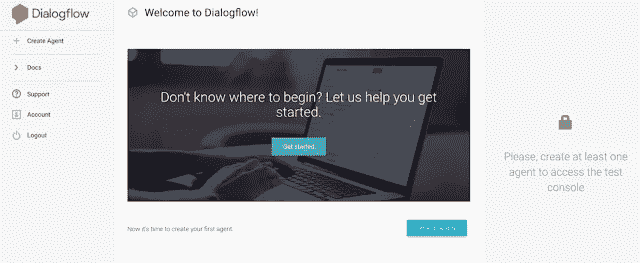
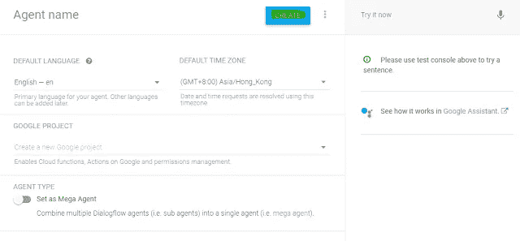
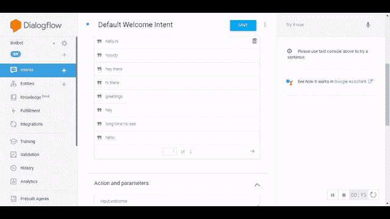
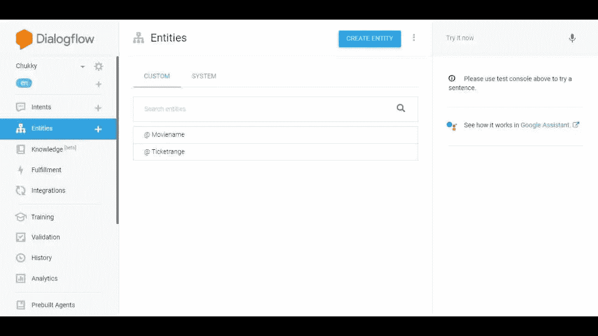
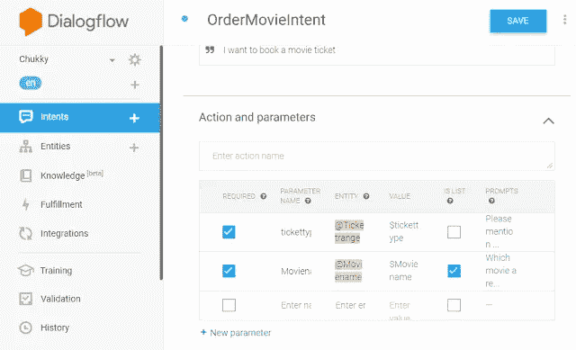
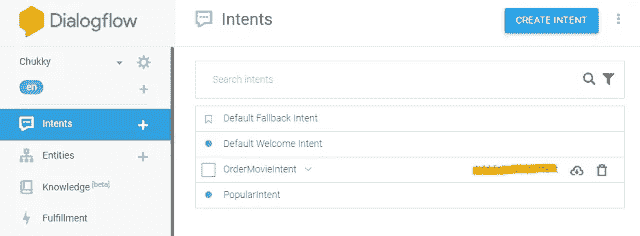
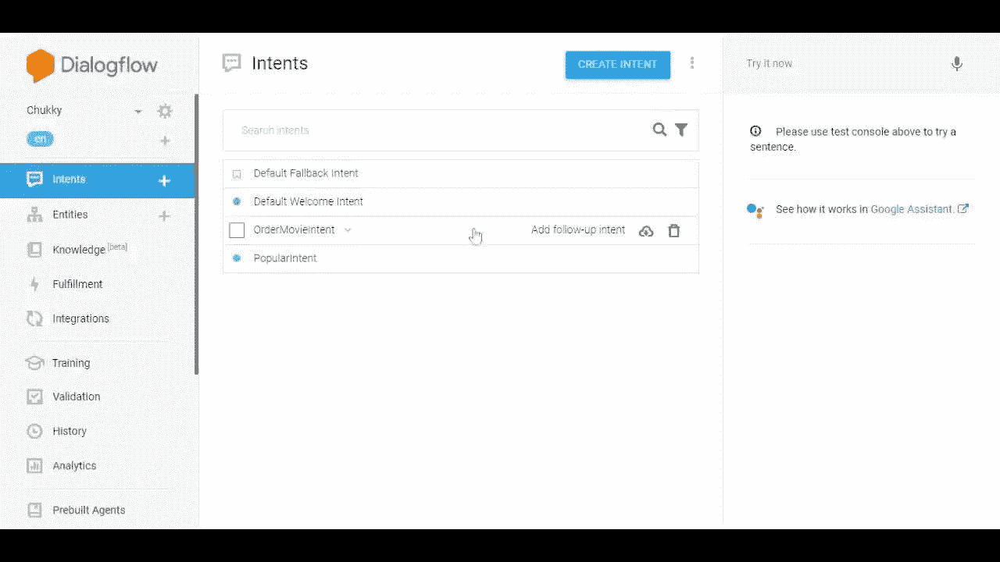

# 学会在 5 分钟内创建一个聊天机器人:谷歌的对话流

> 原文：<https://towardsdatascience.com/learn-to-create-a-chatbot-in-5-minutes-googles-dialogflow-4064b4fa336a?source=collection_archive---------23----------------------->

在我看到 Google 的 DialogFlow 之前，我从未意识到构建一个聊天机器人会如此简单。这就像巫师有一根魔杖，聊天机器人不知从哪里冒出来一根鞭子。不管怎样，让我们为自己是这里的巫师而自豪，我们的魔杖就是对话流。

由[卢卡斯·佛罗伦廷](https://unsplash.com/@flucas?utm_source=unsplash&utm_medium=referral&utm_content=creditCopyText)在 [Unsplash](https://unsplash.com/s/photos/wand-cartoon?utm_source=unsplash&utm_medium=referral&utm_content=creditCopyText) 上拍摄的照片

# **对话框流中的组件**

现在让我们进入构建模块，这些模块必须被安排以获得一个功能性的机器人。

**代理:**代理可以实现为客户支持超级明星，直接与用户打交道，以获得令人敬畏的体验。类似地，在 DialogFlow 中，我们的聊天机器人在高层被称为代理。

**意图:**代理通过意图和意图连接到用户，一般来说，对用户试图做出的对话请求进行分类。例如，如果一个用户想要查看他的帐户详细信息，那么该请求将被定向到 *AccountenquiryIntent。*因此，意图是将问题类型重定向到特定类别的守门人

**实体:**实体处理数据提取部分。它们有助于识别特定的关键词，这些关键词对于引导回复的特定意图至关重要

**语境:**语境就像自然语言理解在哪里回应当前的对话我们需要获取之前对话的语境。因此，它们有助于将每个对话块连接在一起，以便聊天机器人的回复有意义

满足感:这是谈话的支柱。它使用 API 连接到后端数据库，以存储对话或检索数据库的信息

**集成:**这些是可以连接到 dialogflow 的外部应用程序，这样我们的聊天机器人就可以在外部世界茁壮成长。一些应用程序包括，slack，脸书信使，Twilio，Telegram

# **让我们深入:做部分**

现在让我们通过实际实现一些很酷的东西来弄脏我们的手

为了访问 Dialogflow，我们需要一个 Google 帐户。所以一定要有一个，并使用[链接](https://dialogflow.cloud.google.com/#/login)进入对话流页面和*登录谷歌*。接受谷歌的*条款和条件*并设置您的国家。你将被带到对话流控制台

图 1:对话流控制台。作者提供的图片来源

# 1.创建代理:

第一步是创建一个代理，这就是我们实际的聊天机器人。因此，点击页面左上角的**创建代理**按钮或中间的按钮。给你的聊天机器人起个名字，设置语言和它工作的时区。完成后，点击**创建**。

图 2:代理设置页面。作者提供的图片来源

# 2.设置意图:

在屏幕的左上角，我们可能会找到一个名为 **Intent 的选项卡。**默认情况下，DialogFlow 为我们提供默认的回退意图和欢迎消息意图。如果您点击任何一个意向，您可能会发现:

*   **训练短语:**这些是用户在与聊天机器人交互时可能提供的合适对话。我们不需要提供所有可能的对话，相反，我们只提供几个样本。对话流后端的机器学习算法将使用所有合适的短语进行训练
*   **响应:**这些是聊天机器人在识别合适的训练对话之一时提供的响应。如果聊天机器人不能识别输入对话，则向用户给出回退问题，以提供更清晰的输入信息

这是一个屏幕截图，显示了培训短语和回答，以及测试对话

图 3: Bot 训练和响应。作者提供的图片来源

# 3.自定义意图:

要创建自定义意图，请单击创建意图。例如，如果我们计划创建一个帮助预订电影票的聊天机器人，我们可以创建一个名为*ordermovieinent 的自定义意图。*在*训练短语*中，您可以设置接受屏幕类型和电影名称的对话，并相应地创建响应

# 4.实体:

实体帮助提取数据的特定部分，以便聊天机器人做出相应的响应。例如，如果对话中有*我想今天订票，*，系统会自动将*今天*理解为*日期时间字段*，并帮助聊天机器人做出响应。我们也可以创建自定义实体。在电影票预订示例中，我们可以创建 *tickettype、Moviename* 等。作为自定义实体。要创建它，单击左上角选项卡上的实体，并给实体命名。指定变量和同义词。这里有一个例子

图 4:实体设置页面。作者提供的图片来源

# 5.在意图中使用自定义实体:

我们可以将实体创建为对话中的强制部分，以便用户向机器人提供所有需要的信息。为此，打开已经创建的*意图*，在*动作和参数*部分添加创建的实体名称和回退响应(如果用户没有提供)。

图 5:意向设置页面。作者提供的图片来源

一旦它被添加，包括一些训练阶段的例子，包括添加的实体，并点击*保存*，后面的 ML 模型将训练所有可能的组合

# 6.背景:

在每一次谈话中，谈话的背景都很重要。这意味着，如果机器人必须迅速回答问题，它应该理解用户以前回答过什么。为了创建这种对话流，我们可以将 sub *Intent* 添加到已经存在的 Intent 中。

为此，转到*意向*页面，点击**添加跟进意向**

图 6:跟进意向设置页面。作者提供的图片来源

选择建立对话所需的意图，例如，如果用户肯定回答，我们可以使用 *Yes* 跟进意图，这可能会提示他们在电影预订机器人的情况下提供联系方式/其他详细信息。一些流行的跟进意图包括

图 7:流行的跟进意图。作者提供的图片来源

# 7.履行:

来自用户的响应可以存储到后端使用履行功能的数据库。默认情况下，DialogFlow 为连接到后端提供了两个 API 选项— 1。Webhook 2。内嵌编辑器。“履行”选项卡位于屏幕的左侧

# 8.集成:

我们可以将我们的聊天机器人与多个可用的外部应用程序集成，如脸书信使、Slack、Twilio、我们自己的网站和许多其他地方。为此，我们只需进入集成，打开我们想要集成的应用程序。

荣誉🙌您已经创建了功能齐全的聊天机器人。DialogFlow 提供了许多更高级的功能，可以很好地进行试验:)

再见！祝学习愉快