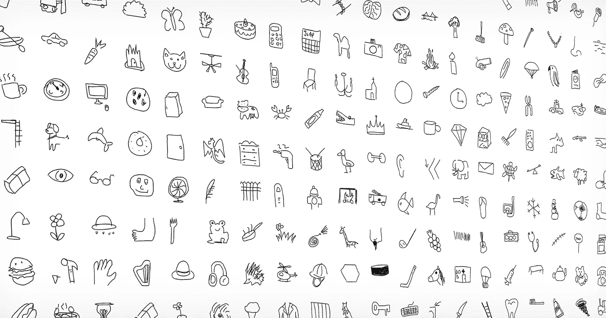
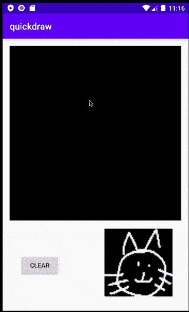
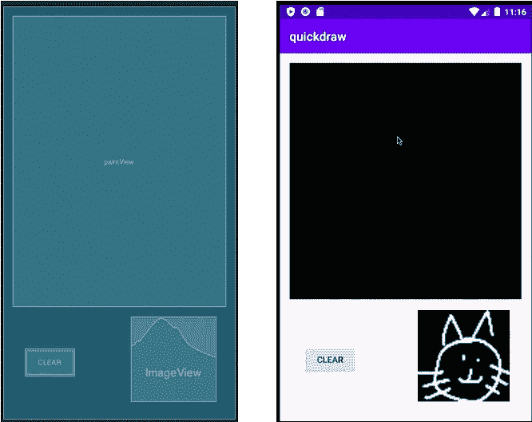
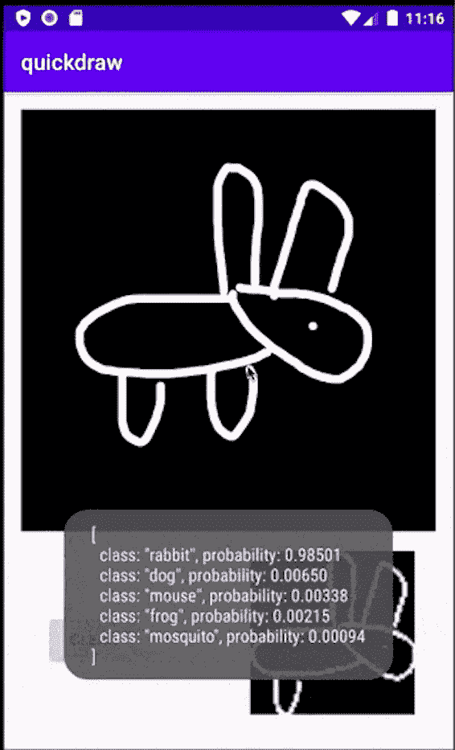
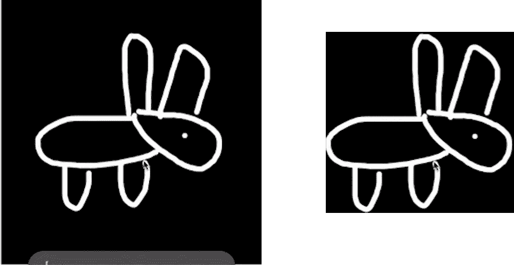

# 学习在 Android 上创建一个涂鸦游戏

> 原文：<https://towardsdatascience.com/learn-to-create-a-doodle-draw-game-on-android-f713e64408a7?source=collection_archive---------43----------------------->

## 使用 PyTorch 和深度 Java 库



QuickDraw 数据集(来源[https://github . com/Google creative lab/quick draw-Dataset/blob/master/preview . jpg](https://github.com/googlecreativelab/quickdraw-dataset/blob/master/preview.jpg))

# 介绍

涂鸦绘画游戏的目标是以最快的速度创作出一幅特定物品的图画，比如一所房子或一只猫。虽然绘画部分很简单，但在深度学习出现之前，计算机不可能准确猜测你画了什么。与照片不同，绘画也有艺术家特有的创作风格，这使得它们特别难以理解。你可以在这里看到任何涂鸦绘画游戏[的例子。

随着多年来计算能力的稳步增长，现在已经可以在手机操作系统(如 Android)上运行边缘/物联网设备上的机器学习(ML)任务。然而，Android 运行在 Java 上，而大多数深度学习框架，如 TensorFlow 和 PyTorch，都是为 Python 设计的。为了解决这个挑战，我们需要一种在 Java 中构建深度学习模型的方法。Deep Java Library (DJL)是一个新的开源深度学习框架，由 AWS 构建，可以轻松地用 Java 进行深度学习。](https://djl.ai/website/demo.html#doodle)



Android 上的涂鸦应用程序(图片由作者提供)

在本教程中，我们将介绍在 Android 上部署 PyTorch 涂鸦识别模型的主要步骤。因为代码库相对较大，所以我们将涵盖您需要理解的最重要的部分，以便模型能够正确工作。你可以访问我们的[示例项目](https://github.com/aws-samples/djl-demo/tree/master/android)开始制作。

# 设置

这个项目需要 Android API 26+来使用大多数 DJL 功能。您可以查看我们的[示例项目设置](https://github.com/aws-samples/djl-demo/tree/master/android)以节省一些时间。下面的代码块列出了此项目所需的依赖项:

```
dependencies {
    implementation 'androidx.appcompat:appcompat:1.2.0'
    implementation 'ai.djl:api:0.7.0'
    implementation 'ai.djl.android:core:0.7.0'
    runtimeOnly 'ai.djl.pytorch:pytorch-engine:0.7.0'
    runtimeOnly 'ai.djl.android:pytorch-native:0.7.0'
}
```

您将使用 DJL 提供的 API 和 PyTorch 包。

# 步骤 1:定义布局

受[学习为 Android 创建画图应用](https://medium.com/@ssaurel/learn-to-create-a-paint-application-for-android-5b16968063f8)的启发，我们可以在 Android 上创建一个视图类来显示结果。



DoodleDraw 布局(图片由作者提供)

正如您在这些图像中看到的，您在主页中创建了两个视图对象。`PaintView`对象是允许用户涂鸦的对象。`ImageView`在右下角会显示实际图像馈给模型进行推理。你还在左下角预留了一个按钮来清理画布。

# 步骤 2:处理绘制动作

在 Android 设备上，您可以定制一个 Android 触摸事件处理程序来响应用户的触摸动作。在这种情况下，我们定义了三个动作处理程序来处理不同的触摸动作:

*   触摸开始:当检测到触摸动作时触发
*   触摸移动:当用户在屏幕上移动手指时触发
*   touchUp:当用户完成触摸动作时触发

同时，您使用`paths`来存储用户在画布上绘制的路径。让我们看看实际的代码。

## 重写 OnTouchEvent 和 OnDraw

覆盖`onTouchEvent`函数来处理动作:

```
@Override
public boolean onTouchEvent(MotionEvent event) {
    float x = event.getX();
    float y = event.getY(); switch (event.getAction()) {
        case MotionEvent.ACTION_DOWN :
            touchStart(x, y);
            invalidate();
            break;
        case MotionEvent.ACTION_MOVE :
            touchMove(x, y);
            invalidate();
            break;
        case MotionEvent.ACTION_UP :
            touchUp();
            runInference();
            invalidate();
            break;
    } return true;
}
```

如该代码块所示，您在`MotionEvent.ACTION_UP`处理程序中添加了一个`runInference`。该函数用于预测用户画线完成时的涂鸦。我们将在接下来的几个步骤中讨论这一点。

你还需要覆盖 onDraw 函数来显示用户画完的涂鸦:

```
@Override
protected void onDraw(Canvas canvas) {
    canvas.save();
    this.canvas.drawColor(DEFAULT_BG_COLOR); for (Path path : paths) {
        paint.setColor(DEFAULT_PAINT_COLOR);
        paint.setStrokeWidth(BRUSH_SIZE);
        this.canvas.drawPath(path, paint);
    }
    canvas.drawBitmap(bitmap, 0, 0, bitmapPaint);
    canvas.restore();
}
```

实际图像存储在位图中并显示在屏幕上。

## 触摸开始

当触摸开始时，下面的代码创建一个新的路径，并在屏幕上记录该路径的坐标。

```
private void touchStart(float x, float y) {
    path = new Path();
    paths.add(path);
    path.reset();
    path.moveTo(x, y);
    this.x = x;
    this.y = y;
}
```

## 触摸移动

在移动过程中，你不断记录坐标并形成一个[二次贝塞尔曲线](https://developer.android.com/reference/android/graphics/Path#quadTo(float,%20float,%20float,%20float))。您可以使用移动动作的绝对差值来校准绘制动作。只有当坐标差超过公差时，它才画一条线。

```
private void touchMove(float x, float y) {
    if (x < 0 || x > getWidth() || y < 0 || y > getHeight()) {
        return;
    }
    float dx = Math.abs(x - this.x);
    float dy = Math.abs(y - this.y); if (dx >= TOUCH_TOLERANCE || dy >= TOUCH_TOLERANCE) {
        path.quadTo(this.x, this.y, (x + this.x) / 2, (y + this.y) / 2);
        this.x = x;
        this.y = y;
    }
}
```

## 修饰

当触摸完成时，下面的代码块在路径上画一条线，并计算路径的矩形边界。

```
private void touchUp() {
    path.lineTo(this.x, this.y);
    maxBound.add(new Path(path));
}
```

# 第三步:开始推理

要在 Android 上运行推理，需要完成以下三项任务:

*   从 URL 加载模型
*   定义预处理和后处理
*   从绘画视图运行推理

为了实现这些目标，您需要创建一个`DoodleModel`类来覆盖它们。下一节将遍历这个类中的核心逻辑来完成这些任务。

## 加载模型

DJL 有一个内置的模型管理系统。用户可以在文件系统中指定存储模型的目录。

```
File dir = getFilesDir();
System.*setProperty*("DJL_CACHE_DIR", dir.getAbsolutePath());
```

通过定义`DJL_CACHE_DIR`属性，模型被保存到目标位置。

之后，定义一个[标准](https://javadoc.io/doc/ai.djl/api/latest/ai/djl/repository/zoo/Criteria.html)从 URL 下载模型。zip 文件包含:

*   `doodle_mobilenet.pt`:py torch 型号
*   `synset.txt`:包含类名

```
Criteria<Image, Classifications> criteria =
            Criteria.builder()
                    .setTypes(Image.class, Classifications.class)
                    .optModelUrls("https://djl-ai.s3.amazonaws.com/resources/demo/pytorch/doodle_mobilenet.zip")
                    .optTranslator(translator)
                    .build();
return ModelZoo.loadModel(criteria);
```

这个代码块还定义了`translator`。您可以使用这个类对图像进行预处理和后处理。
最后，在主活动中创建一个[模型](https://javadoc.io/doc/ai.djl/api/latest/ai/djl/Model.html)，并使用它生成一个[预测器](https://javadoc.io/doc/ai.djl/api/latest/ai/djl/inference/Predictor.html)，如下所示:

```
@Override
protected Boolean doInBackground(Void... params) {
    try {
        model = DoodleModel.loadModel();
        predictor = model.newPredictor();
        return true;
    } catch (IOException | ModelException e) {
        Log.e("DoodleDraw", null, e);
    }
    return false;
}
```

有关模型加载的更多信息，请参见[如何加载模型](https://github.com/awslabs/djl/blob/master/docs/load_model.md)。

## 使用翻译器定义预处理和后处理

在 DJL，我们定义了一个[翻译器](https://javadoc.io/doc/ai.djl/api/latest/ai/djl/translate/Translator.html)接口，用于进行预处理和后处理。这里我们刚刚定义了一个[image classificationtranslator](https://javadoc.io/doc/ai.djl/api/latest/ai/djl/modality/cv/translator/ImageClassificationTranslator.html)实现了`DoodleModel`中的翻译器:

```
ImageClassificationTranslator.builder()
    .addTransform(new ToTensor())
    .optFlag(Image.Flag.GRAYSCALE)
    .optApplySoftmax(true).build());
```

在内部，转换器在创建过程中加载 synset.txt 文件来存储类名。我们的预期输入是[图像](https://javadoc.io/doc/ai.djl/api/latest/ai/djl/modality/cv/Image.html)，我们的输出是[分类](https://javadoc.io/doc/ai.djl/api/latest/ai/djl/modality/Classifications.html)。对于后处理，我们对输出应用 softmax 操作，并存储在分类类中。要了解更多关于 translator 如何工作并创建您自己的定制翻译器，请参见[使用您的模型](https://github.com/awslabs/djl/blob/master/jupyter/tutorial/image_classification_with_your_model.ipynb) [](https://render.githubusercontent.com/view/ipynb?commit=ca6afa7e568cd9621e128160007dcc5e9e0af488&enc_url=68747470733a2f2f7261772e67697468756275736572636f6e74656e742e636f6d2f6177736c6162732f646a6c2f636136616661376535363863643936323165313238313630303037646363356539653061663438382f6a7570797465722f7475746f7269616c2f696d6167655f636c617373696669636174696f6e5f776974685f796f75725f6d6f64656c2e6970796e62&nwo=awslabs%2Fdjl&path=jupyter%2Ftutorial%2Fimage_classification_with_your_model.ipynb&repository_id=218396611&repository_type=Repository#Inference-with-your-model)进行推理。

## 从绘画视图运行推理

最后，实现我们之前定义的`runInference`函数。

```
public void runInference() {
    // make a copy
    Bitmap bmp = Bitmap.createBitmap(bitmap);
    // do scaling
    bmp = Bitmap.createScaledBitmap(bmp, 64, 64, true);
   // run inference
    Classifications classifications = model.predict(bmp);
   // display input image
    Bitmap present = Bitmap.createScaledBitmap(bmp, imageView.getWidth(), imageView.getHeight(), true);
    imageView.setImageBitmap(present);
   // display output
   if (messageToast != null) {
        messageToast.cancel();
    }
    messageToast = Toast.makeText(getContext(), classifications.toString(), Toast.LENGTH_SHORT);
    messageToast.show();
}
```

这将在屏幕上创建一个 [Toast](https://developer.android.com/reference/android/widget/Toast) 弹出窗口，显示结果如下:



吐司(作者图片)

就是这样。您刚刚完成了第一个涂鸦应用程序的创建！

## 可选:优化输入

为了获得最佳预测，您可能需要计算此图像的最大界限。该模型是在正方形图像上训练的，因此将输入图像设置为正方形将获得最佳结果。



裁剪图像(作者提供的图像)

右边的图像比左边的图像有更好的预测结果，因为它不包含太多的空白。因为所有的路径都可以计算出一个矩形边界，所以我们可以找到所有 x 和 y 坐标的最小和最大值来找到最大的正方形。我们已经定义了一个`Bound`类来做这件事。之后，按如下方式裁剪存储的位图:

```
RectF bound = maxBound.getBound();
int x = (int) bound.left;
int y = (int) bound.top;
int width = (int) Math.ceil(bound.width());
int height = (int) Math.ceil(bound.height());
// do crop
Bitmap bmp = Bitmap.createBitmap(bitmap, x, y, width, height);
```

就是这样！现在你应该可以在你的 Android 设备上创建一个涂鸦游戏了。同样，您也可以参考我们的[示例项目](https://github.com/aws-samples/djl-demo/tree/master/android)以获得完整的示例。

# 关于深度 Java 库


DJL 标志(图片由作者提供)

[深度 Java 库(DJL)](https://djl.ai) 是一个用 Java 编写的深度学习框架，同时支持训练和推理。DJL 建立在现代深度学习引擎(TenserFlow、PyTorch、MXNet 等)之上。您可以轻松地使用 DJL 来训练您的模型或部署您喜爱的模型从各种引擎，没有任何额外的转换。它包含一个强大的 ModelZoo 设计，允许您管理训练好的模型并在一行中加载它们。内置的 ModelZoo 目前支持来自 GluonCV、HuggingFace、TorchHub 和 Keras 的 70 多个预训练和随时可用的模型。

关注我们的 [GitHub](https://github.com/awslabs/djl/tree/master/docs) 、[演示库](https://github.com/aws-samples/djl-demo)、 [Slack channel](https://join.slack.com/t/deepjavalibrary/shared_invite/zt-ar91gjkz-qbXhr1l~LFGEIEeGBibT7w) 和 [twitter](https://twitter.com/deepjavalibrary) 获取更多关于 DJL 的文档和示例！