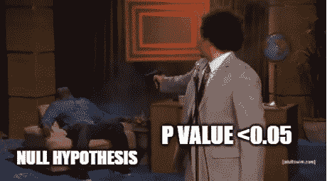

# 了解 p 值的正确解释

> 原文：<https://towardsdatascience.com/learn-to-read-p-value-in-english-11725c09f30e?source=collection_archive---------31----------------------->

## 理解低 p 值如何导致拒绝零假设。

图片来自 Unsplash

当我们开始学习概率和统计的概念时，有几个主题需要我们进行逻辑跳跃，常常让我们感到困惑。在我之前的[帖子](/confidence-interval-clearly-explained-b9f3fa787d0)中，我曾经谈到过这样一个话题，置信区间。在这篇文章中，我将尝试解释另一个令人困惑的话题，p 值。(剧透提醒:不，不是概率，而是和概率有关)

为什么我们不能理解 p 值的概念，是因为我们忽略了 p 值的基本解释，只关注它的概率方面。我在这里的目的只是解释 p 值的基本英文解释，这是经常被忽视的。

在开始之前，先讨论两个先决条件:条件概率和假设检验。

# 条件概率

P(A|B)被解释为给定或以事件 B 为条件的概率。

p(今天会下雨)=0.4 表示今天有 40%的几率会下雨。这是一个无条件的概率。没有与之相关的条件或假设。

p(今天会下雨|天空是灰色的)=0.7 意味着今天下雨的概率增加了，因为我们现在有了天空是灰色的新信息。这个概率回答了这个问题，假设天空是灰色的，今天下雨的可能性有多大。

在[维基百科](https://en.wikipedia.org/wiki/Conditional_probability)的第一段，这个概念解释的很清楚。

现在，如果 P(今天会下雨|天空是灰色的)=0.3，这并不意味着今天下雨的可能性低，但鉴于天空是灰色的，今天下雨的可能性很小。注意那一点！

# 假设检验:概述

## 真实世界场景

假设你是 Expedia 的一名数据科学家。你需要分析是什么因素促使新用户成为 Expedia 的忠实客户。你对数据做一些初步的探索性分析。你发现当一个新用户通过一些促销优惠或交易预订时，他/她倾向于回到网站。因此，如果一个新用户在第一次访问 Expedia 时使用一些促销优惠来预订服务，他们比那些没有使用任何交易就直接预订的新用户更有可能回来。

稍微研究了一下艺术，你会发现这些交易和优惠对新网站的访问者来说并不吸引眼球，因为它们是用蓝色显示的。你认为如果交易和优惠重新设计并用红色突出显示，这可能会增加首次用户的保留率。你向企业推荐这个。但是，为了从统计上表明你对自己的主张有多有信心，你需要执行以下步骤，而不是简单的想法叙述:

*   用红色重新设计网站的推广内容，把这个新版本只展示给网站新增流量的一半。
*   其余的新用户看到的是旧版本的网站，即蓝色。

如果一天之内有 100，000 个新用户访问该网站，想象一下，向 50，000 个用户显示旧版本，而向其余 50，000 个用户显示新版本。

这样，你就会明白是什么版本的网站引起了用户的注意并使用了这些交易。(点击阅读更多关于 A/B 测试的信息

想象一下，在新版本中，使用促销的新用户的百分比是 40%,而在旧版本中，使用促销的新用户的百分比仅为 20%。

在这里，你观察到**使用新版网站**时，使用推广的新用户数量增加了 100%。但是在你得出结论，将网站的促销颜色改为红色可以增加使用促销优惠的新用户，从而提高保留率之前，你必须**确定这种增加不是随机的**。这种增长可能是由于您的抽样方式，或者是因为，一般来说，当天使用新版本的用户不知道任何其他旅游预订网站，或者是因为任何其他随机原因。为了清楚起见，你运行一个假设检验。

## 假设检验方法

1.  选择一个测试统计(此处为保留百分比)
2.  阐明假设

***零假设(总是现状):*** 两个版本没有区别。观察到的差异只是随机的。

***另类假设:*** 两个版本有区别。

3.计算 p 值

p 值是反对零假设的证据。p 值越小，您应该拒绝零假设的证据就越强。

使用 img flip([https://imgflip.com/memegenerator](https://imgflip.com/memegenerator))创建

# 逻辑飞跃:p 值

维基百科声明:

*在假设零假设正确的情况下，p 值是获得至少与观察到的结果一样极端的测试结果的最大概率。*

这里我们观察到了两个版本之间 100%差异的结果。所以，观察到的结果是 100%。

*为我们的用例将维基百科语句写成一个数学等式:*

P 值为 P(两个版本之间的差异≥100% |零假设为真)

*用英语阅读这个等式(不是维基百科英语):*

p 值是假设零假设为真，两个版本之间的百分比差异**至少为 100%** (观察到的结果)**的概率。**

当我们解释 p 值并认为 p 值只是一个概率时，我们经常忘记“给定”这一部分。

需要注意的一件非常重要的事情是，**p 值并不能回答问题**:这是偶然发生的概率有多大？或者假设为真的概率是多少。相反，p 值回答了这个问题:

> 如果我们假设这是偶然发生的(零假设为真)，那么我们获得大于或等于我们已经观察到的结果的概率是多少。

为了理解这里的细微差别，让我们回到我在文章开头解释的雨的例子。p(今天会下雨|天空是灰色的)没有给出今天会下雨的概率。而是，如果天空是灰色的，今天会下雨的可能性。

现在，如果你重读维基百科的定义，事情就会水落石出。

但是为什么小 p 值会导致我们拒绝零假设呢？

假设，P(两个版本之间的差异≥100% |零假设为真)=0.04

*假设零假设为真，只有 0.04 的几率我们观察到至少 100%的差异*。因此，在我们的零假设为真的条件下，很难观察到至少 100%的差异。

但是在这里，你需要记住这 100%的差异已经在我们的测试中被观察到了。那么如果**在我们的假设下，**观察到至少 100%的差异是极不可能的，这表明我们的假设本身就是错误的。因此，我们拒绝我们的零假设，因为从 p 值，我们知道我们的假设是错误的。

加载可能需要一些时间。我假设你现在的脸有点像这样。但是你还记得高中时学过的矛盾证明吗？啊…这个概念有点类似。

因为我们得到 p 值为 0.04，这意味着我们拒绝了我们的零假设。由此，我们可以得出结论，两个版本之间的差异不是随机的，新版本的网站吸引了更多的用户使用推广代码，这对保留很重要。

现在，当 p 值变高时，我们**无法拒绝**零假设。我们**从不接受**我们的无效假设。这是因为假设检验类似于矛盾证明法。首先，我们假设零假设为假，开始假设检验。(参见 ThinkStats[T5【http://greenteapress.com/thinkstats/】T6](http://greenteapress.com/thinkstats/)Ch:7pg:80)

p 值总是与阈值α进行比较。alpha 的值取决于用例。最常用的 alpha 值是 0.05。

让我知道你对这篇文章的评论。如果这篇文章有所帮助，请鼓掌。

# 更多参考:

1.  思统计(**Ch:7)**
2.  *道恩·格里菲斯的第一本统计书*

*🤝在 [LinkedIn](https://www.linkedin.com/in/aparna-gkumar/) 上与我联系*