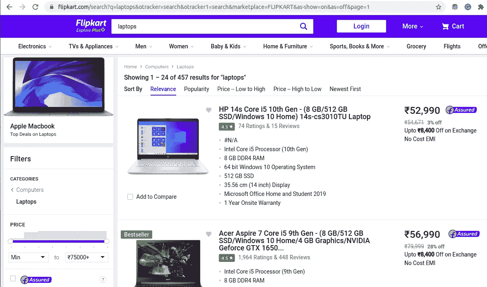
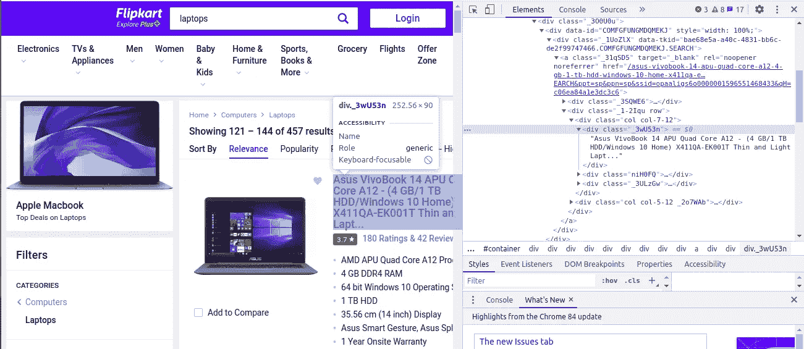
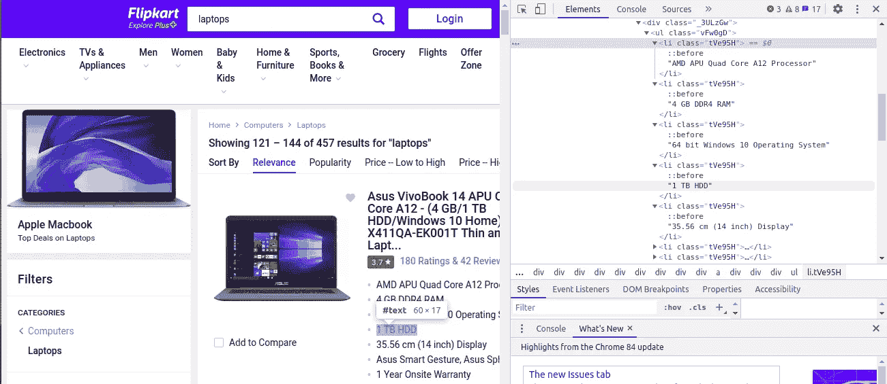
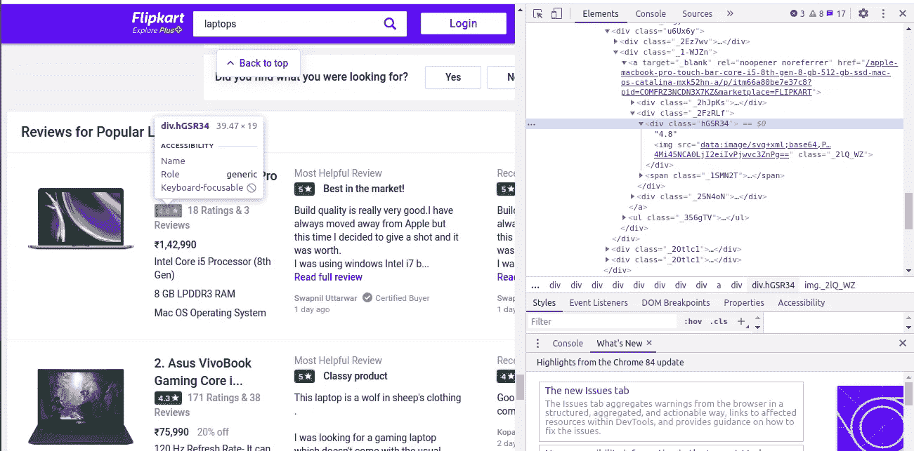
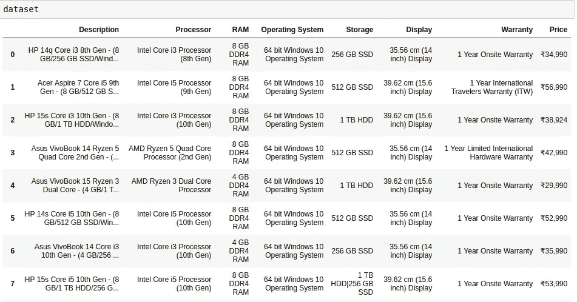
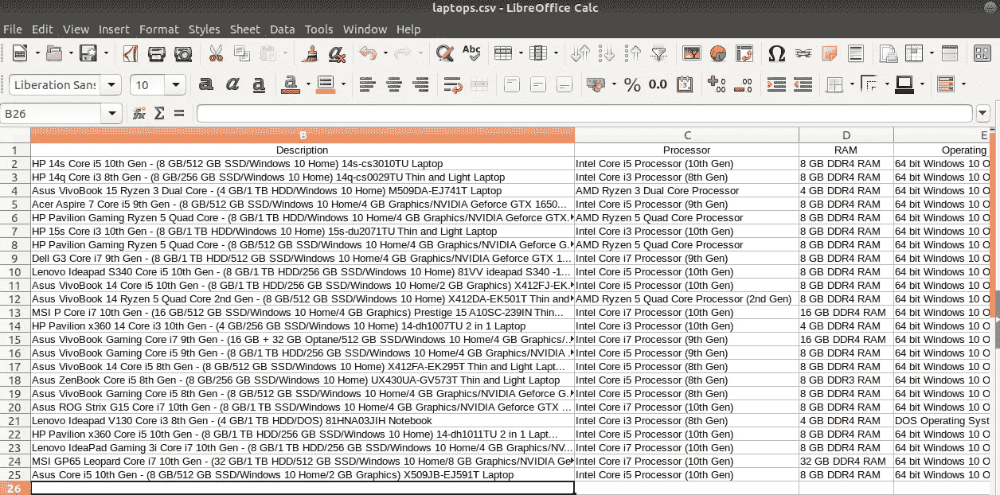

# 15 分钟学会网络抓取

> 原文：<https://towardsdatascience.com/learn-web-scraping-in-15-minutes-27e5ebb1c28e?source=collection_archive---------20----------------------->

## 从 Flipkart 网站抓取笔记本电脑数据


Emile Perron 在 [Unsplash](https://unsplash.com?utm_source=medium&utm_medium=referral) 上的照片

# 什么是网页抓取？

Web 抓取，也称为 web 数据提取，是从网站检索或“抓取”数据的过程。收集这些信息，然后导出为对用户更有用的格式，可以是电子表格或 API。虽然[网页抓取可以手动完成](https://www.upwork.com/search/profiles/?nbs=1&q=web%20scraping)，但在大多数情况下，自动工具在抓取网页数据时更受青睐，因为它们成本更低，工作速度更快。

# 网络抓取合法吗？

最简单的方法就是查看网站的 robots.txt 文件。您可以通过将“/robots.txt”附加到您想要抓取的 URL 来找到该文件。它通常位于网站域/robots.txt。如果所有由“用户代理:*”指示的机器人在 robots.txt 文件中被阻止/禁止，则不允许您抓取。为了这篇文章，我正在浏览 Flipkart 网站。所以，要看“robots.txt”文件，网址是[www.flipkart.com/robots.txt.](http://www.flipkart.com/robots.txt)

# 用于网页抓取的库

BeautifulSoup: BeautifulSoup 是一个 Python 库，用于从 HTML 和 XML 文件中提取数据。它与您喜欢的解析器一起工作，提供导航、搜索和修改解析树的惯用方式。

Pandas: Pandas 是一个快速、强大、灵活且易于使用的开源数据分析和操作工具，构建于 Python 编程语言之上。

# 为什么是 BeautifulSoup？

这是一个从网页中提取信息的不可思议的工具。你可以用它来提取表格、列表、段落，也可以用过滤器从网页中提取信息。更多信息，你可以参考 BeautifulSoup [文档](https://www.crummy.com/software/BeautifulSoup/bs4/doc/)

# 抓取 Flipkart 网站

```
from bs4 import BeautifulSoup 
import requests 
import csv
import pandas as pd
```

首先，我们导入了 BeautifulSoup 和 requests 库，它们对于 web 抓取来说是非常重要的库。

requests: requests 是 Python 中使语言变得有趣的包之一。requests 基于 Python 的 urllib2 模块。

```
req = requests.get("[https://www.flipkart.com/search?q=laptops&otracker=search&otracker1=search&marketplace=FLIPKART&as-show=on&as=off&page=1](https://www.flipkart.com/search?q=laptops&otracker=search&otracker1=search&marketplace=FLIPKART&as-show=on&as=off&page=1)")  # URL of the website which you want to scrape
content = req.content # Get the content
```

要获取指定 URL 的内容，请使用请求库提交请求。这是包含笔记本电脑的 Flipkart 网站的 URL。



这是由不同笔记本电脑组成的 Flipkart 网站。该页面包含 24 台笔记本电脑的详细信息。现在，我们尝试提取笔记本电脑的不同特征，例如笔记本电脑的描述(型号名称以及笔记本电脑的规格)、处理器(英特尔/AMD、i3/i5/i7/Ryzen3Ryzen5/Ryzen7)、RAM (4/8/16 GB)、操作系统(Windows/Mac)、磁盘驱动器存储(SSD/HDD、256/512/1TB 存储)、显示屏(13.3/14/15.6 英寸)、保修(现场/有限硬件/国际)、评级(4.1

```
soup = BeautifulSoup(content,'html.parser')
print(soup.prettify())<!DOCTYPE html>
<html lang="en">
 <head>
  <link href="https://rukminim1.flixcart.com" rel="dns-prefetch"/>
  <link href="https://img1a.flixcart.com" rel="dns-prefetch"/>
  <link href="//img1a.flixcart.com/www/linchpin/fk-cp-zion/css/app.chunk.21be2e.css" rel="stylesheet"/>
  <link as="image" href="//img1a.flixcart.com/www/linchpin/fk-cp-zion/img/fk-logo_9fddff.png" rel="preload"/>
  <meta content="text/html; charset=utf-8" http-equiv="Content-type"/>
  <meta content="IE=Edge" http-equiv="X-UA-Compatible"/>
  <meta content="102988293558" property="fb:page_id"/>
  <meta content="658873552,624500995,100000233612389" property="fb:admins"/>
  <meta content="noodp" name="robots"/>
  <link href="https://img1a.flixcart.com/www/promos/new/20150528-140547-favicon-retina.ico" rel="shortcut icon">
....
....
</script>
  <script async="" defer="" id="omni_script" nonce="7596241618870897262" src="//img1a.flixcart.com/www/linchpin/batman-returns/omni/omni16.js">
  </script>
 </body>
</html>
```

这里我们需要指定内容变量和解析器，也就是 HTML 解析器。所以现在 soup 是我们解析的 HTML 的 BeautifulSoup 对象的一个变量。soup.prettify()显示网页的全部代码。

**提取描述**



当你点击“检查”标签，你会看到一个“浏览器检查框”打开。我们观察到描述的类名是' _3wU53n '，因此我们使用 find 方法提取笔记本电脑的描述。

```
desc = soup.find_all('div' , class_='_3wU53n')[<div class="_3wU53n">HP 14s Core i5 10th Gen - (8 GB/512 GB SSD/Windows 10 Home) 14s-cs3010TU Laptop</div>,
 <div class="_3wU53n">HP 14q Core i3 8th Gen - (8 GB/256 GB SSD/Windows 10 Home) 14q-cs0029TU Thin and Light Laptop</div>,
 <div class="_3wU53n">Asus VivoBook 15 Ryzen 3 Dual Core - (4 GB/1 TB HDD/Windows 10 Home) M509DA-EJ741T Laptop</div>,
 <div class="_3wU53n">Acer Aspire 7 Core i5 9th Gen - (8 GB/512 GB SSD/Windows 10 Home/4 GB Graphics/NVIDIA Geforce GTX 1650...</div>,
....
....
<div class="_3wU53n">MSI GP65 Leopard Core i7 10th Gen - (32 GB/1 TB HDD/512 GB SSD/Windows 10 Home/8 GB Graphics/NVIDIA Ge...</div>,
 <div class="_3wU53n">Asus Core i5 10th Gen - (8 GB/512 GB SSD/Windows 10 Home/2 GB Graphics) X509JB-EJ591T Laptop</div>]
```

使用 *find* 方法从网站中提取描述——抓取类名为“_3wU53n”的 div 标签。这将返回类名为' _3wU53n '的所有 div 标记。由于 class 在 python 中是一个特殊的关键字，我们必须使用 class_ keyword 并在这里传递参数。

```
descriptions = [] # Create a list to store the descriptions
for i in range(len(desc)):
    descriptions.append(desc[i].text)
len(descriptions)24 # Number of laptops
['HP 14s Core i5 10th Gen - (8 GB/512 GB SSD/Windows 10 Home) 14s-cs3010TU Laptop',
 'HP 14q Core i3 8th Gen - (8 GB/256 GB SSD/Windows 10 Home) 14q-cs0029TU Thin and Light Laptop',
 'Asus VivoBook 15 Ryzen 3 Dual Core - (4 GB/1 TB HDD/Windows 10 Home) M509DA-EJ741T Laptop',
 'Acer Aspire 7 Core i5 9th Gen - (8 GB/512 GB SSD/Windows 10 Home/4 GB Graphics/NVIDIA Geforce GTX 1650...',
....
....
'MSI GP65 Leopard Core i7 10th Gen - (32 GB/1 TB HDD/512 GB SSD/Windows 10 Home/8 GB Graphics/NVIDIA Ge...',
 'Asus Core i5 10th Gen - (8 GB/512 GB SSD/Windows 10 Home/2 GB Graphics) X509JB-EJ591T Laptop']
```

创建一个空列表来存储所有笔记本电脑的描述。我们甚至可以通过点访问来访问子标签。所以现在遍历所有的标签，然后使用。方法只从标记中提取文本内容。在每次迭代中，将文本添加到描述列表中。因此，在遍历所有标签后，descriptions 列表将包含所有笔记本电脑的文本内容(笔记本电脑型号名称和规格的描述)。

类似地，我们应用相同的方法来提取所有其他特征。

**提取规格**



我们注意到，不同的规格都在同一个 div 下，所有这 5 个特性(处理器、RAM、磁盘驱动器、显示器、保修)的类名都是相同的。

所有的特性都在“li”标签中，所有的类名都是相同的，都是“tVe95H ”,所以我们需要应用一些技术来提取不同的特性。

```
# Create empty lists for the features
processors=[]
ram=[]
os=[]
storage=[]
inches=[]
warranty=[]for i in range(0,len(commonclass)):
    p=commonclass[i].text # Extracting the text from the tags
    if("Core" in p): 
        processors.append(p)
    elif("RAM" in p): 
        ram.append(p)
# If RAM is present in the text then append it to the ram list. Similarly do this for the other features as well elif("HDD" in p or "SSD" in p):
        storage.append(p)
    elif("Operating" in p):
        os.append(p)
    elif("Display" in p):
        inches.append(p)
    elif("Warranty" in p):
        warranty.append(p)
```

的。文本方法用于从标签中提取文本信息，这样我们就可以得到处理器、RAM、磁盘驱动器、显示器和保修的值。因此，以同样的方式，我们也将这种方法应用于其余的功能。

```
print(len(processors))
print(len(warranty))
print(len(os))
print(len(ram))
print(len(inches))24
24
24
24
24
```

**提取价格**

```
price = soup.find_all(‘div’,class_=’_1vC4OE _2rQ-NK’) 
# Extracting price of each laptop from the website
prices = []
for i in range(len(price)):
 prices.append(price[i].text)
len(prices)
prices24
['₹52,990',
 '₹34,990',
 '₹29,990',
 '₹56,990',
 '₹54,990',
....
....
'₹78,990',
 '₹1,59,990',
 '₹52,990']
```

同样，我们提取每台笔记本电脑的价格，并将所有价格添加到价格列表中。

```
rating = soup.find_all('div',class_='hGSR34') 
Extracting the ratings of each laptop from the website
ratings = []
for i in range(len(rating)):
    ratings.append(rating[i].text)
len(ratings)
ratings37
['4.4',
 '4.5',
 '4.4',
 '4.4',
 '4.2',
 '4.5',
 '4.4',
 '4.5',
 '4.4',
 '4.2',
....
....
'₹1,59,990',
 '₹52,990']
```



这里我们得到的评级长度为 37。但是背后的原因是什么呢？

我们观察到推荐的笔记本电脑的类名也与特色笔记本电脑的类名相同，这就是为什么它也提取推荐的笔记本电脑的评级。这导致了收视率的上升。应该是 24 岁，但现在是 37 岁！

最后但同样重要的是，将所有要素合并到一个数据框中，并以所需的格式存储数据！

```
df = {'Description':descriptions,'Processor':processors,'RAM':ram,'Operating System':os,'Storage':storage,'Display':inches,'Warranty':warranty,'Price':prices}
dataset = pd.DataFrame(data = d) 
```

**最终数据集**



**将数据集保存到 CSV 文件**

```
dataset.to_csv('laptops.csv')
```

现在我们将整个数据集放入一个 CSV 文件中。



为了再次验证，我们阅读了 Jupyter 笔记本中下载的 CSV 文件。

```
df = pd.read_csv('laptops.csv')
df.shape(24, 9)
```

由于这是一个动态的网站，内容不断变化！

完整代码可以随时参考我的 [**GitHub 库**](https://github.com/mathangpeddi/Flipkart-Web-Scraping) 。

在 LinkedIn 上联系我 [**这里**](https://www.linkedin.com/in/mathang-peddi-23763317b/)

> “你在网络分析工具上每花 20 美元，你就应该在大脑上花 80 美元来理解数据。”—杰夫·绍尔

我希望你觉得这篇文章很有见地。我很乐意听到反馈，以便即兴创作，并带来更好的内容。

非常感谢您的阅读！