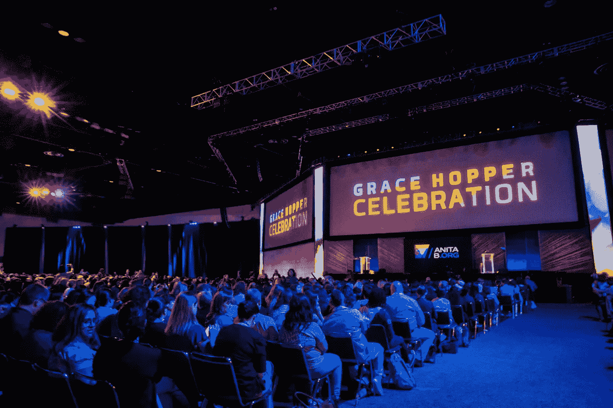
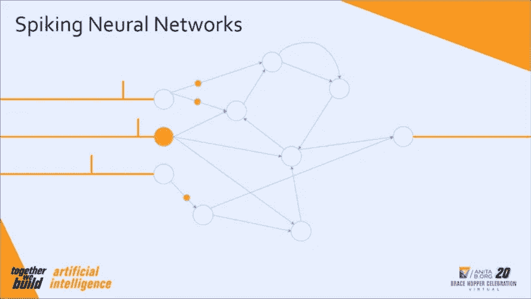
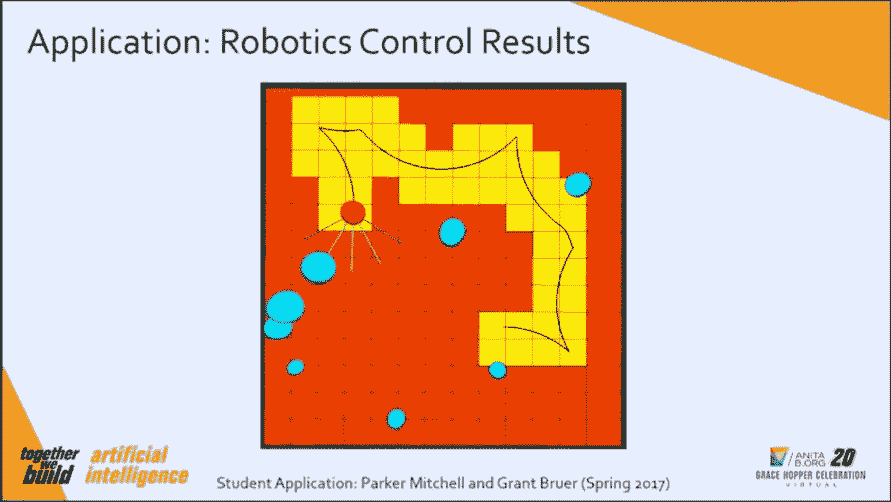

# 在 2020 年格蕾丝·赫柏庆典上了解基于时间数据的尖峰神经网络

> 原文：<https://towardsdatascience.com/learning-about-spiking-neural-networks-for-time-based-data-at-the-grace-hopper-celebration-2020-68ba58fac5bb?source=collection_archive---------51----------------------->

之前的(亲自)格蕾丝·赫柏庆典。来源:https://ghc.anitab.org/previous-years/2017-gallery/

格蕾丝·赫柏 T2 庆典是世界上最大的女性科技会议。今年的会议(当然)是虚拟的，有来自 115 个国家的 30，000 名与会者。2020 年的主题是“我们一起建设”，考虑到今年事件后重建的迫切需要，这似乎格外合适。

提供了大量的讲座、研讨会和主题演讲，特别是我参加了一些非常有趣的技术讲座。这包括关于如何构建人工智能超级计算机的讲座、音译语言的自然语言处理(NLP )(事实证明这非常困难，当前的模型表现不太好)、用于可视化的 NLP 可解释性工具、会见人工智能虚拟助理，甚至是关于因果模型的经济学讲座。

对我来说，真正突出的三个数据科学讲座是关于尖峰神经网络的，谷歌关于负责任地构建人工智能产品的观点，以及足够奇怪的是，来自并不立即令人兴奋的税务软件世界的机器学习案例研究。我会在其他帖子中讨论其中的一些，但在这篇帖子中，我想谈谈脉冲神经网络，这是一种处理基于时间的数据的令人兴奋的神经网络形式。

# 脉冲神经网络

这次演讲由橡树岭国家实验室的科学家凯瑟琳·舒曼主持。

## 神经网络和时间序列数据

我对处理空间和时间的机器学习技术特别感兴趣，比如时间序列预测、路由的图形网络以及表示和概念化空间的方法，因为它们以一种真正有形的方式将数据科学的工作与我们生活的世界直接联系起来。所以我很喜欢这个关于脉冲神经网络(SNNs)的演讲，因为神经网络有许多不同的风格，但这一个是专门为处理与时间相关的数据而设计的，特别是来自实时数据源的数据。

如果你对数据科学领域有一点兴趣，你可能会看到下面这张图片，它描述了传统神经网络(NN)的基本模型架构。在一个标准的神经网络模型中，输入数据首先被输入到左边的输入神经元，然后通过称为突触的连接穿过其他神经元的隐藏层。数据在每一步都被转换，一层的输出被用作下一层的输入。

最终，您会到达最终输出图层，该图层会输出您的预测，例如，类别分类或回归中的数值。这里没有实时元素——输入数据同时通过所有层，按顺序通过每个隐藏层，然后一次性输出。

传统的神经网络架构。来源:[https://www . kdnugges . com/2019/11/designing-neural-networks . html](https://www.kdnuggets.com/2019/11/designing-neural-networks.html)

## 介绍脉冲神经网络

但是，如果你的输入数据不是以整齐的方式在同一时间到来，那该怎么办？如果它是时间序列数据，或者以其他方式与时间相关，比如来自自动驾驶汽车上传感器的实时输入，那该怎么办？如果你的输出也是如此——如果这也是基于时间的，就像给自动驾驶汽车发出的何时转弯、何时加速或减速的指令，那会怎么样？

snn 是这个问题的解决方案。它们可以接收基于时间的输入，并产生基于时间的输出。它们没有整齐的层，而是具有更复杂的结构来在神经元之间传递数据，如环路或多向连接。因为它们更复杂，它们需要不同类型的训练和学习算法，比如对类似反向传播的方法进行改变，以适应尖峰行为。

下面的图片是凯瑟琳出色的关于这些网络如何工作的动画。你可以看到神经元和突触的结构是如何比之前图像中看到的清晰的层结构更复杂。在左侧，您可以看到黄线，代表进入网络的输入数据峰值。当这些尖峰到达输入(左边的白色大圆圈)神经元时，它们会刺激神经元，使它们放电(左边的黄色大圆圈)。这些神经元随后向网络产生内部尖峰，然后在整个网络中传播(沿着突触的黄色小圆圈)。这些内部尖峰最终到达输出神经元并产生输出尖峰。就输出而言，重要的数据不仅仅是输出是什么，还有峰值的数量以及峰值之间的时间，所有这些都可以告诉您一些有用的信息。

来源:Catherine Schuman (2020)尖峰神经网络:在神经网络和神经科学之间架起桥梁，在 2020 年格蕾丝·赫柏庆典上的演讲

## 应用程序

社交网络的潜在应用是巨大的，因为它们可以用于任何与时间相关的事情。给出的例子包括:

*   玩电脑游戏《小行星》,你控制一艘船向来袭的小行星射击。在下面的幻灯片中，SNN 在左边，游戏在右边。神经元在左侧排列成一个圆圈，因为这是游戏中传感器在船周围的排列方式。SNN 接收来自这些传感器的输入，当小行星靠近时，这些传感器就会触发——来自传感器的每个输入都是一个尖峰信号。然后，它必须决定何时转向、前进或开火，这些都是基于时间的输出。

来源:Catherine Schuman (2020)尖峰神经网络:在神经网络和神经科学之间架起桥梁，在 2020 年格蕾丝·赫柏庆典上的演讲

*   自主机器人导航。下面的幻灯片显示了模型在模拟中接受训练，然后以小型机器人的形式在真实环境中释放。机器人接受关于其环境的实时激光雷达输入(这告诉它障碍物有多远)，它的目标是尽可能多地探索环境，同时避免障碍物并记住它去过的地方。

来源:Catherine Schuman (2020)尖峰神经网络:在神经网络和神经科学之间架起桥梁，在 2020 年格蕾丝·赫柏庆典上的演讲

*   计算网络中点与点之间的最短路径。在该应用中，图形网络(传统上用于路由算法)被转换为 SNNS，空间中的点被转换为神经元，距离被转换为与特定突触相关联的延迟。对我来说，这是一个特别令人兴奋的应用，因为它使用基于时间的 SNN 来模拟空间——结合了我的两个兴趣。
*   流行病传播模型。在这里，神经元是群体中的个体，突触是共享的社会联系，尖峰是感染的传播，参数允许对不同的条件进行建模。由于显而易见的原因，这是目前特别有前途的研究途径。

我将在其他帖子中写一些我参加的其他有趣的技术讲座，但 Catherine Schuman 关于 SNNs 的讲座尤其引人注目，是一个令人着迷的话题，我渴望与其他未能参加会议的数据科学家分享。我希望你和我一样对此感兴趣！