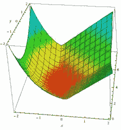
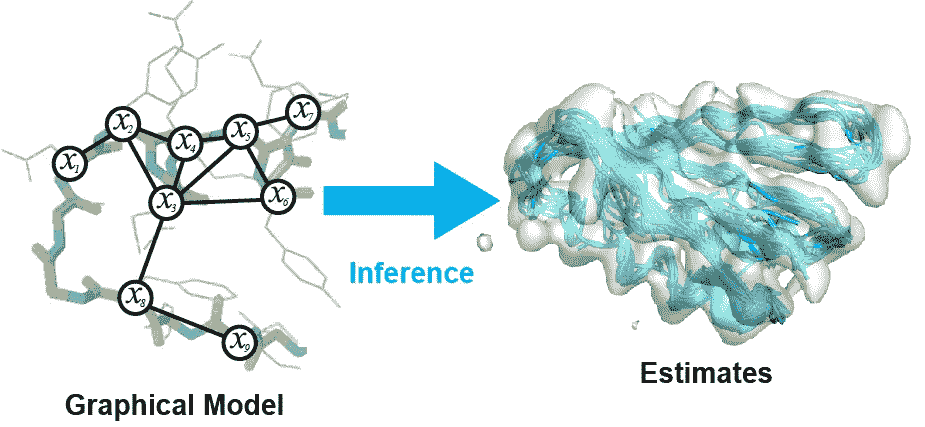
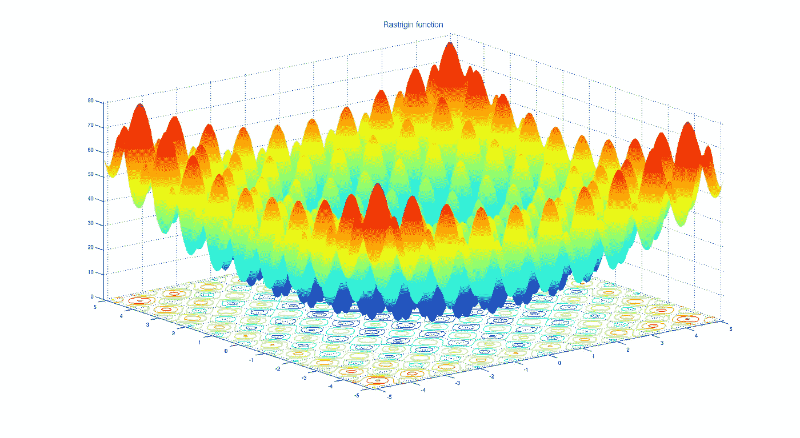

# 学习机器学习背后的高等数学

> 原文：<https://towardsdatascience.com/learning-advanced-mathematics-behind-machine-learning-7582e0b3be1a?source=collection_archive---------16----------------------->

## 学习机器学习高等数学的全面资源列表

照片由[思想目录](https://unsplash.com/@thoughtcatalog?utm_source=medium&utm_medium=referral)在 [Unsplash](https://unsplash.com?utm_source=medium&utm_medium=referral) 上拍摄

数学构成了大多数机器学习算法的基础。所以，掌握好数学对理解机器学习是势在必行的。而大多数数据科学家都知道线性代数、统计学等基本数学概念。但他们中的许多人并没有意识到一些深层的数学概念，这些概念可以帮助他们更清楚地了解一种算法是如何工作的，或者让他们了解机器学习的最新研究。

在这篇文章中，我分享了高等数学课程的资源，这些资源有助于机器学习。本文讨论的主题是**凸和非凸优化、信息论、概率图形模型等。**

给出资源列表是为了假设读者熟悉基本概念，如**线性代数、概率论、多变量微积分和多变量统计**。理解这些基本主题对于理解本文中的高级课程中的内容是至关重要的。

我还写了另一篇关于这些主题的文章，可以作为这篇文章的前身。请随意查看！

 [## 三个月计划学习机器学习背后的数学

### 为期 3 个月的计划，学习机器学习背后的数学知识

towardsdatascience.com](/three-month-plan-to-learn-mathematics-behind-machine-learning-74335a578740) 

本文中的资源可用于攻读博士学位，学生需要对与研究主题相关的数学概念有透彻的理解。

该计划主要分为以下几个部分

*   **凸优化**
*   **概率图形模型**
*   **非凸优化**
*   **信息论**

这个列表是永无止境的，但我在这里讨论的以下四个主题在机器学习中是必不可少的，并且可以高度移植到其他工程领域。

# 充分利用资源:

*   建议不要听课，即使你知道内容。这样的讲座可以用来修改概念。
*   一边看讲座一边做手写笔记。它有助于更好地理解和记忆概念。
*   练习书本或课程作业中的问题。如果有许多类似的问题，每种类型做 1-2 个问题。
*   在本书的每个讲座/章节之后，尝试推导所讨论的定理/证明，并相应地修改。

# 凸优化:

[http://Thein F2 . informatik . uni-jena . de/Lectures/Convex+optimization . html](http://theinf2.informatik.uni-jena.de/Lectures/Convex+Optimization.html)

机器学习中的大多数方法都是基于寻找使一些目标函数(如二进制交叉熵、均方误差等)最小化的最佳参数。由于这一事实，大多数机器学习问题可以被视为优化问题。使用凸优化，一些机器学习算法使分析变得简单，并确保解的唯一性。凸优化应用于许多工程领域，并且是任何工程学位的基本课题之一。

学习该主题最经典的书是史蒂芬·博伊德博士和列文·范德伯格博士的**凸优化书。**世界各地的不同大学也提供非常棒的讲座。其中一些列举如下:

*   YouTube 上**史蒂芬·博伊德博士**的演讲
*   YouTube 上的 CMU 10–725 讲座
*   【Joydeep Dutta 教授在 NPTEL 上的凸优化

# 概率图形模型:

[https://www2.cs.arizona.edu/~pachecoj/courses.html](https://www2.cs.arizona.edu/~pachecoj/courses.html)

概率图形模型提供了一种数学方法来编码图形中随机变量之间的概率关系。通常，图中的节点是变量，边编码了它们之间的概率独立性或依赖性。在大多数现代机器学习研究中，许多机器学习模型是用图形模型定义的。该方法用于描述模型下的概率推理的结构。它也用于其他领域，如生物，金融等。

**达芙妮·柯勒和 Nir Friedman 的概率图形模型**是学习 PGM 的标准书籍。除了这本书，还有一些关于 PGMs 的漂亮课程，列举如下:

*   Tom Mitchell 博士和 Lella Wehbe 博士的讲座。这是一门博士水平的课程。
*   **概率图形模型专业化**在 **Coursera** 由**斯坦福**由**达弗·柯勒**博士提供。

# 非凸优化:

[https://commons . wikimedia . org/wiki/File:rastri gin _ function . png](https://commons.wikimedia.org/wiki/File:Rastrigin_function.png)

与凸优化相比，非凸优化是一个相对较新的领域，在神经网络等算法中非常重要。使用凸优化技术来解决非凸问题会导致局部最优而不是全局最优，这是深度学习模型中最大的问题之一。非凸问题有许多可行且非常平坦的区域，曲率变化很大，每个区域有几个鞍点。

很少有足够的资源可用于非凸优化，因为它不是一个既定的领域，仍然是一个活跃的研究领域。最好的阅读资源是【Prateek Jain 博士和 Purushottam Kar 博士的《**机器学习的非凸优化**》。没有任何课程详细介绍非凸优化。最好的视频资源是在 **NIPS 2015 非凸优化研讨会**上的演讲。

# 信息论:

istock.com

信息论与机器学习有着牢固的关系。许多机器学习算法中使用的交叉熵损失是信息论的直接应用。决策树也使用信息论的概念，如熵、互信息等。拆分树形数据结构中的节点。信息论还用于数据压缩、信号处理、信息检索、数据挖掘等。

学习信息论的经典书籍是 **David MacKay** 的《**信息论、推理和学习算法**》。除了这本书，作者在剑桥大学还有一门名为“**信息论、模式识别和神经网络**的课程，和**讲座**可在 **YouTube** 上获得。

# 下一步做什么？

完成上面提到的课程后，可以尝试学习更多与机器学习相关的数学课程。比如**测度论、张量代数、数学建模**等。都是这样的其他话题。

除了课程之外，你现在可以选择在顶级会议上发表的任何理论机器学习论文，如 **NIPS、ICML、ICLR** 等。阅读并尝试复制论文的结果。从这个计划中学到的东西也可以用来在任何公司开始你的研究，或者开始攻读博士学位。