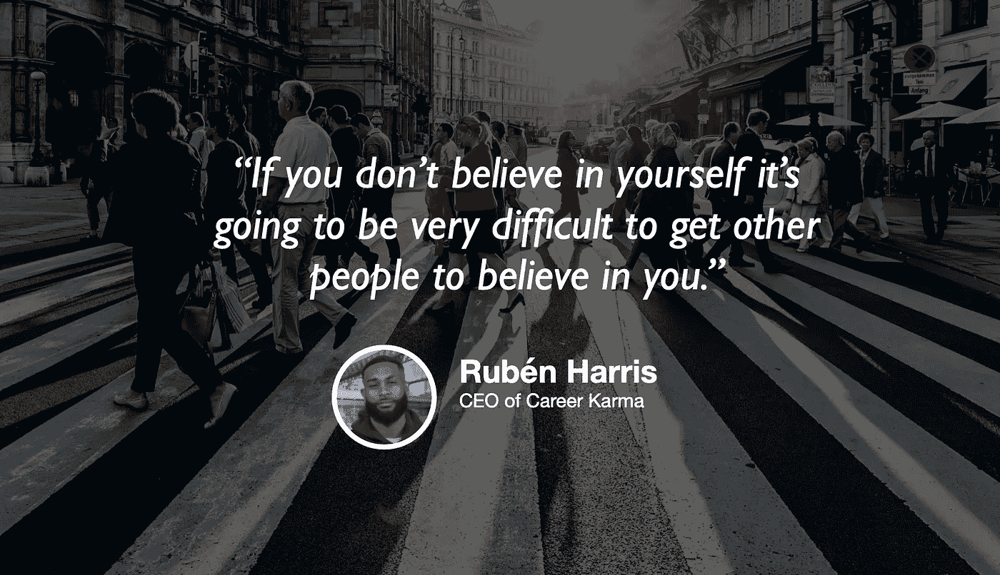

# 学习和寻找检疫工作

> 原文：<https://towardsdatascience.com/learning-and-looking-for-jobs-in-quarantine-c6502a5f5e1e?source=collection_archive---------65----------------------->

## [苹果](https://podcasts.apple.com/ca/podcast/towards-data-science/id1470952338?mt=2) | [谷歌](https://www.google.com/podcasts?feed=aHR0cHM6Ly9hbmNob3IuZm0vcy8zNmI0ODQ0L3BvZGNhc3QvcnNz) | [SPOTIFY](https://open.spotify.com/show/63diy2DtpHzQfeNVxAPZgU) | [其他](https://anchor.fm/towardsdatascience)

## Rubén Harris 在 [TDS 播客](https://towardsdatascience.com/podcast/home)

*编者按:迈向数据科学播客的“攀登数据科学阶梯”系列由 Jeremie Harris 主持。Jeremie 帮助运营一家名为*[*sharpes minds*](http://sharpestminds.com)*的数据科学导师初创公司。可以听下面的播客:*

冠状病毒隔离从根本上改变了学习和求职的动力。就在几个月前，面对面的训练营和大学项目，人们握手和交换名片的现场网络活动是这个世界的工作方式，但现在，不再是了。考虑到这一点，许多有抱负的技术人员都在问自己，考虑到当前疫情和即将到来的经济衰退的限制，他们应该如何调整自己的游戏计划，以跟上学习或获得下一份工作。

这就是为什么我想和 Rubén Harris 谈谈，他是 Career Karma 的首席执行官和联合创始人，Career Karma 是一家帮助有抱负的开发人员找到最适合他们的编码训练营的初创公司。他有一个很好的视角来分享导航自学和找工作的特殊心理和实践挑战，他很友好地抽出时间与我聊天，这是迈向数据科学播客的最新一集。

以下是我最喜欢的一些外卖食品:

*   既然面试是通过视频聊天进行的，求职者就有了一个独特的机会，他们可以在练习回答问题的过程中对自己的面试表现进行自我评估。Rubén 还建议准备一些笔记，你可以在谈话中参考，以帮助你更顺利地表达，并让你保持在正轨上。[注意:请记住，正如我的兄弟 Ed [最近在 tweet](https://twitter.com/neutronsNeurons/status/1247196547722461184)上说的，Zoom 有一个设置，允许会议主持人看到你屏幕上的内容，所以你可能并不总是能够逃脱这个问题]。
*   保持学习的动力是一项你可以努力学习和发展的技能，尤其重要的是，现在你不能依赖老师或助教亲自带你去上课或训练营。做到这一点的一个很好的方法是利用原子习惯策略:找到带你去你想去的方向的最小的行动(无论多么可笑的小)，并从那里开始。例如，如果你想养成锻炼习惯，先穿上你的运动短裤，然后称之为胜利——如果之后你做了一些俯卧撑，那就太棒了。一旦你养成了“穿上我的短裤”的习惯，把下一个目标定为做一个俯卧撑，并从那里开始培养你的习惯。
*   另一个伟大的激励策略是公开承诺你的目标。像 Twitter 这样的社交媒体平台可以很好地做到这一点，同时帮助你与面临类似挑战的志同道合的人联系。

你可以在这里的 [Twitter 上关注鲁本，在这里](https://twitter.com/rubenharris)找到职业因果的网站[。](https://careerkarma.com/)

你可以[在推特上关注我](https://twitter.com/jeremiecharris)。

**订阅《走向数据科学》的** [**月刊**](https://medium.com/towards-data-science/newsletters/monthly-edition) 直接在你的邮箱✨里接收我们最好的文章、视频和播客