# 学习协会

> 原文：<https://towardsdatascience.com/learning-associations-74a8c27cf142?source=collection_archive---------25----------------------->

## 购物篮分析和关联规则

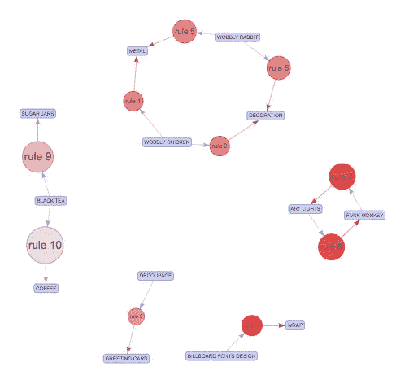

关联规则

想象一下，一个在线电子商务网站在数字营销方面尽其所能。利用有机的、付费的、社交的和其他营销技术来吸引消费者访问他们的网站，提供合适的吸引人的内容来通知消费者，并通过他们的产品详情页面和无缝结账流程进一步将他们转化为销售。这个电商团队还有什么可以做的吗？如果会怎样；即使转换率很高，但营销努力和预算大于通过他们的网站销售；他们应该减少他们的数字营销努力吗？如果他们的交谈率下降了呢？

我记得大约十年前，我们会在结账后将额外的产品信息添加到解决页面，这样用户就可以进行额外的购买。我们的营销团队会根据他们的领域专长选择这些**交叉销售**产品。他们非常仔细，在选择这些产品上花费了大量的时间和精力，因为如果他们不包括这些额外的产品，他们就会失去很多销售机会。

在本文中，我们将查看我们为[客户细分](/retail-customer-analysis-c84b97d21ff9)分析的相同数据集，但是这次我们将在购买的产品之间创建一个关联规则。关联规则是 X 到 Y 形式的蕴涵，其中 X 是前提规则，Y 是结果规则。关联规则最常见的用途之一是**市场篮分析。简单地说，我们希望找到两个项目之间的依赖关系。如果购买商品 X 的人通常也会购买 Y，如果有一个消费者购买了 X，但没有购买 Y，那么这个消费者就是一个潜在客户。**

# 数据收集和清理

正如我前面提到的，我们使用的数据集与我们在上一篇关于客户细分的文章中探索的数据集相同。然而，这一次，我们将关注交易(“InvoiceNo”)和项目(“StockCode”、“Description”)，而不是关注客户。

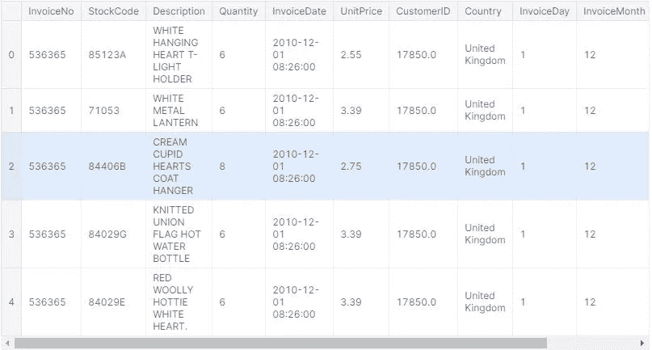

我们在“Description”和“CusomterID”变量上缺少一些值。在这种情况下，我们有两个选择，我们可以简单地删除丢失的值观察值，或者将它们作为我们分析的一部分。因为我们在看项目，描述对我们来说是一个重要的变量，然而，在总共 541909 个观察值中，1454 个并不重要。我们可以保持丢失的值不变。我们也有一些退货(信用)，我们删除了这些项目，因为消费者没有完全购买。为了查看购买行为，我们还添加了 InvoiceDay 和 Hour 变量。

# 数据探索

当我们查看关联规则时，我们主要感兴趣的是了解如果有人购买 X，同一个人购买 Y 的概率是多少。这只是一个条件概率，其中 Y 是我们希望以 X 为条件的产品。在不进入太多关于抛硬币的示例的情况下，我们应该考虑查看客户购买行为。

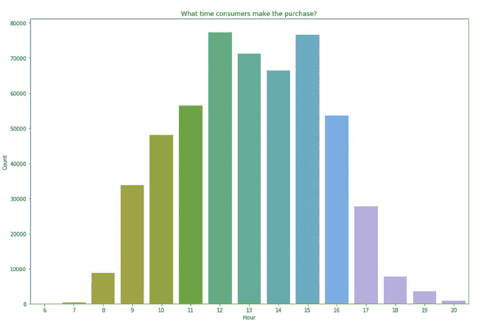

消费者购买行为

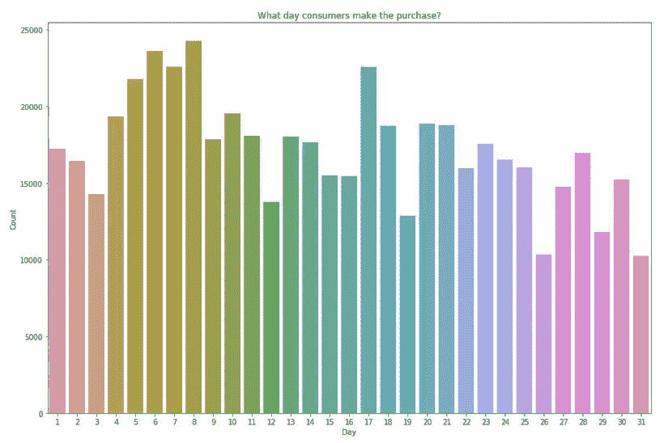

顾客购买行为

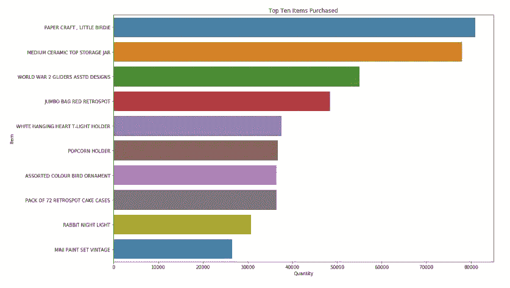

购买的前十件商品

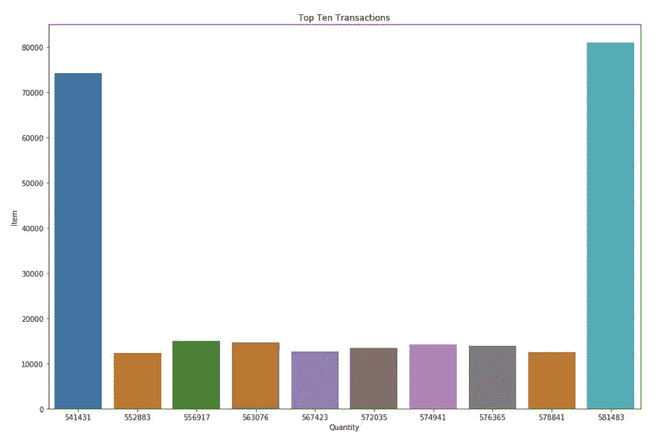

十大交易

查看我们的数据，我们可以看到，消费者在一天中的下午 12 点、1 点和 2 点、6 日、7 日、8 日和 17 日进行了最多的购买，并且主要购买了“第二次世界大战滑梯 Asstd 设计”、“巨型袋红色 Retrospot”和“爆米花架”。最大的购买来自发票 541431 和 581483 交易。

# 建模的数据准备

为了将关联规则应用到我们的数据集，我们需要将数据的当前状态转换为更具事务性的基本数据集。我们关注的是每笔交易中购买的商品。这就是“篮子”这个术语的由来。我们需要关注数据集内的独特产品，并查看购物篮中的商品集合。

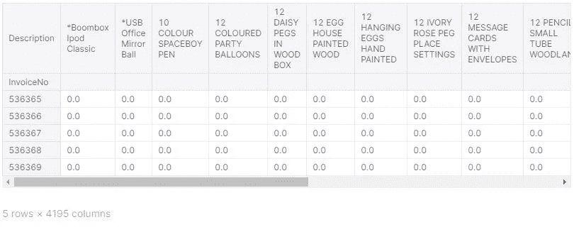

当我们转换数据时，我们简单地定义了标识产品的列和标识交易的发票号的行。

随着为消费者在产品中建立关联规则，我们正在寻找集合、子集和超集。集合中有独特的项目，通过购物篮分析，我们可以看到项目集合中较小的集合。例如，我们的数据集中的项目是 X={ "面包"、"黄油"、"奶酪"、"葡萄酒" }，X 项目集的子集是 Size 0: {}，Size 1:{ "面包" }，{ "葡萄酒" }，… Size 2: { "面包"、"葡萄酒" }…{"Bread"}的超集是{"Bread "，" Butter"}。我们来看看每笔交易的购买情况。

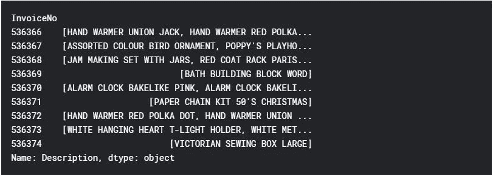

# 模型开发

在构建关联规则时，我们会考虑使用三个主要参数或衡量标准。

*   支持关联规则。x 到 Y
*   关联规则的可信度。x 到 Y
*   Lift，也称为关联规则的兴趣。x 到 Y

**Support** 简单的表示一个项集的流行度。在数据集中购买的项目集越多，该项目集就越受欢迎。它的计算方法是将项集(例如 X 和 Y)中的项所购买的事务数除以事务总数。

**置信度**简单地表示关联规则为真的频率。它的计算方法是，购买项集(例如 X 和 Y)中的项的事务数除以包含项集中某项(例如 X)的事务数。简单来说，就是显示 Y 和 x 一起买的百分比。

**Lift** 简单地表明规则内的关联有多强。它的计算方法是在给定另一个项目(X)的条件下，用一个项目(Y)的概率除以另一个项目(Y)的概率。如果 Lift > 1，Y 很可能用 x 买，如果 Lift < 1，Y 不太可能用 x 买。

置信度是条件概率。为了能够以足够的信心声明规则成立，信心值应该接近 1，并且显著大于购买 y 的概率。我们还希望最大化规则的支持，因为即使这样的客户数量很少，规则也是无价的。

有一种众所周知的高效算法叫做 **Apriori** ，它可以在大型数据库中找到所有具有高支持度和置信度的规则，只需对数据集进行少量遍历。该算法分两步发现关联规则。

*   找到有足够支持度的频繁项目。
*   用足够的信心将它们转化为愤怒。

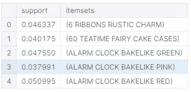

Apriori 算法的思想很简单。如果一个项目集是频繁的，那么它的所有子集也一定是频繁的。对于一个非频繁项集，它的所有超集都是非频繁的。

例如，在我们的电子商务数据集中，如果一个消费者购买了像 GREEN kind 一样的闹钟烘焙，我们有 65 %的信心他们也会购买闹钟烘焙 LINE RED。作为我们算法中的一个参数，我们将最小支持阈值设置为 5%。当生成规则时，Apriori 从具有单个先例的高可信度规则开始(如我们的“规则”关联规则数据框架所示),并继续构建更复杂的规则，结果是更多的项目。

# 模型评估

我们已经使用 Apriori 算法创建了用于购物篮分析的模型。我们可以改变和改进某些参数，例如创建关联规则的最小阈值或创建频繁项目的最小支持度。我们还可以定义最小升力和长度。但是，对于我们创建的模型，我们还应该详细查看关联规则。我们可以看的第一个方面是**多余的规则**。如果存在具有相同或更高置信度的更一般的规则，我们可以消除规则以避免冗余。

让我们详细看看我们的篮子中的频繁项和关联规则。

最常出现的项目集

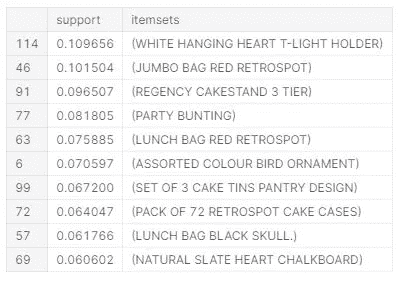

最常出现的项目集

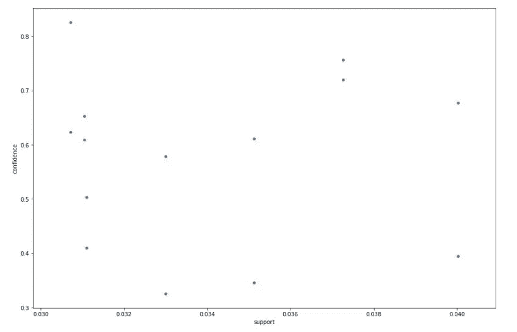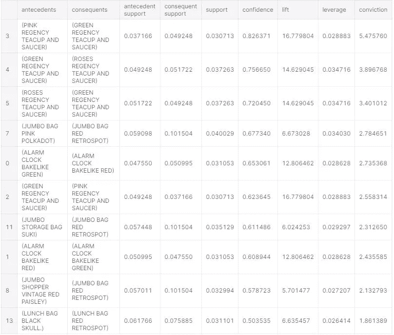

# 结论

在购物篮分析和在消费者购买的商品中创建关联规则时，我们不是看消费者购买了多少，而是关注他们购买了什么。在我们的在线零售商数据集中，我们能够找到前因和后果的关联规则，例如:如果消费者购买了粉红色的丽晶茶杯和茶托，我们有 82%的信心他们也会购买绿色的丽晶茶杯和茶托。我们还回顾了最受欢迎的(经常购买的商品)、关联规则、每个关联规则的使用频率，最后，如果消费者购买了商品 Y，则可能会或不可能购买商品 x。

关联规则在机器学习应用中有许多用途。我们回顾了一个关于如何对在线零售商数据集执行 Apriori 算法的示例，以便找出消费者购买的产品之间的关联，这对交叉销售营销方法非常有用。如果这不是一个在线零售商，而是一个书商，方法将是相同的。我们可以对 web 门户应用相同的关联规则方法。在这种情况下，项目将对应于网页中的链接，我们可以预测(估计)用户可能点击的链接。