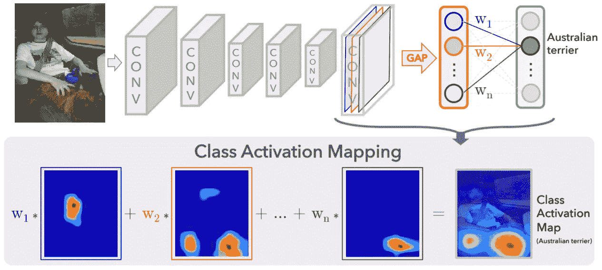
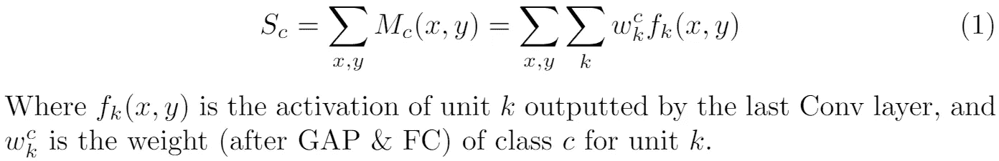
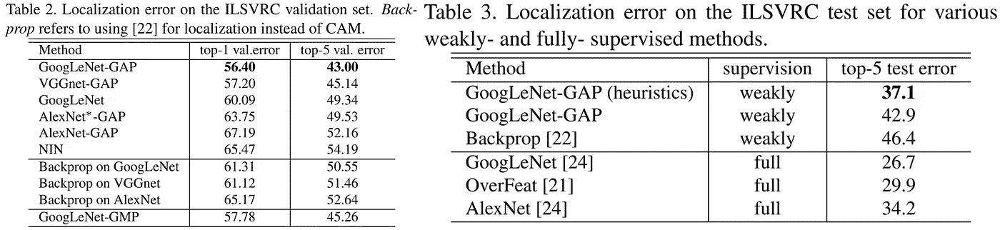
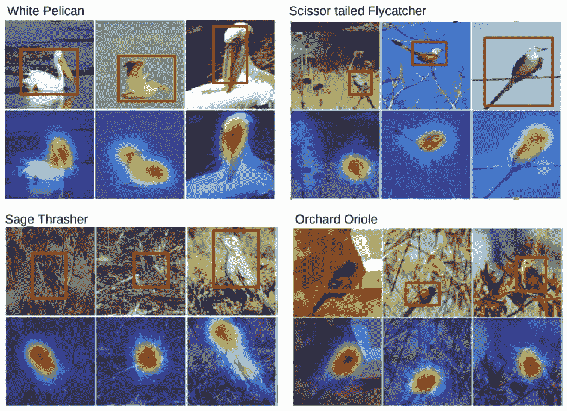
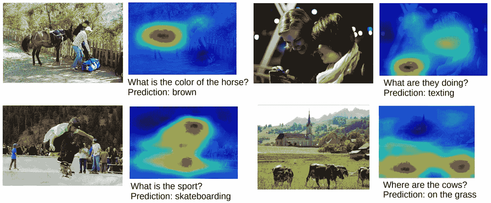

# 用于鉴别定位的深度特征学习

> 原文：<https://towardsdatascience.com/learning-deep-features-for-discriminative-localization-class-activation-mapping-2a653572be7f?source=collection_archive---------35----------------------->

## 可解释人工智能的全局平均池和类激活映射

类激活映射[1]

今天，我将重温 CVPR 2016 年的论文“学习歧视性本地化的深层特征”。该论文由麻省理工学院研究人员*周等人***【1】**撰写，在可解释人工智能和弱监督检测/定位方面做出了有价值的贡献。其贡献可归纳如下:

1.  **全球平均池使康文网络保持其本地化能力**
2.  **引入弱监督、端到端、单路目标定位的类激活映射技术**
3.  **在 ILSVRC 2014 上获得 37.1%的前 5 名本地化误差，接近完全监督的 AlexNet 的 34.2%**

本白皮书基于之前对 ConvNets 本地化功能的研究，以及全球平均池(GAP)的优势。广泛应用于计算机视觉中的 ConvNets 具有固有的金字塔结构和固有的平移不变性，允许它们通过以分层的方式从空间特征图中提取语义代表性增加的特征。虽然之前的研究**【2】**表明，ConvNets 的卷积单元在没有监督的情况下学习位置信息，但当全连接(FC)层(其中神经元密集地连接到前一层的激活值)用于分类时，这种能力就丧失了。在这项工作中，*周等人*提出了全局平均池作为一种机制来保持 ConvNets 的本地化能力，直到最后一层。

**全球平均统筹(缺口)**

尽管 GAP 并不是一项新技术——已经作为防止过度拟合的规则进行了研究，但直到这项工作，其潜力才被充分认识到。作者在 GAP 和**【3】**的全局最大池(GMP)之间进行了显著的比较，目的是弱监督的对象定位。使用 GMP，**【3】**仅限于定位对象的边界，而 GAP 则使*周等人*能够识别整个对象的位置(类似于一个遮罩)。这是由这样的认识提供的，即平均池激励对所有区别区域(有助于成功识别对象的特征)的识别，而最大池仅仅激励对图像的最大区别区域的识别。

**类激活图(CAM)**

CAMs 可以被描述为最后卷积特征映射的点积和 FC 层的类权重(在 GAP 之后应用)的总和。这被正式描述为:

因此，作者将 cam 描述为“在不同空间位置存在的(这些)视觉模式的加权总和”。根据最后一个卷积特征图的分辨率，对 CAM 进行上采样，以显示输入图像中的区别区域，并通过 softmax/sigmoid 输出函数，以生成图像级分类标签。

**实验**

*周等人*在 8 个分类数据集上评估了 3 个 ConvNet 基线上的 cam，即 AlexNet、VGGNet 和 GoogLeNet，以及用于弱监督包围盒定位的 ILSVRC 2014 和 CUB-200–2011 数据集。对分类数据集的实验产生了两个主要见解:

*   首先，这种差距不会严重影响基线模型的分类性能(除了 vanilla AlexNet，他们通过添加 Conv 层进行了调整)，同时保留了本地化信息。
*   第二，在空间和语义特征之间存在折衷，其中移除 Conv 层(以获得更高的映射分辨率，即，最后的卷积特征图较少下采样)有益于定位，但是有害于分类。

这由表 1 中的前 5 和前 1 分类误差在去除 Conv 层之后的轻微增加所证明:

在 ILSVRC 的本地化数据集上进一步评估 CAM 基线。*周等人*使用在最大的对象特征集群(定义为 CAM 中值>为 CAM 中最大值的 20%的区域)上拟合边界框的阈值技术，生成边界框预测。表 2 和表 3 证明了 CAM 方法比以前的方法(包括**【4】**的反向传播和**【5】**的网络中的网络)以及 vanilla(在图像级标签上训练的)ConvNet 基线定位得更好。特别地，GoogLeNet-GAP(使用启发式)获得了接近完全监督(在边界框注释上训练)的 AlexNet 的结果，尽管已经在图像级分类标签上进行了训练。

对 CUB-200–2011 数据集的进一步评估用于细粒度识别和边界框定位。作者报告了 GoogLeNet-GAP 在 3 种设置下的结果，其中训练使用 1)具有图像级标签的弱监督方法，2)具有裁剪的逐代方法，3)具有边界框注释的完全监督方法。分类结果分别为 63.0%，67.8%，70.5%，超过了大多数以前的方法，表明由 GAP 识别的特征有助于分类性能，因此在定位任务之外是有用的。最后，使用边界框 0.5 交集/并集(IoU)标准的评估给出了 41.0%的准确度(相比之下，机会性能为 5.5%)。通过在 CUB-200–2011 数据集上的实验，*周等人*表明 GAP 方法识别深度的可定位特征，适用于两种分类&定位任务。

对 CUB-200–2011 数据集的评估[1]

**应用**

作者进一步探讨了 GAP 方法的模式识别和可视化能力。通过 SUN**【6】**和 SVT**【7】**数据集，作者展示了由 GoogLeNet-GAP 生成的特征具有从图像中发现、定位和在某种程度上解释高级概念的潜力，尽管缺乏明确的监督。此外，cam 能够根据查询的感兴趣类别(称为特定类别单元)突出显示不同的区分区域。通过对视觉问答的初步实验，*周等人*证明了 CAMs 中可能存在的高层次理解能力。

VQA 的凸轮[1]

**结论**

“学习区分性定位的深度特征”介绍了一种在分类和定位中都有用的弱监督方法，并在基准数据集上进行严格的实验以验证其结果。通过对全局平均池函数的新颖见解，以及类激活图的开发，这项工作极大地推进了对 ConvNets 内部工作方式的理解。

*SUN397、MIT Indoor67、Scene15、SUN Attribute、Caltech101、Caltech256、斯坦福 Action40、UIUC Event8*

**参考文献**

[1] B .周、a .科斯拉、a .拉皮德里扎、a .奥利瓦和 a .托拉尔巴。[学习深度特征进行鉴别定位。](https://arxiv.org/pdf/1512.04150.pdf)2016 年 CVPR。[2] B .周、V. Jagadeesh 和 R. Piramuthu。 [Conceptlearner:从弱标记图像集合中发现视觉概念。](https://arxiv.org/pdf/1411.5328.pdf)2015 年，CVPR。
[3]奥夸布、博图、拉普捷夫和西维奇。对象本地化是免费的吗？卷积神经网络的弱监督学习。2015 年，CVPR。
[4] K. Simonyan、A. Vedaldi 和 A. Zisserman。[深层卷积网络:可视化图像分类模型和显著图。](https://arxiv.org/pdf/1312.6034.pdf)2014 年 ICLR 研讨会。
[5]m . Lin、Q. Chen 和 S. Yan。[网络中的网络。](https://arxiv.org/pdf/1312.4400.pdf)2014 年 ICLR。
[6]肖、海斯、埃林格、奥利瓦和托雷巴。[孙数据库:从修道院到动物园的大规模场景识别。](https://www.cc.gatech.edu/~hays/papers/sun.pdf)2010 年，CVPR。
[7]k .王、b .巴本科和 s .贝隆吉。[端到端的场景文本识别。](https://vision.cornell.edu/se3/wp-content/uploads/2014/09/wang_iccv2011.pdf)2011 年，ICCV。