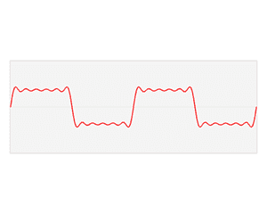

# 从音频中学习:傅立叶变换

> 原文：<https://towardsdatascience.com/learning-from-audio-fourier-transformations-f000124675ee?source=collection_archive---------22----------------------->

## 打破信号处理中的一个基本方程

## *相关文章:*

*   [学习音频:波形](/learning-from-audio-wave-forms-46fc6f87e016#60b2-e67809770e17)
*   [从音频中学习:时域特征](/learning-from-audio-time-domain-features-4543f3bda34c)
*   [从音频中学习:频谱图](/learning-from-audio-spectrograms-37df29dba98c)
*   [从音频中学习:梅尔标度、梅尔频谱图和梅尔频率倒谱系数](/learning-from-audio-the-mel-scale-mel-spectrograms-and-mel-frequency-cepstral-coefficients-f5752b6324a8)
*   [从音频中学习:音高和色度图](/learning-from-audio-pitch-and-chromagrams-5158028a505)

# 简介:

在 Wave Forms 中，我们看了什么是 Wave，如何将它们可视化，以及如何处理空数据。

在这篇文章中，我的目标是发展一种直觉，什么是傅立叶变换，为什么它在研究音频时是有用的，展示数学证明，使其计算效率高，并可视化结果。**我们在这篇(和相关)文章中使用的数据可以在我的本系列** **的** [**GitHub 存储库中找到。**](https://github.com/theadamsabra/MediumCode/tree/master/Learning%20From%20Audio)

考虑到这一点，我们开始吧。我们将首先初始化下面的必要变量和包:

# 从波形中回忆:

图 1 —作者图片

# 傅立叶变换:

## 什么是傅立叶变换？为什么重要？

看上面的图，我们可以看到不同的振幅峰值为独特的声音创造了独特的模式。这是因为所有复杂的声音——就像我们的声音——实际上只是许多正弦和余弦信号的总和。下面的`gif`展示了该目标的美好愿景:

[作者卢卡斯·v·巴博萨——自己的作品，公共领域](https://commons.wikimedia.org/w/index.php?curid=24830373)

需要注意的是，通过使用这种变换，我们将把音频从时域转换到频域。以下是关于这两者的一些要点:

*   时域着眼于信号幅度随时间的变化。这对理解它的物理形状很有用。为了绘制这个图，我们需要 x 轴上的时间和 y 轴上的振幅。这种形状让我们很好地了解了声音的大小。
*   频域观察我们记录的组成信号。通过这样做，我们可以找到一种声音的“指纹”。为了绘制这个图，我们需要 x 轴上的频率和 y 轴上的幅度。震级越大，频率就越重要。幅度就是 FFT 结果的绝对值。

## 离散傅立叶变换

`numpy`构建的 DFT 如下:

[来自加州大学圣巴巴拉分校的德里克·l·史密斯的方程。](https://web.math.ucsb.edu/~dls/Expository/2014-10-FFT.pdf)

学习傅立叶变换时，您可能会看到一个连续版本，即利用积分而不是求和，称为连续傅立叶变换。这种变换的离散形式通常用于计算机的运算。事实上，即使是离散形式，大多数计算机仍然缺乏适当的计算能力来求解下面的原始方程。DFT 有一些很好的特性，便于计算，称为快速傅立叶变换。

## 快速傅立叶变换

FFT 如下所示:

[来自加州大学圣巴巴拉分校的 Derek L. Smith 的方程。](https://web.math.ucsb.edu/~dls/Expository/2014-10-FFT.pdf)

不要让符号困扰你。在离散傅里叶变换中，你处理的是 x 和ω乘积的和。该等式将乘积之和一分为二，一个沿着奇数指数，另一个沿着偶数指数。相对于 DFT，上述过程可以用计算机过程更有效地建模。

现在，让我们想象一下 FFT 是什么样子的。在我们的应用程序中，我们将使用`numpy.fft.fft`函数，并将其应用于我们的声波。

图 2 —作者提供的图片

同样，可视化也有一些小问题。然而，这是一个非常简单的解决方法，因为 DFT 具有对称特性。这是有意义的，因为我们在左半部分的可视化模拟了右半部分的可视化。我们将把数组切成两半，从那里开始可视化。

图 3 —作者图片

# 结论:

在本文中，您现在应该能够提取任何类型的任何复杂信号的傅立叶变换，并找到其独特的指纹。

敬请关注即将发表的文章，因为它们将着眼于更深入的处理和可视化技术，让我们能够从音频中了解更多。

> 感谢您的阅读。