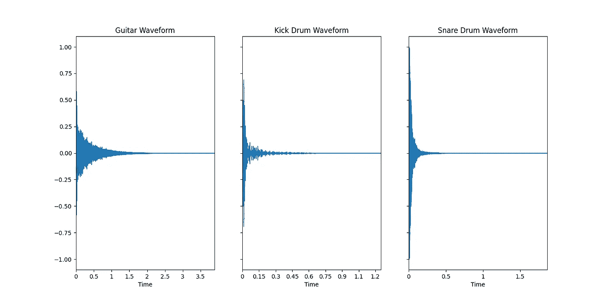
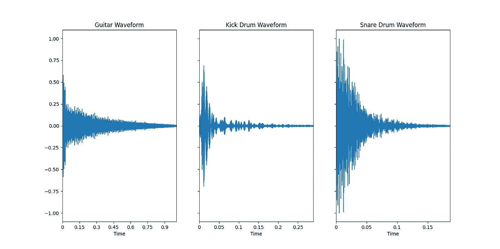

# 从音频中学习:波形

> 原文：<https://towardsdatascience.com/learning-from-audio-wave-forms-46fc6f87e016?source=collection_archive---------22----------------------->

## 波形介绍和零数据处理。

乔纳森·贝拉斯克斯在 [Unsplash](https://unsplash.com?utm_source=medium&utm_medium=referral) 上的照片

## 相关文章:

*   [从音频中学习:时域特征](/learning-from-audio-time-domain-features-4543f3bda34c)
*   [从音频中学习:傅立叶变换](/learning-from-audio-fourier-transformations-f000124675ee)
*   [从音频中学习:频谱图](/learning-from-audio-spectrograms-37df29dba98c)
*   [从音频中学习:梅尔标度、梅尔频谱图和梅尔频率倒谱系数](/learning-from-audio-the-mel-scale-mel-spectrograms-and-mel-frequency-cepstral-coefficients-f5752b6324a8)
*   [从音频中学习:音高和色度图](/learning-from-audio-pitch-and-chromagrams-5158028a505)

# 简介:

答 udio 是一个极其丰富的数据源。根据`sample rate` — *每秒采样的点数来量化信号* —一秒钟的数据可能包含数千个点。将这扩展到数小时的录音，你可以看到机器学习和数据科学如何与信号处理技术完美地交织在一起。

这篇文章旨在分析到底什么是波形，并利用 Python 中的`librosa`进行分析和可视化——与`numpy`和`matplotlib`一起。

# 波形:

`Waves`是重复的`signals`，根据它们的复杂程度，在振幅上振荡和变化。在现实世界中，`waves`是连续的、机械的——这与离散的、数字化的计算机截然不同。

那么，我们如何将连续的、机械的东西转化为离散的、数字化的东西呢？

这就是前面定义的`sample rate`的用处。比如说，录制的音频的`sample rate`是 100。这意味着，对于每一秒记录的音频，计算机将沿着`signal`放置 100 个点，试图最好地“跟踪”连续曲线。一旦所有的点都就位，一条平滑的曲线将它们连接在一起，以便人类能够可视化声音。由于录制的音频是以`amplitude`和`time`为单位，我们可以直观地说波形是在`time domain`工作的。

为了更好地理解这种声音，我们来看看三种声音:底鼓、吉他和小鼓。[本文的代码和数据可以在我的 GitHub 存储库中找到。](https://github.com/theadamsabra/MediumCode/tree/master/Learning%20From%20Audio)

载入数据。

既然数据已经载入，让我们来想象这些声音。

图 1

从一开始，我们就看到了可视化的一些问题。

虽然我们可以很容易地分辨出可视化之间的一些差异，但这并不像我们希望的那样明显。我们还知道，音频信号不会突然消失，事实上它们会逐渐消失，直到无法感知。这意味着就音频而言，这构成了`null`数据。

# 音频中的空数据:

有许多方法可以处理`time domain`中的`null`音频数据。然而，这种方法通常是最简单的。

给定`signal`和`signal`中`amplitude`的最小值`threshold`:

*   取信号中各点的`absolute value`
*   如果点数大于`threshold`，我们保留它。否则，我们删除它。

图 2

您可以将`thresholds`视为记录的一种参数。不同的`thresholds`对不同的声音有不同的作用。摆弄一下`threshold`是了解*如何*和*为什么*这种视觉变化的好方法。

既然数据已经从这些录音中移除，那么就更容易看出每个声音中的个性。吉他的形状更加统一，随着时间的推移逐渐消失。底鼓在开始时用力击打，然后很快淹没，留下一些残余的声音。小军鼓是响亮而沙哑的，你不会想重复听。

# 结论:

这就结束了用`librosa`在 Python 中处理音频信号的基础。敬请关注更多深入探讨如何从音频中学习的更高级主题的文章！

> 感谢您的阅读。

*注:所有未注明出处的数字均为作者。*