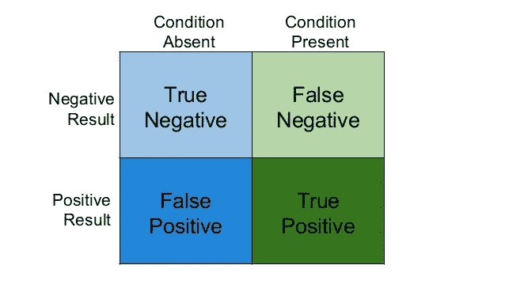
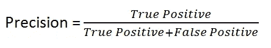
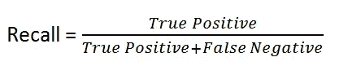
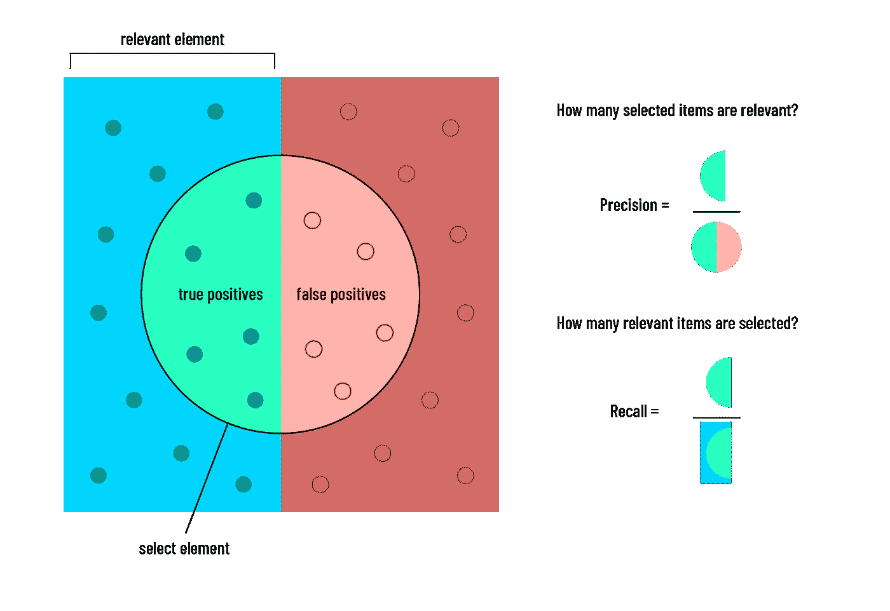
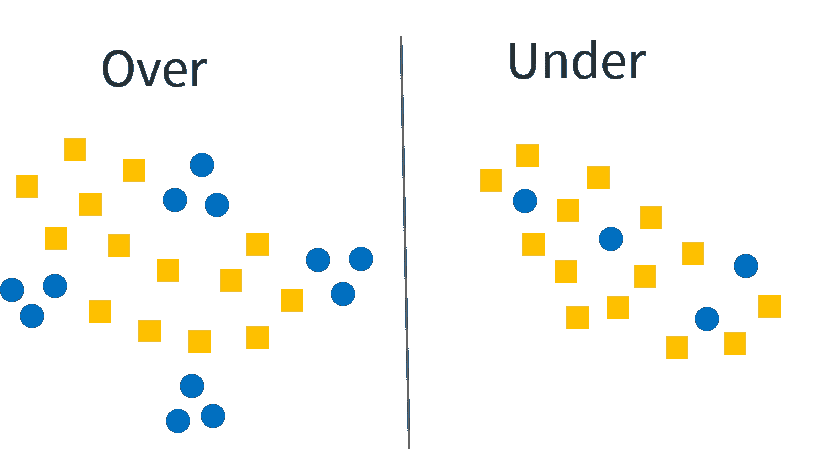
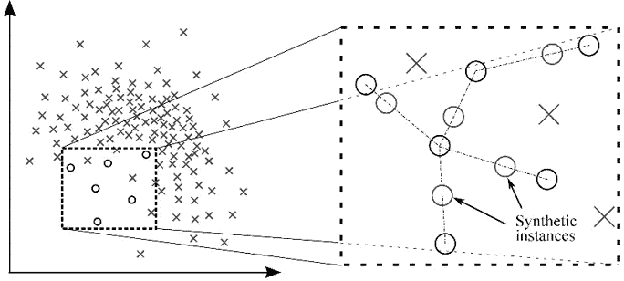

# 从不平衡数据集中学习

> 原文：<https://towardsdatascience.com/learning-from-imbalanced-datasets-b601a1f1e154?source=collection_archive---------29----------------------->

## 不平衡类是机器学习分类中的一个常见问题，其中每个类中的观察值比例不成比例。在本文中，我们提供了处理不平衡数据集的指南。

[艾德亚多·桑奇兹](https://unsplash.com/@eduardoequis?utm_source=unsplash&utm_medium=referral&utm_content=creditCopyText)在 [Unsplash](https://unsplash.com/s/photos/unbalanced?utm_source=unsplash&utm_medium=referral&utm_content=creditCopyText) 上拍照

数据科学家经常面临处理不平衡数据集的需求。事实上，不平衡类是机器学习分类中的一个常见问题，其中每个类中的观察值比例不成比例。

阶层失衡可以在许多领域找到，包括广告技术、医疗诊断、垃圾邮件过滤和欺诈检测。但大多数机器学习算法在每类样本数量大致相等的情况下工作得最好。这是因为大多数算法都是为了最大限度地提高精度和减少误差而设计的。

在本文中，我们提供了处理不平衡数据集的指南。但是在做我们推荐的任何事情之前，你应该首先确定你是否能**收集更多的数据**。获取更多的欠采样类总是最好的解决方案。

在你收集了尽可能多的数据之后，处理不平衡的数据集包括选择三件事:**正确的度量标准**，使用什么样的**重采样方法**，以及**正确的建模框架**一旦你预处理了你的数据。‍

**选择正确的指标**

> 准确性悖论是一个矛盾的发现，即在预测分析中进行分类时，准确性不是预测模型的一个好指标。这是因为一个简单的模型可能有很高的精确度，但是太粗糙而没有用。例如，如果女性对男性的发生率占主导地位，在 99%的病例中被发现，那么预测每个病例都是女性的准确率将为 99%。[维基百科](https://en.wikipedia.org/wiki/Accuracy_paradox)

仔细观察这种自相矛盾的行为会发现两种类型的错误分类:假阳性和假阴性。在一个涉及火灾警报的例子中，假阳性将包括在没有火灾时预测有火灾(预测阳性)；假阴性是错误地预测没有火灾(预测阴性)，而实际上有火灾。在准确性悖论的情况下，我们可以看到，我们所有的错误都是预测肯定的(意味着有火灾)而不是火灾，因为我们所做的所有预测都不是火灾。这给我们留下了和负面观察一样多的假阴性。

作者照片

为了更仔细地检查我们在假阳性和假阴性方面准确或不准确的地方，我们需要查看密切相关的指标精度和召回。为了全面评估一个模型的有效性，你必须同时检查**精度**和**召回**。精确度和召回率是可选的性能指标:

*   **精度**:实际上有多少比例的肯定识别是正确的？

*   **回忆:**正确识别实际阳性的比例是多少？

图片来自[维基百科](https://en.wikipedia.org/wiki/File:Precisionrecall.svg)

不幸的是，精确和回忆天生就是矛盾的。也就是说，提高精度通常会降低召回率，反之亦然。精确和召回的重要性取决于问题的商业逻辑。例如，在火灾警报的情况下，我们想要捕捉所有的火灾，即使代价是每隔一段时间触发一次假警报。这意味着回忆比精确更重要。

例如，在 YouTube 推荐中可以看到相反的情况。由于推荐一些你可能不喜欢的东西并没有真正的伤害，所以错误的否定很容易被忽视。与此同时，推荐你不知道并且可能喜欢的东西的好处超过了你仅仅跳过视频的风险。

为了全面了解您的预测的假阳性和假阴性图，我们建议在混淆矩阵的框架中查看您的模型的分数。

最后，如果你的目标是选择一个指标，而不是同时处理两个指标，你可能要考虑 F1 的分数。F1 分数是精确度和召回率的调和平均值，其中 F1 分数在 1 时达到其最佳值(完美的精确度和召回率),在 0 时最差。

**重采样方法**

数据科学家有多种重采样方法可供选择，每种方法都有各自的优缺点。在这里，我们将重点关注行业中使用的一些更流行的方法。由于不同的建模任务可能需要不同的重采样方法，我们建议您尝试几种方法，以探索哪种方法最适合您的特定问题。

*   **随机欠采样** 在随机欠采样中，你从过表示类中选择随机观察值。这应该作为更复杂的建模工作的基线。请注意，随着代表过多和代表不足的标签之间的比率增加，这种方法可能会产生越来越大的偏差。偏差是由于如果不平衡太大，随机样本可能不会从特征空间的整个区域采样。举个例子，假设某个游戏 app 里的标签是购买者，我们有三十六万非购买者。除此之外，数据中的每一行都表示用户的年龄和性别。如果我们以 1:1 的比例进行抽样，我们可能不会对特定年龄以下的女性用户的负面标签进行抽样，或者由于样本量较小，我们的样本通常不代表被抽样的人群。这可能会导致某些特征在预测标注时显得比实际更有影响力。
*   **随机过采样** 在随机过采样中，从代表性不足的类别中复制随机观察值。在随机欠采样的情况下，这种采样方法可以用作更复杂建模工作的基线。注意，在尝试过采样技术之前，你应该**总是**分成“测试”和“训练”组*。分割数据之前的过采样可以允许在“测试”和“训练”集中出现完全相同的观察结果。此外，由于阳性标签被重复多次，因此在使用随机过采样时，模型过拟合训练数据是非常常见的。*

作者照片

*   **聚类质心** 在这种重采样方法中，将一些聚类算法应用于数据，将每个数据点分配给一个聚类，并按等于该聚类大小的比例按聚类执行欠采样。这旨在解决特征空间中的区域在随机下采样中可能不被表示的问题。如果回到用户年龄和性别的例子，聚类模型会根据特征空间确定数据中有 K 个聚类；一群可能是老年女性，另一群可能是年轻男性，等等。然后，将根据每个聚类在数据中的大小按比例进行采样，而不是统一从整个数据集中进行采样。因此，向下采样的数据必然会更准确地代表真实群体(我们从中采样的群体)。

**SMOTE(合成少数民族过采样算法)** 这种重采样方法沿着观察值和其最近的少数民族邻居之间的线生成新的少数民族类样本。这种方法的一个优点是，它允许您避免过拟合，过拟合是在随机过采样中添加少数实例的精确副本时发生的。这种方法有助于强调存在大比例阳性标记的区域，而不是过度拟合可能无法概括的单个阳性观察。

照片由 [Rohit Walimbe](https://www.datasciencecentral.com/profiles/blogs/handling-imbalanced-data-sets-in-supervised-learning-using-family) 通过[数据科学中心](http://datasciencecentral.com)拍摄

‍ **选择正确的建模框架** 每当你遇到机器学习问题时，尝试各种算法是一个很好的经验法则。当您处理不平衡的数据集时，这样做尤其有益。

决策树通常在不平衡数据上表现良好。他们通过学习“如果/否则”问题的层次结构来最小化数据中的熵。

某些模型允许您为损失函数分配权重，以便处理数据集由大小不等的类组成的类。在 scikit-learn 框架中，这通常被称为“class_weights ”,它通常包含一个字典，定义每个类应该受到多少惩罚。这个参数也存在于 XGBoost 框架中，它被称为“scale_pos_weight”

无论您选择什么样的建模框架，我们建议从阅读文档开始，并检查模型是否支持针对不平衡数据情况的某种损失函数惩罚。

**结论**

正如我们提到的，不平衡数据是一个常见的问题。不要让它吓倒你。虽然处理不平衡的数据的确具有挑战性，但是只要你按照我们在这里提供的指导方针仔细计划，这也是可行的。

你应该总是从小事做起。仔细阅读一种方法，确保你确切地知道在引擎盖下发生了什么。如果你发现一种方法给你带来了价值，你可以通过尝试同一系列的不同方法来进一步调整它。

另外，**尊重基线**。将你所做的一切与一个简单的基线进行比较，以确保你没有浪费时间，并且通过对你的数据实施这些方法，你实际上已经足够移动指针了。我们建议最简单和最强的基线是随机过采样和随机欠采样。

最后，**使用外部库**。正如数据科学中 99%的情况一样，你不是第一个遇到你所面临的问题的人！寻找能够解决你正在处理的问题的开源库。如果 python 是您数据科学的首选武器(应该是！)，我们推荐不平衡学习(下面的链接)。

**有用的资源**

以下是一些资源，可进一步帮助您找到处理不平衡数据集的方法:

*   Bigabid 数据科学家 Ido Zehori 发表了一篇关于不平衡数据集的演讲— [这里](https://youtu.be/P0YN5-PFOU0)。
*   上图[的演讲——这里是](https://docs.google.com/presentation/d/1ef97mUt38OAV4rZMqFXdu0DsKcw-eokyoF7RTzuYXGo/edit?usp=sharing)。
*   不平衡-学习 python 包— [此处](https://github.com/scikit-learn-contrib/imbalanced-learn)。
*   推荐论文:
    [不平衡数据集的数据挖掘:综述](http://link.springer.com/chapter/10.1007/978-0-387-09823-4_45) [从不平衡数据中学习](http://ieeexplore.ieee.org/xpls/abs_all.jsp?arnumber=5128907)
*   **这篇博文最初是为** [**Bigabid 博客**](https://www.bigabid.com/blog) **而写的，可在** [**这里**](https://www.bigabid.com/blog/data-learning-from-imbalanced-datasets) 找到