# 从多模态目标中学习

> 原文：<https://towardsdatascience.com/learning-from-multimodal-target-5d3d2ea0d4c5?source=collection_archive---------15----------------------->

## 混合密度神经网络——使用张量流违反假设、实施、分析和应用。

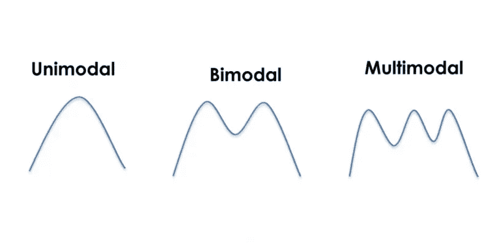

来源:作者

# 介绍

出于统计和商业原因，为模型评估进行预测并测量其不确定性是非常重要的。基本上，对于监督模型，我们有预测值(x)和目标值(y ),我们尝试使用预测值预测目标值，并量化我们预测的效果。这通常通过最小化平方和或交叉熵误差函数来完成，在连续预测值或分类变量的后验概率的情况下，该函数输出每个预测值的近似平均值。

**商业案例示例**

让我们考虑一家销售手表的电子商务公司(ABC ),该公司有一个典型的亚马逊类型的业务模型，其中卖家列出要销售的产品，买家访问这些产品。当另一个卖家试图列出类似产品时，ABC 希望对产品列表价格进行建模，以提供建议价格。下面是一款数字式手表的标价分布。

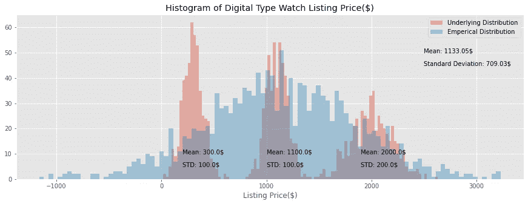

数字型手表上市价格分布|来源:作者

从分布来看，一块数字手表可以卖到 20 美元到 2500 美元。有卖家在卖 3 种不同价位的手表。$20–$500, $700–$1500, $1600–$2500.这种类型的数据违反了线性回归的单峰正态假设之一。然而，在实际场景中，我们不知道基础分布，因为经验分布仍然是正态分布。

**拟合模型和违反假设**

如果我们用手表的**类型**作为唯一的预测器来拟合一个线性回归模型，那么通过对第一类手表的过度预测和对第三类手表的低预测，它将为**数字**类型手表预测 1133 美元。标准偏差是预测中的一个误差，将是 709 美元，使这个模型彻底失败。如果我们用这个预测的平均值(mu)和标准差(sigma)生成随机样本，它也会生成空白区域之间的价格。负价格也一样！[注意:我们在拟合模型之前对价格进行对数变换，因为价格无论如何都不是正态分布的，但为了简单起见，我们假设它是正态分布的]。即使将神经网络拟合到这种类型的数据也是完全失败的模型，因为它仍然试图最小化平方误差函数的总和。不同类型的手表标准差不一样怎么办？让我们考虑下面的小提琴情节:

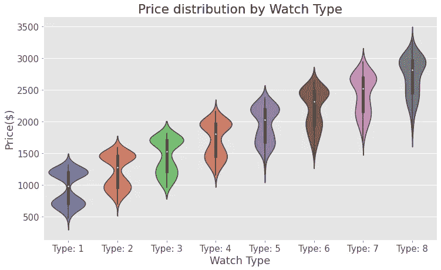

方差递增的双峰分布|来源:作者

每种类型都是双峰分布模型，在不同的水平上有不同的方差。不同类别的手表类型变化的差异。如果我们将神经网络或线性回归拟合到此数据，并且仅使用手表类型作为预测因素，那么误差的预测和标准偏差会发生什么变化？这个数据是否遵循了回归的所有假设？

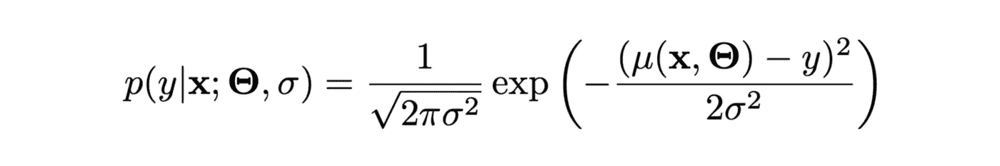

正态分布方程|来源:维基百科

基本上，当我们最小化线性函数或平方和时，我们最小化给定 **x** 的线性函数μ的输出的平方误差项(μ( **x** ，**θ**-*y*)以及函数的参数(**θ)**。它是唯一一个依赖于 **x** 的μ，并丢弃了其余的参数(标准差)，也称为同方差。

**我们可以通过手表类型学习多模态分销参数吗？是，带 MDN**

# 高斯混合模型和混合密度网络

我知道很多人对 GMM 很熟悉，但我还是想描述一下它和 MDN 的区别，因为它们非常相似。GMM 是一种期望最大化无监督学习算法，作为 K-means，除了学习假设分布的参数。K-means 在重叠聚类的情况下不起作用，而 GMM 可以通过学习底层分布的参数来执行重叠聚类分割。对于上面的例子，我们可以通过应用 GMM 来导出基本的三态分布的参数。理论上，GMM 通过优化由下式给出的给定概率分布来计算 n 个分量(聚类)以及相关的 mu、sigma 和聚类成员概率:

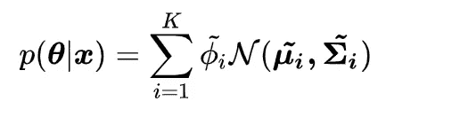

https://en.wikipedia.org/wiki/Mixture_model GMM 似然函数|来源:

其中 K 是聚类数，phi 是聚类潜在概率。使用 EM 算法，我们可以学习φ、μ和σ。

对于我们的 ABC 示例，我们用 1500 * 3[样本数*聚类数]**φ**计算 3 个**μs**和 3 个**μs**。为了便于理解，我在上述数据集上训练了 GMM，并验证了集群 mu 和 sigmas 是否接近真实 mu 和信号。

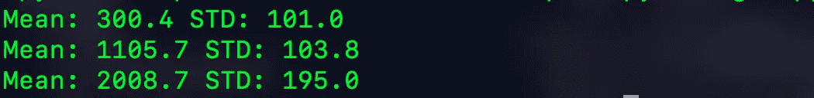

输出【[https://github.com/dwipam/MDN/blob/master/gmm.py](https://github.com/dwipam/MDN/blob/master/gmm.py)】|来源:作者

这为混合密度网络(MDN)奠定了基础。我们可以学习依赖于预测器的模型核参数。为此，我们将把我们的核限制为高斯核。MDN 优化了与 GMM 相同的似然函数，并为我们数据集中的每个样本输出 **mu、sigma 和 phi** 。

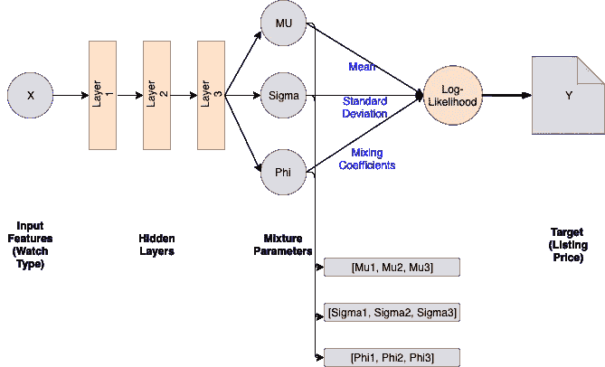

3 集群 MDN 架构|来源:作者

在不深入数学细节的情况下，让我们跳到训练模型。克里斯托弗·贝肖普已经解释得比我所能解释的还要好！

# 构建和培训 MDN

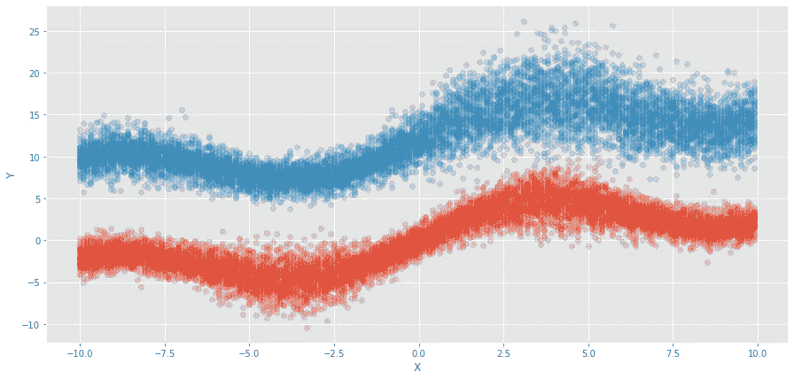

综合数据集平均分布在 2 个集群和 x 个相关参数(mu，sigma) |来源:作者

**生成数据**

我们将尝试生成具有以下 x 和 y 关系的数据

```
x_ = sin(0.5 * x) * 3.0+ x * 0.5)
f1(x) = N(x_, square(x_)/15) + N(0,1) # Cluster 1 y
f2(x) = N(f1(x) + 12, square(x)/100) + N(0,1) # Cluster 2 y
This equation generates data with 2 distinct cluster and x dependent variance.
```

**试衣 MLP**

一个完全连接的神经网络用平方和损失函数拟合数据，并从预测中产生随机样本。如前所述，预测值是平均值，标准偏差用以下公式计算

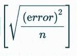

模型的标准差(适马)|来源:作者

其中误差为(y 模型预测)

正态随机样本由平均值和标准差生成。

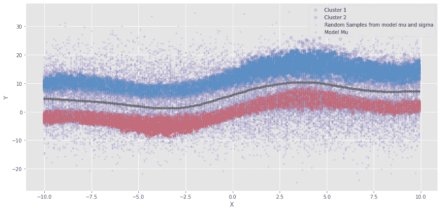

MLP 估计|来源:作者

这是一个问题，模型通过对 50%的数据预测不足，而对剩余的 50%的数据预测过度，在空白区域内进行预测。因为 means 和 sigmas 是数据相关的，所以让我们尝试使用 MDN

**构建 MDN**

全连接 4 层神经网络

第一部分相当于某人会为任何其他问题创建一个神经网络。在这里，我们创建了 4 个隐藏层神经网络，每个分别具有(50，20，20，20)个节点。我使用的是 Tanh 激活，但这里任何其他激活都可以，因为我们正在尝试学习的函数是一个简单的函数，对任何其他激活函数都不会有问题。

定义管理部门、西格玛、phi

然后，我们为每个μ、σ和φ创建“k”大小向量。在我们的例子中，K 是 2

*   我们的目标具有从-ve 到+ve 的值，因此我们不会使用激活函数来估计**均值** (mu)。
*   **标准差** (sigma)不能为负，因此我们可以使用 softplus、elu、relu 或任何其他变量，只要它输出值> 0，并且不像 sigmoid 那样限制输出。
*   **在所有 k 上计算后验聚类分配概率** (Pi)。由于它们是互斥事件，我们使用 softmax 激活函数。

可以使用张量流概率内置函数来定义损失函数(TFP . distributions .**mixture same family**)。然而，如果你真的想计算损失，我们仍然可以用下面的公式。

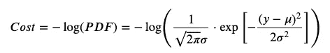

MDN 负日志损失|来源:作者

无 tfp 的 Tensorflow MDN 损耗。mixture 同一个家庭

损失是使用上述相同的 **GMM** 似然方程计算的。首先，计算每个分量的**μ**和**σ**，并计算后验概率。然后乘以关联的分量**φ**并对所有后验概率求和得到似然。然后记录可能性，并对所有样本求和，得到对数可能性。那么平均损失就是负对数似然的平均值，它将进一步进入优化器。如果您想节省一个步骤，让 TensorFlow 来处理，我们可以使用 tensor flow-probability . distributions .**mixture same family。张量流概率**被**数据科学家、ML 研究人员和统计学家**广泛用于概率建模。

带 tfp 的 Tensorflow MDN 损耗。mixture 同一个家庭

**TFP . distributions 几何**定义分类损失。由于我们局限于正态分布，我们可以用张量流概率来定义它。我们可以定义正态分布方程来代替！。MixtureSameFamily 会将 mus 和 sigma 的向量转换为混合分布的协方差矩阵。然后使用 log_prob 返回 log_likelihood，最后最小化负的 log-likelihood。

定义优化程序

人们可以使用任何优化器，但我决定你 RMSProp，因为它仍然比随机梯度下降优化器更好。

最后，我们训练我们的网络，从混合分布中生成随机样本，并查看预测平均值(mu)、标准差(sigma)和聚类概率(phi)。

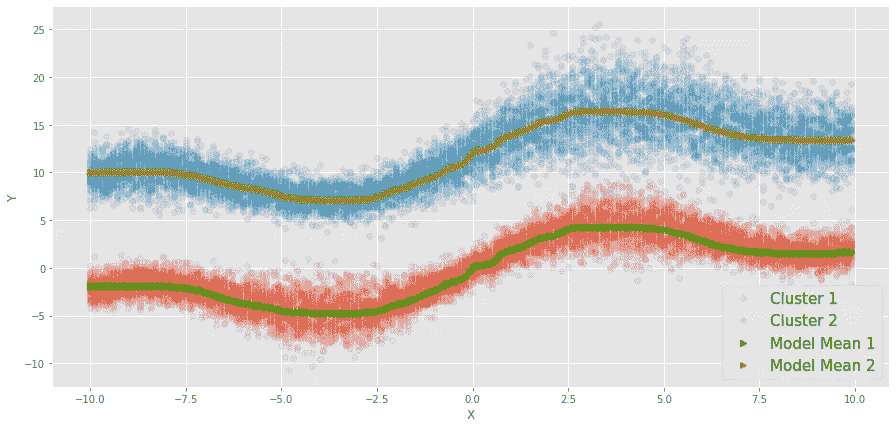

MDN 估计平均值|来源:作者

在学习了包含 2 个组件的 MDN 之后，我们得到了我们所希望的。现在均值的估计不在空白区域，正确地估计了每 x 的双峰分布均值。

为了查看方差，我们可以生成随机样本，并确保这些样本属于各自的聚类。

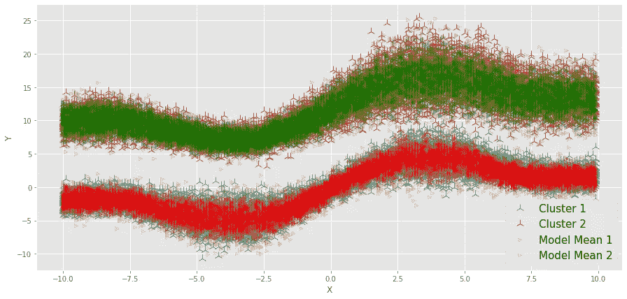

来自 MDN 估计平均值和 sigmas 的随机样本|来源:作者

与 MLP 模型预测相比，我们可以看到两个不同的集群重叠的基本事实，从而准确估计 x 依赖的双模态分布参数。

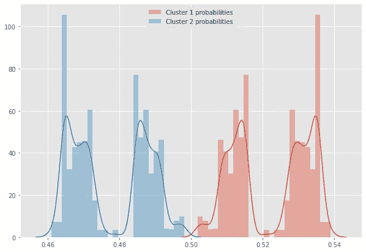

估计聚类概率分布|来源:作者

聚类概率(phi)非常接近 50%(46%-54%是模型参数的方差，每次训练可能不同)，因为我为每个 x 的每个聚类生成了相同数量的样本，即 P(cluster=1|x) = P(cluster=2|x)。如果不是这种情况，那么我们可以看到不同的集群分配概率的分布。

# 结论

通过我们之前的 ABC 示例，该公司可以拟合 MDN 并获得对价格分布的真实理解。如果我们不知道我们的目标是多模态分布，聚类概率(phi)可以很好地理解这一点。实际上，训练一个 MDN 是非常耗时和困难的，因为对分布的假设可能不成立。MDN 可以用来学习不同家族的混合分布，但是你的模型和你的假设一样正确！

通过这篇简单的博文，我展示了平方和函数的缺点，以及应用 MDN 测量参数估计的不确定性的优点，以及它们对业务问题的重要性。鉴于其简单的架构和易于实现(感谢 TF)，我很想听听读者的想法！

培训笔记本:

[](https://github.com/dwipam/MDN/blob/master/MDN_NOTEBOOK.ipynb) [## dwipam/MDN

### permalink dissolve GitHub 是 4000 多万开发人员的家园，他们一起工作来托管和审查代码，管理…

github.com](https://github.com/dwipam/MDN/blob/master/MDN_NOTEBOOK.ipynb) 

# **参考文献:**

MDN 论文-【https://github.com/dwipam/MDN/blob/master/MDN.pdf】T2TF mixture same Family-[https://www . tensor flow . org/probability/API _ docs/python/TFP/distributions/mixture same Family](https://www.tensorflow.org/probability/api_docs/python/tfp/distributions/MixtureSameFamily)Shaked 的博客-[https://engineering . taboo la . com/predicting-probability-distributions/](https://engineering.taboola.com/predicting-probability-distributions/)
GMM-[https://en.wikipedia.org/wiki/GMM](https://en.wikipedia.org/wiki/GMM)