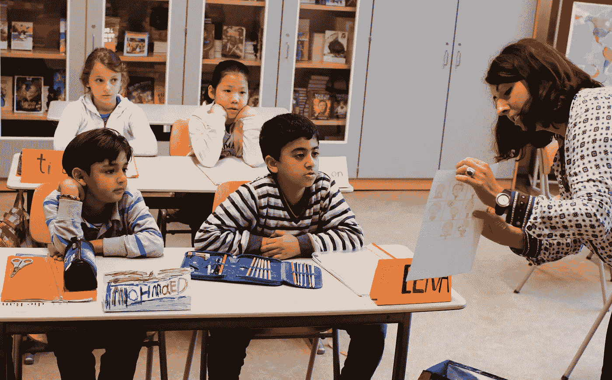
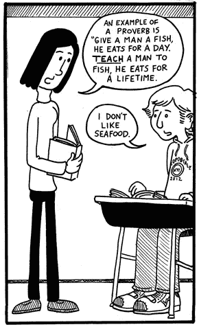

# 向中华民国学习

> 原文：<https://towardsdatascience.com/learning-from-the-roc-797e19ac8003?source=collection_archive---------38----------------------->

美国教育界似乎刚刚赶上数据科学家多年前就知道的东西。你从错误中学习。

如果说我们的教育系统现在才意识到这一点听起来有些牵强，你并不孤单。这是一个古老的格言，但不知何故它跳过了应用教育理论。不相信我？那就相信哥伦比亚大学心理学教授珍妮特·梅特卡夫(Janet Metcalfe)吧，她在 2017 年出版了《[从错误中学习](https://www.annualreviews.org/doi/10.1146/annurev-psych-010416-044022)》(就在三年前！).



在这篇开创性的论文中，梅特卡夫博士指出了大量的证据，证明美国教师一贯忽视错误，而是教给学生得出正确答案的方法(即公式)。一个并不令人惊讶的变化是，教授一种方法远不如从错误中学习。日本教师采用的策略(通过错误分析进行教学)和比较这些国家的国际考试分数证实了这一点。要是这两个学科之间有一些交叉授粉就好了！对我们这些数据科学家来说，很明显，从错误中学习是学习一个概念的最好方法。在她的论文中，Metcalfe 博士继续论证了如何从错误中学习更好，并进一步量化了优化学习的条件。

> 你选择最小化的损失会改变你的机器的学习。

这是我想在数据科学背景下讨论的最后一部分，即优化学习中的细微差别。我们能从教育中学习吗，就像教育应该从数据科学中学习一样？

# 教师:学生::数据科学家:ML 算法

你还记得标准化考试中的那些类比吗？a 之于 B，如同 C 之于？好吧，这里有一个给你:老师对于学生，就像数据科学家对于机器学习算法一样。顺便说一句，我是一名教师，这个类比并不意味着贬低教师的工作(这是很难的东西！).

这个类比非常适合我们的环境，尤其是如果我们(显著地)简化了老师的角色。想想看，老师的目标是帮助学生学会做出正确的预测。事实上，这些预测非常好，我们称之为“答案”。老师采用一套策略来帮助学生尽可能快地学习。其中一个策略就是指出错误。然后，学生拿起这些错误，并(希望)分析它们，以理解为什么他们的预测是不正确的。然后，他们更新他们对这个概念的心理模型，并再次尝试。对人类来说，这个过程是**高效但不快速**。学生通过几个例子学习一个新概念，但是需要一些时间来整合信息。



这是一个好的还是一个坏的例子？

数据科学家做完全相同的事情。我们的目标是帮助我们的 ML 算法做出正确的预测。如果他们的预测足够好，那么这些算法就会“回归自然”。就像老师一样，数据科学家指出算法的错误，此时算法分析错误并更新其数字模型。对于计算机来说，这个过程很快，但效率不高。算法可以快速更新自己的模型，但是改变模型需要很多例子。

# 高效学习

为什么学生，甚至人类，学习效率很高？我的直觉是，我们以一种非常微妙的方式分析错误，这让我们理解*为什么*一个预测是不正确的。这导致我们心智模型的最佳更新，让我们从更少的错误中学习。它还有一个额外的好处，那就是我们可以在特定的条件下优化以获得正确的答案。让我解释一下:

想象你是一个正在觅食的早期人类。你刚刚看到你的朋友胡摘了一个浆果，吃了它，然后死了(悲惨的故事，对不起)。幸运的是，这是一个学习的时刻！你去研究浆果，注意到它是紫色带黄色斑点的。两天后，你再次觅食，发现了带有黄绿色斑点的紫色浆果。你吃吗？可能没有！犯错的代价非常高，所以即使这个浆果不完全符合模式，也不值得冒这个险。

这种情况下的正确答案是“吃任何不会杀死我们的东西”。所以浆果可能被错误地贴上了有毒的标签(称之为假阳性)，但至少你没死。你可以说是以牺牲精确性为代价来优化召回。

想想这个词语的选择。你(你的早期人类版本)正在为回忆而优化。这听起来很像机器学习算法做的事情。事实上，这正是《T4》杂志打算做的事情。它通过最小化损失来优化系统。你(数据科学家)选择最小化的损失改变了你的机器学习的内容。

# 选择你的损失函数

如果你选择最小化的损失改变了你的机器的学习，难道你不应该选择一个最大化你感兴趣的度量的损失吗？在一个完美的世界里，是的，但不幸的是，你必须与损失函数的限制作斗争。

一般来说，损失函数需要是光滑的，理想情况下也是凸的。如果它不是平滑的，那么你就不能计算一个梯度来更新模型参数。如果它不是凸的，那么你不能保证达到全局最小值，或者有时根本不能达到任何优化。损失函数也不能是“单边的”——例如，只测量精度或召回率。“单边”损失函数会将模型推向“全有或全无”行为，以使损失最小化。最后一点需要注意的是，损失函数需要采用以下形式:


其中 *y* 是地面真实向量，ŷ是概率预测。

这些限制让你的选择更少，但绝不意味着你没有选择。例如，如果你有兴趣改进的指标是受试者工作特性(ROC ),那么你应该训练它的积分。您应该仔细考虑您有兴趣改进的指标，并在可能的情况下编写一个损失函数来优化该指标。

# 向中华民国学习

说到这里，**你是如何从接收机工作特性中学习到**的？幸运的是，一个团队在 2003 年发现了如何做到这一点！[你可以点击这里阅读他们的出版物。这个损失在 Keras 中没有实现，但幸运的是，你很容易实现自己的损失函数。下面的代码是(非常)稍微修改过的版本，来自现在已经不存在的 TFLearn 库。](https://pdfs.semanticscholar.org/df27/dde10589455d290eeee6d0ae6ceeb83d0c6b.pdf)

为了训练 auROC，在一个单独的单元中初始化这个函数。然后，在编译模型时引用该函数:

```
model.compile(optimizer = ‘adam’, loss = auROC(), metrics = …)
```