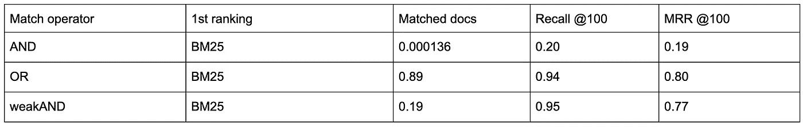
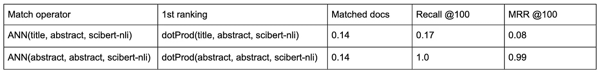
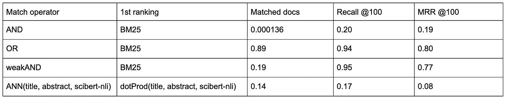

# 利用新冠肺炎开放研究数据集从无标签数据中学习

> 原文：<https://towardsdatascience.com/learning-from-unlabelled-data-with-covid-19-open-research-dataset-cded4979f1cf?source=collection_archive---------30----------------------->

## 文本搜索结果的客观标准和一些令人惊讶的结果

新冠肺炎开放研究数据集可以帮助研究人员和卫生界对抗全球疫情。Vespa 团队通过发布基于数据集的[搜索应用](https://cord19.vespa.ai/)做出了贡献。*由于数据没有可靠的标签来判断好的搜索结果和坏的搜索结果，我们想提出客观的标准来评估不依赖于人注释标签的搜索结果。我们使用这个标准来运行实验，并评估术语匹配和语义信号所提供的价值。然后，我们表明，即使在考虑一个专门为科学文本设计的模型的微调版本时，语义信号也只能产生很差的结果。*


照片由[国家癌症研究所](https://unsplash.com/@nci?utm_source=unsplash&utm_medium=referral&utm_content=creditCopyText)在 [Unsplash](https://unsplash.com/s/photos/medical?utm_source=unsplash&utm_medium=referral&utm_content=creditCopyText) 上拍摄

由艾伦人工智能研究所发布的新冠肺炎开放研究数据集(CORD-19)包含超过 44，000 篇学术文章，其中包括超过 29，000 篇全文，涉及新冠肺炎和冠状病毒家族，供全球研究界使用。它的发布是为了动员研究人员应用自然语言处理的最新进展来产生新的见解，以支持与这种传染病的斗争。它确实做到了。

它一发布，就有了一个 [Kaggle 挑战](https://www.kaggle.com/allen-institute-for-ai/CORD-19-research-challenge/)，一个[数据集资源管理器](https://cord-19.apps.allenai.org/)，[微调嵌入模型](https://github.com/gsarti/covid-papers-browser)和一个收集标记数据的运行:

鉴于我对 MS MARCO 数据集中包含强烈术语匹配偏差的标签的[最新体验](https://medium.com/@thigm/why-you-should-not-use-ms-marco-to-evaluate-semantic-search-20affc993f0b?source=friends_link&sk=72816c998048e220fceaa0e044cb42bf)，以及我们 [vespa.ai](https://vespa.ai/) 希望快速围绕 CORD-19 数据集构建一个[搜索应用](https://cord19.vespa.ai/)的事实，我决定花一些时间思考如何在没有标签数据的情况下在不同匹配标准和排名函数之间进行评估。

# 文本搜索的客观标准

*我们的目标是建立一个客观的标准，摆脱在没有可靠标签时常用的“看起来足够好”的标准。我的建议很简单，我们可以使用文章的标题作为查询，并将相关摘要视为查询的相关文档。*


Marc A 在 [Unsplash](https://unsplash.com/s/photos/dart?utm_source=unsplash&utm_medium=referral&utm_content=creditCopyText) 上拍摄的照片

这个标准很简单，可以扩展到大量数据，因为我们不依赖于人工注释，而且它是有意义的。请这样想，如果您将标题用作查询，而给定的方法无法检索正确的摘要并将其包含在结果列表的前 100 名中，那么对于 CORD-19 搜索应用程序的上下文来说，我们有一个非常次优的排名函数。

# 结果

本节总结了所获得的一些结果。我们在此报告三个重要指标。查询匹配的文档的百分比、前 100 个位置的召回以及考虑返回的前 100 个文档的平均倒数排名(MRR)。

## 术语匹配

表 1 示出了通过对具有术语匹配信号 [BM25 分数](https://docs.vespa.ai/documentation/reference/bm25.html)的文档进行排序而获得的结果。第一行显示了当我们只匹配包含标题中每个单词(和操作符)的摘要的文档时的结果。这种方法限制太多，只匹配一小部分文档(0.01%)，因此错过了许多相关的摘要，导致召回率和 MRR 指标很差(分别为 20%和 19%)。



表 1:涉及术语匹配的关键结果指标。

第二行匹配包含至少一个标题(或操作符)单词的摘要的所有文档。这太宽泛了，几乎匹配了语料库中的所有文档(89%)，但却带来了良好的召回率和 MRR 指标(分别为 94%和 80%)。

当使用 [Vespa weakAND operator](https://docs.vespa.ai/documentation/using-wand-with-vespa.html) 时，可以获得中间地带。它根据一个简单的计算术语匹配方程跳过许多文档，导致它只匹配 19%的语料库，同时保留了与更昂贵的 OR 运算符检索到的文档相当的召回率和 MRR 指标(分别为 95%和 77%)。我们还可以调整用 weak 和检索多少文档。在这种情况下，我们将其设置为 1.000 个文档，以便与我们在语义搜索实验中使用的最近邻操作符进行比较。

## 语义搜索

表 2 的第一行报告了用语义搜索获得的结果。对于这个实验，我们决定使用 [scibert-nli 模型](https://github.com/gsarti/covid-papers-browser)，它是 [AllenAI 的 SciBERT](https://www.aclweb.org/anthology/D19-1371/) 的微调版本。我们对这个模型抱有很高的期望，因为它是一个为科学文本设计的模型的微调版本。



表 2:语义搜索结果的关键指标

然而，结果并不符合我们的期望。我们平均检索了大约 14%的语料库，其中[Vespa nearest neighborhood 操作符](https://docs.vespa.ai/documentation/reference/query-language-reference.html#nearestneighbor)被设置为检索 1000 个文档。这意味着我们基于标题和抽象嵌入之间的距离检索至少 1000 个文档，其中嵌入由 [scibert-nli 模型](https://github.com/gsarti/covid-papers-browser)构建。排名函数被设置为标题和抽象嵌入之间的点积。这种设置导致了我们实验中最差的召回率和 MRR(分别为 17%和 8%)。

当我查看结果时，首先想到的是代码有问题。所以为了检查这一点，我决定运行相同的实验，但是现在使用抽象作为查询。然后，任务变成了试图自我恢复的抽象。如果设置是正确的，结果应该是(接近)完美的，因为相同嵌入之间的距离应该近似为零(除了舍入误差)。

表 2 的第二行报告了这个健全性检查实验，并验证了我们的设置，获得了完美的回忆和近乎完美的 MRR。当应用于嵌入时，这至少消除了匹配阶段、排序函数和实验设置实现完全出错的可能性。因此，语义模型的糟糕表现继续作为一个奇怪和令人惊讶的结果冲击着我们。

# 评论

我们尽最大努力清理数据，使实验中只包含有意义的标题和摘要，这样语义搜索实验就不会受到不公平的对待。我们排除了许多标题和/或摘要明显错误的文章，如“作者索引”或“主题索引”。清理将考虑的文档数量从 44，000 个减少到大约 30，000 个。

之后，我们创建了标题和抽象嵌入，没有额外的预处理步骤，因为我们相信这是大多数人将如何使用它:

```
title_embedding = model(title)
abstract_embedding = model(abstract)
```

当然，如果有迹象表明这将显著改善结果，我们愿意接受关于如何通过微调模型从文本构建嵌入的建议。所有嵌入都被归一化(L2 范数)为长度 1。

我们还结合了术语匹配和语义信号，但与纯粹的术语匹配设置相比，没有明显的改进。

# 结论

表 3 总结了这里讨论的结果。到目前为止，最明显的赢家是`weakAND + BM25`组合。语义搜索得到的结果令人失望，值得进一步研究。强调我们在搜索上下文中使用和评估语义模型是很重要的。这里报告的(差的)性能并不一定适用于其他语义任务。



表 3:涉及术语匹配和语义搜索的关键结果指标

拥有客观的标准来评估不依赖于人工注释数据的搜索结果是很重要的，这不仅对于没有显式标签的情况，如 CORD-19 数据集。它在处理具有有偏差标签的数据集时也很有用，例如，MS MARCO 数据集[偏向于术语匹配信号](/why-you-should-not-use-ms-marco-to-evaluate-semantic-search-20affc993f0b)，这可能是由于其数据收集设计。