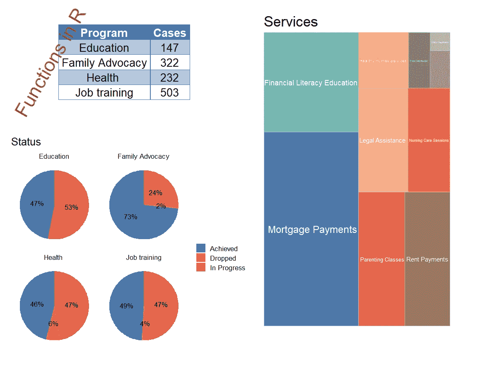
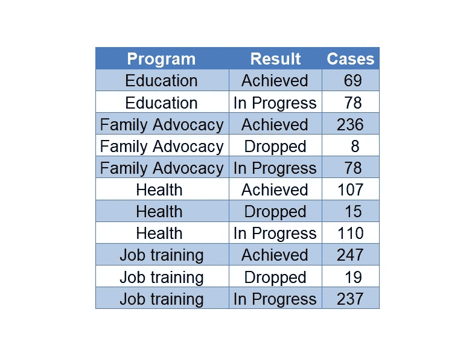
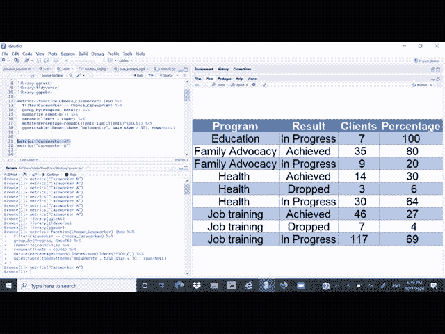
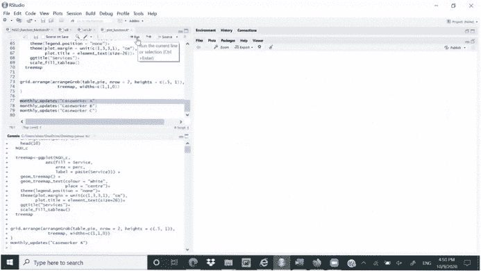

# 使用 R 函数进行项目监控

> 原文：<https://towardsdatascience.com/learning-how-to-create-function-in-r-can-be-extremely-helpful-for-project-monitoring-f30df3771410?source=collection_archive---------59----------------------->

作者图片

许多人知道 R 允许编写自己的函数，但并不是每个人都在实践中应用这个机会。事实上，R 有很多内置函数，可以满足一些人进行数学或统计分析的需要。然而，学习如何用 R 编写函数也无妨，可以根据您的具体项目需求进行定制。

在讨论具体的例子之前，让我们回顾一下函数的定义。简而言之，函数是一组一个或多个参数的集合，这些参数概述了为了实现结果它必须执行的任务的描述。如果你是函数概念的新手，可以考虑安装“漩涡”包，完成函数的免费互动部分。这一部分结合了一套很好的关于函数的理论和实践材料。

说到功能，需要区分它应该具备的四个重要组成部分。它们是(1)函数名(2)参数(3)主体和(4)返回

> function_name

Now, let us check out this example. To find out the mean using R, you need to type mean () — name of variable in brackets. The variable should be numeric. Once you do it, R will give you the mean.

Knowing that mean is the sum of all values divided by the total number of values in the array of data points, you can write the average function in your own way.

Let us review the code above to understand step by step function writing:

***首先*** ，为函数取一个名字。在这里，函数的名称是 ***平均值*** 。

***第二个*** ，列出自变量，到函数内部的函数。这里，只有一个参数—函数(x)。

***第三个*** ，将代码写在函数体 a {紧跟 function(…)的块中。代码告诉 R，如果 x 不是数字，就停止运行。如果 x 是数字，那么创建 y 变量，它等于 x 的总和除以 x 的值的总数。

***第四个*** ，显示结果。

运行代码并保存后创建了 ***平均*** 函数，让我们测试一下。两个函数，mean () —内置 R 和新编写的函数给出相同的结果。

让我们看看你在工作中可能遇到的具体例子。作为监控流程的一部分，您需要获得关于打开的案例数量及其结果状态的详细信息。用于演示的数据集由以下变量组成:程序、案例数、个案工作者和结果。您可以使用 tidyverse 包分组并获得一个百分比表。

这是做这件事的方法:

这是输出:

作者图片

结果显示了整个程序流程。但是，如果您需要通过社会工作者获得该表，您会怎么做？解决方法是使用 tidyverse 进行过滤。如果你有几个社会工作者，这个过程会很好，但是，如果你有超过 50 个社会工作者要报告，这个过程就会变得令人厌烦。这是一个将你的代码转化为功能非常有用的时候。下面的例子展示了你可以如何做。这个例子没有使用社会工作者的真实姓名。相反，它使用社会工作者 A，社会工作者 B，等等。

运行并保存这段代码后，它将成为一个函数。你将能够通过社会工作者获得结果。只需输入 function-metrics(" case worker A ")，它将显示您请求过滤的***case worker****的结果。所创建的函数将提取个案工作者 A 的数据，并向您显示结果。您还可以看到原始代码略有变化。它有一个过滤行代码设置为 ***选择个案工作者*** 。*

**

*作者图片*

*接下来，让我们看看这个想法如何与图表一起工作。这一次**，**我们的仪表盘将按个案工作者显示每月进度。*

*它有三个要点:*

*1)未结案件总数*

*2)结果(实现、放弃、进行中)*

*3)提供的服务数量*

*第一步，您必须决定要使用的图表。然后，您可以将代码转换成函数，并开始使用它。作为准备阶段，将这些包加载到 R:*

*请参阅下面的代码，了解如何做到这一点。该函数被命名为 *monthly updates* ，应用了与上一个示例相同的逻辑——根据您选择的个案工作者显示结果。*

*现在，你输入***【monthly _ updates】(【个案工作者 A】)***或者 ***(【个案工作者 B】)***，而不是写很长的代码，就会得到结果。请看下面的**和**的演示:*

**

*作者图片*

*学习如何编写函数非常有帮助。上述方法说明了如何将它应用于您的项目监控目的。为项目监控创建一个通用函数将有助于更快地获得结果，并使您的工作效率更高。您可以探索许多其他机会，了解如何根据您的需求和您所做的工作来最好地使用创建函数。*

*[1]:学 R，在 R(2015 . 8 . 19)。[https://swirlstats.com/](https://swirlstats.com/)*

*[2]:加勒特·格罗勒蒙德(2014 年 7 月)。*使用 R 动手编程，第 17 页**