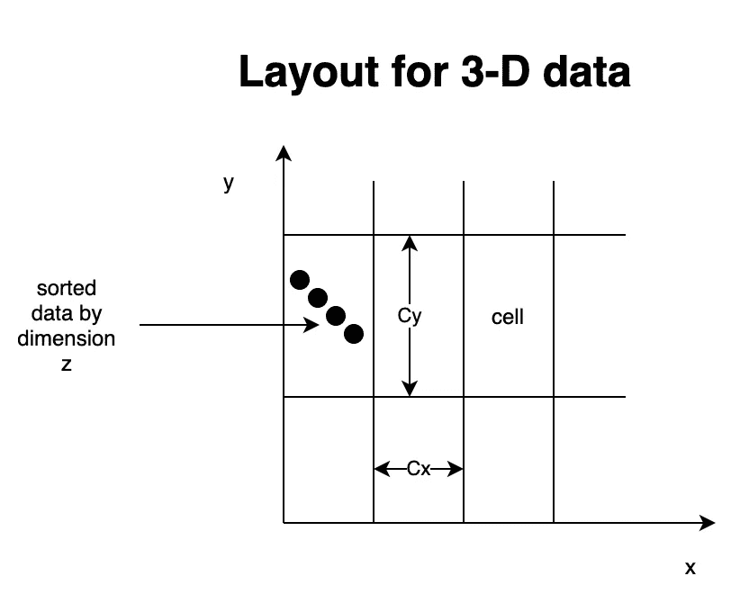
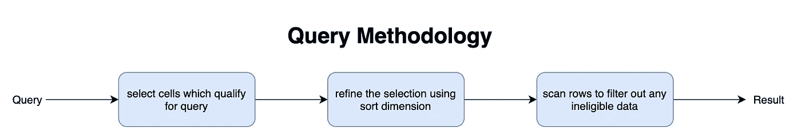
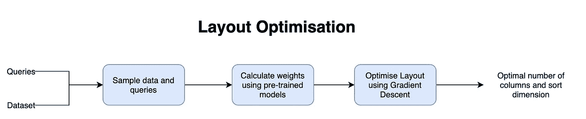

# 学习多维指数:OLAP DBs 的下一件大事

> 原文：<https://towardsdatascience.com/learning-multi-dimensional-indices-a7aaa2044d8e?source=collection_archive---------45----------------------->

弗兰基·查马基在 [Unsplash](https://unsplash.com?utm_source=medium&utm_medium=referral) 上拍摄的照片

世界上数据的泛滥为学习和分析世界各地人们的行为提供了大量的机会。大多数分析至少需要几天的数据，这就需要一个快速的可查询存储引擎。OLAP 数据库的存在仅仅是为了服务于这个目的，也就是说，使大量的数据能够以最小的延迟被容易地查询。

为了最大限度地减少延迟，所有数据库都对数据创建了索引。索引通常是基于树的结构，例如 B 树、R 树等。它基于某个固定的键直接向您提供包含数据的行或块，而不是让您扫描所有的行。

OLAP 数据库的独特之处在于，可以一次对多个列进行查询，例如，通过用户、日期和城市获得订单总数的查询。从技术上讲，您也可以在多个维度上创建索引，但是您必须假设用户将遵循什么样的查询模式。您还必须假设每列将容纳的数据量，以做出有效的索引决策。

如果数据库本身根据插入的数据修改了索引会怎么样？有学问的多维索引是回答这个特殊问题的一种努力。在这篇博客中，我们将看看其中的一种算法。

## 洪水

Flood 算法是为内存索引设计的。也可以对其进行修改，以便在 OLTP 数据库中使用。洪水背后有两个关键思想:

1.  使用示例查询筛选器工作负荷来确定某些维度的使用频率、哪些维度一起使用以及哪些维度比其他维度更具选择性。基于这些信息，定制整个布局以优化性能。
2.  使用经验 CDF 模型将多维倾斜数据展平到统一空间中。

让我们假设需要在 d 维数据上创建索引。在这样的数据中，没有自然的排序顺序。因此，该算法首先选择一个将用于排序的维度。然后，该算法创建一个 d-1 维网格，其中每个维被分成等间距的列。这种网格中的每个单元格都包含多个数据点。

为了确保数据点均匀分布，使用特定维度的最小值和最大值对其进行标准化。最后一个维度用于对每个单元格中的数据进行排序。

## 询问

一个查询通常由 k 个维度组成，其中 k < d. Since the query already contains the range of values for each dimension that need to be queried, we can simply select all the cells which lie within that range along with cells that have partial overlap. This step is known as Projection.

For the cells which have partial overlap, we can use the fact that the data in them is sorted and select the relevant data using binary search. This is only possible when you have the sort dimension as a part of the query. This step is known as Refinement.

Once we have all the data, we can refine it further to check if any out of range data is there or not and then return the result to the user. This step is known as Scan.

## Layout optimization

The primary strength of FLOOD lies in its ability to optimize the data layout to minimize the query latency. To minimize the latency, you first need a proxy to determine the query performance. The algorithm uses a custom cost function to serve the purpose. The cost function is composed of three parts:

*   *wpNc* ，其中 wp 是对一个单元执行细化的平均时间，Nc 是网格中单元的总数。
*   *wrNc* 其中 wr 是对一个单元执行细化的平均时间，Nc 是网格中单元的总数。
*   *wsNs* ，其中 ws 是执行每次扫描的平均时间，Ns 是扫描数据点的总数。

然后，查询时间的模型可以计算为

wpNc + wrNc + wsNs

下一步是计算权重 wp、wr 和 ws。对于该洪水，使用一个简单的模型，该模型采用像元总数、可过滤像元大小的平均值、中间值和尾部分位数、维数等特征。Flood 仅训练权重模型一次，并将其重新用于多个数据布局。

最后一步是优化布局，包括调整排序维度的维度和每个维度中的列数。

在每次迭代中，该算法选择 d 维中的一个作为排序维。其余所有维度都用来创建 d-1 维网格。然后，它运行梯度下降算法来确定最小化查询时间的列数。

Flood 为每个新工作负载重新调整数据布局。由于 DB administrator 不可能生成最可能的查询作为模型的输入，因此 Flood 本身会生成用于训练的查询，方法是将一些维度随机分组，将其他维度随机过滤，而将其余维度置之不理。group by 聚合函数也是随机的。

## 结论

Flood 算法标志着自学习索引道路上的一个重要里程碑。它具有很高的实用性，可以在真实世界的数据库中使用。然而，Flood 仍然存在一些缺点，需要解决这些缺点以使其成为一个完全通用的算法。其中一些缺点是-

*   它不支持插入新数据。在新数据到达的情况下，需要再次拟合整个数据集。当前版本仅适用于只读工作负载。
*   它是单线程的，在其当前实现中不支持并发。
*   尽管 Flood 针对新的工作负载进行了自我调优，但它仍然很难确定工作负载何时发生了足以触发重新调优操作的变化。

最后，我希望这些问题将在未来得到解决，OLAP 数据库最终将变得至少比本文中展示的快一个数量级。

您可以使用以下参考资料来了解有关已学数据结构和索引的更多信息:

*   维克拉姆·内森，丁嘉林，穆罕默德·阿里扎德，蒂姆·菲利普·克拉斯卡
*   [蒂姆·菲利普·克拉斯卡、亚历克斯·比特尔、Ed H. Chi、Jeffrey Dean、Neoklis Polyzotis 撰写的学习指数结构案例](https://arxiv.org/abs/1712.01208)