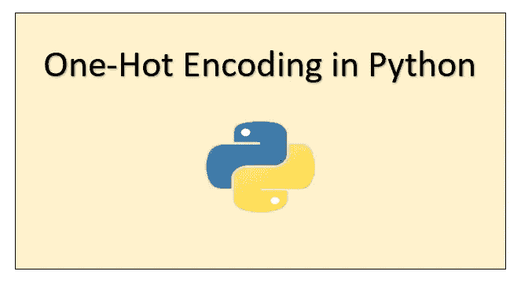
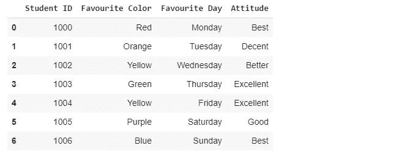
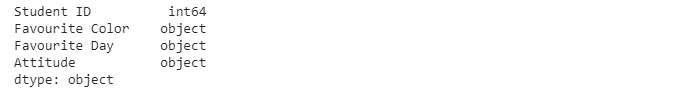
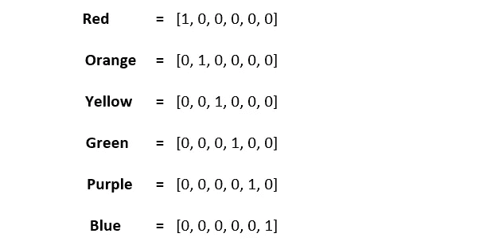
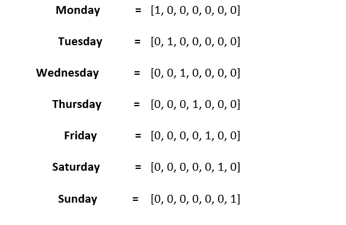
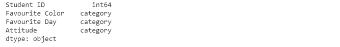
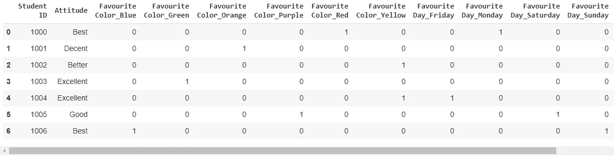
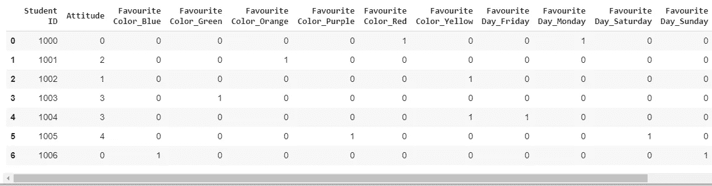

# 以最简单的方式学习 Python 中的一键编码

> 原文：<https://towardsdatascience.com/learning-one-hot-encoding-in-python-the-easy-way-665010457ad9?source=collection_archive---------31----------------------->

## 在本教程中，我们将从头开始学习特征工程中的一个重要概念，即一键编码。



我们先了解一下情况，然后定义一热编码。有时候解决问题是理解概念的最快方法之一。好吧，我们先创造一个情境(我刚刚虚构的情境)。只需一个平视就可以在我的 [**GitHub 资源库中找到下面给出的**](https://github.com/Tanu-N-Prabhu/Python/blob/master/Learning_One_Hot_Encoding_in_Python_the_Easy_Way.ipynb) :

[](https://github.com/Tanu-N-Prabhu/Python/blob/master/Learning_One_Hot_Encoding_in_Python_the_Easy_Way.ipynb) [## 塔努-北帕布/Python

### permalink dissolve GitHub 是 4000 多万开发人员的家园，他们一起工作来托管和审查代码，管理…

github.com](https://github.com/Tanu-N-Prabhu/Python/blob/master/Learning_One_Hot_Encoding_in_Python_the_Easy_Way.ipynb) 

# 情况

假设您正在解决一个简单的数据科学问题。现在，实际问题是什么并不重要，但您会陷入这样一种情况:您有一个很小的数据集，其中有 7 个实例，每个实例有 4 个特征。用蹩脚的话说，数据集有 **7 行**和 **4 列**。其中三列为类型`object`，意味着这些列包含**字符串值**。另一列是类型`int`,这意味着它只有整数值。现在说得够多了，让我们实际看看数据集是什么样子的。而不是给你看原始数据。CSV 格式)。我用[熊猫库](https://pandas.pydata.org/)把它格式化成一个数据帧。



为了安全起见，让我们看看列的数据类型。



现在实际情况开始了，因为一些学习算法只处理数字数据，你必须以某种方式处理这些`object`数据。处理这种情况有两种选择:

*   **删除**所有三列然后睡觉
*   **阅读本教程并实现一键编码**

我知道**选项 1** 效果很好，但是有时候你必须集中精力，为了生计而努力工作。现在解决这种情况的方法是将这种`object`类型的数据转换成几种`binary`类型的数据。我的意思是要仔细观察数据集。列**最喜欢的颜色**有 6 个独特的值，如**红色、橙色、黄色、绿色、紫色和蓝色。**现在我们可以将这个特征转换成一个六个数值的向量，如下所示:



同样，你不认为我们也可以将**最喜欢的日子列**转换成一个六个数值的向量吗？因为这一栏有 **7** 个独特的日子，比如**周一、周二、周三、周四、周五、周六、周日**。



现在你可能会想，我们能不能不做同样的事情呢？但这里的关键是不。不要做同样的事情。在这里，我们将学习一个叫做**顺序**的新概念。既然有**体面，好，更好，最好，优秀。**我们将它们排序为**{过得去，好，更好，最好，优秀}** 为 **{1，2，3，4，5}** 或 **{0，1，2，3，4}。**

> *这是因为当一些值的排序很重要时，我们可以通过只保留一个变量来替换这些值。*

请记住，这种技术并不是在所有情况下都有效。例如，你们中的一些人可能会想，我们不能用同样的技术来填充其他两列的值吗？通过这样做，你肯定会降低特征向量的维数，但是这意味着在该类别中的值之间有一个顺序，并且它经常会混淆学习算法。当没有规则时，学习算法将试图找到一个**状态**或**规则**，并且该算法很可能**过拟合**。所以要明智地思考和使用这种技巧。仅当值的顺序很重要时才使用此选项。这种技术可以用在一篇文章的质量、用户对产品的评论、食物的味道等方面。

因此，有意或无意地，你已经学习并掌握了一键编码的概念，以及在哪里使用它。这就是如何将**分类或对象类型数据转换成数值类型数据。让我们看看如何实际编码并摆脱这种情况。**

## 从头开始创建数据集

如前所述，这是一个虚构的数据集。为本教程创建。不是针对你。

```
import **pandas** as **pd****# Creating a list with some values** **studentID** = [1000, 1001, 1002, 1003, 1004, 1005, 1006]**color** = ['Red', 'Orange', "Yellow", 'Green', 'Yellow', 'Purple', 'Blue']**DaysOfTheWeek** = ['Monday', 'Tuesday', 'Wednesday', 'Thursday', 'Friday', 'Saturday', 'Sunday']**Attitude** = ['Best', 'Decent', 'Better', 'Excellent', 'Excellent', 'Good', 'Best']
```

现在我们有了列表，让我们将其转换为数据框。为此，我们需要**压缩**所有列表值，然后存储它。

```
**# Converting the list into a data frame and simultaneously renaming the columns.****df** = pd.DataFrame(list(zip(studentID, color, DaysOfTheWeek, Attitude)), **columns** =['Student ID', 'Favourite Color', 'Favourite Day', 'Attitude'])print(**df**)
```


## 将对象类型数据转换成分类类型

这是因为在大多数情况下，您可能会得到分类类型的数据。但是在这里，上面看到的三个都是一个`object`类型。如果是这种情况，那么您需要手动将它们转换为分类类型。

```
**# Converting the object type data into categorical data column**for **col** in ['**Favourite Color**','**Favourite Day**', '**Attitude**']:
    df[**col**] = df[**col**].astype('**category**')print(**df.dtypes**)
```



## 将二进制代码分配给分类值

如前所述，我们将只把**最喜欢的颜色和最喜欢的日子**列转换成二进制值列。我们可以使用 pandas `get_dummies`方法，而不是手动操作。

```
**# Assigning the binary values for Favourite Day and Favourite Color columns****df** = pd.get_dummies(data=df,columns=['Favourite Color','Favourite Day'])print(df)
```



通过这样做，你显然会**增加数据集的维度**，但是你的学习算法会执行得更好。

## 将订单分配给名为“态度”的分类列

有两种方法可以做到这一点:

*   使用字典手动赋值。
*   使用`LabelEncoder`方法

选项 1 是没有用的，因为如果你有超过 **1000** 个唯一值，那么你可能会使用一个循环语句，使你的生活变得复杂。现在是 **2020** 聪明思考，使用`sklearn`库来做这件事。

```
**# Assigning order to the categorical column** from **sklearn.preprocessing** import **LabelEncoder****# Initializing an object of class LabelEncoder
labelencoder** = LabelEncoder() df['**Attitude**'] = labelencoder.fit_transform(df['Attitude'])print(df)
```



好了，现在你可以使用你最喜欢的学习算法，然后告诉`fit(X, y)`或其他什么，然后愉快地睡觉。

好了，伙计们，我希望你们今天学到了新东西。这真的是一个非常重要的概念，也是你将会遇到的特性工程技术。这是数据科学面试中最常被问到的问题之一。如果你对本教程有任何疑问，那么评论区就是你的了。在那之前保持安全，再见。下次再见。