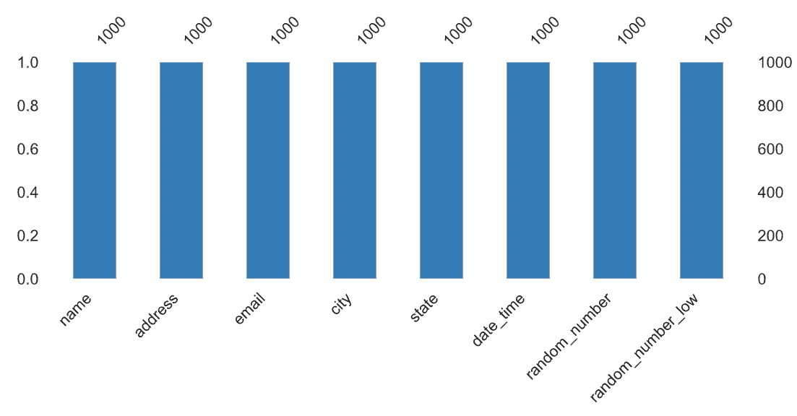

# 学习熊猫简介

> 原文：<https://towardsdatascience.com/learning-pandas-profiling-fc533336edc7?source=collection_archive---------33----------------------->

## 使用 Python 进行 Pandas Profiling 的全面入门指南

照片由 [Sid Balachandran](https://unsplash.com/@itookthose?utm_source=medium&utm_medium=referral) 在 [Unsplash](https://unsplash.com?utm_source=medium&utm_medium=referral) 上拍摄

# 介绍

在当今时代，成为一名数据科学家是一份令人难以置信的令人兴奋和有益的职业。随着技术的爆炸式发展以及每天创建的大量数据和内容，数据科学家需要不断学习新的方法来有效地分析这些数据。任何新数据项目最关键的部分之一是**探索性数据分析**阶段。作为一名数据科学家，这一阶段允许您学习和熟悉手头的数据，数据从哪里收集，数据中的任何缺口，任何潜在的异常值以及所使用的数据类型的范围。一个已经成为数据科学家常用的工具是 [**熊猫概况**](https://github.com/pandas-profiling/pandas-profiling) 。Pandas Profiling 是一个用 Python 编写的开源工具，能够生成详细描述数据集中数据类型的交互式 HTML 报告；突出显示缺少的值；提供描述性统计数据，包括平均值、标准差和偏斜度；创建直方图并返回任何潜在的相关性。

# 安装熊猫档案

对于本文，我们使用的是由 JetBrains 创建的集成开发环境 [PyCharm](https://www.jetbrains.com/pycharm/) 。PyCharm 是一个非常好的工具，因为它可以处理一些任务，包括为项目创建一个虚拟环境，以及安装代码中引用的包。

要开始，打开 PyCharm 并选择`File > New Project`，将出现一个对话框，您可以在其中命名项目并创建一个相关的虚拟环境。虚拟环境允许您安装项目可以引用的特定 python 包，而不必在您的机器上全局安装这些包。当您有多个项目需要同一个包的不同版本时，这是很方便的。

一旦在虚拟环境中安装了默认包，我们需要安装 Pandas Profiling。为此，导航至`File > Settings > Project > Project Interpreter`，选择右上角的`+`按钮，搜索`pandas-profiling`，然后按下`Install Package`。

使用 PyCharms 项目解释器安装 Pandas Profiling。

# 入门指南

对于这个例子，我们已经创建了一个简单的 Python 脚本，您可以使用它开始学习。如果这是你第一次使用 Python，请阅读 [*入门——Python 熊猫*](https://medium.com/@deanmcgrath/getting-started-python-pandas-84068523a819) ,我们在下面的脚本中解释了代码。

一个 Python 脚本将使用假数据生成一个 HTML 熊猫概况报告。

在执行脚本之后，一个名为`pandas_profile_text.html`的新 HTML 文件将会在您的项目根目录中创建。要查看报告*，右击 HTML 文件上的*并选择`Open in Browser > Default`。

# 熊猫概况报告

## 概观

熊猫概况报告中的概述部分

Pandas Profiling 报告的第一部分“概述”部分显示了整个数据集的汇总统计数据。它返回变量的数量，即传递的数据帧中包含的列数。观察次数是接收到的行数。该概览还提供了缺失单元格或重复行的数量以及受影响记录总数的百分比。丢失的单元格和重复的行统计数据对于数据科学家来说非常重要，因为这些可能表明更广泛的数据质量问题或用于提取数据的代码问题。概述部分还包括内存中数据集大小的数据、内存中平均记录大小以及任何可识别的数据类型。

在 Overview 部分的 Warnings 选项卡下，您可以找到数据集内任何变量的校对警告。在这个例子中，我们收到了一个关于*名称*、*电子邮件*和*城市*的*高基数*警告。在这个上下文中，高基数意味着被标记的列包含非常多的不同值，在现实世界中，对于雇员编号和电子邮件，您可能会遇到这种情况。

## 变量—类别

Pandas 特征分析报告分类变量的结果

Pandas Profiling 报告中的变量部分分析传递的数据帧中的列。分类变量是包含表示 Python 字符串类型的数据的列。

为分类变量返回的典型度量是列中字符串的长度。要查看生成的直方图，选择`Toggle Details`，然后导航至`Length`选项卡。“长度”选项卡还包含关于字符串长度的最大值、中值、平均值和最小值的统计数据。

## 变量—数字

Pandas 分析报告数字变量的结果

Pandas Profiling 提供了令人难以置信的对数字变量的深入分析，涵盖了**分位数**和**描述性统计**。它返回数据集中的**最小值**和**最大值**以及之间的**范围**。它显示四分位值，这些值通过将集合分成四个箱来测量数据集中有序值在中位数**上方和下方的分布。当考虑四分位数值时，如果四分位数 1 和中位数与中位数和四分位数 3 之间的距离更大，那么我们将其解释为较小值比较大值的分散性更大。**四分位数间距**就是四分位数三减去四分位数一的结果。**

**标准差**反映了数据集相对于其平均值的分布。较低的标准差意味着数据集中的值更接近平均值，而较高的标准差意味着数据集值分布在更大的范围内。**变异系数，**也称为相对标准差，是标准差与平均值的比值。**峰度**可用于通过测量相对于有序数据集均值的分布尾部的值来描述数据的形状。峰度值根据数据的分布和极端异常值的存在而变化。**中位数绝对偏差**是另一种统计方法，它反映了数据在中位数周围的分布，并且在出现极端异常值时，它是一种更为可靠的分布测量方法。**偏斜度**反映了标准钟形概率分布的失真程度。正偏度被认为是向右偏度，在分布的右侧有一个较长的尾部，而在左侧有一个负值。

## 互动和相互关系

熊猫概况报告中的交互图。

交互和相关性部分是 Pandas Profiling 真正领先于其他探索工具的地方。它将所有变量成对分析，并使用 Pearson、Spearman、Kendal 和 Phik 方法突出任何高度相关的变量。它提供了一个强大的、易于理解的可视化表示，可以显示任何紧密相关的数据。作为一名数据科学家，这是一个很好的起点，可以问为什么这些数据对可能相关。

## 缺少值

熊猫概况报告中的缺失值条形图

缺失值部分基于概述部分的缺失单元格指标。它直观地表示数据帧中所有列的缺失值出现的位置。这一部分可能会强调数据质量问题，并且可能需要将缺失的数据映射到一个缺省值，我们将在后面的文章中讨论这个问题。

## 样本部分

示例部分显示了数据集头部和尾部的结果快照。如果数据集是按特定列排序的，您可以使用这一部分来了解最小和最大列值所关联的记录类型。

# 摘要

Pandas Profiling 是一个令人难以置信的开源工具，每个数据科学家都应该考虑将其添加到任何项目的数据探索阶段的工具箱中。通过提供深入的描述性统计数据、可视化分布图和一套强大的关联工具，这是消化和分析不熟悉的数据集的有效方法。

感谢您花时间阅读我们的文章，我们希望您发现它有价值。