# 深度神经网络的学习过程

> 原文：<https://towardsdatascience.com/learning-process-of-a-deep-neural-network-5a9768d7a651?source=collection_archive---------9----------------------->

## 人工神经网络是如何学习的？[更新版本]

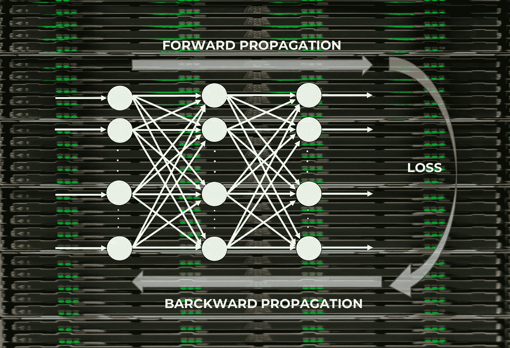

(来源: [https://torres.ai](https://torres.ai) )

这是我两年前写**系列的第五帖([帖 3](/basic-concepts-of-neural-networks-1a18a7aa2bd2) ，[帖 4](/deep-learning-for-beginners-practical-guide-with-python-and-keras-d295bfca4487) )的**更新版**。在这篇文章中，我将以 Keras[为例，直观地展示神经网络学习过程的主要组成部分，Keras 已经成为 TensorFlow 的高级 API](https://www.tensorflow.org/guide/keras) ，用于构建和训练深度学习模型。**

**最后，我们将通过一个名为 [TensorFlow Playground](http://playground.tensorflow.org) 的交互工具来实践这里提出的一些概念。**

# **神经网络的学习过程**

**神经网络由**个神经元**相互连接而成；与此同时，我们神经网络的每个连接都与一个权重相关联，该权重在乘以输入值时决定了这种关系在神经元中的重要性。**

**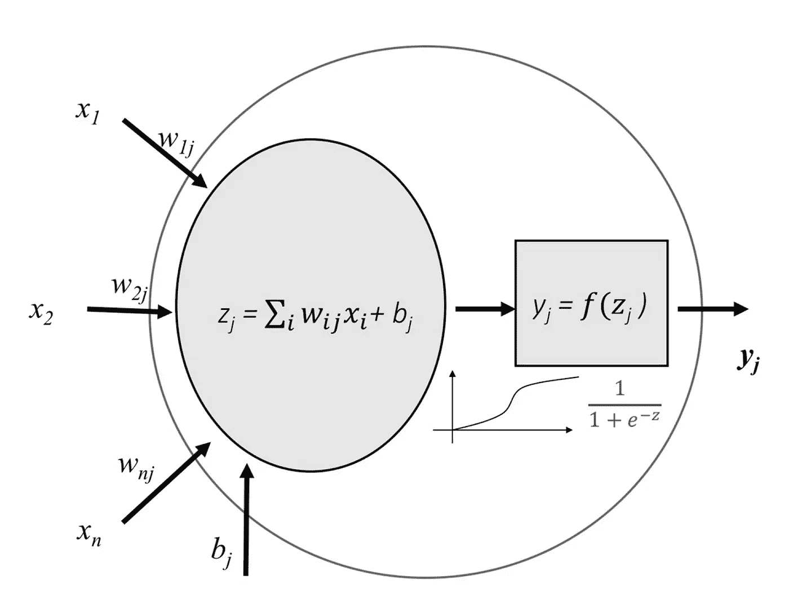**

**一个神经元可以被形象化为这张图(来源: [https://torres.ai](https://torres.ai) )**

**每个神经元都有一个**激活函数**，它定义了神经元的输出。激活函数用于在网络的建模能力中引入非线性。我们有几个激活函数的选项，我们将在本帖中展示。**

**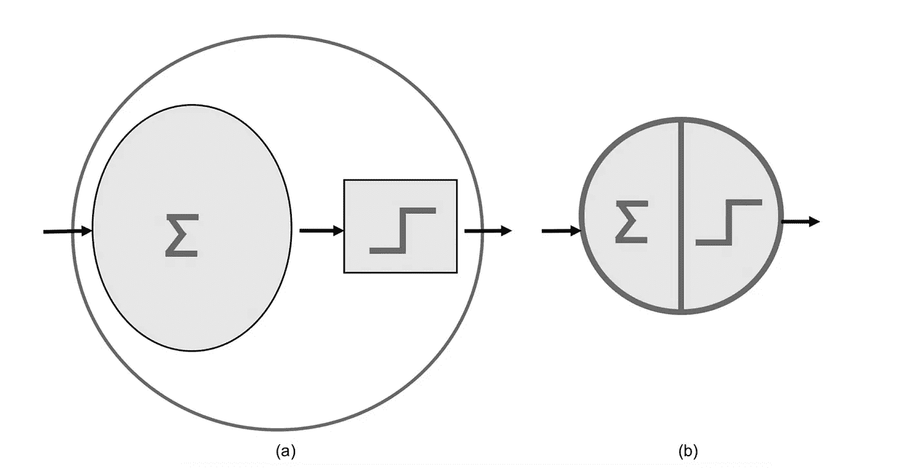**

**(a)先前人工神经元的简化表示。(b)更简化的代表性。(来源: [https://torres.ai](https://torres.ai) )**

**根据之前的简化表示，我们可以将前一篇文章中提出的模型[表示为将 MNIST 数字](/deep-learning-for-beginners-practical-guide-with-python-and-keras-d295bfca4487)分类为:**

**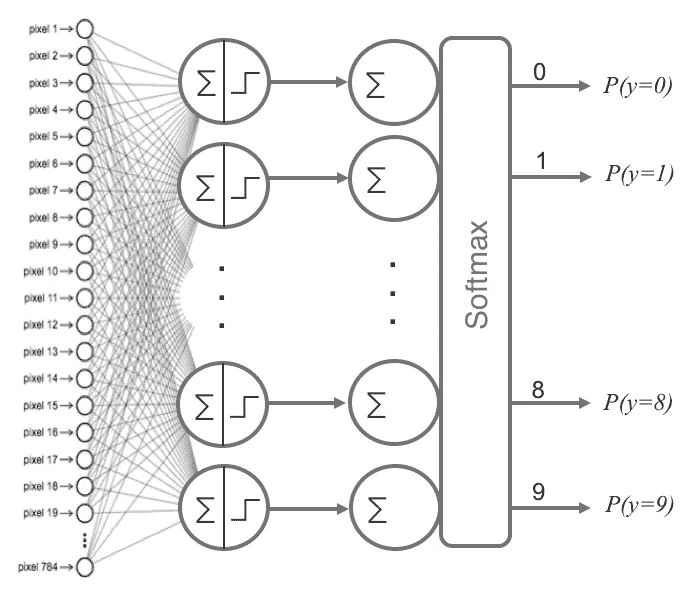**

**(来源: [https://torres.ai](https://torres.ai) )**

**训练我们的神经网络，即学习我们的参数值(权重 *wij* 和 *bj* 偏差)是深度学习最真实的部分，我们可以将神经网络中的这一学习过程视为神经元层的“往返”迭代过程。“去”是信息的前向传播，“回”是信息的后向传播。**

**第一阶段**前向传播**发生在网络暴露于训练数据时，这些数据穿过整个神经网络以计算它们的预测(标签)。也就是说，通过网络传递输入数据，使得所有神经元将它们的变换应用于它们从前一层神经元接收的信息，并将它发送到下一层神经元。当数据已经穿过所有层，并且其所有神经元已经进行了它们的计算时，将到达最后一层，具有那些输入示例的标签预测的结果。**

**接下来，我们将使用一个**损失函数**来估计损失(或误差),并比较和衡量我们的预测结果相对于正确结果的好坏程度(请记住，我们是在一个受监督的学习环境中，我们有一个标签来告诉我们期望值)。理想情况下，我们希望成本为零，也就是说，估计值和期望值之间没有偏差。因此，随着模型被训练，神经元互连的权重将被逐渐调整，直到获得良好的预测。**

**一旦计算出损失，该信息就被反向传播。因此，它的名字:**反向传播**。从输出层开始，损失信息传播到隐藏层中直接对输出做出贡献的所有神经元。然而，基于每个神经元对原始输出的相对贡献，隐藏层的神经元仅接收总损失信号的一部分。这个过程一层一层地重复，直到网络中的所有神经元都接收到描述它们对总损失的相对贡献的损失信号。**

**视觉上，我们可以用这个阶段的视觉方案来总结我们所解释的内容(基于我们神经网络的先前视觉表示):**

**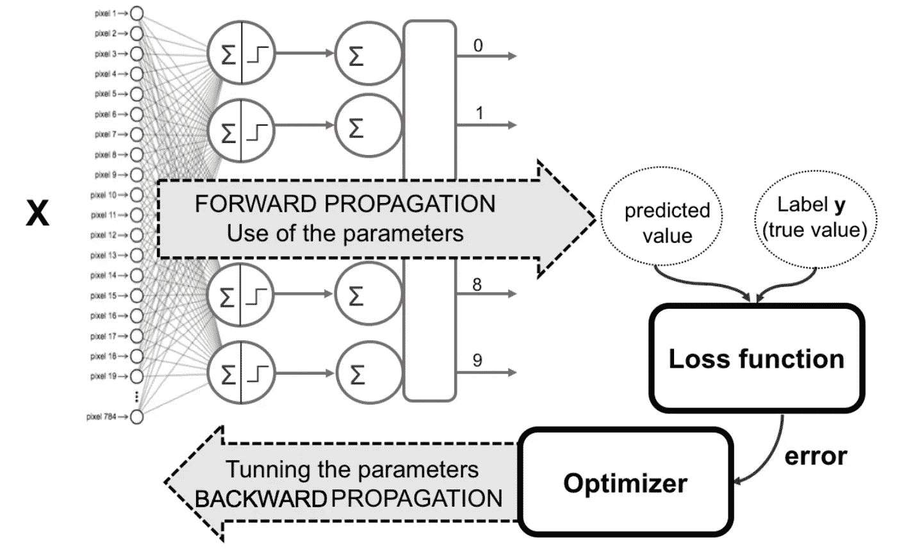**

**(来源: [https://torres.ai](https://torres.ai) )**

**现在我们已经将这些信息传播回来，我们可以调整神经元之间连接的权重。我们正在做的是，在下次使用网络进行预测时，让损失尽可能接近于零。为此，我们将使用一种叫做**梯度下降**的技术。这种技术在损失函数的导数(或梯度)的计算的帮助下以小增量改变权重，这允许我们看到朝着全局最小值“下降”的方向；这通常是在我们在每次迭代中传递给网络的所有数据集的连续迭代(历元)中的成批数据中完成的。**

**概括地说，学习算法包括:**

**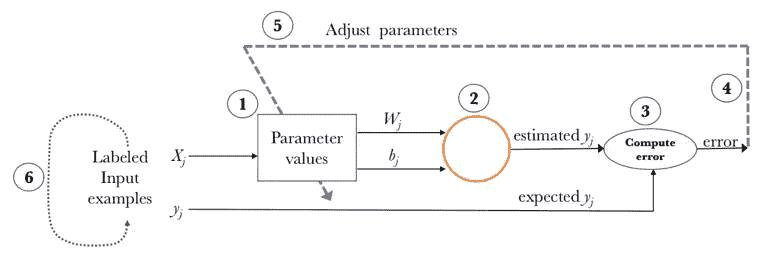**

**(来源: [https://torres.ai](https://torres.ai) )**

1.  **从网络参数的值(通常是随机的)开始( *wij* 权重和 *bj* 偏差)。**
2.  **取一组输入数据的例子，并通过网络传递它们以获得它们的预测。**
3.  **将获得的这些预测值与预期标签值进行比较，并用它们计算损失。**
4.  **执行反向传播，以便将这种损失传播到构成神经网络模型的每一个参数。**
5.  **使用这种传播的信息来更新具有梯度下降的神经网络的参数，从而减少总损失并获得更好的模型。**
6.  **继续迭代前面的步骤，直到我们认为我们有一个好的模型。**

**下面，我们将更详细地介绍我们在本节中强调的每个元素。**

# **激活功能**

**记住，我们使用激活函数来向前传播神经元的输出。该输出由该神经元所连接的下一层的神经元接收(直到包括输出层)。正如我们已经说过的，激活函数用于在网络的建模能力中引入非线性。下面我们将列举现今使用最多的；都可以在一层 Keras 中使用(我们可以在他们的网站上找到更多信息[)。](https://keras.io/activations/)**

## **线性的**

**线性激活函数基本上是恒等函数，实际上，它意味着信号不变。**

**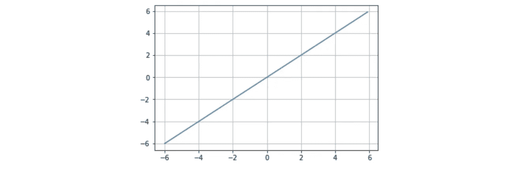**

**(来源: [https://torres.ai](https://torres.ai) )**

## **乙状结肠的**

**sigmoid 函数已经在之前的文章中介绍过了。它的兴趣在于它允许减少有效数据中的极端或非典型值，而不消除它们:它将几乎无限范围的独立变量转换成 0 到 1 之间的简单概率。它的大部分输出将非常接近 0 或 1 的极端值。**

**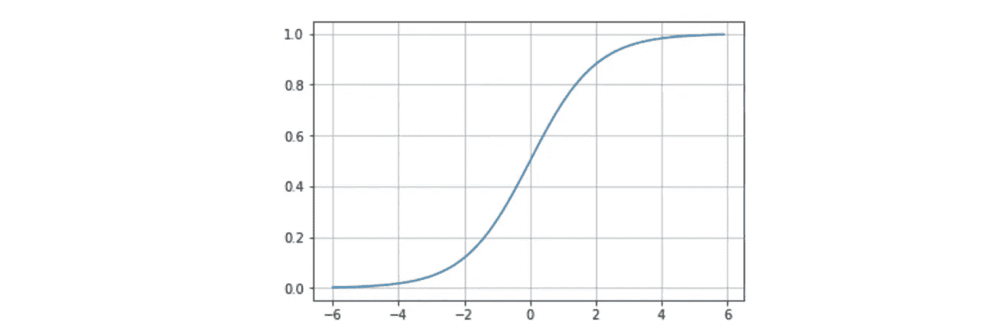**

**(来源: [https://torres.ai](https://torres.ai) )**

## **双曲正切**

**不赘述，我们可以总结一下，tanh 表示双曲正弦和双曲余弦的关系: [tanh(x)=sinh(x)/cosh(x)](https://en.wikipedia.org/wiki/Hyperbolic_function) 。与 sigmoid 函数不同，tanh 的归一化范围在-1 和 1 之间，这是一些神经网络的输入。tanh 的优点是负数更容易处理。**

**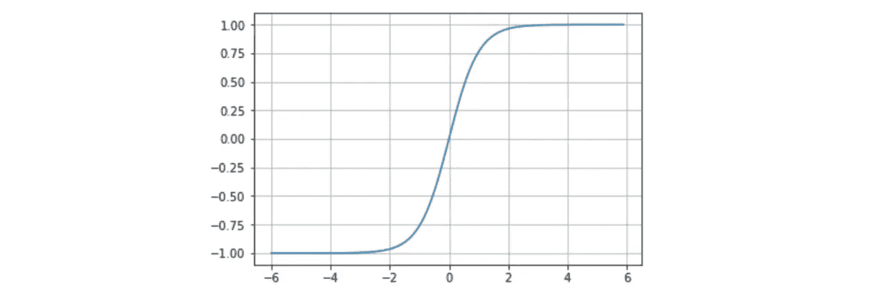**

**(来源: [https://torres.ai](https://torres.ai) )**

## **Softmax**

**softmax 激活函数在[之前的文章](/basic-concepts-of-neural-networks-1a18a7aa2bd2)中也有介绍，用于推广逻辑回归，因为它可以包含多个决策限制，而不是二进制分类。正如我们所见，softmax 激活函数通常位于神经网络的输出层，并返回互斥输出类的概率分布。**

## **热卢**

**激活函数整流线性单元(ReLU)是一种非常有趣的变换，如果输入高于某个阈值，它会激活单个节点。默认的和更常见的行为是，只要输入值小于零，输出就为零，但是当输入值大于零时，输出与输入变量成线性关系，形式为 *f(x)=x* 。ReLU 激活函数已经被证明在许多不同的情况下都有效，并且目前被广泛使用。**

**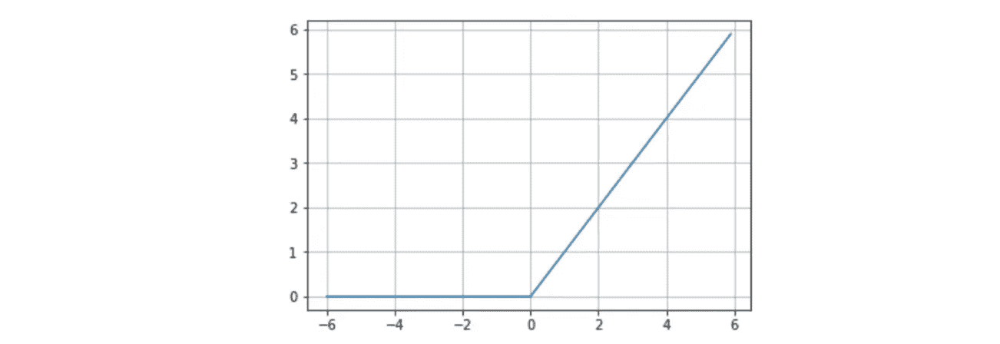**

**(来源: [https://torres.ai](https://torres.ai) )**

# **反向传播组件**

**总之，我们可以认为反向传播是一种在正确方向上改变神经网络参数(权重和偏差)的方法。它首先通过计算损失项开始，然后考虑到这个计算的损失，用优化算法以相反的顺序调整神经网络的参数。**

**请记住，在 Keras 中， *compile()* 方法允许我们定义我们希望学习过程中涉及的组件如何:**

```
model.compile(loss=’categorical_crossentropy’,
              optimizer=’sgd’,
              metrics=[‘accuracy’])
```

**具体来说，在这个例子中，有三个参数被传递给这个方法:一个优化器、一个损失函数和一个度量列表。在像我们的例子这样的分类问题中，精确度被用作一种度量。让我们更深入地探讨一下这些论点。**

## **损失函数**

**损失函数是量化特定神经网络在训练过程中有多接近理想权重所需的参数之一。**

**在 [Keras 手册页](https://keras.io/losses)中，我们可以找到所有可用的损失函数类型。有些有其具体的超参数，必须指出；在[前一篇文章](/deep-learning-for-beginners-practical-guide-with-python-and-keras-d295bfca4487)的例子中，当我们使用*分类 _ 交叉熵*作为损失的函数时，我们的输出必须是分类格式。损失的最佳函数的选择在于理解什么类型的误差对于特定的问题是可接受的或不可接受的。**

## **优化者**

**优化器是 *compile()* 方法中需要的另一个参数。Keras 目前有不同的优化器可以使用: *SGD* ， *RMSprop* ， *Adagrad* ， *Adadelta* ， *Adam* ， *Adamax* ， *Nadam* 。你可以在 Keras 文档中找到更多关于它们的细节。**

**一般而言，我们可以将学习过程视为一个全局优化问题，其中参数(权重和偏差)必须以最小化上述损失函数的方式进行调整。在大多数情况下，这些参数无法解析求解，但一般来说，它们可以通过优化算法很好地逼近，例如上面提到的那些算法。**

## **梯度下降**

**我们将解释其中一个具体的优化器，以便您理解优化器的整体操作。具体来说就是*梯度下降*，很多优化器的基础，也是机器学习和深度学习中最常见的优化算法之一。**

**当更新参数时，梯度下降使用损失函数的一阶导数(梯度)。记住梯度给出了函数在该点的斜率。在不能深入细节的情况下，该过程包括将每个隐藏层的损失的导数与其上层损失的导数链接起来，在计算中结合其激活函数(这就是为什么激活函数必须是可导的)。在每一次迭代中，一旦所有的神经元都具有对应于它们的损失函数的梯度值，参数值就以与梯度指示的方向相反的方向更新。事实上，梯度总是指向损失函数值增加的方向。因此，如果使用梯度的负值，我们可以得到我们倾向于减少损失函数的方向。**

**让我们以直观的方式来看这个过程，假设只有一维:假设这条线代表损失函数对于每个可能的参数值所取的值，并且梯度的负值由初始点中的箭头来表示:**

**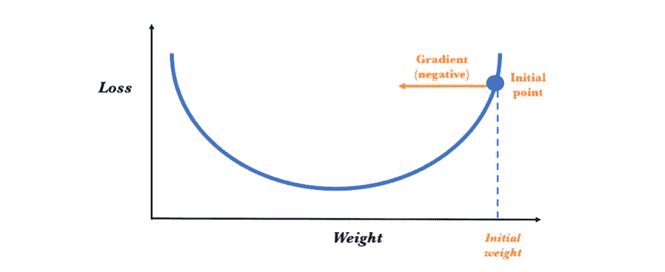**

**(来源: [https://torres.ai](https://torres.ai) )**

**为了确定参数的下一个值，梯度下降算法将初始权重的值修改为与梯度相反的方向(因为它指向损失增加的方向，我们希望减少损失)，并在此基础上增加一个比例量。这种变化的幅度由梯度值和我们可以指定的学习率超参数决定(我们将很快介绍)。因此，从概念上讲，就好像我们沿着斜坡向下走，直到我们到达局部最小值:**

**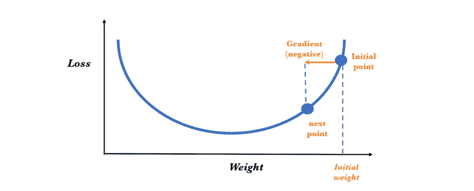**

**(来源: [https://torres.ai](https://torres.ai) )**

**梯度下降算法重复这个过程，越来越接近最小值，直到参数值达到一个点，超过这个点，损失函数不能减小:**

**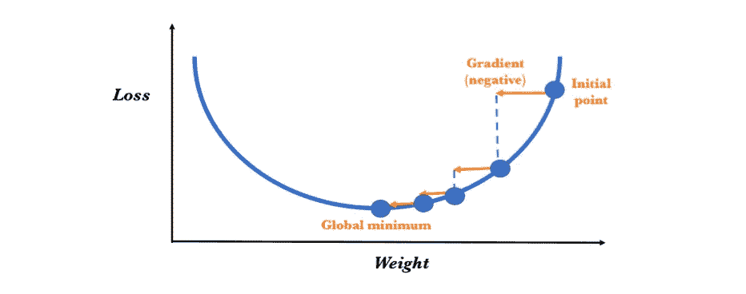**

**(来源: [https://torres.ai](https://torres.ai) )**

## **随机梯度下降**

**在前面的章节中，我们已经了解了参数值是如何调整的，但没有了解调整的频率:**

*   **每个条目示例后？**
*   **在每一轮的整套训练实例(epoch)之后？**
*   **在训练集的例子样本之后？**

**在第一种情况下，我们称之为在线学习，即从每个训练实例的观察损失中估计梯度；当我们谈到随机梯度下降(SGD)时也是如此。第二种称为批量学习，称为批量梯度下降。文献表明，通常情况下，在线学习可以获得更好的结果，但有理由证明使用批量学习是正确的，因为许多优化技术只能使用批量学习。**

**但是，如果数据分布良好，其中的一小部分应该会给我们一个很好的梯度近似值。我们可能得不到最好的估计，但它更快，而且，考虑到我们正在迭代的事实，这种方法非常有用。出于这个原因，经常使用第三个选项，称为小批量。该选项通常与在线一样好，但是更新神经网络的参数需要较少的计算。此外，许多输入示例的梯度的同时计算可以使用矩阵运算来完成，这些运算可以通过 GPU 非常有效地实现，正如我们在之前的[帖子](/basic-concepts-of-neural-networks-1a18a7aa2bd2)中所看到的。**

**这就是为什么在现实中，许多应用使用随机梯度下降(SGD)和几个例子的迷你巴赫。要使用所有数据，需要做的是将数据分成几批。然后我们取第一批，通过网络，计算其损失的梯度并更新神经网络的参数；这将依次进行，直到最后一批。现在，在一次通过所有输入数据的过程中，只有一些步骤与批次数量相等。**

**SGD 在 Keras 中非常容易实现。在 *compile()* 方法中，指出优化器是 SGD(参数中的值 *sgd* )，然后必须做的就是在训练过程中用 *fit()* 方法指定批量大小，如下所示:**

```
model.fit(X_train, y_train, epochs=5, batch_size=100)
```

**在这个使用 *fit()* 方法的代码示例中，我们使用 *batch_size* 参数将数据分成 100 个一批。通过*历元的数量*，我们可以显示对所有数据执行该过程的次数。在本文的后面，当我们已经介绍了常用的优化器参数时，我们将回到这两个参数。**

# **模型参数化**

**如果前一篇文章末尾的读者已经用我们在那里使用的超参数执行了一个模型，我假设该模型的准确性将超过 90%。这些结果好吗？我认为它们非常棒，因为这意味着读者已经用 Keras 编写并执行了他的第一个神经网络。*恭喜你！***

**另一件事是，还有其他模型可以提高精确度。这取决于拥有丰富的知识和大量的实践来处理好我们可以改变的许多超参数。例如，通过简单改变第一层的激活函数，从*s 形*变为如下所示的 *relu* :**

```
model.add(Dense(10, activation=’relu’, input_shape=(784,)))
```

**我们可以在差不多相同的计算时间内获得 2%以上的精度。**

**也可以增加*时期*的数量，在一层中增加更多的神经元或者增加更多的层。然而，在这些情况下，准确性的提高具有增加学习过程的执行时间的副作用。例如，如果我们向中间层添加 512 个节点，而不是 10 个节点:**

```
model.add(Dense(512, activation=’relu’, input_shape=(784,)))
```

**我们可以用 *summary()* 方法检查，参数数量增加(是一个*全连接*)执行时间明显变高，甚至减少了历元数。利用该模型，准确率达到 94%。如果我们增加到 20 个历元，可以达到 96%的准确率。**

**简而言之，在下一节中，我们将更详细地了解一个无限可能的世界，读者可以意识到，鉴于我们拥有的多种可能性，找到激活函数的最佳参数和超参数的最佳架构需要一些专业知识和经验。**

## **参数和超参数**

**到目前为止，为了简单起见，我们还没有明确注意区分参数和超参数，但是我认为现在是时候了。通常，我们将模型的参数视为模型内部的配置变量，其值可以根据数据进行估计。相比之下，超参数指的是模型本身外部的配置变量，其值通常无法从数据中估计，并由程序员指定以调整学习算法。**

**当我说深度学习更像是一门艺术而不是一门科学时，我的意思是找到这些超参数的最优值需要大量的经验和直觉，这些最优值必须在开始训练过程之前指定，以便模型训练得更好更快。鉴于本书的介绍性质，我们不会详细介绍所有这些参数，但我们有值得简要提及的超参数，包括神经网络的结构和拓扑水平(层数、神经元数、它们的激活函数等)。)和学习算法级别(学习速率、动量、时期、批量大小等)。).**

**接下来，我们将介绍其中一些，其余的将在我们进入卷积神经网络时出现在 futuro 帖子中。**

## **纪元**

**正如我们已经做的，epochs 告诉我们在训练过程中所有训练数据通过神经网络的次数。一个很好的线索是增加历元的数量，直到验证数据的准确性度量开始降低，即使训练数据的准确性继续增加(这是当我们检测到潜在的过度拟合时)。**

## **批量**

**正如我们之前说过的，我们可以将训练数据划分为小批量，以便通过网络传递它们。在 Keras 中， *batch_size* 是指示这些批的大小的参数，这些批将在训练的迭代中的 *fit()* 方法中使用，以更新梯度。最佳大小取决于许多因素，包括我们用来计算的计算机的内存容量。**

## **学习率**

**梯度向量有方向和大小。梯度下降算法将梯度的大小乘以一个称为学习率(有时也称为步长)的标量，以确定下一个点。**

**以更正式的方式，反向传播算法计算误差相对于每个权重如何变化:**

****

**为了使用简单的更新规则来更新网络的每个权重:**

****

**其中，α是学习率。**

**例如，如果梯度的大小为 1.5，学习率为 0.01，那么梯度下降算法将选择距离前一点 0.015 的下一点。**

**这个超参数的适当值非常依赖于所讨论的问题，但是一般来说，如果这个值太大，那么就要迈出巨大的步伐，这有利于在学习过程中走得更快。但在这种情况下，我们可能会跳过最小值，使学习过程难以停止，因为当搜索下一点时，它会永远随机地在“井”的底部跳动。在该图中，我们可以直观地看到可能发生的影响，其中从未达到最小值(在图中用小箭头表示):**

**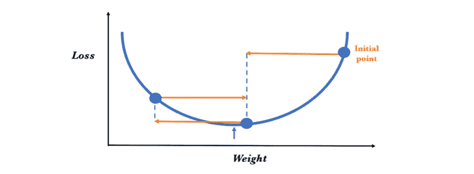**

**(来源: [https://torres.ai](https://torres.ai) )**

**相反，如果学习率很小，将会取得很小的进步，有更好的机会达到局部最小值，但是这会导致学习过程非常慢。一般来说，如果我们的学习模式不起作用，一个好的规则是降低学习速度。如果我们知道损失函数的梯度很小，那么测试它用学习率补偿梯度是安全的。**

## **学习率衰减**

**但是一般来说，最好的学习速率是随着模型接近一个解而降低的速率。为了实现这种效果，我们有另一个超参数，学习率衰减，它用于随着时代的推移降低学习率，以允许学习在开始时以更大的学习率更快地前进。随着进展，进行越来越小的调整，以促进训练过程收敛到损失函数的最小值。**

## **动力**

**在我们已经解释的下降梯度算法的可视例子中，为了最小化损失函数，我们保证找到全局最小值，因为没有局部最小值，优化过程会被卡住。然而，在现实中，真实情况更加复杂，从视觉上看，我们似乎可以找到几个局部最小值，损失函数的形式如下图所示:**

**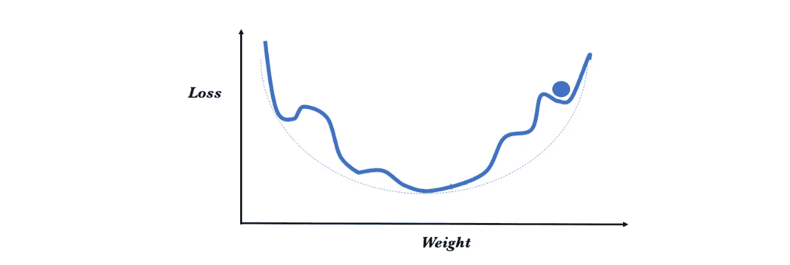**

**(来源: [https://torres.ai](https://torres.ai) )**

**在这种情况下，优化器很容易陷入局部最小值，并且算法可能认为已经达到了全局最小值，从而导致次优结果。原因是当我们卡住的时候，梯度是零，我们不再能严格地沿着梯度的路径走出局部最小值。**

**解决这种情况的一种方法可以是从不同的随机位置重新开始该过程，并且以这种方式增加达到全局最小值的概率。**

**为了避免这种情况，通常使用的另一种解决方案涉及*动量*超参数。以一种直观的方式，我们可以看到，如果要前进，它将采取前面步骤的加权平均来获得一点动力，并克服“颠簸”，作为一种不陷入局部最小值的方法。如果我们认为以前的平均值更好，也许这将允许我们进行跳跃。**

**但是使用平均值已经被证明是一个非常激烈的解决方案，因为，也许在前面步骤的梯度中，它比仅仅在前面步骤中更不相关。这就是为什么我们选择加权先前的梯度，并且动量是用于该加权的 0 和 1 之间的常数。已经表明，使用动量的算法在实践中效果更好。**

**一种变体是*内斯特罗夫动量*，这是最近流行的动量更新的稍微不同的版本，当它接近解决方案时，它基本上减慢梯度。**

## **参数权重的初始化**

**参数权重的初始化并不完全是一个超参数，但它与其中任何一个参数一样重要，这就是我们在本节中做一个简短段落的原因。建议用小的随机值初始化权重，以打破不同神经元之间的对称性，如果两个神经元具有完全相同的权重，则它们将总是具有相同的梯度；这假设两者在随后的迭代中具有相同的值，因此它们将不能学习不同的特征。**

**按照标准正态分布随机初始化参数是正确的，但它可能会导致渐变消失(当渐变的值太小而模型停止学习或因此花费太长时间时)或渐变爆炸(当算法为权重分配过高的重要性时)的问题。**

**一般来说，考虑到我们的网络具有的激活功能的类型，可以使用试探法。深入这些细节超出了本书的介绍范围，但是，如果读者想要更深入，我建议你[访问斯坦福 Andrej Karpathy 的 CS231n 课程网站](http://cs231n.github.io/neural-networks-2/#init)，在那里你将获得这一领域非常有价值的知识，这些知识以一种非常说教的方式展现出来。**

## **Keras 中超参数和优化器**

**我们如何指定这些超参数？回想一下，优化器是模型的 *compile()* 方法中需要的参数之一。到目前为止，我们都是通过它们的名字来调用它们(用一个简单的字符串来标识它们)，但是 Keras 也允许将优化器类的一个实例作为一个参数来传递，并指定一些超参数。**

**例如，*随机梯度下降*优化器允许使用*动量*、*学习率衰减*和*内斯特罗夫动量*超参数:**

```
keras.optimizers.SGD(lr=0.01, momentum=0.0, decay=0.0,      
                     nesterov=False)
```

**上一个方法的参数中指示的值是默认采用的值，其范围可以是:**

*   **lr:浮点> = 0。(学习率)**
*   **动量:浮点> = 0**
*   **衰减:浮点> = 0(学习率衰减)。**
*   **nesterov: boolean(表示是否使用内斯特罗夫动量)。**

**正如我们已经说过的，Keras 中有几个优化器，读者可以在他们的[文档页面](http://keras.io/optimizers)上探索。**

# **张量流游乐场**

**[TensorFlow Playground](http://playground.tensorflow.org) 是一个用 JavaScript 编写的交互式可视化 web 应用程序，允许我们模拟在浏览器中运行的简单神经网络，并实时查看结果:**

**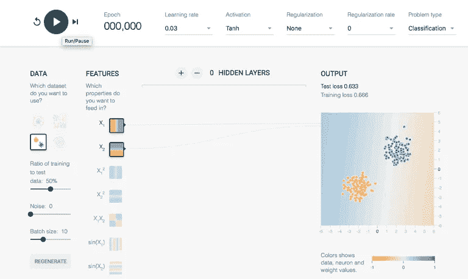**

**使用该工具，我们可以试验不同的超参数，并观察它们的行为。事实上，神经网络中超参数所提供的灵活性是它的优点之一，同时也是它的缺点之一，对于那些刚开始学习这个主题的人来说:有许多参数需要调整！**

## **二元分类问题**

**为了开始理解这个工具是如何工作的，我们可以使用前一篇文章中[提出的第一个感知器的例子，一个简单的分类问题。](/basic-concepts-of-neural-networks-1a18a7aa2bd2)**

**从这个例子开始，我们选择了上图中“数据”部分所示的数据集，然后单击“播放”按钮。现在我们可以看到 TensorFlow Playground 是如何解决这个特殊问题的。蓝色和橙色区域之间的线开始慢慢移动。你可以按下“重置”按钮，重新测试几次，看看这条线在不同初始值下是如何移动的。**

**在这种情况下，应用程序会尝试找到允许正确分类这些点的参数的最佳值。如果将光标放在弧上，读者将看到分配给每个参数的值出现(甚至允许我们编辑它):**

****

**请记住，当这个权重乘以输入值时，它决定了神经元中这种关系的重要性。**

**在第一次接触之后，我们将展示一点工具，让我们了解神经网络如何运作。在菜单的上半部分，我们基本上找到了超参数，其中一些我们已经在上一节中评论过:纪元、学习率、激活、正则化率和问题类型。它们都是下拉菜单，我们可以在其中选择这些超参数的值。**

**在“问题类型”选项卡中，平台允许我们指定两种类型的问题:回归(连续问题)和分类。总的来说，我们可以选择四种类型的数据用于分类，两种类型的数据用于回归:**

****

**蓝色和橙色的点构成了数据集。橙色点的值为-1，蓝色点的值为+1。在左侧，在数据类型下面，有不同的参数，我们可以修改这些参数来调整我们的输入数据。**

**使用“训练与测试数据的比率”选项卡，我们可以控制分配给训练集的数据百分比(如果我们修改它，我们会看到屏幕右侧“输出”中出现的点是如何交互变化的)。数据的噪声水平也可以由“噪声”字段定义和控制；随着噪声的增加，数据模式变得更加不规则。正如我们可以体验到的，当噪声为零时，问题数据在它们的区域中被清楚地区分。但是当达到 50 以上的时候，我们可以看到蓝点和橙点是混在一起的，所以分类起来非常困难。**

**顾名思义，通过“批量大小”，我们可以确定每个训练批次将使用的数据量。**

**然后，在下一个专栏中，我们可以选择特性。我建议我们使用“X1”和“X2”这两个可用的词:“X1”是水平轴上的值，“X2”是垂直轴上的值。**

**神经元网络的拓扑可以在下面的列中定义。我们最多可以有六个隐藏层(通过点击“+”号来添加隐藏层)，每个隐藏层最多可以有八个神经元(通过点击相应层的“+”号):**

**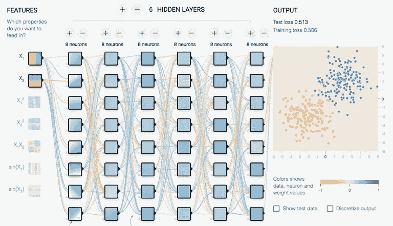**

**最后，请记住，在训练神经网络时，我们希望最小化“训练损失”,然后将其与测试数据进行比较,“测试损失”也会最小化。在屏幕的右上部分，在一个小图中交互地显示了每个时期中两个度量的变化，其中，如果损失减少，曲线向下。损失测试用黑色画，训练损失用灰色画。**

## **超参数设置基础**

****用单个神经元分类****

**现在我们对这个工具有了更多的了解，让我们回到第一个分类示例，它将数据分成两组(聚类)。**

**我建议我们在前进之前修改一些参数来使用该工具进行练习。例如，我们可以用 0.03 的学习率和一个 ReLU 激活函数来修改一些参数(正则化将不被使用，因为它超出了本书的范围)。**

**我们将问题保持为分类，并且我建议我们将“训练与测试的比率”设为数据的 50%,并且我们还将“噪声”参数保持为零，以促进解决方案的可视化(尽管我建议稍后您自己练习)。我们可以将“批量大小”保留为 10。**

**和以前一样，我们将使用“X1”和“X2”作为输入。我建议从单个神经元的单个隐藏层开始。我们可以通过使用“-”或“+”按钮来实现:**

**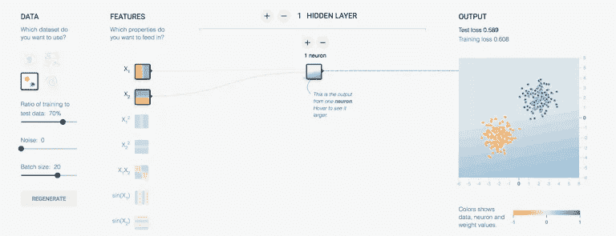**

**在右上方，我们看到“测试损失”和“训练损失”的初始值很高(读者可以得到不同的值，因为初始值是以随机方式生成的)。但是在按下“播放”按钮之后，可以看到“训练损失”和“测试损失”都以非常低的比率收敛，并且保持不变。此外，在这种情况下，黑色和灰色的两条线完全重叠。**

**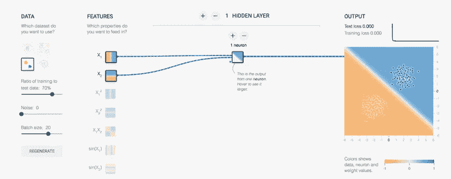**

****用多于一个神经元分类****

**让我们选择另一组类似于附图中的起始数据:**

**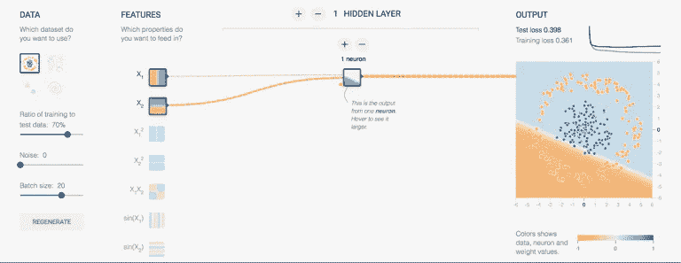**

**我们现在想把两个数据集分开:橙色的必须归入一组，蓝色的归入另一组。但问题是，在这种情况下，他们将有一个圆形，橙色点将在外圆，蓝色点将在内。现在，这些点不能像以前那样用一条线分开。如果我们用具有单个神经元的隐藏层作为先前分类的模型进行训练，那么在这种情况下分类将会失败。**

**我建议我们用隐藏层的多个神经元进行测试。例如，尝试两个神经元:你会发现你还没有调够。我建议你试着用三个。你会看到，最终，你可以得到一个好得多的训练和测试损失:**

**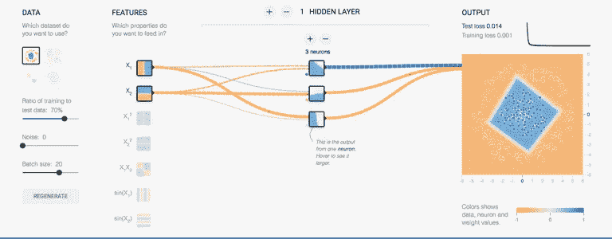**

**让我们看看左边的另一个数据集，其中的数据被分成四个不同的正方形区域。现在，这个问题无法用以前的网络解决，但我建议您尝试一下:**

**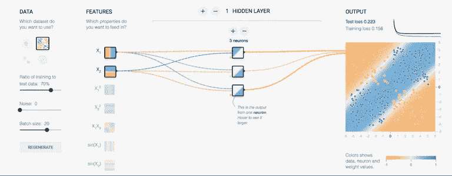**

**可以看出，我们不能得到一个好的分类(虽然在某些情况下，可能发生只有 3 个神经元的情况，因为初始化是随机的，但是如果你做几次测试，你会发现这在一般情况下是不能实现的)。然而，如果我们有 5 个神经元，如下图所示，读者可以看到该神经网络如何获得这种情况下的良好分类:**

**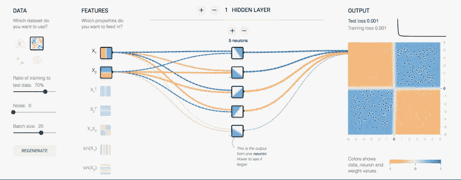**

****多层分类****

**现在，我们将尝试使用该工具中最复杂的模式对数据集进行分类。橙色和蓝色数据点的漩涡结构是一个具有挑战性的问题。如果我们依赖前面的网络，我们看到甚至没有 8 个神经元，工具留给我们的最大值，我们得到一个好的分类结果:**

**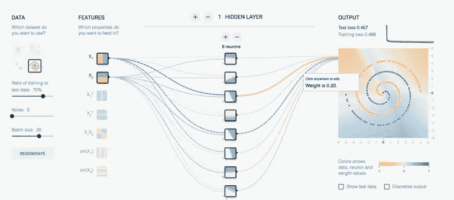**

**如果读者已经尝试过，在这种情况下，我想你会得到一些测试损失的好值。是时候多放几层了；我向您保证，如果您使用该工具允许的所有层，您将得到它:**

**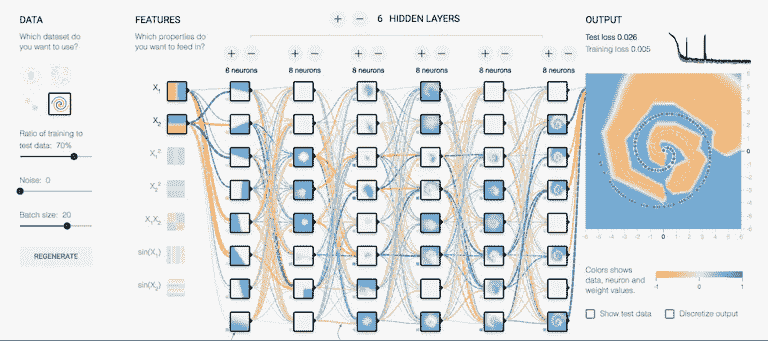**

**但是你会看到，很明显，学习参数的过程需要很长时间。**

**实际上，用更少的层或神经元你可以得到好的结果；我要求你自己玩一点，比如改变激活函数来得到一个更简单的模型。您还可以考虑测试任何其他参数。**

**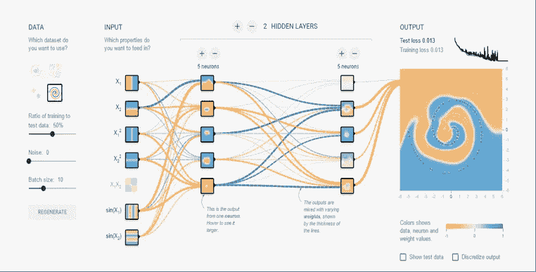**

**这个工具只考虑密集的神经网络；稍后我们将看到卷积神经网络(和递归神经网络)呈现更复杂的困境。但只有在这些密集的网络中，我们才能看到最难调整的超参数之一是决定模型有多少层以及每层有多少神经元。**

**在隐藏层中使用非常少的神经元将导致所谓的欠拟合，即缺乏模型拟合，因为隐藏层中只有非常少的神经元来正确检测复杂数据集中的信号。**

**另一方面，在隐藏层中使用太多的神经元会导致几个问题。首先，它会产生过拟合，当神经网络具有如此大的信息处理能力，以至于训练集中包含的有限信息量不足以训练隐藏层中的所有神经元时，就会发生过拟合。但另一方面，隐藏层中的大量神经元会增加训练网络所需的时间，以至于无法在必要的时间内正确训练神经网络。**

**显然，我们必须在隐藏层中太多和太少的神经元之间达成妥协，这就是为什么我已经评论说，我们面临的挑战需要更多的艺术而不是科学。**

**我希望这篇文章对你有所帮助，你会在工作或大学中用到它们。你可以在这里阅读下一篇关于卷积神经网络的文章[。](/convolutional-neural-networks-for-beginners-using-keras-and-tensorflow-2-c578f7b3bf25)**

**[](/convolutional-neural-networks-for-beginners-using-keras-and-tensorflow-2-c578f7b3bf25) [## 卷积神经网络初学者使用 Keras 和 TensorFlow 2

### 边做边学:包含 GitHub 代码的实用指南

towardsdatascience.com](/convolutional-neural-networks-for-beginners-using-keras-and-tensorflow-2-c578f7b3bf25)**