# 通过探索和可视化 Google App 数据学习 PySpark

> 原文：<https://towardsdatascience.com/learning-pyspark-by-exploring-and-visualizing-google-app-data-60cfecacc701?source=collection_archive---------15----------------------->

## 帮助你将熊猫技能移植到 PySpark 的实用指南

Rami Al-zayat 在 [Unsplash](https://unsplash.com/s/photos/technology?utm_source=unsplash&utm_medium=referral&utm_content=creditCopyText) 上拍摄的照片

**Apache Spark** 是每个人在处理大数据时都应该知道的不可或缺的数据处理框架。当我们试图对大数据进行数据分析时，我们可能会遇到一个问题，即由于单台计算机的处理能力和内存资源有限，您当前的计算机无法满足处理大数据的需求。虽然我们可以尝试升级我们的计算机以满足大数据处理的需要，但我们很快就会发现，当处理不断增加的数据集时，计算机可以轻松地再次达到其最大容量。

解决这个问题的一个方法是将我们的大数据提取到一个分布式并行处理平台，该平台由一个计算机集群支持，而不是依赖于单个机器。这就是 Apache Spark 在大数据处理中发挥作用的地方。

> " **Apache Spark 基本上是一个统一的分析引擎，用于并行和批处理系统中的大规模数据处理。"** ( [来源](http://spark.apache.org/))。

Apache Spark 最初是用 Scala 语言编写的，但它也提供了 Python API，即 **PySpark** 。PySpark 的发布简化了数据科学社区的工作，他们深深扎根于 Python 编程，利用 Apache Spark 的强大功能，而无需学习另一种编程语言，如 Scala。人们可以只编写 Python 脚本来访问 Apache Spark 提供的功能，并对大数据执行数据探索性分析。

照片由 [Christina Morillo](https://www.pexels.com/@divinetechygirl?utm_content=attributionCopyText&utm_medium=referral&utm_source=pexels) 从 [Pexels](https://www.pexels.com/photo/woman-programming-on-a-notebook-1181359/?utm_content=attributionCopyText&utm_medium=referral&utm_source=pexels) 拍摄

此外，学习 PySpark 并不是一项艰巨的任务，尤其是如果您已经在现有的数据分析工作中使用了 Pandas 一段时间。Spark 提供了一个与[熊猫数据帧](https://pandas.pydata.org/pandas-docs/stable/reference/api/pandas.DataFrame.html)非常相似的数据帧数据结构。

在本文中，我将通过一个例子来说明我们如何在一个表示为 Spark Dataframe 的 Google App 数据集上执行数据探索和可视化。

# 数据集

我们将要使用的样本数据集可以从 [Kaggle](https://www.kaggle.com/lava18/google-play-store-apps) 下载。网站上有两个 csv 文件，我们将只使用其中的一个，即“ **googleplaystore.csv** ”。数据集是关于谷歌 Play 商店应用程序的，其中包含应用程序名称、类别、评级、价格等信息。

想象一下，如果你打算开发一个移动应用程序，并希望在应用程序开发之前了解更多关于市场趋势的信息，探索这个数据集可能是有用的。

# 分布式计算平台

我们将需要一个分布式计算平台来托管我们的数据集，并使用 PySpark 处理它。在早期，建立一个分布式计算平台是一项非常复杂和艰巨的任务。

幸运的是，由于云服务的存在，整个设置过程已经大大简化为点击几个按钮。我们将在这里使用云服务之一，即 [**数据块**](https://databricks.com/) 。我们将通过 Databricks 建立一个分布式计算环境，以完成本文中介绍的数据探索任务。

## 设置数据块

**第一步:**拜访[https://databricks.com/](https://databricks.com/)

Databricks 网站

**第二步:**注册一个 Databricks 账户。只需点击右上角的“尝试数据块”。我们将被重定向到一个页面，在那里我们可以继续填写我们的详细信息以注册帐户。

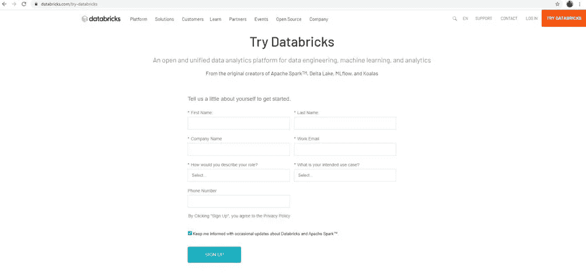

数据块注册页面

**第三步:**完成注册后，登录**社区版**。只需点击“在此签名”的小链接。

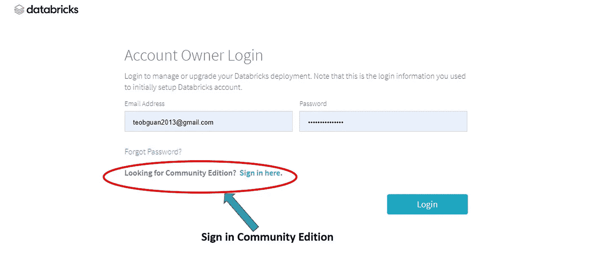

数据块登录页面

Databricks 提供完全免费的社区版。社区版为我们提供了一个具有 15.3 GB 内存、2 个内核和 1 个 DBU 的集群。这对于学习和实验目的是足够的。

但是，请注意**Community Edition 集群将在空闲两小时后自动终止**。这意味着我们必须不时地在数据块中重新构建一个新的集群。

(不要担心，在 Databricks 中重建新集群只需点击几下按钮，即可在 1 分钟内完成)。

第四步:建立一个集群。在 Databricks 的主页中，从左侧的面板中选择“集群”。

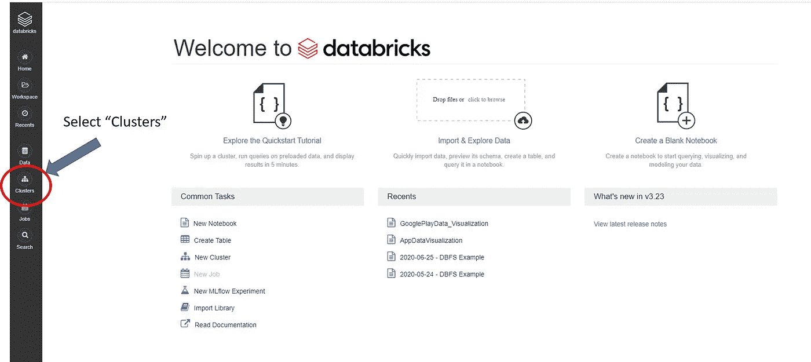

导航至集群设置页面

接下来，填写下一页中的“集群名称”字段。我们可以根据自己的喜好提供一个集群名。

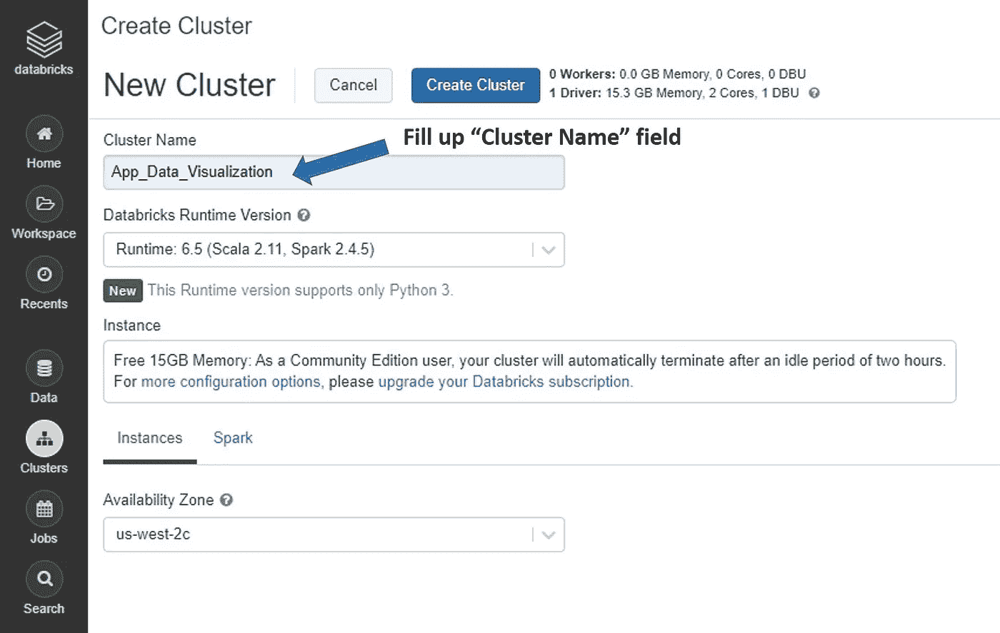

数据块创建集群页

等待大约 2-3 分钟，然后 Databricks 将集群分配给我们。

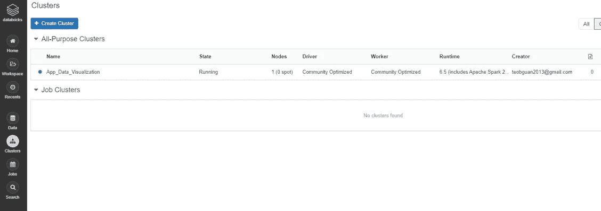

数据块簇列表

**第五步:**上传数据集。从左侧面板中选择“数据”。

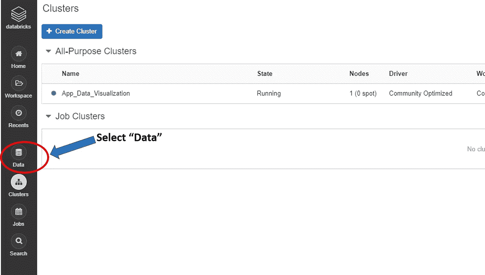

导航至添加数据页面

点击“添加数据”。

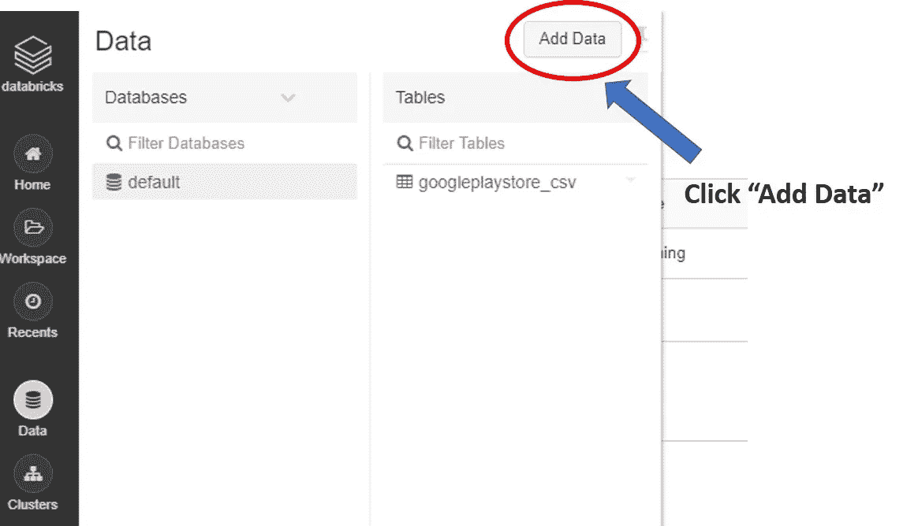

我们可以选择删除 Kaggle 数据集，或者浏览我们的目录来上传数据集。

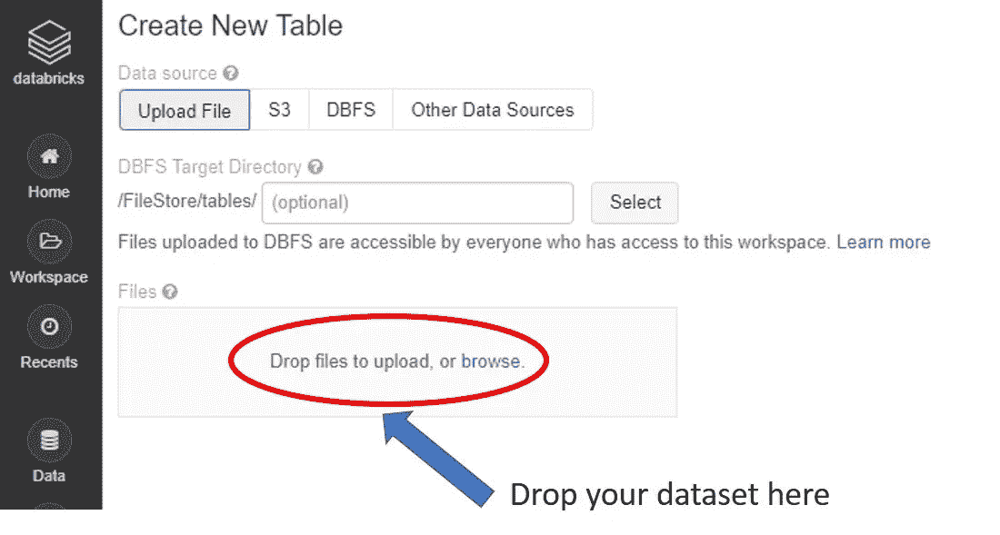

将数据上传到数据块

**第 6 步:**从 Databricks 主页创建一个空白笔记本。为我们的笔记本命名。

在数据块中创建笔记本

新笔记本将自动连接到我们在上一步中刚刚创建的集群。

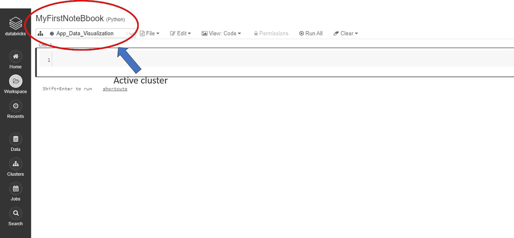

将群集连接到笔记本电脑

只需点击几下按钮，我们就可以在 Databricks 中建立一个分布式计算平台，并将数据上传到平台上。此外，我们还创建了一个笔记本，我们可以在其中编写 Python 脚本来执行数据分析工作。PySpark 已经内置在笔记本中，这里不需要进一步安装框架。

*(请注意 Databricks 中的笔记本，就像我们常用的 Jupyter 笔记本一样，它提供了一个交互式编程接口来编写我们的脚本并可视化输出)*

我们现在已经准备好使用 PySpark 开始我们的数据探索之旅。

# 探索谷歌应用数据

在本节中，我们将开始在 Databricks 笔记本中编写 Python 脚本，以使用 PySpark 执行探索性数据分析。这一节将被分成七个部分，同时还将介绍一些常见的 PySpark 方法。

*您可以通过此* [*链接*](https://databricks-prod-cloudfront.cloud.databricks.com/public/4027ec902e239c93eaaa8714f173bcfc/4212847372568791/2909369757549244/2027857480347661/latest.html) *访问在线版笔记本，或者您也可以从我的*[*Github*](https://github.com/teobeeguan/PySpark-Project)*下载离线版笔记本。*

## 第 1 部分:导入库

第一步从导入必备的库/模块开始。

用于导入库的 Python 脚本

第 1–5 行:

*   导入本文介绍的数据探索任务所需的所有 PySpark 模块。

第 7 行:

*   PySpark 需要一个 SQLContext 来启动 Spark SQL 的功能。Spark SQL 是用于处理结构化数据的 Spark 模块之一。在后面的阶段，我们将使用它从我们的数据集执行数据查询。
*   关键字“ ***sc*** ”表示 SparkContext。SparkContext 表示到 Spark 集群的连接，被认为是 Spark 功能的主要入口点。

## **第 2 部分:读取文件并计算记录的总行数**

接下来，我们从外部来源(在本例中是一个 CSV 文件)获取数据。

读取文件和计算总行数的 Python 脚本

第一行:

*   在 PySpark 中，我们使用 SQLContext 模块中的 ***read.csv*** 方法从前面步骤中上传到 Databricks 的数据中读取 csv 文件。请注意，默认情况下，csv 文件存储在 Databricks 中的“FileStore/tables”目录下。
*   ***read.csv*** 方法返回一个 Spark 数据帧，并将其赋给变量 *df_spark* 。Spark 数据帧类似于熊猫数据帧。

第二行:

*   PySpark 使用 ***count*** 方法获取从 csv 文件中读取的记录的行数。

记录的总行数

## 第 3 部分:检查数据

一旦我们从 CSV 文件中读取了原始数据，我们可能会有兴趣通过快速浏览一些记录来了解数据集的一些基本细节。

**3.1 显示列细节**

打印列详细信息的 Python 脚本

*   ***printSchema*** 方法显示每一列的数据类型，也显示一列是否可以为空。此时，我们可以观察到所有的列都是字符串并且可以为空。

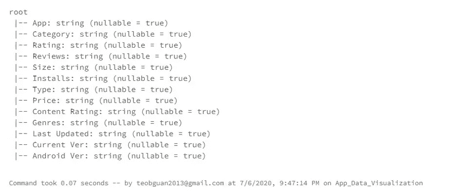

列详细信息

**3.2 显示前几行记录**

显示前五行记录的 Python 脚本

*   ***显示*** 的方法是显示前几行记录。我们可以灵活地向 *show* 方法传递不同的值，以调整我们想要显示的行数。

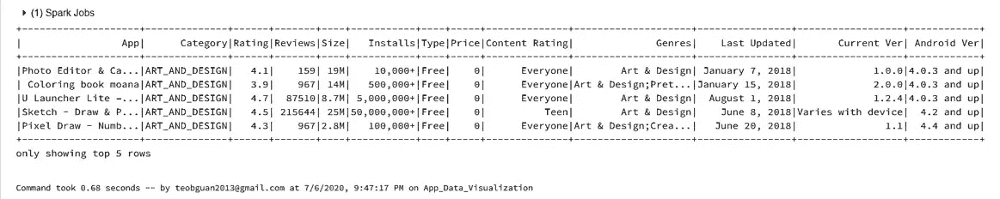

前五行记录

**3.3 显示特定列**

显示特定列的 Python 脚本

*   我们也可以使用“**方法与“ ***show*** ”方法连锁，只显示某些指定的列，而不是显示所有的列。**

**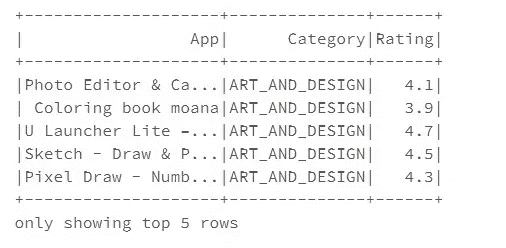**

**选定列的前五行**

## **第 4 部分:数据争论**

**乍一看从 CSV 文件中读取的原始数据，我们可能会注意到几个问题:**

*   **由于所有列都可以为空，因此某些列中可能存在空值或缺失值。空值或缺失值会导致分析错误。**
*   **所有的列都是字符串。当我们希望使用数据进行统计分析或绘制图表时，这将带来问题。**
*   **此外，一些列没有以允许数值分析的格式呈现。例如，“*尺寸*栏中的值在数字后附加一个字母“M”。“*安装*列的值与逗号和加号字符混合。“价格”值前面也有“$”字符。**

**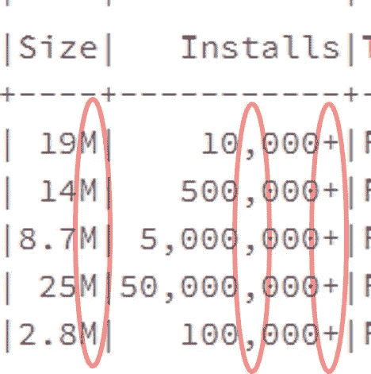**

**一些错误数据格式的例子**

**这里需要数据清理和转换，以便于数据访问和分析。**

****4.1 删除空值****

**在删除空值之前，我们需要确定可以找到空值的列。**

**Python 脚本显示每列中的空值**

*   **上面的代码检查每一列是否存在空值，并计算其频率，然后以如下表格格式显示出来。**

**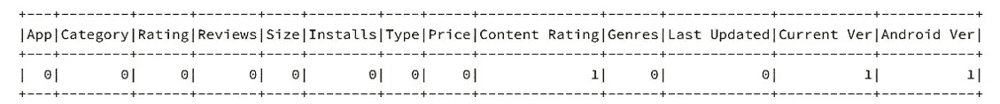**

**每列中存在大量的空值**

**输出显示“*内容分级*”、“*当前版本*”和“ *Android 版本*”列中有一个空值。接下来我们将使用 ***dropna*** 方法从列中删除空值。**

**移除空值的 Python 脚本**

****4.2 删除不需要的字符****

**在 PySpark 中，我们可以将指定列中的数据转换成对我们有用的格式。为此，我们可以用 ***与*** 和 ***翻译*** 的方法。**

**移除不需要的字符的 Python 脚本**

**第 1–3 行:**

*   *****withColumn*** 的方法是指定我们要转换的列(如 *Size* 、 *Installs* 、 *Price* )**
*   *****翻译*** 的方法是用目标字符替换字符模式。例如，translate('Size '，' Mk '，'')会将' Size '列中的所有字符' M '或' k '替换为空字符串' '。这意味着附加了大小值的所有字符“M”或“k”都将被删除。采用类似的方法，从*安装*列中去掉“+”或“，”并从*价格*列中去掉“$”。**

**第 5 行:**

*   **数据转换后再次显示前五条记录。**

**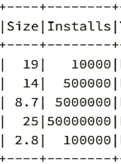**

**转换数据的样本**

****4.3 过滤不需要的值****

**此时，我们已经成功地从“*大小*”列中删除了不想要的字符“M”或“k”。然而，还有一个问题。该栏中存在值*随设备*变化。这是因为一些应用程序的大小会因设备而异。这样的字符串值与列中的其余值(数值)不一致，因此我们必须删除它们。**

**移除不需要的值的 Python 脚本**

*   **要从一列中过滤出一个特定的值，我们可以使用 ***where*** 方法来设置一个过滤条件，其中只有指定列的值(例如" Size ")满足特定的条件(例如！= "随设备变化")将被选择并将其分配回 *df_spark。***
*   **这种方法将筛选出所有大小值等于“因设备而异”的记录。**

****4.4 改变列的数据类型****

**请记住，即使我们已经完成了上面的数据清理和转换步骤，所有的列仍然是字符串格式。我们必须将一些列从字符串转换成数值。**

**用于更改列的数据类型的 Python 脚本**

**第 1–4 行:**

*   **我们再次使用 ***和*** 列来设置我们将要使用的特定列。接下来，我们使用 ***cast*** 方法来设置一个特定的数据类型( *IntegerType* 或 *FloatType* )，我们打算将字符串转换为该数据类型。**

**第 5 行:**

*   **再次使用 ***printSchema*** 显示每一列中更新的数据类型。**

**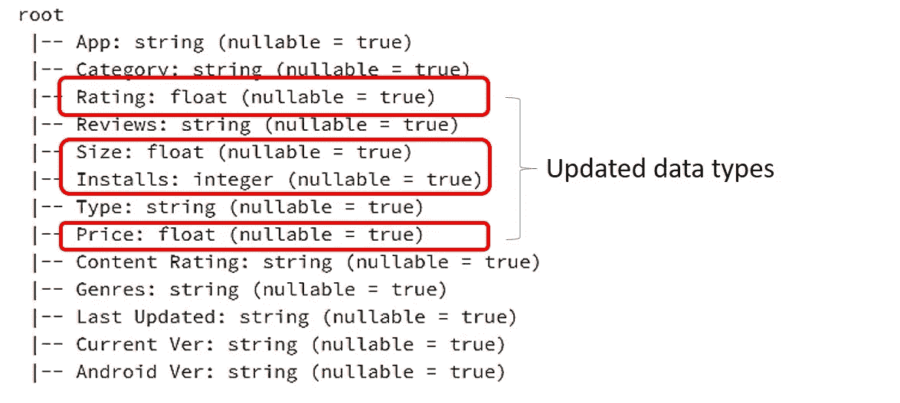**

**更新的数据类型**

****4.5 重命名列****

**现在，我们可以对刚刚转换了值的列进行重命名，以反映这些更改。**

**用于重命名列的 Python 脚本**

**第 1–3 行:**

*   **要重命名一个列，我们可以用 ***与*** 的方法来重命名。这个方法有两个参数，1)原始列名和 2)新列名。**

**第 4 行:**

*   **显示记录的前五行，以查看列名的变化。**

**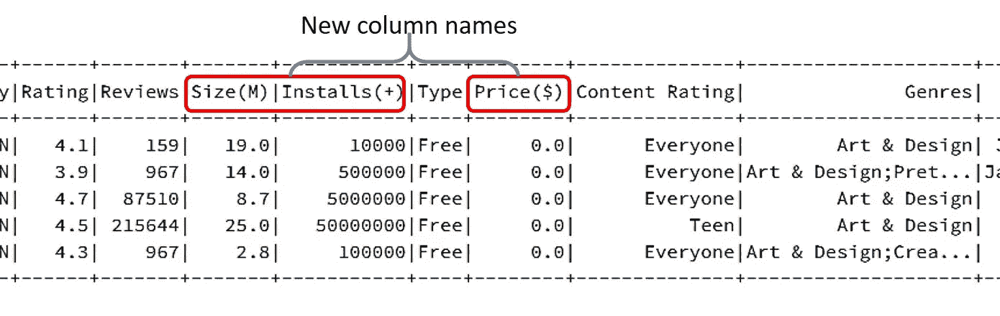**

**重命名的列**

****4.6 删除不需要的列****

**并非所有的列都与这里的研究相关，我们可以删除那些不相关的列。**

**删除列的 Python 脚本**

*   **删除列很简单。只需使用 ***drop*** 方法，并将目标列名(例如评论、流派&当前版本)作为参数传递给该方法。**

**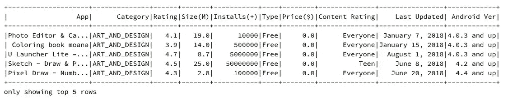**

**删除所选列后的数据帧**

## ****第五部分:查询数据****

**最后，我们设法以一种可用的格式获得了一个干净的数据，现在我们准备更深入地研究我们的数据。在本部分中，我们将使用 ***过滤*** 的方法，根据不同类型的条件进行数据查询。**

****5.1 单条件查询****

**一般来说，我们可以在 ***filter*** 方法中设置一个条件，这将返回所有符合条件的记录。让我们看看下面的例子:**

**用于搜索青少年专用应用程序的 Python 脚本**

*   **这个查询是为了搜索青少年专用的应用程序。**

**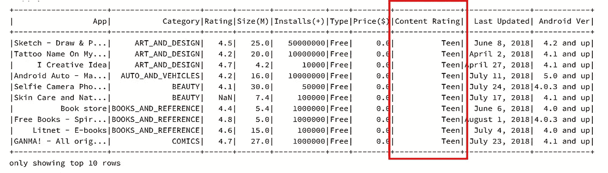**

**过滤记录**

**用于搜索评分高于 4.2 的应用程序的 Python 脚本**

*   **上面的查询是为了搜索“*”评分大于 4.2 的记录。***

***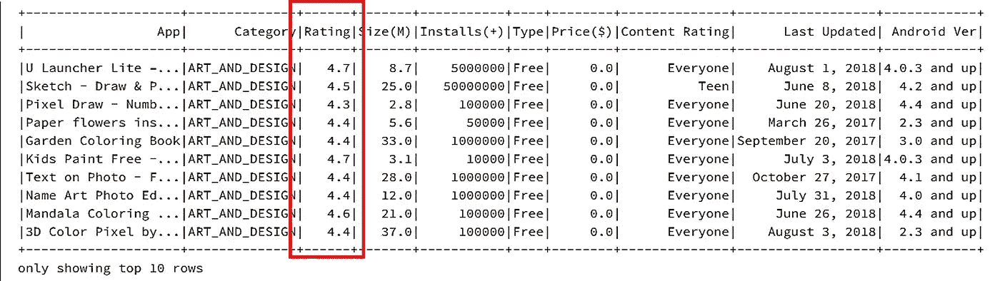***

***过滤记录***

*****5.2 按值范围查询*****

***PySpark 提供了一个方法，*之间，使我们能够搜索一个下限和一个上限之间的记录。****

***按值范围搜索的 Python 脚本***

*   ***上面的代码返回“*价格*”在 1 美元到 3 美元之间的记录。***

**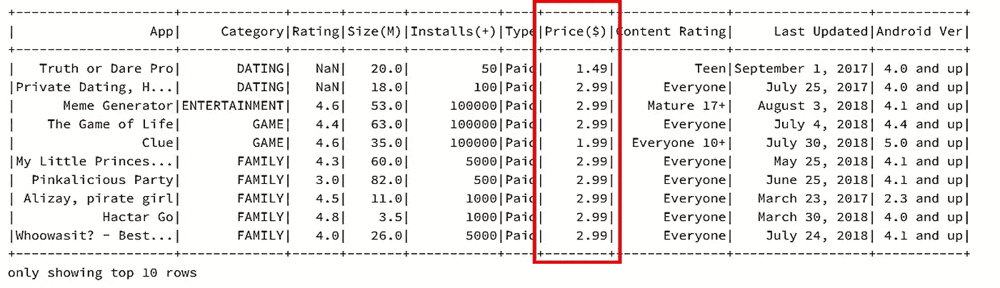**

**过滤记录**

****5.3 关键字查询****

**也可以根据特定列中存在的某些特定关键字来搜索记录。我们可以通过三种方法之一来实现: ***startswith*** ， ***endswith*** ， ***包含*** 。下面我们来看几个例子:**

****5.3.1 从**开始**

**使用 startswith 查询数据的 Python 脚本**

*   **上面的 ***startswith*** 方法返回以“4”开头的“ *Android Ver* 的记录。这意味着只有运行在 Android 4 上的应用程序的记录才会被返回。**

**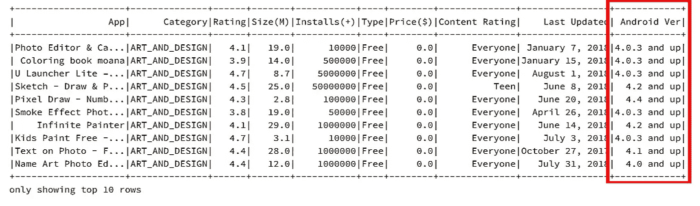**

**过滤记录**

****5.3.2 端盖****

**使用 endswith 查询数据的 Python 脚本**

*   **上面的 ***endswith*** 方法返回“ *Last Updated* ”结束于“2018”的记录。这意味着只会返回该应用程序在 2018 年最后更新的记录。**

**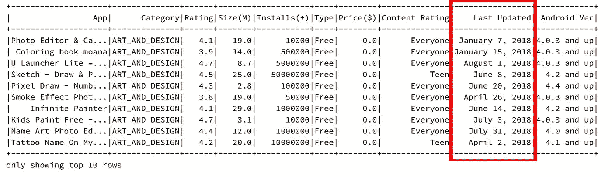**

**过滤记录**

****5.3.3 包含****

**使用包含来查询数据的 Python 脚本**

*   **上面的 ***包含*** 方法返回的记录中带有 *App* 包含关键字“照片”。这意味着只会返回名称中包含“照片”关键字的应用程序的记录。**

****

**过滤记录**

****5.4 多条件查询****

**我们可以在数据查询中使用逻辑运算符，如 **&、|、**和 **~** 来连接多个搜索条件。**

**使用逻辑运算符连接多个搜索条件进行查询的 Python 脚本**

*   **上面的代码使用了 ***&*** 运算符来连接三个搜索条件，以便只返回属于游戏类别并且最后更新年份是 2018 年并且运行在上面的 Android 5 上的 app 的记录。**

**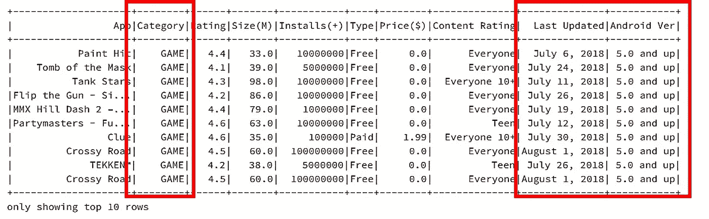**

**过滤记录**

## **第 6 部分:描述性统计**

**我们可以使用 py spark***describe***方法轻松地对我们的数据集进行快速描述性统计研究。**

**用于计算描述性统计数据的 Python 脚本**

*   **在单行代码中， ***describe*** 方法显示了每一列的描述性统计摘要。**

**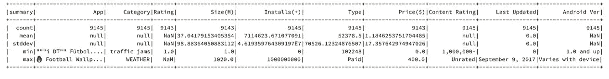**

**描述性统计概要**

## ****第 7 部分:数据可视化****

**我们将进入一个有趣的部分，我们将看到 PySpark 如何提供一些非常用户友好的特性，使用户能够创建不同类型的图表来可视化他们的数据。**

**在本部分中，我们将使用 PySpark***display***函数绘制一些图表，以解决一些与 app 开发相关的问题。下面我们来看一些例子。**

****7.1 饼状图****

**假设我们想知道哪一类应用程序的市场份额最高。一个简单的解决方案是创建一个饼图，按类别显示安装总数。从那里，我们可以很容易地确定最主要的应用类别。**

**用于聚合数据和生成图表的 Python 脚本**

**第一行:**

*   **我们使用 ***groupby*** 将我们的数据按“*类别*分组，然后使用 ***agg*** 方法应用“ *sum* ”函数来计算每个类别的安装总数。聚合结果将作为新的数据帧返回，并赋给变量 *df_cat_sum* 。**

**第二行:**

*   **我们将 *df_cat_sum* dataframe 传递给 ***display*** 函数。当我们运行上面的代码时，我们将首先看到数据帧以如下表格格式显示:**

**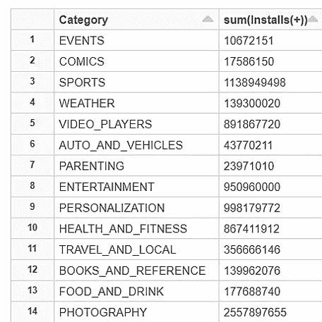**

**列入总汇表的数据**

*   **如果我们看一下表格的底部，我们会看到有一个下拉列表。当我们点击它时，我们会看到有几个内置的图，我们可以选择来呈现我们的数据。**

**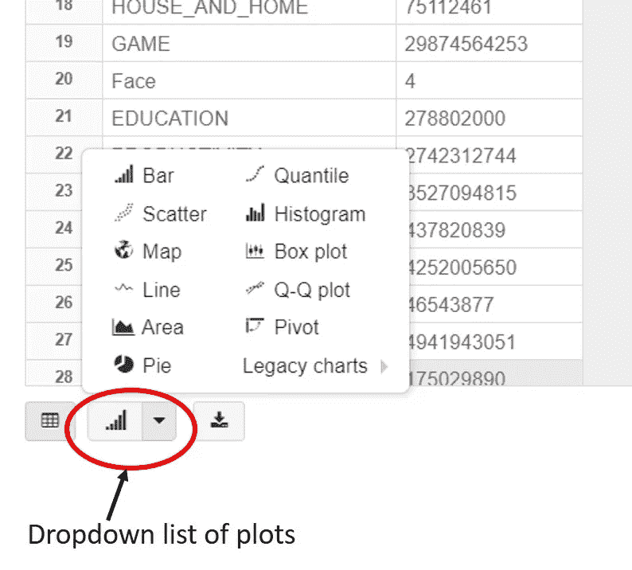**

**图的下拉列表**

*   **让我们选择“**饼图**，我们将看到一个饼图正在生成。**

**(*默认情况下，图表的原始大小可能非常小。我们可以通过拖动图表右下角来放大图像来调整大小。*)**

**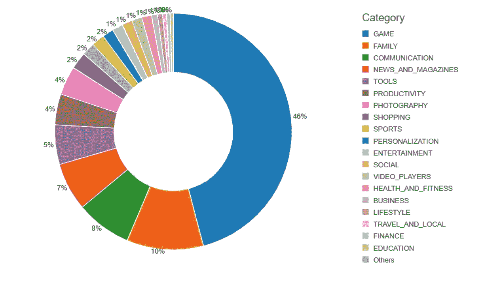**

**圆形分格统计图表**

**从饼状图中可以明显看出，游戏几乎占据了应用程序市场的一半，与其他游戏相比，其市场份额最高。**

**如上所示，我们不需要编写额外的代码来生成绘图。相反，我们可以使用 ***显示*** 功能来处理我们的数据帧，并从下拉列表中选择一个绘图选项来显示我们的数据。**

## ****7.2 直方图****

**另一个问题可能会引起我们的兴趣:应用程序的大小会影响安装率吗？**

**我们可以预测，用户通常更喜欢轻量级应用程序，它消耗的移动设备存储资源更少。让我们通过绘制直方图来验证它。**

**用于聚合数据和生成图表的 Python 脚本**

*   **上面给出的两行代码类似于 7.1 节中的代码，只是我们试图按大小对整个安装进行分组。**
*   **对于这一轮，我们将从下拉列表中选择“直方图”。**

**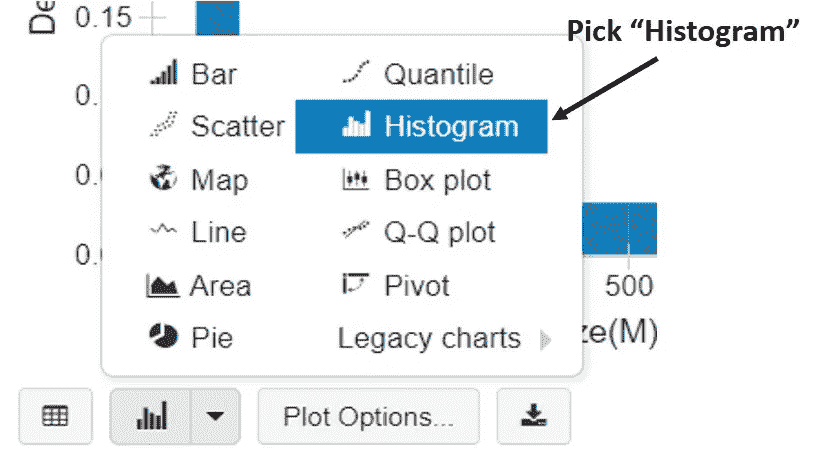**

**从下拉列表中选择直方图**

*   **接下来，单击下拉列表旁边的另一个按钮“绘图选项”。**

**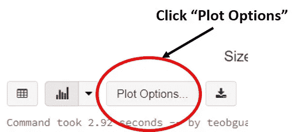**

**PySpark 绘图选项**

*   **将弹出一个定制绘图向导。将“*尺寸(M)* ”拖至数值字段，点击右下角的“应用”按钮。**

**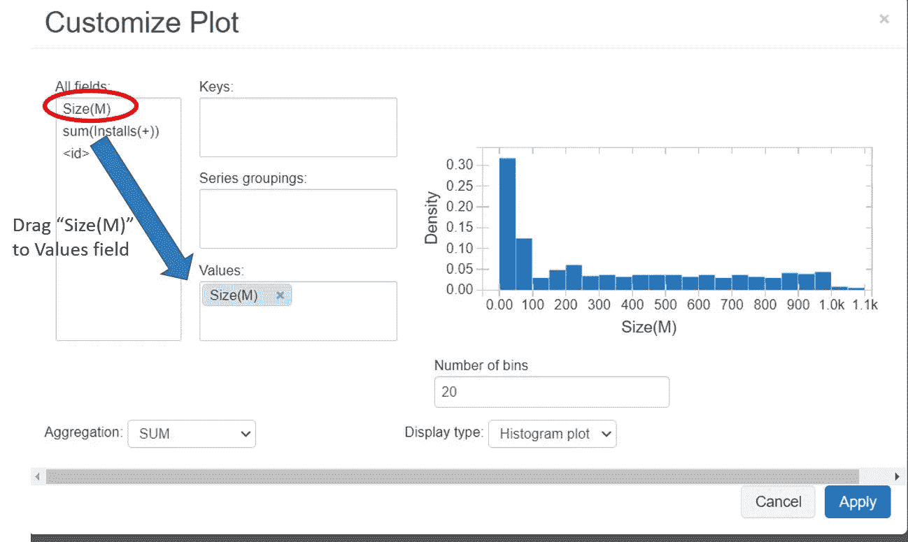**

**自定义绘图向导**

*   **我们将看到一个直方图生成如下。**

**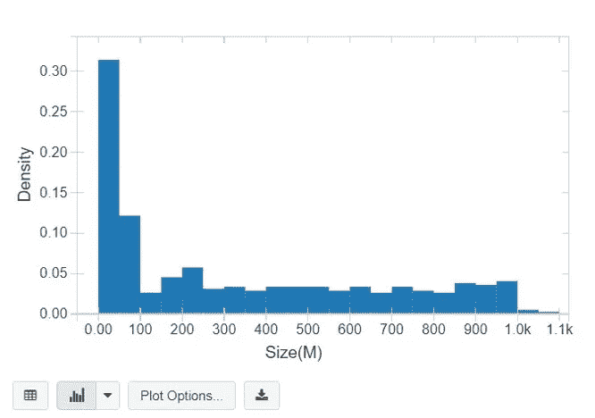**

**柱状图**

**从柱状图来看，小于 50 兆的应用最受社区欢迎。超过 100 兆字节的大小往往会驱使一大群用户远离使用它。**

****7.3 条形图****

**在开发应用程序时，我们倾向于确保我们的应用程序能够覆盖尽可能大的社区群体。我们应用的接受度高度依赖于能够支持我们应用的 Android 版本。**

**这就是为什么对当前最广泛支持的 Android 平台的调查非常有助于我们做出更好的决定，为我们的应用程序设置最低操作系统平台。为此，我们可以选择绘制一个条形图，显示不同 Android 版本支持的应用程序的出现次数(最低级别)。**

**用于计算出现次数并生成图表的 Python 脚本**

*   **在上面的代码中，我们使用 *count* 方法来获得每个应用程序的出现次数，这些应用程序按其支持的最低 Android 版本分组。我们还尝试按降序对结果进行排序。**
*   **从图的下拉列表中，选择“**条形图**”图表。**

**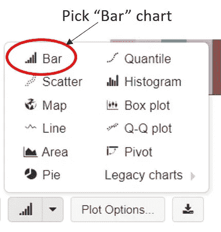**

**从下拉列表中选择栏**

*   **单击“*绘图选项*打开“自定义绘图”向导，然后确保我们将“ *Android Ver* ”拖至系列分组字段，并将“ *count* ”拖至值字段。最后，单击“应用”按钮。**

**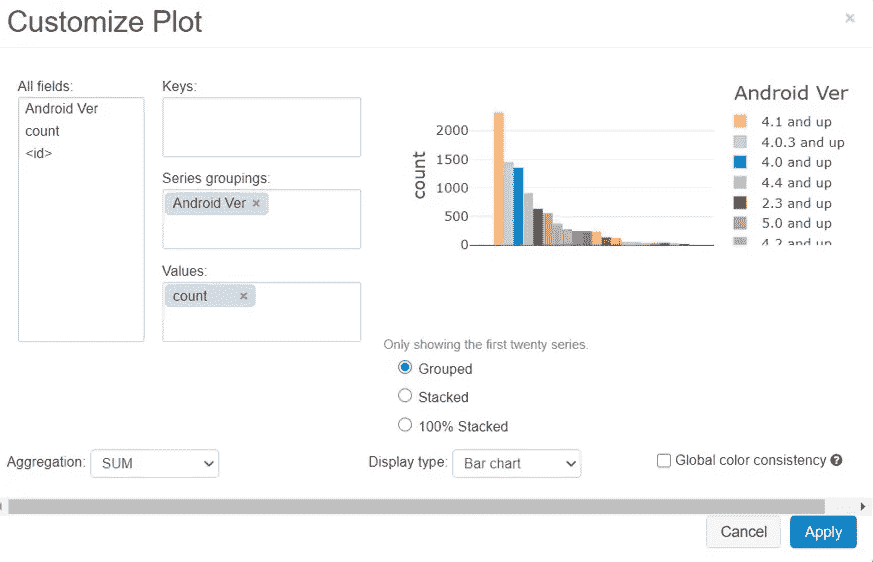**

**自定义绘图向导**

*   **最后，我们将看到一个条形图生成如下。**

**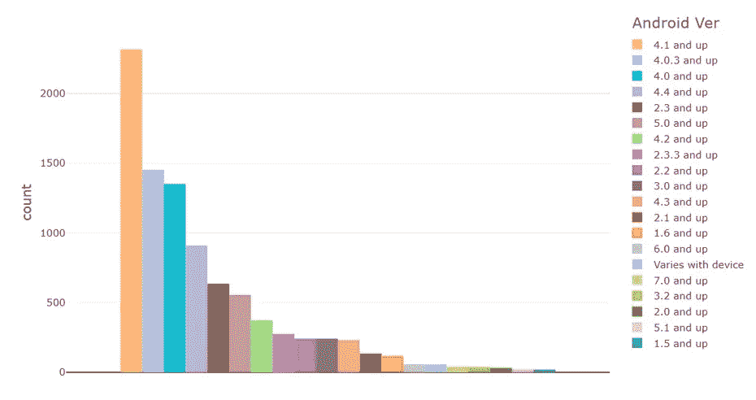**

**条形图**

**从上面的条形图中，我们了解到 Android 版本 4.1、4.0.3、4.0 和 4.4(最低级别)支持大多数当前应用程序。因此，如果我们打算瞄准更大的市场，明智的做法是让我们的应用程序得到 Android 版本 4 及更高版本的支持。**

****7.4 堆积条形图****

**现在，我们希望为我们的应用程序设定一个合理的价格。虽然定价在很大程度上取决于开发和维护成本，但另一个值得考虑的重要因素是用户的承受能力。高昂的价格标签会阻止许多用户使用我们的应用程序，即使我们的应用程序开发和维护得很好。**

**在这里，我们创建了一个堆积条形图，向我们展示不同用户群的支付能力的一些线索。**

**仅选择付费应用程序并生成图表的 Python 脚本**

*   **在上面的代码中，我们使用 *filter* 方法只选择那些付费应用的记录，返回的数据帧被赋给一个变量*df _ app _ payed*。**
*   **从图的下拉列表中，再次选择“**条**图”。**

****

**选择栏选项**

*   **单击“绘图选项”打开“自定义绘图”向导，然后确保我们将“*内容分级*”拖到“关键字”字段，“价格($) ”拖到“系列分组”字段，“T24”安装(+) ”拖到“值”字段。确保选中“堆叠”单选按钮。最后，单击“应用”按钮。**

**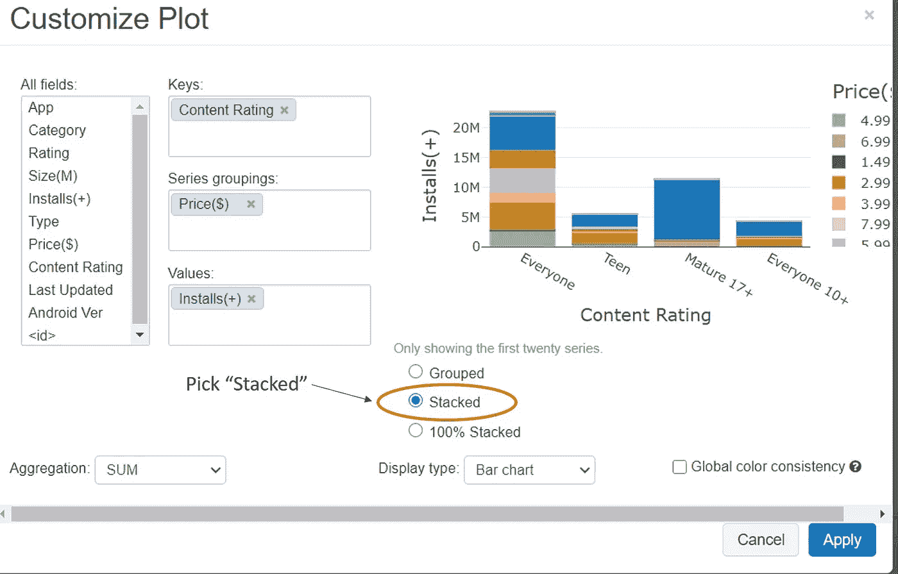**

**自定义绘图向导**

*   **我们将看到一个堆积条形图生成如下。**

**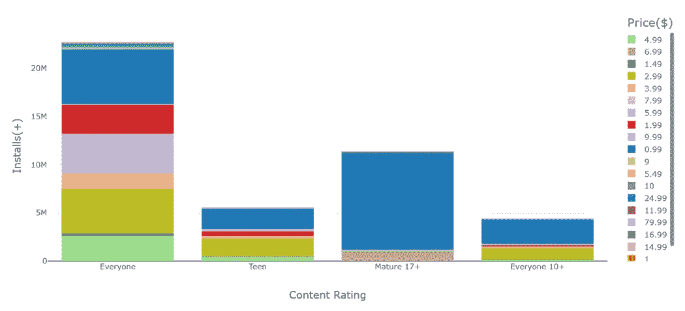**

**堆积条形图**

**显然，0.99 美元的价格标签最广泛地被所有年龄组接受。10 美元以上的价格标签很难获得显著的公共市场份额。**

****7.5 盒图****

**最后，我们还有一个问题:应用程序的价格会影响应用程序的评级吗？如果用户付费多了，会不会对 app 寄予更高的期望？**

**为了解决这个问题，让我们创建一系列的方框图。**

**基于类别和评级选择记录并绘制图表的 Python 脚本**

*   **我们只是通过使用逻辑操作符来应用上一节中介绍的类似步骤&选择属于游戏类别和评级为 5 或更低的记录(这个条件是必需的，因为评级列中有一些异常)。我们还根据评级对过滤后的记录进行降序排序，然后将数据帧赋回变量*df _ app _ payed*。**
*   **从图的下拉列表中，选择“**方框图**”。**

**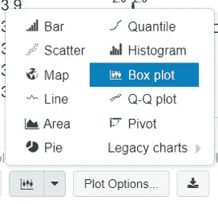**

**选择“方框图”**

*   **单击“绘图选项”以打开“自定义绘图”向导，然后确保我们将“*评级*”拖至 Keys 字段，并将“*价格($)* ”拖至 Values 字段。最后，单击“应用”按钮。**

**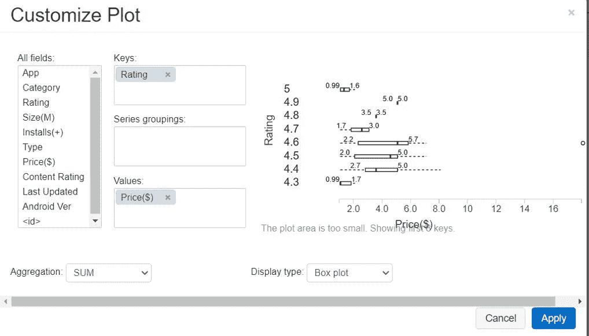**

**自定义绘图向导**

*   **一系列评级的箱线图如下所示。**

**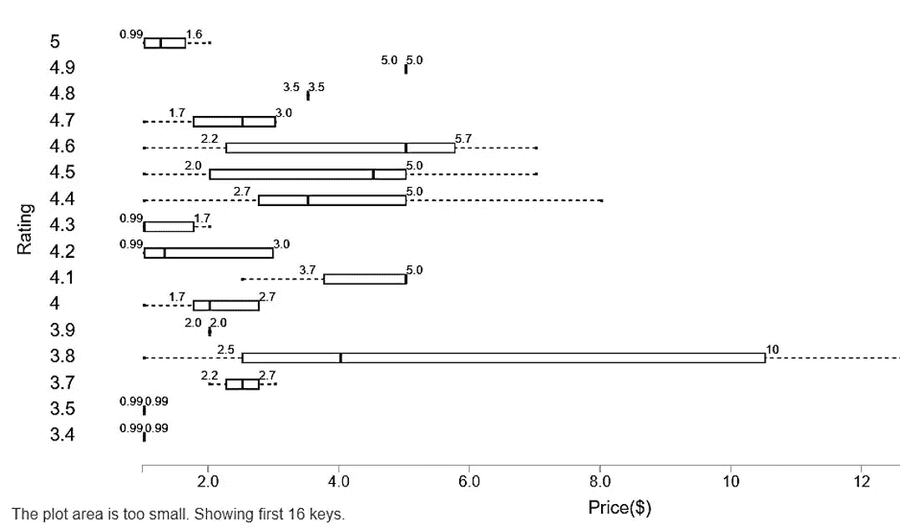**

**箱线图**

**箱线图没有显示出明显的模式，即中值价格越高，评级越低，反之亦然。价格为 0.99 美元的应用程序可以获得 3.4 到 5 的评级。**

# **结论**

**在本文中，我们看到了如何使用 PySpark 在分布式计算环境中执行数据探索和可视化。如果您熟悉 Pandas Dataframe，您可以很容易地适应 PySpark Dataframe，因为除了语法上的一些细微差别之外，它们之间有许多相似之处。然而，了解 Pandas 不是为并行处理而设计的，而是基于单线程操作，这一点很重要。因此，Pandas 并不是在大数据环境中处理大量数据集的理想选择。另一方面，PySpark 还提供了一种非常用户友好的方式来从它的数据帧中绘制一些基本的图形。基本上，数据可视化工作可以通过如上所述的图形用户界面来完成。**

**值得一提的是，还有很多 PySpark 特性没有在本文中讨论，其中两个是**弹性分布式数据集(RDD)** 和 **Spark MLlib** ，它们太宽泛了，无法在一篇文章中涵盖。我在这里的目的是通过主要关注 PySpark 的数据框架来介绍 PySpark，我希望这可以帮助那些已经熟悉 Pandas 的人将数据技能迁移到 py spark。**

**我希望你喜欢这篇文章并从中受益。**

# **参考**

1.  **[http://spark.apache.org/](http://spark.apache.org/)**
2.  **[https://databricks.com/](https://databricks.com/)**