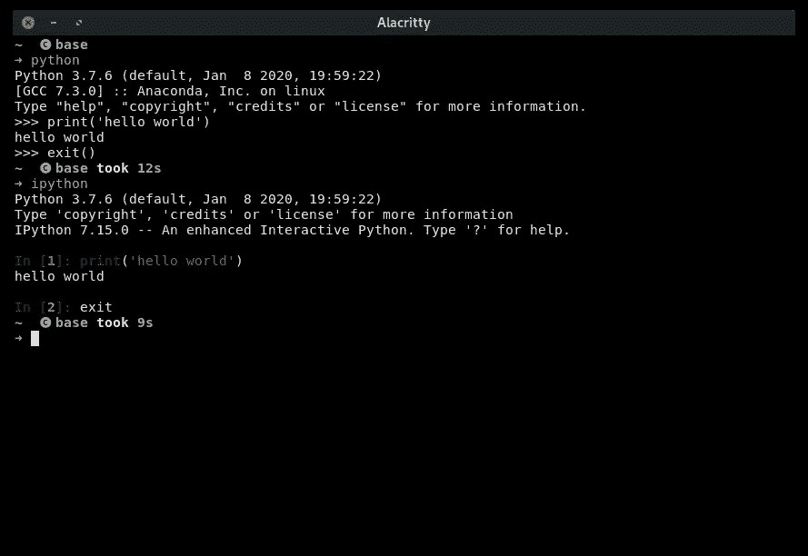

# 每天 10 分钟学习 Python 10

> 原文：<https://towardsdatascience.com/learning-python-10-minutes-a-day-1-7fda6662276?source=collection_archive---------37----------------------->

[杰瑞米·拉帕克](https://unsplash.com/@jeremy_justin?utm_source=unsplash&utm_medium=referral&utm_content=creditCopyText)在 [Unsplash](/?utm_source=unsplash&utm_medium=referral&utm_content=creditCopyText) 上的原始照片。

## [每天 10 分钟 Python 速成班](https://towardsdatascience.com/tagged/10minutespython)

## Python，IPython，Jupyter lab 是什么？

这是一个[系列](https://python-10-minutes-a-day.rocks)的 10 分钟 Python 短文，帮助你开始学习 Python。我试着每天发一篇文章(没有承诺)，从最基础的开始，到更复杂的习惯用法。如果您想了解关于 Python 特定主题的问题或请求，请随时通过 LinkedIn[联系我。](https://www.linkedin.com/in/dennisbakhuis/)

根据 PYPL(编程语言的流行程度)，Python 是目前最流行的编程语言。这是有充分理由的，因为它是为通用快速编程而设计的，可读性是核心规则。许多成功的公司，如 Reddit 和 Dropbox，都是围绕 Python 建立的。虽然易学从来就不是设计目标，但许多人都这样描述，很可能是因为 Python 社区非常欢迎初学者。

从主[网站](https://www.python.org/doc/essays/blurb/)来看，Python 自称是一种解释的、面向对象的、具有动态语义的高级编程语言。它被解释，因此，不需要编译步骤，减少了编辑-测试-调试周期的时间。这种语言不仅支持面向对象的编程(函数式编程也很好)，而且在 Python 中一切都由一个对象表示。高级别意味着您不必担心低级别的系统细节，如内存分配和垃圾收集。Python 是动态类型的，这意味着变量是对对象的引用(或标签),它们可以在运行时自由改变。对于像 C 这样的静态类型语言来说，情况就不一样了，在 C 语言中，变量类型必须在编译时声明。

我可以想象这些通用的设计规则目前很难掌握，但随着时间和更多的经验，它最终会变得清晰，我保证！我一般建议人们记住的是，Python 被设计得非常简单。我不止一次惊讶于简单的 Python 如何解决一些问题。如果您想快速掌握 Python，您必须亲自动手编写代码。

要开始使用 Python，需要安装一个版本(Mac 和很多 Linux 发行版上已经有预装版本)。虽然最直接的方法是去 Python.org 下载最新版本，但我推荐使用 Miniconda。为此，我写了一篇关于如何和为什么的简短指南。python 安装后，就可以开始使用“Python”了，比如从终端。这就打开了一个所谓的 REPL:阅读、评估、打印、循环。它只是某种直接与 Python 交互的命令行界面(CLI)。您可以直接执行任何 python 代码和/或打开文件来运行 Python 脚本。python 解释器通常用于从 CLI 运行脚本，除了一个快速计算器，我不知道有谁直接使用 REPL 界面。为了更交互地使用 Python，几乎所有人都使用 IPython。

您的终端可能看起来不同，但在这里我启动了两个 REPLs。

IPython 提供了一个增强的交互式 Python shell，开始时只需在终端中键入“ *ipython* ”(您可能需要使用“ *pip install ipython* ”来安装它)。IPython 的另一个惊人特性是从 REPL 中分离出“E ”,它称之为“内核”。内核接收执行指令并发回结果。虽然使用内核有很多好处，但广泛使用的一个好处是其他应用程序(如 Spyder 和 Jupyter)连接到 IPython 内核。需要与内核交互的应用程序通常会自己启动。

如果您喜欢使用简单的文本编辑器进行开发，IPython 可能就是您所需要的。你想有一个更成熟的 IDE，有 pyCharm 或 Visual Studio 代码(VSC)。我认为开发人员在那里感觉很自在。对我来说，作为一名数据科学家，我在 Jupyter 笔记本上感觉最舒服。这是 IPython 交互式 shell 和一个文档的组合，您可以将您的代码与结构化的解释片段结合起来。几个星期后，我的记忆会变得模糊，有时我会忘记自己打算做什么。因此，对我来说，围绕代码的文档是非常宝贵的。为了给它一点 IDE 的感觉，他们创建了 Jupyter lab("*pip install Jupyter lab*")，这是 Jupyter 的一个扩展，具有更多的功能。用你觉得最舒服的方式工作，或者如果你没有偏好，用你同事最常用的方式。对于内部工作，这都是 IPython，它本身就是 Python。

## 今天的练习:

如果你还没有，我强烈建议你使用 Miniconda 设置 Python，就像这个[指南](/environments-conda-pip-aaaaah-d2503877884c)中建议的那样。

1.  启动基本的 Python REPL 并运行“打印(' hello world ')”命令。您可以使用“quit()”或“exit()”退出它(注意括号？).
2.  启动 IPython REPL 并运行“print('hello world ')”命令。您可能需要安装 IPython。在这里，您可以使用“退出”或“退出”来退出。
3.  设置您的首选 Python 环境，即 Jupyter、VSC、Spyder、pyCharm，或者如果您只是从文本编辑器和终端工作，则不设置任何环境。这对于示例来说并不重要，但是我们将展示来自 Jupyter 实验室或简单的 IPython 的所有内容。

如果您有任何问题，欢迎通过 [LinkedIn](https://www.linkedin.com/in/dennisbakhuis/) 联系我。