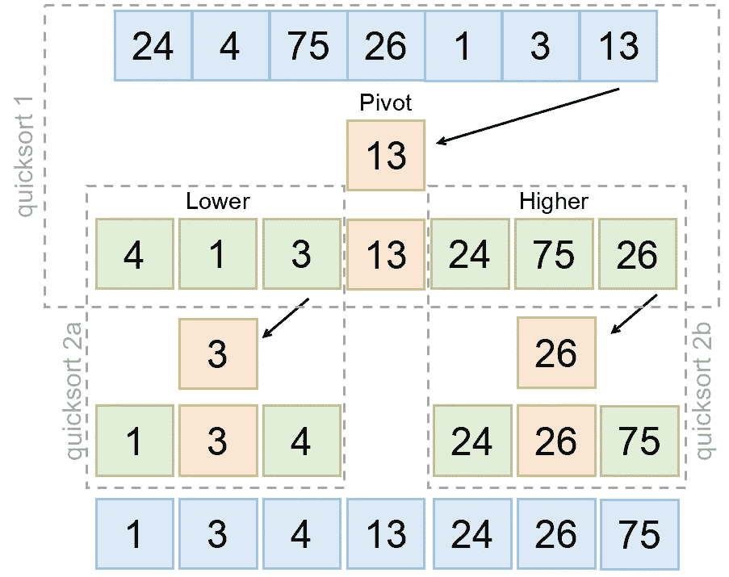
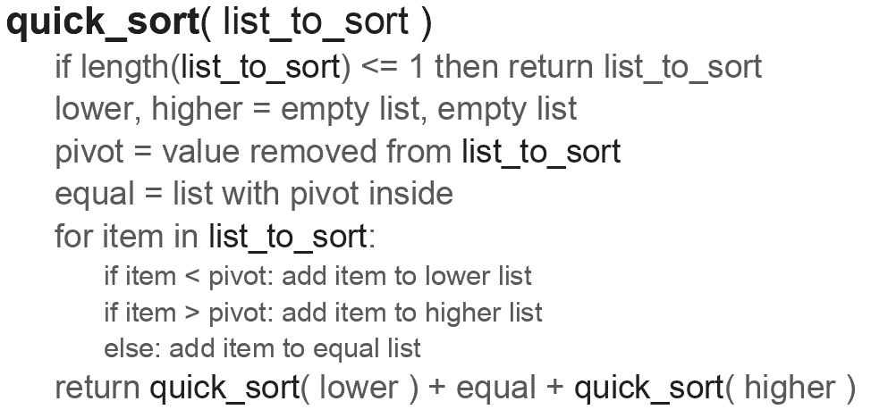

# 每天 10 分钟学习 Python 10

> 原文：<https://towardsdatascience.com/learning-python-10-minutes-a-day-10-91b8ff16cd60?source=collection_archive---------47----------------------->

[杰瑞米·拉帕克](https://unsplash.com/@jeremy_justin?utm_source=unsplash&utm_medium=referral&utm_content=creditCopyText)在 [Unsplash](/?utm_source=unsplash&utm_medium=referral&utm_content=creditCopyText) 上的原始照片。

## [每天 10 分钟 Python 速成班](https://towardsdatascience.com/tagged/10minutespython)

## 测试你的新技能:编写一个快速排序算法

这是一个[系列](https://python-10-minutes-a-day.rocks)10 分钟的简短 Python 文章，帮助您提高 Python 知识。我试着每天发一篇文章(没有承诺)，从最基础的开始，到更复杂的习惯用法。如果您对 Python 的特定主题有任何问题或要求，请随时通过 LinkedIn 联系我。

今天，我们不会讨论一个新的话题，而是有一个简短的任务来强化你的知识。大约十年前，我参加了一个演讲，在演讲中，Python 因为做科学计算而得到了推广。在这次演讲中，有一个例子展示了快速排序算法。快速排序是一种相对简单但有效的排序算法。在演讲中让我惊讶的是，在讨论了算法如何使用伪代码工作后，python 解决方案几乎与伪代码完全相同。希望您也能惊讶于用 Python 实现该算法是多么简单。

快速排序算法图。

快速排序是一种所谓的分治算法。首先，它从列表中选择一个元素，这个元素称为 pivot。然后，它遍历剩余的元素，并将它们分成三组:小于透视值、等于透视值和大于透视值。它通过调用*本身*对更小和更大的部分重复这个过程。最后，它将所有列表合并在一起，得到一个排序后的列表。在伪代码中，它看起来像这样:

仅使用这些信息和我们到目前为止讨论的所有主题，您应该能够编写自己的快速排序算法。您可能需要的唯一东西是一个很好的值排序列表。有许多方法可以创建它们，但是我们还没有讨论可能有助于生成随机数的包。因此，我将提供创建随机数列表的代码:

代码片段从 Python 标准库中导入 random 模块，并用于生成随机数。random()函数返回一个介于 0 和 1 之间的随机数。为了让它们更大一些，我们将它们乘以 100，这样更容易阅读。在实现您的解决方案时，我会保持 N(即值的数量)较小。当一切正常时，可以随意试验排序列表的大小。在 IPython 中测试代码的一个好方法是使用 *%timeit* 魔法命令。魔术命令是内置于 IPython(而不是 Python 本身)的特殊函数，用于帮助完成各种事情。 *%timeit* 函数将一个函数重复几次，并给出每次迭代的平均值。这是测试代码执行速度在改变步骤时是否有所提高的一个很好的方法。如果你已经解决了，这里的[就是我的解决方案。](https://gist.github.com/dennisbakhuis/f6a4e5ad8666ef87c62bf1f4c282617b)

我希望你在实现快速排序算法的过程中获得了乐趣。它仍然经常被使用，当然有一些优化。你注意到和伪代码的相似之处了吗？

如有任何问题，欢迎通过 [LinkedIn](https://www.linkedin.com/in/dennisbakhuis/) 联系我。

下一次会议将于星期一再次提供。