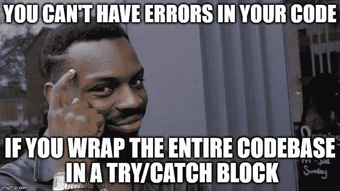

# 每天 10 分钟学习 Python 10

> 原文：<https://towardsdatascience.com/learning-python-10-minutes-a-day-12-44806ea44852?source=collection_archive---------54----------------------->


[杰瑞米·拉帕克](https://unsplash.com/@jeremy_justin?utm_source=unsplash&utm_medium=referral&utm_content=creditCopyText)在 [Unsplash](/?utm_source=unsplash&utm_medium=referral&utm_content=creditCopyText) 上的原始照片。

## [每天 10 分钟 Python 速成班](https://towardsdatascience.com/tagged/10minutespython)

## 尝试，除了，最后，和上下文管理器

这是一个[系列](https://python-10-minutes-a-day.rocks)10 分钟的简短 Python 文章，帮助您提高 Python 知识。我试着每天发一篇文章(没有承诺)，从最基础的开始，到更复杂的习惯用法。如果您对 Python 的特定主题有任何问题或要求，请随时通过 LinkedIn 联系我。

当你用 Python 写代码时，你会(很可能)犯错误。有些会导致语法错误，这是因为您很可能拼错了某个单词，从而导致无效的 Python 代码。这些错误并不难改正。Python 中的其他类型的错误是异常。这些错误在将 Python 代码转换成字节码时完全没问题(没有语法错误)，但是当试图执行某些东西时，就会出现无效的东西。例如，不能用圆周率除一个字符串。这对我们来说没有什么意义，Python 也不知道该做什么，并引发了一个异常。其中一些例外非常明显。例如，打开一个不存在的文件进行读取会引发 FileNotFound 异常。不是所有的例外都那么明确，甚至都是你的错。例如，尝试联系关闭的 restAPI 也会导致异常。当然，最好是尽量避免所有的错误和异常，但是 Python 中的一个习语总是让我吃惊:

> 请求原谅比请求允许容易( [EAFP](https://docs.python.org/3.4/glossary.html) )



在 Reddit 上发现的模因是正确的。

Python 有一个用于*捕捉*异常的结构，即 try/except 块。顾名思义，它将尝试执行 try 块中的所有语句。如果成功了，一切都完成了。如果由于某种原因引发了异常，它将执行 except 块，并且所有错误都被抑制。虽然我们可以讨论这是否是一种好的编程方式，但它是一种非常有效的方式，因为它比试图首先检查所有可能的错误要快得多。try-except 块可以通过提供异常类型来检查许多特定的异常，或者通过将异常类型留空来捕捉任何异常。异常实际上是 exception 类型的对象(你惊讶吗？).让我们从一个如何使用这个结构的例子开始。

在这个例子中，我们有一个有效的函数来除两个数。这将很好地工作，除非你有第二个数字等于零。我们都听说过除数为零是没有定义的，我们从 [Siri](https://www.youtube.com/watch?v=4zJT3ktWAiw) 那里了解到，你不能在零个朋友之间分配五块饼干。如上面的代码所示，除以零会导致 ZeroDivisionError:


哎呦……

ZeroDivisionError 是一个对象，通过使用 try-except 构造，我们可以*捕获*错误并阻止我们的脚本崩溃。在示例中，我们创建了 *secure_divide* ，它将尝试对值进行除法运算。在第一个 except 语句中，我们将专门捕捉 ZeroDivisionError。如果我们除以零，Python 将结束执行这个块中的语句。会不会有另一个问题，例如，如果我们引用一个不存在的变量，它会在第二个 except 块中结束，该块捕获所有(其他)异常。我们可以根据需要测试尽可能多的异常，或者只是捕获所有异常，而不提供异常。

如果您看到一个错误(或异常)，我发现最简单的方法是从下到上阅读错误。最后一行显示了异常和错误的简短描述。然后，错误消息在前面有错误的行周围显示代码块。有错误的行显示错误发生在哪一行。如果错误发生在函数中，上面的每个代码段都比高一级*，直到第一个代码块是代码的顶层。这有时会令人困惑，因为这些代码块的一部分来自导入的库，即不是您创建的代码。诀窍是忽略这些，并向更高的层次前进，直到你达到自己的代码层次。虽然从技术上讲，错误可能出现在一个包中，但更常见的是我们错误地使用了代码，并在导入的函数中输入了错误的参数。*

对于特定的情况，try-except 构造是一个很好的方法，但是我建议尽量少用它。然而，非常有用的一点是 try-(except)-finally 结构。except 在括号之间，因为它是可选的。一个简短的例子:

在本例中，第一个代码片段显示了 try-finally 构造。它将*尝试*执行 try-block 中的所有代码，不管代码是成功还是失败，它将*总是*执行 finally 块中的部分。第二部分演示了这一点，我们故意让 try 块失败。在这两种情况下，都会打印“done”字符串。

try-finally 构造非常有用，在 Python 中使用得很多，但可能不是直接可见的。例如，当处理文件时，我们必须确保在完成后关闭文件。这可以通过 try-finally 构造来实现:

不管成功还是失败，try-finally 总是确保文件被关闭。这是一个非常棒的概念，Guido 决定创建一个特殊的构造来使它更加紧凑(并且在脚本的底部没有一个或多个 finally-clauses)，即带有关键字的*。带有*关键字的*打开(或连接，或…)一个对象，并将其连接到一个标识符。在下一个缩进的代码块中，变量是可用的，我们可以执行任意多的语句。当我们退出代码块时，或者当一个错误发生时，文件(或者连接，或者……)被关闭，与我们之前创建的 try-finally 构造相同(只是方式更短)。Python 中的这种语法称为上下文管理器，并且不仅仅适用于文件。它也经常与数据库一起使用。对数据库的更改通常会被收集起来，直到您提交它们。上下文管理器可以确保这些行被提交，并且数据库连接被正常关闭，而不管是否有错误。请记住，上下文管理器(使用*和*关键字)确保代码的最后部分总是在代码段的末尾执行。最容易记住的方法是打开文件+关闭文件的例子。*

# 今天的练习:

在 Python 中，获得交互式用户输入的最简单方法是使用 *input()* 函数。用户可以键入一个值，然后按 enter 键提交该值。该值是一个字符串。

```
input_value = input()  # *this also works in a  Jupyter Notebook*
```

**赋值:**
询问用户年龄，测试是否小于 42。因为输入值是一个字符串，所以需要将其转换为整数。使用 EAFP 原理捕捉无效输入，例如，如果用户输入字符串而不是数字。

如有任何问题，欢迎通过 [LinkedIn](https://www.linkedin.com/in/dennisbakhuis/) 联系我。