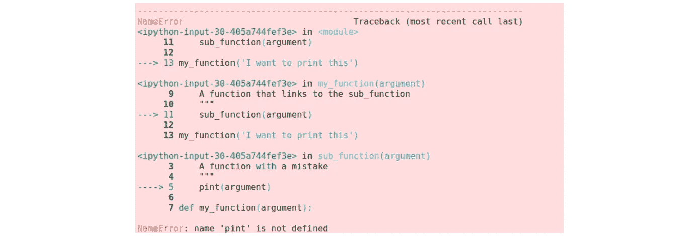
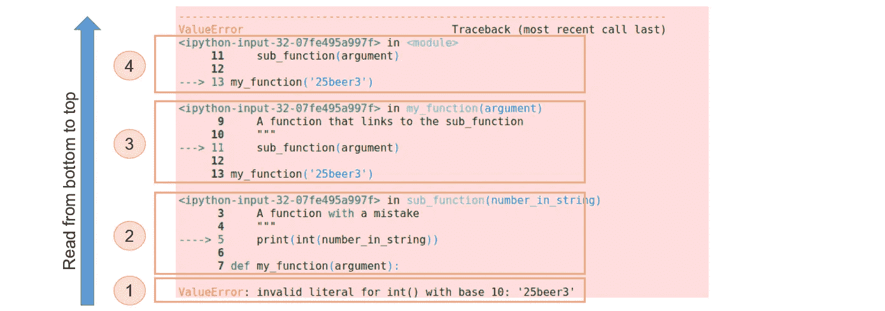

# 每天 10 分钟学习 Python 10

> 原文：<https://towardsdatascience.com/learning-python-10-minutes-a-day-19-4d688c4101ce?source=collection_archive---------58----------------------->

[杰瑞米·拉帕克](https://unsplash.com/@jeremy_justin?utm_source=unsplash&utm_medium=referral&utm_content=creditCopyText)在 [Unsplash](/?utm_source=unsplash&utm_medium=referral&utm_content=creditCopyText) 上的原始照片。

## [每天 10 分钟 Python 速成班](https://towardsdatascience.com/tagged/10minutespython)

## 在 Python 中读取错误和异常

这是一个[系列](https://python-10-minutes-a-day.rocks)10 分钟的简短 Python 文章，帮助您提高 Python 知识。我试着每天发一篇文章(没有承诺)，从最基础的开始，到更复杂的习惯用法。如果您对 Python 的特定主题有任何问题或要求，请随时通过 LinkedIn 联系我。

当我们编码时，犯错是不可避免的。这些错误使得 Python 生成了大量的打印输出，这可能有些令人不知所措。今天的目标是更加熟悉错误读数，并了解它们实际上非常具有描述性。下面是一段相对容易发现错误的代码:

这里我们有两个函数，它们相互嵌套，并被顺序调用。首先我们调用 my_function 并提供一个字符串。在 my_function 中我们调用了另一个叫做 sub_function 的函数。在创建 sub_function 时，我们还没有足够的咖啡，并且犯了一个错别字: *print - > pint* 。这将创建这个大的打印输出:

我们没能找到绳子！

对于一个丢失的字母来说，这是一个很大的信息，对于新来的人来说可能有点令人生畏。在 IPython 和 Jupyter 中，这种消息被正式称为回溯，是用颜色解析的。如果你运行 vanilla Python，这将会是同样的颜色，看起来更可怕。尽管如此，这条消息实际上是相当翔实的，并与正确的步骤，真的很容易阅读。

从*底部*到*顶部*读取一个 Python 回溯。最后一行告诉您异常的名称和简短描述。在很多情况下，这就是你需要知道的全部。在这个例子中，我们得到一个 *NameError* ，并告诉我们名称‘品脱’没有被定义。当我编码时，我不断地测试我的代码，因此，记住我只是添加了一行带有 *print()* 函数的代码。所以，这么小的错别字很快就被识别出来了。如果您不确定这个异常发生在哪里，Python 会给我们提供额外的信息，这些信息分为代码深度的不同级别。每一次，我们调用一个函数，我们就深入一层。基础层是我们调用 my_function()函数的主要代码层。my_function 引入了对 sub_function 进行另一个函数调用的另一个级别。sub_function 创建发生错误的第三个也是最后一个级别。这三个级别在回溯中是可见的，最深的级别(错误实际发生的地方)在底部。在每个级别中，都可以看到一个箭头，指出发生错误的行。它还打印出行号以及有错误的行的前后两行，以便在实际代码中更好地识别这段代码。

你可能会问，如果错误发生在底层，为什么我们需要更高的代码级别。原因是发生了错误，因为我们可能在更早的步骤(更高级)中提供了错误类型的参数。让我们创建另一段错误代码，并一步一步地进行追溯:

阅读回溯消息的步骤。

我们必须自下而上地分析这种追溯。首先(1)我们看到我们有一个*值错误*。当函数或类获得它不期望的值时，会引发值错误。在这种情况下，int()类需要一个数字的字符串表示。描述使这一点变得更加清楚:基数为 10 的 int()的无效文字:“25beer3”。事实上，从该字符串生成整数是不明确的。添加了基数 10，因为数字也可以是基数 2(二进制)、基数 8(八进制)或基数 16(十六进制)。

接下来，我们需要检查这个错误发生在哪里。在倒数第一个块(2)中，我们确实看到我们试图将变量 number_in_string 转换为整数。就代码而言，这里没有任何错误，所以我们更上一层楼(3)。在这个函数中，同样没有任何错误，所以我们继续到顶层(4)。这里我们发现了错误:我们提供了错误类型的参数。

在这个例子中，很容易修复，因为我们自己提供了一个错误的字符串。在现实生活中，这个字符串可能是从另一个从文件导入的字符串中提取出来的，所以是不可见的。例如，我们正在读取的 CSV 文件可能没有所有行的合理值(只是简单的错误值)。解决方案是在第一次函数调用之前检查字符串是否是我们所期望的，否则替换字符串。根据函数得到错误参数的可能性，可以增加测试。开发人员已经使用单元测试解决了这个问题。测试以检查函数是否按预期工作。在这些单元测试中，我们都可以测试数据的有效性。我的观点是，你需要用常识来判断要测试什么，你可以假设什么是好的。如果有麻烦，你总会有值得信赖的线索来指引你。

本文描述的方法是在代码中查找错误的典型工作流程。大多数时候，最底层的信息就是你所需要的。如果您需要检查异常发生的位置，那是因为我们向函数提供了错误的参数类型。诀窍是找到导致问题的函数。回溯是找到有问题的函数的完美工具。这些类型的错误通常可以通过快速检查要调用的函数的 DocString 来修复。

# 今天的练习:

发现错误是每个程序员都要掌握的技能。下面我提供了一段可怕的周一早晨的代码。使用错误对话框找到并消除所有的错误。尽量不要直接找到它们，而是真正使用回溯来识别错误，以获得对其格式的一些练习。

如有任何问题，欢迎通过 [LinkedIn](https://www.linkedin.com/in/dennisbakhuis/) 联系我。