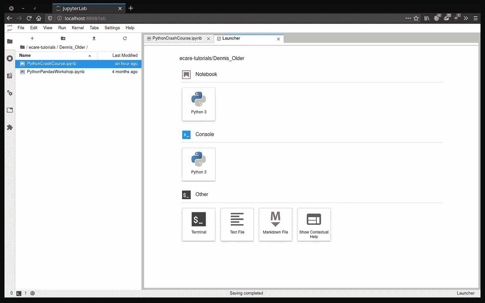

# 每天 10 分钟学习 Python # 2

> 原文：<https://towardsdatascience.com/learning-python-10-minutes-a-day-2-86a56e6f0568?source=collection_archive---------38----------------------->


[杰瑞米·拉帕克](https://unsplash.com/@jeremy_justin?utm_source=unsplash&utm_medium=referral&utm_content=creditCopyText)在 [Unsplash](/?utm_source=unsplash&utm_medium=referral&utm_content=creditCopyText) 上的原始照片。

## [每天 10 分钟 Python 速成班](https://towardsdatascience.com/tagged/10minutespython)

## 使用 Jupyter 实验室和导航笔记本

这是一个[系列](https://python-10-minutes-a-day.rocks)的 10 分钟 Python 短文，帮助你开始学习 Python。我试着每天发一篇文章(没有承诺)，从最基础的开始，到更复杂的习惯用法。如果您想了解关于 Python 特定主题的问题或请求，请随时通过 LinkedIn[联系我。](https://www.linkedin.com/in/dennisbakhuis/)

希望从第一堂课开始，你已经对 Python 的工作原理有了大致的了解，并且已经成功安装了 Python(还记得我在本[指南](/environments-conda-pip-aaaaah-d2503877884c)中关于使用 Miniconda 安装 Python 的建议吗？).在这篇短文中，我们将讨论 Jupyter 笔记本环境。

笔记本是使用单元格构建的交互式文档。有两种类型的细胞，即输入细胞和输出细胞。输入单元格由我们(用户)创建，可以是三种类型:代码单元格、降价单元格或原始单元格。顾名思义，代码单元是一段可以被评估的代码。评估的输出显示在该代码单元格正下方的输出单元格中。降价单元格是带有以降价语言格式化的文本的单元格。有许多不同的格式功能可用，如标题，列表，字体粗细选项。markdown 的好处是，即使不渲染，也非常易读。原始像元是一种特殊类型的像元，Jupyter 不会对其求值，但如果您使用另一个名为 nbconvert 的工具，则可以对其求值。我从未使用过后者，但是当使用像 Sphinx 这样的自动文档套件时，它会很方便。code 单元格和 markdown 单元格的组合使得拥有一个将代码和解释结合起来的优秀分析文档成为可能。这使得笔记本成为分享结果的首选方式。

要安装 Jupyter，有两个选项。只有 Jupyter，它可以让您访问笔记本电脑环境，或者 Jupyter lab，它有更多的功能。两个都好。唯一要记住的是，Jupyter 实验室有时需要更多的步骤来安装定制的小部件。两种方法都安装 Jupyter 笔记本服务器。与 Jupyter 交互的标准方式是通过网络浏览器，但由于它是一种客户端-服务器结构，其他应用程序也可以与之交互。例如，有一个 Visual Studio 代码插件也可以与笔记本服务器交互，可能还有许多其他选项。如果你喜欢，可以随意使用其他的。现在，让我们使用终端在新环境中安装并启动 Jupyter lab:

```
conda create --name tutor python=3.7
conda activate tutor
pip install jupyterlabjupyter lab
```



Jupyter 实验室启动后，左侧栏打开。

浏览器应该会打开并显示 Jupyter 实验室的主页。该窗口由三部分组成:与其他应用程序类似的顶部菜单栏、侧菜单选项卡栏和主编辑器窗格。侧边栏由标签组成:文件导航，运行内核，命令，属性检查器，打开标签，如果安装了扩展管理器。目前我们只谈前两个。“导航”选项卡帮助您导航计算机上的文件。您可以浏览和创建目录。出于安全原因，Jupyter 实验室开放时，您不能进入更低的目录。Jupyter 是作为服务器创建的，所以也有上传的选项。“加号”符号在主窗口中打开一个新的启动器选项卡，当 Jupyter lab 启动时，它也会自动打开。在 launcher 选项卡中，您可以创建新的笔记本，在选项卡中打开 IPython 控制台，创建文本文件，甚至是终端。回到侧边栏，另一个选项卡显示活动的内核。每次你打开或创建一个笔记本，一个内核就被启动了。关闭笔记本不会停止内核，除非你关闭 Jupyter lab 或者转到这个标签并关闭它们。如果您不小心关闭了标签，您可以从这里再次打开它。同样值得一提的是，主编辑器面板可以定制为通过拖动标签并排显示文件。一定要试一试。

让我们使用启动器在当前目录中创建新的笔记本。创建后，您可以在文件导航器中右键单击新文件来重命名它。您也可以右键单击选项卡名称来实现相同的目的。还要注意文件导航器中的小绿点，它显示该文件当前作为内核运行。新笔记本相当空，因为它只有一个电池。顶部是一个小菜单栏，显示了一些基本功能，如复制/粘贴、单元格选项和一些内核选项。Jupyter lab 是一个模态编辑器，类似于 vim。它有一个命令模式，您可以在其中导航或编辑单元格，还有一个单元格编辑模式，您可以在其中键入内容。在命令模式下，您可以轻松地添加、删除、剪切或复制单元格。为此，有一些便于记忆的快捷方式(它们也可以在顶部菜单中找到):

*   箭头键在单元格内移动。按住 shift 键选择单元格。
*   “a”和“b”添加当前单元格上方的单元格*或*下方的单元格*。*
*   “c”、“x”、“v”到*复制*、*剪切*，或者粘贴单元格。
*   “y”或“m”分别将单元格类型更改为编码或降价。
*   “shift + enter”计算当前单元格。

花些时间了解降价的基本知识是有用的。它们非常简单，你可能只需要几个。看看这个[备忘单](https://www.markdownguide.org/cheat-sheet/)，你会直观地看到它的语法。

## **今天的练习:**

1.  创建一个新的笔记本，并将其重命名为合理的名称。
2.  做一些简单的计算，并评估细胞。
3.  将单元格更改为 markdown，并编写描述，包括标题。
4.  在笔记本上移动，复制和粘贴单元格。

作为数值运算符的建议:
+(加法):10 + 12，
-(减法):20 - 30，
*(乘法):3 * 3，
/(除法):49 / 7，
**(幂):2**8。

如有任何问题，欢迎通过 [LinkedIn](https://www.linkedin.com/in/dennisbakhuis/) 联系我。