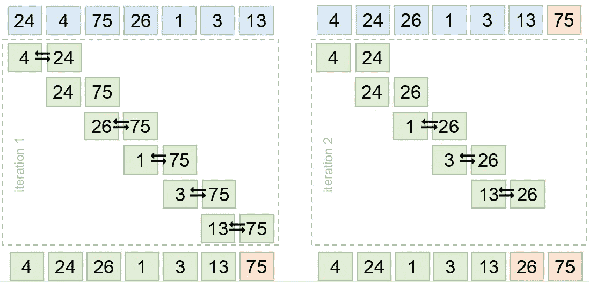
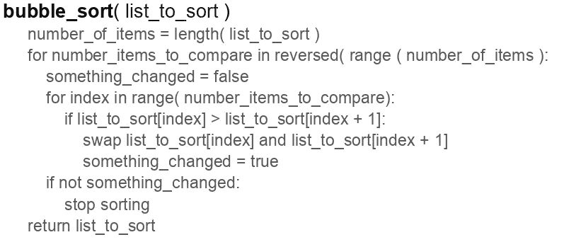

# 每天 10 分钟学习 Python 10

> 原文：<https://towardsdatascience.com/learning-python-10-minutes-a-day-20-13af35b86452?source=collection_archive---------66----------------------->


[杰瑞米·拉帕克](https://unsplash.com/@jeremy_justin?utm_source=unsplash&utm_medium=referral&utm_content=creditCopyText)在 [Unsplash](/?utm_source=unsplash&utm_medium=referral&utm_content=creditCopyText) 上的原始照片。

## [每天 10 分钟 Python 速成班](https://towardsdatascience.com/tagged/10minutespython)

## 让我们进行分类排序

这是一个[系列](https://python-10-minutes-a-day.rocks)10 分钟的简短 Python 文章，帮助您提高 Python 知识。我试着每天发一篇文章(没有承诺)，从最基础的开始，到更复杂的习惯用法。如果您对 Python 的特定主题有任何问题或要求，请随时通过 LinkedIn 联系我。

两周前我们写了一个快速排序算法，这是一个相对高效的排序算法。当我们需要对一个列表进行排序时，Python 自带了一个名为 *sorted()* 的内置排序函数。实现的算法叫做 [Timsort](https://en.wikipedia.org/wiki/Timsort) ，由 Tim Peters 在 2002 年实现。该函数采用 iterable，默认情况下按升序对值和字符进行排序。sorted()的语法如您所料:

数字按照您预期的方式排序。如果要反转顺序，我们需要将*反转*参数设置为*真*。Sorted()返回一个新的列表，因此，我们也可以使用 *reverse()* 函数来反转列表。反向函数返回一个*反向迭代器*对象。要打印列表，我们需要首先转换它。Sorted()也可以对字符串进行排序，并且会一个字符一个字符地进行排序，从数字开始，然后是字母表。现在，结果是一个字符列表。对字符串列表进行排序时，sorted()会按字母顺序对每一项进行排序。需要记住的是，字符串中的数字是在字符级别上排序的，因此，对文件的排序可能不是您所期望的顺序:

对字符串进行排序时，Python 使用字符的 Unicode 值。这意味着 Unicode 编码的低值(如大写字母)出现在高值字符(如小写字母)之前。如果一个字符串包含一个数字，而你想按这个数字排序，我们需要提供一个键。一个键是一个函数(或者 lambda 函数，我们仍然需要在以后的课程中讨论这个函数),它可以转换条目，使其以不同的方式排序。key-function 的结果可以是排序后可以对其执行排序逻辑的任何内容。在我们的示例中，我们创建了一个从文件名中提取数字并将其转换为整数的函数。Sorted 现在对这些整数进行排序，并按顺序返回原始列表。这使得 key-parameter 成为一种非常强大的列表排序方式。

需要注意的是，sorted()只能对可以与列表中所有其他项目进行比较的项目进行排序。当你提供一个混合类型的列表，比如整数和字符串，说 25 比‘香蕉’大是模棱两可的。字典列表也是如此。它不知道如何比较每个包含不同值的字典。这些问题可以通过定义一个键函数来解决。

# 今天的练习:

作业 1:
第一个作业你要按照库存水果的多少来排列字典的清单。为此，您需要定义一个键(一个函数)来选择相关的值，并再次明确排序。

```
fruit_types = [
    {'name': 'banana', 'amount': 123, 'price': 2.50},
    {'name': 'strawberry', 'amount': 23, 'price': 1.75},
    {'name': 'apple', 'amount': 87, 'price': 2.10},
    {'name': 'pear', 'amount': 3, 'price': 1.50},
]
```

**任务 2:**
在第二部分中，我们将实现另一种排序算法:冒泡排序。冒泡排序是(剧透)一种效率低得多的排序方式。该算法反复遍历一个列表，比较两个相邻的值，如果它们的顺序不正确，就交换它们。下面是两次迭代的示意图:



该图从比较前两个值开始，当 24 大于 4 时，交换这两个值。接下来的两个值不变。这个过程一直持续到所有值都比较完为止。第一次迭代后，最后一个值是固定的，因为这是列表中最大的值。这意味着对于下一次迭代，我们可以忽略最后一个值，只需比较 75 之前的值。第二次迭代后，最后两个值是固定的。伪代码中的全部代码(读作:几乎是 Python 代码)看起来是这样的:



现在，使用这个伪代码来实现冒泡排序算法，并比较它与我们之前的[快速排序算法相比慢了多少。您可以使用神奇的命令 *%timeit* 来评估排序算法的性能:](/learning-python-10-minutes-a-day-10-91b8ff16cd60)

解决方案发布在我的 Github 账户上的[这里](https://gist.github.com/dennisbakhuis/0f40e5a36cec0cb59f82b64a01fec28c)。

下一篇文章将在我两周后的假期后发布，也就是 8 月 10 日。

如果您有任何问题，请随时通过 [LinkedIn](https://www.linkedin.com/in/dennisbakhuis/) 联系我。