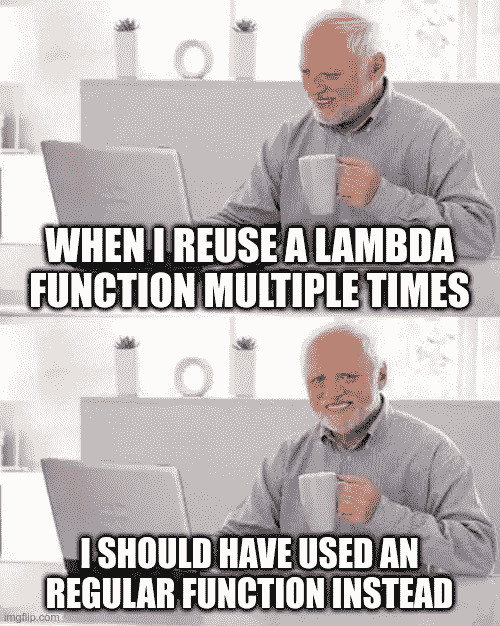

# 每天 10 分钟学习 Python # 21

> 原文：<https://towardsdatascience.com/learning-python-10-minutes-a-day-21-f1d8eec408d?source=collection_archive---------77----------------------->

[杰瑞米·拉帕克](https://unsplash.com/@jeremy_justin?utm_source=unsplash&utm_medium=referral&utm_content=creditCopyText)在 [Unsplash](/?utm_source=unsplash&utm_medium=referral&utm_content=creditCopyText) 上的原始照片。

## [每天 10 分钟 Python 速成班](https://towardsdatascience.com/tagged/10minutespython)

## 匿名函数也叫λ函数

这是一个[系列](https://python-10-minutes-a-day.rocks)10 分钟的简短 Python 文章，帮助您提高 Python 知识。我试着每天发一篇文章(没有承诺)，从最基础的开始，到更复杂的习惯用法。如果您对 Python 的特定主题有任何问题或要求，请随时通过 LinkedIn 联系我。

对于新手来说，lambda 函数可能有点吓人。我也避免使用这些函数有一段时间了，因为我从来不知道它们的真正用途。如今，我确实看到了这种结构的好处，但这种好处相当小。你会遇到这些功能，因此，知道发生了什么是很好的。Lambda 函数也被称为*匿名函数*或*无名函数*，这更好地描述了它们。lambda 函数是没有名字的函数的内联定义。除了没有名字，常规函数和 lambda 函数有什么区别？*几乎没有！*那么下一个问题是:当一个常规函数做同样的事情时，为什么要使用 lambda 函数？事实上，在大多数情况下，常规函数是可行的。但是，有时候你只需要做一次手术。虽然您仍然可以使用常规函数，但是内联函数(lambda 函数)*可能会更容易一些。*

lambda 函数的定义很简短:它以关键字 *lambda* 开始，后跟一个或多个用逗号分隔的参数。分号后面是函数本身的步骤。让我们来看一个例子:

在这个例子中，我们有一个费用清单。每笔费用都是一个元组，包含名称和成本。虽然有其他方法(如列表理解)，但我们选择使用 map()来选择所有成本。Map()需要一个函数和一个 iterable。我们现在可以创建一个选择元组第二项的正则函数，但是我们只使用它一次。这意味着 lambda 函数在这里是完美的。map()在每个元组上执行我们的函数，并返回所有成本的列表，后跟一个总和。现在我们来看看更多的例子(免责声明:并非所有都有用):

在示例中，我们展示了 lambda 表达式返回对匿名函数的引用。该函数现在被一个变量捕获，它将不会被“垃圾收集”。这消除了 lambda 函数的好处，即一次性匿名函数，它将在使用后被丢弃。如果添加对 lambda 函数的引用，只需编写一个常规函数即可。常规函数可读性更好。尽管如此，您可以将 lambda 函数捕获到一个引用中，然后该变量就充当一个常规函数(只是不要这样做(-；).

imgflp.com 上产生的模因

只是为了好玩，您也可以直接调用引用，而不用在变量中捕获它。虽然这没有多大意义，但它是可能的，而且完全有效。需要额外的括号，否则将返回函数标识符。

为了证明常规函数和 lambda 函数是相同的，我们可以检查来自 Python 解释器的字节码。为此，我们可以利用 *dis* 模块，它将实际执行的字节码可视化。所有 Python 命令都可以分解成少量的字节码操作。这里我们比较了常规和 lambda 之间的字节码，看到我们有一个精确的匹配。它们的字节码是一样的！

前面的例子展示了两个有用的新函数:filter()和 reduce()。顾名思义，filter()用于过滤 iterable。iterable 的每一项都被放入一个必须返回布尔值的函数中。如果布尔值为真，则保留该值。如果布尔值为 false，则忽略该值。我们可以提供一个常规函数，但如果是一次性的，lambda 函数可能更容易。

Reduce()是许多其他语言中常见的方法。它接受一个 iterable，并使用提供的函数将 iterable 简化为一个值(同一类型)。实际情况是，它接受 iterable 的前两个值，并根据提供的函数创建一个新值。它重复这个操作，直到只剩下一个值。同样，这可能是一个 lambda 函数的绝佳位置。

# 今天的练习:

虽然没有 lambda 函数的生活是很可能的，但我认为这是一个很好的*很高兴知道*。你偶尔会遇到他们。在这个任务中，我们将使用 reduce()找到一组值中的最大值。

**赋值:**
用 reduce 求 1000 个值中的最大值。

提示:
1。λ函数有两个参数
2。使用内联 if 返回正确的值

一个解决方案是[发布在我的 Github 上](https://gist.github.com/dennisbakhuis/1f0ae5486d014c6e9ffe455cbe46edf3)。

如有任何问题，欢迎通过 [LinkedIn](https://www.linkedin.com/in/dennisbakhuis/) 联系我。