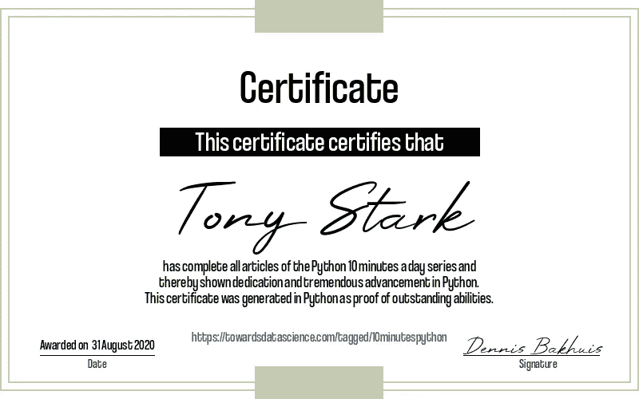

# 每天 10 分钟学习 Python # 25

> 原文：<https://towardsdatascience.com/learning-python-10-minutes-a-day-25-a14ac87d16d2?source=collection_archive---------43----------------------->

[杰瑞米·拉帕克](https://unsplash.com/@jeremy_justin?utm_source=unsplash&utm_medium=referral&utm_content=creditCopyText)在 [Unsplash](/?utm_source=unsplash&utm_medium=referral&utm_content=creditCopyText) 上的原始照片。

## [每天 10 分钟 Python 速成班](https://towardsdatascience.com/tagged/10minutespython)

## 应得的自创证书

这是一个[系列](https://towardsdatascience.com/tagged/10minutespython)10 分钟的简短 Python 文章，帮助您提高 Python 知识。我试着每天发一篇文章(没有承诺)，从最基础的开始，到更复杂的习惯用法。如果您对 Python 的特定主题有任何问题或要求，请随时通过 LinkedIn 联系我。

今天是每天学习 Python 10 分钟的第 25 集。如果你在这里，你应该感到自豪，因为我们已经讨论了 Python 语言的基本、中级和一些高级习惯用法。足以启动您的 Python 开发生涯。我的第一个想法是用一些真实的例子(使用一些库)来结束这个系列。这些例子包括数据可视化、使用矩阵、神奇熊猫图书馆和一些 Scikit-Learn 主题。虽然，我可能仍然会创作这些文章，但它们会在今年晚些时候以一个独立的系列发表(当然不是每天都发表)。如有任何要求或建议，请随时联系我。

当完成一门在线课程时，你经常会在你的 LinkedIn 上获得一个证书来分享。既然你已经做到了这一步，我认为你在这个系列中得到一个也是很重要的。为了证明 Python 是一种通用语言，我们将自己创建一个令人印象深刻的证书！如果你真的把这个贴在你的 LinkedIn 上就太好了，请不要忘记给我加标签。我将祝贺你的成就！好了，让我们尽可能用 Python 的方式创建我们的 Python 证书吧！首先我们需要三个库: *matplotlib* 和 *pillow* 用于处理图像，以及 *wget* 用于下载所需的字体。

使用 Linux 的人可能已经听说过 *wget* ，这是一个用于从互联网下载文件的命令行界面(CLI)实用程序。在这里，我们已经下载了 wget 的 Python 版本，它可以在任何机器上工作，并使用它来下载字体。现在让我们介绍生成证书的函数:

这是一段很长的代码，但是它确实创建了一个完整的证书，具有人们所期望的所有功能。我们首先导入 pillow 的三个部分，缩写为 PIL: Image、ImageDraw 和 ImageFont。第一个模块保存图像，第二个模块添加许多绘图功能，最后一个模块添加文本绘制功能。另一个新的东西是魔术选项`%matplotlib inline`，它确保我们将绘图写入笔记本(这在早期是必需的，不确定是否仍然需要)。证书功能本身利用了 pillow 的绘图功能。我们添加了一个双线边框，并在顶部和底部添加了一些矩形。接下来，我们添加两种不同字体的居中文本。为了正式起见，我在底部加上了当前日期和我的签名。我们可以用幸运儿的名字来调用函数 We，它会把图像*和*写到屏幕上。它应该是这样的:

我们非常正式的证书。

嗯，这看起来是合法的(-:。这项工作的最大部分是微调设计。创建单独的组件相对容易。函数中的最后一个操作是将证书作为便携网络图形(PNG)写到磁盘上。所以现在在 LinkedIn 上分享，给我贴标签，超级容易；-).

## 现在怎么办？

你的下一个问题可能是，现在怎么办？从普通 Python 的角度来看，您现在已经知道了所需的大部分内容。但是在现实生活中，大多数人都是用包来解决自己的问题，有无数的包可以探索。如果你想进入科学计算或数据科学/机器学习领域，下一个合乎逻辑的探索步骤是 *Numpy* 。

[Numpy](https://numpy.org/) 在 Python 中增加了对大型多维数组和矩阵的支持。如果没有 Numpy，我们可能会创建一个列表，这将非常好。Numpy 牺牲了列表中包含任何对象的灵活性，而将固定类型(通常是数字)作为数组，并以惊人的速度编译代码来处理它们。Numpy 比普通 Python 快得多。但是和普通 Python 一样，学习概念需要一些时间。Pablo Carares 为 Numpy 制作了一个[惊人的指南](https://pabloinsente.github.io/intro-numpy-fundamentals)，强烈推荐您从那里开始。

Imgflip.com 上产生的模因

如果你知道 Numpy 是如何工作的(你不必是一个 Numpy 大师)，下一步肯定是[熊猫](https://pandas.pydata.org/)。就个人而言，我是熊猫*的超级粉丝*！它提供了一种与你的数据交流的语言。掌握流利的熊猫语有很多好处，我真的建议在这项技能上投资。从熊猫开始，在熊猫文档中有[熊猫 10 分钟](https://pandas.pydata.org/pandas-docs/stable/user_guide/10min.html)。每年，PyCon 上都有很棒的教程。我非常喜欢 Brandon Rhodes 在 2015 年的演讲。陈琦程也做了一个很好的关于熊猫的初学者教程。变得擅长熊猫！我保证你会喜欢的！

当你对熊猫感到舒适的时候，接下来的事情就是做数据可视化。绘图本身可以用许多不同的库来完成。一开始，几乎所有人都使用 Matplotlib。它很容易使用，但有其微妙之处。现在，我通常使用 [Seaborn](https://seaborn.pydata.org/) ，这是一个基于 Matplotlib 的框架，具有更好的默认设置和更简单的语法。这些不是唯一的选择，还有[和](https://plotly.com/python/)以及[散景](https://docs.bokeh.org/en/latest/index.html)，实际上还有更多。我还是觉得从 Matplotlib 开始比较有用。在那之后，如果你想要更多的视觉享受，就选择其他的。

有了所有这些，我们终于准备好看看一些机器学习的东西。虽然我们可以马上去 [Scikit-Learn](https://scikit-learn.org/stable/) ，我还是建议你去[Kaggle.com](https://www.kaggle.com/)吧。Kaggle 是以基于问题/项目的方式学习数据科学和机器学习的终极资源。如果这是你的第一次，点击过去最喜欢的泰坦尼克号比赛。这是一个介绍性的比赛，做起来很有趣，你可能还会从比赛中学到一些历史事实。

## 你成功了！

这是 Python 每天 10 分钟系列的结尾。肯定有一些主题我们没有讨论，比如多处理/多线程或者许多优秀的库和框架的例子。然而，这些确实需要超过 10 分钟。在不久的将来，我可能会写一些这样的教程。如果你有兴趣，请随时联系我。

现在，谢谢你们能走到这一步。我已经通过 LinkedIn 收到了一些积极的信息和反馈。但是，我仍然不知道到底是谁制作了这个系列。所以，如果你想帮我一个忙，把你辛苦挣来的证书放在 LinkedIn 上，给我加个标签。我保证祝贺每个人的成就！一如既往，如果有任何问题、意见或评论，请随时[联系我](https://www.linkedin.com/in/dennisbakhuis/)！