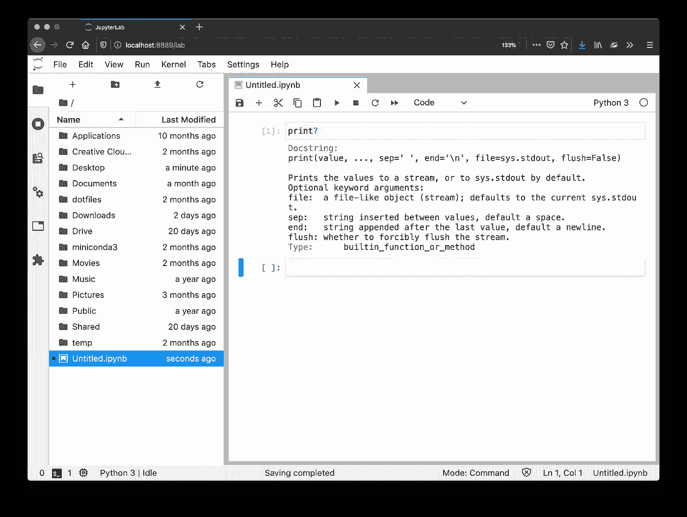

# 每天 10 分钟学习 Python # 3

> 原文：<https://towardsdatascience.com/learning-python-10-minutes-a-day-3-af2967c34a36?source=collection_archive---------48----------------------->

[杰瑞米·拉帕克](https://unsplash.com/@jeremy_justin?utm_source=unsplash&utm_medium=referral&utm_content=creditCopyText)在 [Unsplash](/?utm_source=unsplash&utm_medium=referral&utm_content=creditCopyText) 上的原始照片。

## [每天 10 分钟 Python 速成班](https://towardsdatascience.com/tagged/10minutespython)

## 评论:Python 忽略的对你有用！

这是一个[系列](https://python-10-minutes-a-day.rocks)的 10 分钟 Python 短文，帮助你开始学习 Python。我试着每天发一篇文章(没有承诺)，从最基础的开始，到更复杂的习惯用法。如果您想了解关于 Python 特定主题的问题或请求，请随时通过 LinkedIn[联系我。](https://www.linkedin.com/in/dennisbakhuis/)

每个人都知道评论是重要的，对于每个项目，你可能会对自己说:‘在下一个项目中，我会更加注意评论’。有了笔记本，你已经有了一个很好的结构，但是定期的评论还是很有用的。有时，注释可以帮助解释某个假设或为什么选择某个设置。或者简单地对参数进行内嵌解释。此外，当从一开始就添加特殊的注释(比如 docstrings)时，如果您需要将笔记本转换成常规的 Python 脚本(这非常简单)，您可以立即嵌入解释。

Python 中的注释以“#”开头。当 Python 看到 hashtag 时，它会忽略该部分后面的所有内容。此外，在调试或尝试不同的算法编码方式时，注释掉代码是很有用的。在许多编辑器中，包括 Jupyter，您可以使用“ctrl-/”来注释/取消注释一行。这适用于当前行或选定的多行。

作为一种格式标准，建议在内联注释和实际注释之间留两个空格，就像前面代码中所做的那样。添加评论很棒，尽量做到完整。然而，要避免的一件事是*过度评论*。过度评论意味着你评论了显而易见的东西。对于 Python 来说尤其如此，它被设计成可读的。例如，做一个注释，说您将导入包，然后输入 import 关键字，这显然是过度注释，没有添加信息。

其他语言，如 C 或 Java，能够创建多行注释。Python 本身没有多行注释，最好的方法是在每一行的开头使用一个标签。在特殊情况下，您可以使用三重引号创建多行注释。这实际上不是注释而是多行字符串，没有赋给标签。如果没有赋值，Python 解释器会忽略它。从技术上讲，您可以将这些未赋值的字符串放在代码中的任何地方，但是当将它们放在类或函数定义中时，它们就有了 DocString 的含义。文档字符串是描述函数的一小段特殊注释。虽然您可以自由地为 DocString 创建自己的格式，但是一些大型项目(如 Pandas 或 Numpy)已经对这些格式进行了标准化。熊猫有一个很好的关于如何构建它们的指南。然后这些被用来自动创建文档。我们还没有讨论创建函数，但是我认为这个例子会很清楚:

有不同的方式来设计它们，但是关键的元素是可读性。获得前面代码片段中描述的函数是非常清楚的。我们可能会认为函数名已经足够清楚了，因此，我们做了一些过度注释，但是你可能会创建更复杂的函数，你的同事*和很可能还有你未来的自己*，会感谢你做出高质量的注释和文档字符串。

DocStrings 通常是个好主意的原因是，在 IPython 和相关的任何地方都可以访问它们。如果您不确定某个函数的参数是什么，或者完全忘记了该函数是做什么的，您总是可以使用“？”来访问 DocString。通过键入函数，而不是写括号，您添加一个问号，您将获得该函数的 DocString。如果您使用的是成熟的 IDE，当您将鼠标悬停在某个函数上时，或者当您在括号之间时，有时会显示这些信息。我发现这些东西会让人分心，通常会把它们关掉。如果你喜欢这些东西，Visual Studio 代码当然不错，我还记得 Jupyter 实验室有一个插件可以做到这一点。

要获得 Python 中某个函数的帮助，只需添加一个？而不是括号。

## 今天的练习:

1.  在一个新的笔记本上创建一些简单的计算。
2.  围绕您的计算添加注释，并添加行内注释
3.  使用 ctrl-/注释和取消注释行。
4.  为以下函数创建一个 DocString:

5.使用“？”获取您自己函数的帮助

如果您有任何问题，欢迎通过 [LinkedIn](https://www.linkedin.com/in/dennisbakhuis/) 联系我。